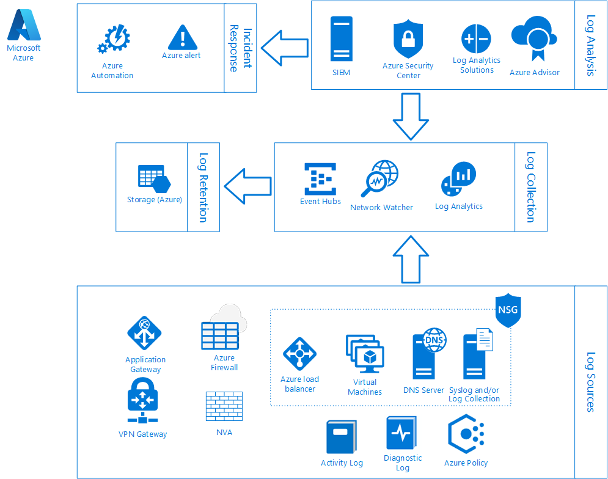

# Gateway logging, auditing, and visibility in Azure Australia

Detecting and responding to cyber security threats relies on generating, collecting and analyzing data related to the operation of a system.

Microsoft has built-in tools in Azure to help you implement logging, auditing, and visibility to manage the security of your systems deployed in Azure. There is also a reference architecture that aligns with the Australian Cyber Security Centre (ACSC) Consumer Guidance and the intent of the Information Security Manual (ISM).

Gateways act as information flow control mechanisms at the network layer and may also control information at the higher layers of the Open System Interconnect (OSI) model. Gateways are necessary to control data flows between security domains and prevent unauthorised access from external networks. Given the criticality of gateways in controlling the flow of information between security domains, any failure, particularly at higher classifications, may have serious consequences. As such, robust mechanisms for alerting personnel to situations that may cause cyber security incidents are especially important for gateways.

Implementing logging and alerting capabilities for gateways can assist in detecting cyber security incidents, attempted intrusions, and unusual usage patterns. In addition, storing event logs on a separate secure log server increases the difficulty for an adversary to delete logging information in order to destroy evidence of a targeted cyber intrusion.

## Australian Cyber Security Centre (ACSC) requirements

The overall security requirements for Commonwealth systems are defined in the ACSC Information Security Manual (ISM). To assist Commonwealth entities to meet these requirements within Azure, the *ACSC CONSUMER GUIDE – Microsoft Azure at PROTECTED* and *ACSC CERTIFICATION REPORT – Microsoft Azure* publications detail the following specific requirements related to Logging, Auditing, and Visibility:

1. To mitigate the risks arising from using shared underlying cloud resources, Commonwealth entities must opt in to Microsoft Azure provided capabilities including Azure Security Centre, Azure Monitor, Azure Policy, and Azure Advisor to assist entities to perform real-time monitoring of their Azure workloads

2. The ACSC also recommends that Commonwealth entities forward all mandated security logs to the ACSC for whole of Australian Government monitoring

3. To assist in risk mitigation, Commonwealth entities should configure within their Azure subscriptions:

    * Enable Azure Security Centre
    * Upgrade to the Standard Tier
    * Enable Automatic Provisioning of the Microsoft Monitoring Agent to supported Azure VMs
    * Regularly review, prioritise, and mitigate the security recommendations and alerts on the Security Centre dashboard

4. Government entities must enable log and event forwarding from their Azure subscription to the ACSC to provide the ACSC with visibility of non-compliance with this guidance. Azure Event Hubs provides the capability to perform external log streaming to the ACSC or on-premises systems owned by the Commonwealth entity

5. Commonwealth entities should align the logging they enable within Azure to the requirements specified in the ISM

6. Microsoft keeps logs within Azure for 90 days. Customer entities must implement a log archival regime to ensure logs can be kept for the seven years required under the NAA AFDA

7. Commonwealth entities that have on-premises or Azure-based Security Information and Event Management (SIEM) capabilities can also forward logs to those systems

8. Commonwealth entities should implement Network Watcher flow logs for Network Security Groups (NSGs) and Virtual Machines. These logs should be stored in a dedicated storage account containing only security logs, and access to the storage account should be secured with Role-Based Access Controls

9. Commonwealth entities must implement ACSC Consumer Guidance to ensure Azure workloads meet the intent of the ISM for logging and monitoring. Commonwealth entities must also opt in to Azure capabilities that assist the ACSC to receive real-time monitoring, alerting, and logs associated with Australian Government usage of Azure

## Architecture

To confidently understand the network traffic entering and leaving your Azure environment, the necessary logging must be enabled on the right set of components. Doing this ensures complete visibility of the environment and provides the necessary data to do analysis.

## Components

The architecture shown above is made up of discrete components that provide the function of either Log Sources, Log Collection, Log Retention, Log Analysis or Incident Response. This architecture includes individual components that are typically involved in internet accessible Azure deployments.

|Functions|Components|
|---|---|
|Log Sources|<ul><li>Application Gateway</li><li>VPN Gateway</li><li>Azure Firewall</li><li>Network Virtual Appliances</li><li>Azure Load Balancer</li><li>Virtual Machines</li><li>Domain Naming System (DNS) Servers</li><li>Syslog and/or Log Collection Servers</li><li>NSGs</li><li>Azure Activity Log</li><li>Azure Diagnostic Log</li><li>Azure Policy</li></ul>|
|Log Collection|<ul><li>Event Hubs</li><li>Network Watcher</li><li>Log Analytics</li></ul>|
|Log Retention|<ul><li>Azure Storage</li></ul>|
|Log Analysis|<ul><li>Azure Security Center (ASC)</li><li>Azure Advisor</li><li>Log Analytics Solutions<ul><li>Traffic Analytics</li><li>DNS Analytics (Preview)</li><li>Activity Log Analytics</li></ul></li><li>SIEM</li><li>ACSC</li></ul>|
|Incident Response|<ul><li>Azure Alerts</li><li>Azure Automation</li></ul>|
|

The architecture works by first generating logs from the necessary sources and then collecting them into centralised repositories. Once you've collected the logs, they can be:

* used by Azure analysis services to get insight,
* get forwarded to external systems, or
* get archived to storage for long-term retention.

To respond to key events or incidents identified by analysis tools, alerts can be configured, and automation developed to take necessary actions for proactive management and response.

## General guidance

When implementing the components listed in this article, the following general guidance applies:

* Validate the region availability of services, ensuring that all data remains within authorised locations and deploy to AU Central or AU Central 2 as the first preference for PROTECTED workloads

* Refer to the *Azure - ACSC Certification Report – Protected 2018* publication for the certification status of individual services and perform self-assessments on any relevant components not included in the report as per the *ACSC CONSUMER GUIDE – Microsoft Azure at PROTECTED*

* For components not referenced in this article, Commonwealth entities should follow the principles included about generating, capturing, analysing, and keeping logs

* Identify and prioritise the logging, auditing, and visibility on high value systems as well as all network ingress and egress points to systems hosted in Azure

* Consolidate logs and minimise the number of instances of logging tools such as storage accounts, Log Analytics workspaces and Event Hubs

* Restrict administrative privileges through Role-Based Access Controls

* Use Multi-Factor Authentication (MFA) for accounts administering or configuring resources in Azure

* When centralising log collection across multiple subscriptions, ensure that administrators have the necessary privileges in each subscription

* Ensure network connectivity and any necessary proxy configuration for Virtual Machines, including Network Virtual Appliances (NVAs), Log Collection Servers and DNS Servers, to connect to necessary Azure services such as the Log Analytics workspaces, Event Hubs, and Storage

* Configure the Microsoft Monitoring Agent (MMA) to utilise TLS version 1.2

* Use Azure Policy to monitor and enforce compliance with requirements

* Enforce encryption on all data repositories such as Storage and Databases

* Use Locally redundant storage (LRS) and snapshots for availability of Storage Accounts and associated data

* Consider Geo-redundant storage (GRS) or off-site storage to align with Disaster Recovery strategies

|Resource|URL|
|---|---|
|Australian Regulatory and Policy Compliance Documents|[https://aka.ms/au-irap](https://aka.ms/au-irap)|
|Azure products - Australian regions and non-regional|[https://azure.microsoft.com/global-infrastructure/services/?regions=non-regional,australia-central,australia-central-2,australia-east,australia-southeast](https://azure.microsoft.com/global-infrastructure/services/?regions=non-regional,australia-central,australia-central-2,australia-east,australia-southeast)|
|Microsoft Azure Security and Audit Log Management Whitepaper|[https://download.microsoft.com/download/B/6/C/B6C0A98B-D34A-417C-826E-3EA28CDFC9DD/AzureSecurityandAuditLogManagement_11132014.pdf](https://download.microsoft.com/download/B/6/C/B6C0A98B-D34A-417C-826E-3EA28CDFC9DD/AzureSecurityandAuditLogManagement_11132014.pdf)|
|Microsoft Monitoring Agent Configuration|[https://docs.microsoft.com/azure/azure-monitor/platform/log-analytics-agent](https://docs.microsoft.com/azure/azure-monitor/platform/log-analytics-agent)|
|

## Component guidance

This section provides information on the purpose of each component and its role in the overall logging, auditing, and visibility architecture. Additional links are provided to access useful resources such as reference documentation, guides, and tutorials.

## Log sources

Before any analysis, alerting or reporting can be completed, the necessary logs must be generated. Azure logs are categorized into control/management logs, data plane logs, and processed events.

|Type|Description|
|---|---|
|Control/management logs|Provide information about Azure Resource Manager operations|
|Data plane logs|Provide information about events raised as part of Azure resource usage, such as logs in a Virtual Machine and the diagnostics logs available through Azure Monitor|
|Processed events|Provide information about analysed events/alerts that have been processed by Azure, such as where Azure Security Center has processed and analysed subscriptions to provide security alerts|
|

### Application Gateway

Azure Application Gateway is one of the possible entry points into an Azure environment so you need to capture information related to incoming connections communicating with web applications. Application Gateway can provide crucial information relating to web application usage as well as assisting in detecting cyber security incidents. Application Gateway sends metadata to the Activity Log and Diagnostic Logs in Azure Monitor where it can be utilised in Log Analytics or distributed to an Event Hub or Storage Account.

|Resources|Link|
|---|---|
|Application Gateway Documentation|[https://docs.microsoft.com/azure/application-gateway/](https://docs.microsoft.com/azure/application-gateway/)|
|Application Gateway quickstart Guide|[https://docs.microsoft.com/azure/application-gateway/quick-create-portal](https://docs.microsoft.com/azure/application-gateway/quick-create-portal)|
|

### VPN Gateway

The VPN Gateway is a potential entry point for a wide range of communications into the Azure environment, such as the connection to an on-premises environment and administrative traffic. Logging on VPN Gateways provides insight and traceability for the connections made to the Azure environment. Logging can provide auditing and analysis as well as assist in the detection or investigation of malicious or anomalous connections. VPN Gateway logs are sent to the Azure Monitor Activity Log where they can be utilised in Log Analytics or distributed to an Event Hub or Storage Account.

|Resources|Link|
|---|---|
|VPN Gateway Documentation|[https://docs.microsoft.com/azure/vpn-gateway/](https://docs.microsoft.com/azure/vpn-gateway)|
|Australian Government specific VPN Gateway guidance|[Azure VPN Gateway configuration](vpn-gateway.md)|
|

### Azure Firewall

Azure Firewall provides a controlled exit point from an Azure environment and the logs generated, which include information on attempted and successful outbound connections, are an important element in your logging strategy. These logs can validate that systems are operating as designed, as well as assist in detecting malicious code or actors attempting to connect to unauthorised external systems. Azure Firewall writes logs to the Activity Log and Diagnostic Logs in Azure Monitor where it can be used in Log Analytics, or distributed to an Event Hub or Storage Account.

|Resources|Link|
|---|---|
|Azure Firewall Documentation|[https://docs.microsoft.com/azure/firewall/](https://docs.microsoft.com/azure/firewall)|
|Tutorial: Monitor Azure Firewall logs and metrics|[https://docs.microsoft.com/azure/firewall/tutorial-diagnostics](https://docs.microsoft.com/azure/firewall/tutorial-diagnostics)|
|

### Network Virtual Appliances (NVA)

NVAs can be used to complement the security capabilities available natively in Azure. The logs generated on NVAs can be valuable resources in detecting cyber security incidents and are a key part of an overall logging, auditing, and visibility strategy. To capture logs from NVAs, utilise the Microsoft Monitoring Agent (MMA). For NVAs that don't support the installation of the MMA, consider using a Syslog or other log collection server to relay logs.

|Resources|Link|
|---|---|
|Overview of Network Virtual Appliances|[https://azure.microsoft.com/solutions/network-appliances](https://azure.microsoft.com/solutions/network-appliances)|
|NVA Documentation|Refer to the vendor documentation on the implementation of the relevant NVA in Azure|
|

### Azure Load Balancer

Azure Load Balancer logs are used to obtain useful information about the connections and usage related to systems deployed in Azure. This can be used for health and availability monitoring, but also forms another key component in gaining the necessary insight into communications traffic and detecting malicious or anomalous traffic patterns. Azure Load Balancer logs to the Activity Log and Diagnostic Logs in Azure Monitor where it can be utilised in Log Analytics or distributed to an Event Hub or Storage Account.

|Resources|Link|
|---|---|
|Azure Load Balancer Documentation|[https://docs.microsoft.com/azure/load-balancer](https://docs.microsoft.com/azure/load-balancer)|
|Metrics and health diagnostics for Standard Load Balancer|[https://docs.microsoft.com/azure/load-balancer/load-balancer-standard-diagnostics](https://docs.microsoft.com/azure/load-balancer/load-balancer-standard-diagnostics)|
|

### Virtual Machines

Virtual Machines are end points that send and receive network communications, process data and provide services. As Virtual Machines can host data or crucial system services, ensuring that they're operating correctly and detecting cyber security incidents can be critical. Virtual Machines collect various event and audit logs that can track the operation of the system and the actions done on that system. Logs collected on Virtual Machines can be forwarded to a Log Analytics Workspace using the Microsoft Monitoring Agent where they can be analysed by Azure Security Center and applicable Log Analytics solutions. Virtual Machines can also integrate directly with Azure Event Hubs or to a SIEM, either directly or through a Log Collection Server.

|Resources|Link|
|---|---|
|Virtual Machines|[https://docs.microsoft.com/azure/virtual-machines](https://docs.microsoft.com/azure/virtual-machines)|
|Collect Data from Virtual Machines|[https://docs.microsoft.com/azure/log-analytics/log-analytics-quick-collect-azurevm](https://docs.microsoft.com/azure/log-analytics/log-analytics-quick-collect-azurevm)|
|Stream Virtual Machine Logs to Event Hubs|[https://docs.microsoft.com/azure/monitoring-and-diagnostics/azure-diagnostics-streaming-event-hubs](https://docs.microsoft.com/azure/monitoring-and-diagnostics/azure-diagnostics-streaming-event-hubs)|
|

### Domain Name Services (DNS) servers

DNS Server logs provide key information related to the services that systems are trying to access, either internally or externally. Capturing DNS logs can help identify a cyber security incident and provide insight into the type of incident, and the systems that may be affected. The Microsoft Management Agent (MMA) can be used on DNS Servers to forward the logs through to Log Analytics for use in DNS Analytics (Preview).

|Resources|Link|
|---|---|
|Azure Name Resolution for Virtual Networks|[https://docs.microsoft.com/azure/virtual-network/virtual-networks-name-resolution-for-vms-and-role-instances](https://docs.microsoft.com/azure/virtual-network/virtual-networks-name-resolution-for-vms-and-role-instances)|
|

### Syslog and log collection servers

To receive logs from Network Virtual Appliances, or custom security logs from other systems for use within a SIEM, dedicated servers can be deployed within Azure VNets. Syslog logs can be collected on a Syslog server and relayed to Log Analytics for analysis. A Log Collection Server is a generic term for any log aggregation and distribution capability used by centralised monitoring systems or SIEMs. These can be used to simplify network architecture and security and to filter and aggregate logs before being distributed to the centralised capability.

|Resources|Link|
|---|---|
|Syslog data sources in Log Analytics|[https://docs.microsoft.com/azure/azure-monitor/platform/data-sources-syslog](https://docs.microsoft.com/azure/azure-monitor/platform/data-sources-syslog)|
|Log Collection Server|Refer to vendor documentation for details on monitoring and SIEM architecture|
|

### Network Security Groups (NSGs)

NSGs control traffic into and out of virtual networks in Azure. NSGs apply rules for the traffic flows that are permitted or denied, which includes traffic within Azure and between Azure and external networks such as on-premises or the Internet. NSGs are applied to subnets within a virtual network or to individual network interfaces. To capture information on the traffic entering and leaving systems in Azure, NSG logs can be enabled through the Network Watcher NSG Flow Logs feature. These logs are used to form a baseline for the standard operation of a system and are the data source for Traffic Analytics, which provides detailed insights into the traffic patterns of systems hosted in Azure.

|Resources|Link|
|---|---|
|Network Security Group Documentation|[https://docs.microsoft.com/azure/virtual-network/security-overview](https://docs.microsoft.com/azure/virtual-network/security-overview)|
|Introduction to flow logging for network security groups|[https://docs.microsoft.com/azure/network-watcher/network-watcher-nsg-flow-logging-overview](https://docs.microsoft.com/azure/network-watcher/network-watcher-nsg-flow-logging-overview)|
|Tutorial: Log network traffic to and from a Virtual Machine using the Azure portal|[https://docs.microsoft.com/azure/network-watcher/network-watcher-nsg-flow-logging-portal](https://docs.microsoft.com/azure/network-watcher/network-watcher-nsg-flow-logging-portal)|
|

### Azure Activity Log

Azure Activity Log, which is part of Azure Monitor, is a subscription log that provides insight into subscription-level events that have occurred in Azure. The Activity Log can help determine the 'what, who, and when' for any write operations (PUT, POST, DELETE) taken ***on*** the resources in a subscription. The Activity Log is crucial for tracking the configuration changes made within the Azure environment. Azure Activity Logs are automatically available for use in Log Analytics solutions and can be sent to Event Hubs or Azure Storage for processing or retention.

|Resources|Link|
|---|---|
|Azure Activity Log Documentation|[https://docs.microsoft.com/azure/monitoring-and-diagnostics/monitoring-overview-activity-logs](https://docs.microsoft.com/azure/monitoring-and-diagnostics/monitoring-overview-activity-logs)|
|Stream the Azure Activity Log to Event Hubs|[https://docs.microsoft.com/azure/monitoring-and-diagnostics/monitoring-stream-activity-logs-event-hubs](https://docs.microsoft.com/azure/monitoring-and-diagnostics/monitoring-stream-activity-logs-event-hubs)|
|

### Azure Diagnostic Log

Azure Monitor diagnostic logs are logs emitted by an Azure service that provide rich, frequent data about the operation of that service. Diagnostic logs provide insight into the operation of a resource at a detailed level and can be used for a range of requirements such as auditing or troubleshooting. Azure Diagnostic Logs are automatically available for use in Log Analytics solutions and can be sent to Event Hubs or Azure Storage for processing or retention.

|Resources|Link|
|---|---|
|Azure Diagnostic Log Documentation|[https://docs.microsoft.com/azure/monitoring-and-diagnostics/monitoring-overview-of-diagnostic-logs](https://docs.microsoft.com/azure/monitoring-and-diagnostics/monitoring-overview-of-diagnostic-logs)|
|Support services for Diagnostic Logs|[https://docs.microsoft.com/azure/monitoring-and-diagnostics/monitoring-diagnostic-logs-schema](https://docs.microsoft.com/azure/monitoring-and-diagnostics/monitoring-diagnostic-logs-schema)|
|

### Azure Policy

Azure Policy enforces rules on how resources can be deployed, such as the type, location, and configuration. Azure Policy can be configured to ensure resources can only be deployed if they're compliant with requirements. Azure Policy is a core component to maintaining the integrity of an Azure environment. Events related to Azure Policy are logged to the Azure Activity Log and are automatically available for use in Log Analytics solutions or can be sent to Event Hubs or Azure Storage for processing or retention.

|Resources|Link|
|---|---|
|Azure Policy Documentation|[https://docs.microsoft.com/azure/governance/policy](https://docs.microsoft.com/azure/governance/policy)|
|Leveraging Azure Policy and Resource Manager templates using Azure Blueprints|[https://docs.microsoft.com/azure/governance/blueprints/overview](https://docs.microsoft.com/azure/governance/blueprints/overview)|
|

## Log collection

Once generated from the multiple log sources, logs need to be stored in a centralised location for ongoing access and analysis. Azure provides multiple methods and options for Log Collection that can be utilised depending on the log type and requirements.

### Event Hubs

The purpose of an Event Hub is to aggregate the log data for the various sources for distribution. From the Event Hub, the log data can be sent on to a SIEM, to the ACSC for compliance and to Storage for long-term retention.

|Resources|Link|
|---|---|
|Event Hubs Documentation|[https://docs.microsoft.com/azure/event-hubs](https://docs.microsoft.com/azure/event-hubs)|
|Guidance on Event Hubs and External Tools|[https://docs.microsoft.com/azure/monitoring-and-diagnostics/monitor-stream-monitoring-data-event-hubs](https://docs.microsoft.com/azure/monitoring-and-diagnostics/monitor-stream-monitoring-data-event-hubs)|
|

### Log Analytics

Log Analytics is part of Azure Monitor and is used for log analysis. Log Analytics uses a workspace as the storage mechanism where log data can be made available for a variety of analysis tools and solutions available within Azure. Log Analytics integrates with a wide range of Azure components directly, as well as Virtual Machines through the Microsoft Monitoring Agent.

|Resources|Link|
|---|---|
|Log Analytics Documentation|[https://docs.microsoft.com/azure/azure-monitor](https://docs.microsoft.com/azure/azure-monitor)|
|Tutorial: Analyze Data in Log Analytics|[https://docs.microsoft.com/azure/azure-monitor/learn/tutorial-viewdata](https://docs.microsoft.com/azure/azure-monitor/learn/tutorial-viewdata)|
|

### Network Watcher

The use of Network Watcher is recommended by the ACSC to assist in understanding and capturing network traffic in an Azure subscription. NSG Flow logs provide the input to the Traffic Analytics solution in Log Analytics, which provides increased visibility, analysis and reporting natively through Azure. Network Watcher also provides a packet capture capability directly from the Azure portal without the need to sign in to the Virtual Machine. Packet capture allows you to create packet capture sessions to track traffic to and from a virtual machine.

|Resources|Link|
|---|---|
|Network Watcher|[https://docs.microsoft.com/azure/network-watcher](https://docs.microsoft.com/azure/network-watcher)|
|Packet Capture Overview|[https://docs.microsoft.com/azure/network-watcher/network-watcher-packet-capture-overview](https://docs.microsoft.com/azure/network-watcher/network-watcher-packet-capture-overview)|
|

## Log retention

For Australian Government organisations, the logs captured within Azure must be retained in accordance with the National Archives of Australia [Administrative Functions Disposal Authority (AFDA)](https://www.naa.gov.au/information-management/records-authorities/types-records-authorities/afda-express-version-2-functions), which specifies retaining logs up to seven years.

|Log Location|Retention Period|
|---|---|
|Azure Activity Log|Up to 90 days|
|Log Analytics workspace|Up to two years|
|Event Hub|Up to seven days|
|

It is your responsibility to ensure that logs are archived appropriately to adhere to AFDA and other legislative requirements.

### Azure Storage

Azure Storage is the repository for logs for long-term retention in Azure. Azure Storage can be used to archive logs from Azure including Event Hubs, Azure Activity Log, and Azure Diagnostic Logs. The period of retention of data in Storage can be set to zero, or can be specified as a number of days. A retention of zero days means logs are kept forever, otherwise, the value can be any number of days between 1 and 2147483647.

|Resources|Link|
|---|---|
|Azure Storage Documentation|[https://docs.microsoft.com/azure/storage](https://docs.microsoft.com/azure/storage)|
|Capture events through Azure Event Hubs in Azure Blob Storage or Azure Data Lake Storage|[https://docs.microsoft.com/azure/event-hubs/event-hubs-capture-overview](https://docs.microsoft.com/azure/event-hubs/event-hubs-capture-overview)|
|Tutorial: Archive Azure metric and log data using Azure Storage|[https://docs.microsoft.com/azure/monitoring-and-diagnostics/monitor-tutorial-archive-monitoring-data](https://docs.microsoft.com/azure/monitoring-and-diagnostics/monitor-tutorial-archive-monitoring-data)|
|Azure Storage Replication|[https://docs.microsoft.com/azure/storage/common/storage-redundancy](https://docs.microsoft.com/azure/storage/common/storage-redundancy)|
|Creating a Snapshot of a Blob|[https://docs.microsoft.com/rest/api/storageservices/creating-a-snapshot-of-a-blob](https://docs.microsoft.com/rest/api/storageservices/creating-a-snapshot-of-a-blob)|
|

## Log analysis

Once generated and stored in a centralised location, the logs must be analysed to assist with detecting attempted or successful security incidents. When security incidents are detected, an agency needs the ability to respond to those incidents and to track, contain, and remediate any threats.

### Azure Security Center (ASC)

Azure Security Center provides unified security management and advanced threat protection. Azure Security Center can apply security policies across workloads, limit exposure to threats, and detect and respond to attacks. Azure Security Center provides dashboards and analysis across a wide range of Azure components. The use of Azure Security Center is specified as a requirement in the ACSC consumer guidance.

|Resources|Link|
|---|---|
|Azure Security Center Documentation|[https://docs.microsoft.com/azure/security-center](https://docs.microsoft.com/azure/security-center)|
|Quickstart: Onboard your Azure subscription to Security Center Standard|[https://docs.microsoft.com/azure/security-center/security-center-get-started](https://docs.microsoft.com/azure/security-center/security-center-get-started)|
|

### Traffic Analytics

Traffic Analytics is a cloud-based solution that provides visibility into user and application activity in Azure. Traffic analytics analyses Network Watcher NSG flow logs to provide insights into traffic flow in Azure. Traffic Analytics is used to provide dashboards, reports, analysis, and event response capabilities related to the network traffic seen across virtual networks. Traffic Analytics gives significant insight and helps in identifying and resolving cyber security incidents.

|Resources|Link|
|---|---|
|Traffic Analytics Documentation|[https://docs.microsoft.com/azure/network-watcher/traffic-analytics](https://docs.microsoft.com/azure/network-watcher/traffic-analytics)|
|

### Azure Advisor

Azure Advisor analyses resource configuration and other data to recommend solutions to help improve the performance, security, and high availability of resources while looking for opportunities to reduce overall Azure spend. Azure Advisor is recommended by the ACSC and provides easily accessible and detailed advice on the configuration of the Azure environment.

|Resources|Link|
|---|---|
|Azure Advisor Documentation|[https://docs.microsoft.com/azure/advisor](https://docs.microsoft.com/azure/advisor)|
|Get started with Azure Advisor|[https://docs.microsoft.com/azure/advisor/advisor-get-started](https://docs.microsoft.com/azure/advisor/advisor-get-started)|
|

### DNS Analytics (Preview)

DNS Analytics is a Log Analytics Solution that collects, analyses, and correlates Windows DNS analytic and audit logs and other related data. DNS Analytics identifies clients that try to resolve malicious domain names, stale resource records, frequently queried domain names, and talkative DNS clients. DNS Analytics also provides insight into request load on DNS servers and dynamic DNS registration failures. DNS Analytics is used to provide dashboards, reports, analysis, and event response capabilities related to the DNS queries made within an Azure environment. DNS Analytics gives significant insight and helps in identifying and resolving cyber security incidents.

|Resources|Link|
|---|---|
|DNS Analytics Documentation|[https://docs.microsoft.com/azure/azure-monitor/insights/dns-analytics](https://docs.microsoft.com/azure/azure-monitor/insights/dns-analytics)|
|

### Activity Log Analytics

Activity Log Analytics is a Log Analytics Solution that helps analyse and search the Azure activity log across multiple Azure subscriptions. Activity Log Analytics is used to provide centralised dashboards, reports, analysis, and event response capabilities related to the actions that are performed on resources the whole Azure environment. Activity Log Analytics can assist with auditing and investigation.

|Resources|Link|
|---|---|
|Collect and analyze Azure activity logs in Log Analytics|[https://docs.microsoft.com/azure/azure-monitor/platform/collect-activity-logs](https://docs.microsoft.com/azure/azure-monitor/platform/collect-activity-logs)|
|

### Security Information and Event Management (SIEM)

A SIEM is a system that provides centralised storage, auditing and analysis of security logs, with defined mechanisms for ingesting a wide range of log data and intelligent tools for analysis, reporting and incident detection and response. You can use SIEM capabilities that include Azure logging information to supplement the security capabilities provided natively in Azure. Commonwealth entities can utilise a SIEM hosted on Virtual Machines in Azure, on-premises or as a Software as a Service (SaaS) capability depending on specific requirements.

|Resources|Link|
|---|---|
|Azure Sentinel (Preview)|[https://azure.microsoft.com/services/azure-sentinel](https://azure.microsoft.com/services/azure-sentinel)|
|SIEM Documentation|Refer to vendor documentation for SIEM architecture and guidance|
|Use Azure Monitor to integrate with SIEM tools|[https://azure.microsoft.com/blog/use-azure-monitor-to-integrate-with-siem-tools](https://azure.microsoft.com/blog/use-azure-monitor-to-integrate-with-siem-tools)|
|

### Australian Cyber Security Centre

The Australian Cyber Security Centre (ACSC) is the Australian Government's lead on national cyber security. It brings together cyber security capabilities from across the Australian Government to improve the cyber resilience of the Australian community and support the economic and social prosperity of Australia in the digital age. The ACSC recommends that Commonwealth entities forward all mandated system-generated log files, events, and logs to the ACSC for whole of Australian Government monitoring.

|Resources|Link|
|---|---|
|Australian Cyber Security Centre website|[https://www.acsc.gov.au](https://www.acsc.gov.au)|
|

## Incident response

Generating the appropriate logs, collecting them into centralised repositories and performing analysis increases understanding of systems and provides mechanisms to detect cyber security incidents. After incidents or events have been detected, the next step is to react to those events and perform actions to maintain system health and protect services and data from compromise. Azure provides a combination of services to respond effectively to any events that occur.

### Azure Alerts

Azure Alerts can be used to notify support and security personnel in response to particular events. This allows a Commonwealth entity to proactively respond to the detection of relevant events raised by the analysis services listed in this article.

|Resources|Link|
|---|---|
|Overview of Alerts in Microsoft Azure|[https://docs.microsoft.com/azure/monitoring-and-diagnostics/monitoring-overview-alerts](https://docs.microsoft.com/azure/monitoring-and-diagnostics/monitoring-overview-alerts)|
|Managing and responding to security alerts in Azure Security Center|[https://docs.microsoft.com/azure/security-center/security-center-managing-and-responding-alerts](https://docs.microsoft.com/azure/security-center/security-center-managing-and-responding-alerts)|
|Respond to events with Azure Monitor Alerts|[https://docs.microsoft.com/azure/azure-monitor/learn/tutorial-response](https://docs.microsoft.com/azure/azure-monitor/learn/tutorial-response)|
|

### Azure Automation

Azure Automation enables Commonwealth entities to trigger actions in response to events. This could be to start a packet capture on Virtual Machines, run a workflow, stop, or start Virtual Machines or services, or a range of other tasks. Automation enables rapid response to alerts without manual intervention thus reducing the response time and severity of an incident or event.

|Resources|Link|
|---|---|
|Azure Automation Documentation|[https://docs.microsoft.com/azure/automation](https://docs.microsoft.com/azure/automation)|
|How-to guide: Use an alert to trigger an Azure Automation runbook|[https://docs.microsoft.com/azure/automation/automation-create-alert-triggered-runbook](https://docs.microsoft.com/azure/automation/automation-create-alert-triggered-runbook)|
|

## Next steps

Review the article on [Gateway Secure Remote Administration](gateway-secure-remote-administration.md) for details on securely managing your Gateway environment in Azure.
