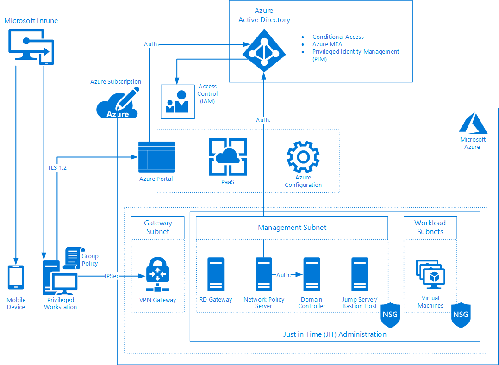

# Secure remote administration of your Gateway in Azure Australia

It's critical to the availability and integrity of any system that administrative activities are conducted securely and are controlled. Administrative activities should be done from a secure device, over a secure connection, and be backed by strong authentication and authorisation processes. Secure Remote Administration ensures that only authorised actions are performed and only by authorised administrators.

This article provides information on implementing a secure remote administration capability for an internet accessible system hosted in Azure that aligns with the Australian Cyber Security Centre (ACSC) Consumer Guidance and the intent of the ACSC's Information Security Manual (ISM).

## Australian Cyber Security Centre (ACSC) requirements

The overall security requirements for Commonwealth systems are defined in the ISM. To assist Commonwealth entities in providing secure administration, the ACSC has published [ACSC Protect: Secure Administration](https://www.acsc.gov.au/publications/protect/secure-administration.htm)

This document discusses the importance of secure administration and suggests one method of implementing a secure administration environment. The document describes the elements of a secure administration solution as follows:

|Element   |Description   |
|---|---|
|Privileged access control   |Controlling access to privileged accounts is a fundamental security control that will protect privileged accounts from misuse. The access control methodology will encompass the concepts of 'least privilege' and 'need to have' as well as processes and procedures for managing service accounts and staff movements.   |
|Multi-factor authentication   |Implementing additional factors of authentication beyond usernames and passphrases, such as physical tokens or smartcards, can help protect critical assets. If an adversary compromises credentials for privileged accounts, as all administrative actions would first need to go through some form of multi-factor authentication, the consequences can be greatly reduced.|
|Privileged workstations|The use of a known secure environment for administrative tasks can result in a lesser risk of the network being compromised due to the implementation of additional security controls.|
|Logging and auditing   |Automated generation, collection, and analysis of security and administrative related events from workstations, servers, network devices, and jump boxes will enable detection of compromises and attempted compromises. Automation enables organisations to respond more quickly, reducing the implications of a compromise.|
|Network segmentation and segregation|Segmenting a network into logical zones such as differing security domains, and further segregating these logical networks by restricting the types of data that flow from one zone to another, restricts lateral movement. Segmentation prevents an adversary from gaining access to additional resources.|
|Jump boxes|A jump box is a hardened remote access server, commonly utilising Microsoft's Remote Desktop Services or Secure Shell (SSH) software. Jump boxes act as a stepping point for administrators accessing critical systems with all administrative actions performed from the dedicated host.|

This article provides a reference architecture for how the elements above can be used for secure administration of systems deployed in Azure.

## Architecture

Providing a secure administration capability requires multiple components that all work together to form a cohesive solution. In the reference architecture provided, the components are mapped to the elements described in [ACSC Protect: Secure Administration](https://www.acsc.gov.au/publications/protect/secure-administration.htm)

## Components

The architecture is designed to ensure that a privileged account is granted only the necessary permissions, is securely identified, and then provided access to administrative interfaces only from an authorised device and through secure communications mechanisms that are controlled and audited.

|Solution| Components|Elements|
|---|---|---|
|Secure Devices |<ul><li>Privileged Workstation</li><li>Mobile Device</li><li>Microsoft Intune</li><li>Group Policy</li><li>Jump Server / Bastion Host</li><li>Just in Time (JIT) Administration</li></ul> |<ul><li>Privileged workstations</li><li>Jump boxes</li></ul>|
|Secure Communication |<ul><li>Azure portal</li><li>Azure VPN Gateway</li><li>Remote Desktop (RD) Gateway</li><li>Network Security Groups (NSGs)</li></ul> |<ul><li>Network segmentation and segregation</li></ul>|
|Strong Authentication |<ul><li>Domain Controller (DC)</li><li>Azure Active Directory (Azure AD)</li><li>Network Policy Server (NPS)</li><li>Azure MFA</li></ul> |<ul><li>Multi-factor authentication</li></ul> |
|Strong Authorisation |<ul><li>Identity and Access Management (IAM)</li><li>Privileged Identity Management (PIM)</li><li>Conditional Access</li></ul>|<ul><li>Privileged access control</li></ul>|
|||

>[!NOTE]
>For more information on the Logging and auditing element, see the article on [Gateway logging, auditing, and visibility](gateway-log-audit-visibility.md)

## Administration workflow

Administering systems deployed in Azure is divided into two distinct categories, administering the Azure configuration and administering workloads deployed in Azure. Azure configuration is conducted through the Azure portal and workload administration is completed through administrative mechanisms such as Remote Desktop Protocol (RDP), Secure Shell (SSH) or for PaaS capabilities, using tools such as SQL Management Studio.

Gaining access for administration is a multi-step process involving the components listed in the architecture and requires access to the Azure portal and Azure configuration before access can be made to Azure workloads.

>[!NOTE]
> The steps described here are the general process using the Graphical User Interface (GUI) components of Azure. These steps can also be completed using other interfaces such as PowerShell.

### Azure configuration and Azure portal access

|Step |Description |
|---|---|
|Privileged Workstation sign in |The administrator signs in the privileged workstation using administrative credentials. Group Policy controls prevent non-administrative accounts from authenticating to the privileged workstation and prevents administrative accounts from authenticating to non-privileged workstations. Microsoft Intune manages the compliance of the privileged workstation to ensure that it is up-to-date with software patches, antimalware, and other compliance requirements. |
|Azure portal sign in |The administrator opens a web browser to the Azure portal, which is encrypted using Transport Layer Security (TLS), and signs in on using administrative credentials. The authentication request is processed through Azure Active Directory directly or through authentication mechanisms such as Active Directory Federation Services (AD FS) or Pass-through authentication. |
|Azure MFA |Azure MFA sends an authentication request to the registered mobile device of the privileged account. The mobile device is managed by Intune to ensure compliance with security requirements. The administrator must authenticate first to the mobile device and then to the Microsoft Authenticator App using a PIN or Biometric system before the authentication attempt is authorised to Azure MFA. |
|Conditional Access |Conditional Access policies check the authentication attempt to ensure that it meets the necessary requirements such as the IP address the connection is coming from, group membership for the privileged account, and the management and compliance status of the privileged workstation as reported by Intune. |
|Privileged Identity Management (PIM) |Through the Azure portal the administrator can now activate or request activation for the privileged roles for which they have authorisation through PIM. PIM ensures that privileged accounts do not have any standing administrative privileges and that all requests for privileged access are only for the time required to perform administrative tasks. PIM also provides logging of all requests and activations for auditing purposes. |
|Identity and Access Management|Once the privileged account has been securely identified and roles activated, the administrator is provided access to the Azure subscriptions and resources that they have been assigned permissions to through Identity and Access Management.|

Once the privileged account has completed the steps to gain administrative access to the Azure portal, access to the workloads can be configured and administrative connections can be made.

### Azure workload administration

|Step |Description|
|---|---|
|Just in Time (JIT) Access|To obtain access to virtual machines, the Administrator uses JIT to request access to RDP to the Jump Server from the RD Gateway IP address and RDP or SSH from the Jump Server to the relevant workload virtual machines.|
|Azure VPN Gateway|The administrator now establishes a Point-to-Site IPSec VPN connection from their privileged workstation to the Azure VPN Gateway, which performs certificate  authentication to establish the connection.|
|RD Gateway|The administrator now attempts an RDP connection to the Jump Server with the RD Gateway specified in the Remote Desktop Connection configuration. The RD Gateway has a private IP address that is reachable through the Azure VPN Gateway connection. Policies on the RD Gateway control whether the privileged account is authorised to access the requested Jump Server. The RD Gateway prompts the administrator for credentials and forwards the authentication request to the Network Policy Server (NPS).|
|Network Policy Server (NPS)|The NPS receives the authentication request from the RD Gateway and validates the username and password against Active Directory before sending a request to Azure Active Directory to trigger an Azure MFA authentication request.|
|Azure MFA|Azure MFA sends an authentication request to the registered mobile device of the privileged account. The mobile device is managed by Intune to ensure compliance with security requirements. The administrator must authenticate first to the mobile device and then to the Microsoft Authenticator App using a PIN or Biometric system before the authentication attempt is authorised to Azure MFA.|
|Jump Server|Once successfully authenticated, the RDP connection is encrypted using Transport Layer Security (TLS) and then sent through the encrypted IPSec tunnel to the Azure VPN Gateway, through the RD Gateway and on to the Jump Server. From the Jump Server, the administrator can now RDP or SSH to workload virtual machines as specified in the JIT request.|

## General guidance

When implementing the components listed in this article, the following general guidance applies:

* Validate the region availability of services, ensuring that all data remains within authorised locations and deploy to AU Central or AU Central 2 as the first preference for PROTECTED workloads

* Refer to the *Azure - ACSC Certification Report – Protected 2018* publication for the certification status of individual services and perform self-assessments on any relevant components not included in the report as per the *ACSC CONSUMER GUIDE – Microsoft Azure at PROTECTED*

* Ensure network connectivity and any necessary proxy configuration for access to necessary authentication components  such as Azure AD, ADFS, and PTA

* Use Azure Policy to monitor and enforce compliance with requirements

* Ensure virtual machines, especially Active Directory Domain Controllers, are stored in encrypted storage accounts and utilise Azure Disk Encryption

* Create and maintain robust identity and administrative privilege management processes and governance to underpin the technical controls listed in this article

|Resource|URL|
|---|---|
|Australian Regulatory and Policy Compliance Documents|[Australian Regulatory and Policy Compliance Documents](https://aka.ms/au-irap)|
|Azure products - Australian regions and non-regional|[Azure products - Australian regions and non-regional](https://azure.microsoft.com/global-infrastructure/services/?regions=non-regional,australia-central,australia-central-2,australia-east,australia-southeast)|
|Strategies to Mitigate Cyber Security Incidents|[Strategies to Mitigate Cyber Security Incidents](https://acsc.gov.au/infosec/mitigationstrategies.htm)|
|ACSC Protect: Secure Administration|[ACSC Protect: Secure Administration](https://acsc.gov.au/publications/protect/secure-administration.htm)|
|How To: Integrate your Remote Desktop Gateway infrastructure using the Network Policy Server (NPS) extension and Azure AD|[Integrate RD Gateway with NPS and  Azure AD](https://docs.microsoft.com/azure/active-directory/authentication/howto-mfa-nps-extension-rdg)|

## Component guidance

This section provides information on the purpose of each component and its role in the overall Secure Remote Administration architecture. Additional links are provided to access useful resources such as reference documentation, guides, and tutorials.

## Secure devices

The physical devices used by privileged users to perform administrative functions are valuable targets for malicious actors. Maintaining the security and integrity of the physical devices and ensuring that they are free from malicious software and protecting them from compromise is a key part of providing a secure remote administration capability. This involves high priority security configuration as specified in the ACSC's Essential Eight Strategies to Mitigate Cyber Security Incidents such as application whitelisting, patching applications, application hardening, and patching operating systems. These capabilities must be installed, configured, audited, validated, and reported on to ensure the state of a device is compliant with organisation requirements.

### Privileged workstation

The privileged workstation is a hardened machine that can be used to perform administrative duties and is only accessible to administrative accounts. The privileged workstation should have policies and configuration in place to limit the software that can be run, its access to network resources and the internet and credentials should be protected in the event that the device is stolen or compromised.|

|Resources|Link|
|---|---|
|Privileged Access Workstations Architecture Overview|[https://docs.microsoft.com/windows-server/identity/securing-privileged-access/privileged-access-workstations](https://docs.microsoft.com/windows-server/identity/securing-privileged-access/privileged-access-workstations)|
|Securing Privileged Access Reference Material|[https://docs.microsoft.com/windows-server/identity/securing-privileged-access/securing-privileged-access-reference-material](https://docs.microsoft.com/windows-server/identity/securing-privileged-access/securing-privileged-access-reference-material)|

### Mobile device

A mobile device is at greater risk of accidental loss or theft due to its portability and size and needs to be secured appropriately. The mobile device provides a strong additional factor for authentication given its ability to enforce authentication for device access, traceability through location services, encryption functions, and the ability to be remotely wiped. When using a mobile device as an additional authentication factor for Azure, the device should be configured to use the Microsoft Authenticator App with PIN or Biometric authentication and not through phone calls or text messages.

|Resources|Link|
|---|---|
|Azure AD Authentication Methods|[https://docs.microsoft.com/azure/active-directory/authentication/concept-authentication-methods](https://docs.microsoft.com/azure/active-directory/authentication/concept-authentication-methods)|
|How to use the Microsoft Authenticator App|[https://support.microsoft.com/help/4026727/microsoft-account-how-to-use-the-microsoft-authenticator-app](https://support.microsoft.com/help/4026727/microsoft-account-how-to-use-the-microsoft-authenticator-app)|

### Microsoft Intune

Intune is the component of Enterprise Mobility + Security that manages mobile devices and apps. It integrates closely with other components like Azure Active Directory for identity and access control and Azure Information Protection for data protection. Intune provides policies for workstations and mobile devices to set compliance requirements for accessing resources and provides reporting and auditing capabilities for gaining insight into the status of administrative devices.

|Resources|Link|
|---|---|
|Microsoft Intune Documentation|[https://docs.microsoft.com/intune/](https://docs.microsoft.com/intune/)|
|Get started with Device Compliance in Intune|[https://docs.microsoft.com/intune/device-compliance-get-started](https://docs.microsoft.com/intune/device-compliance-get-started)|

### Group Policy

Group Policy is used to control the configuration of operating systems and applications. Security policies control the authentication, authorisation, and auditing settings of a system. Group Policy is used to harden the privileged workstation, protect administrative credentials and restrict non-privileged accounts from accessing privileged devices.

|Resources|Link|
|---|---|
|Allow sign in locally Group Policy setting|[https://docs.microsoft.com/windows/security/threat-protection/security-policy-settings/allow-log-on-locally](https://docs.microsoft.com/windows/security/threat-protection/security-policy-settings/allow-log-on-locally)|

### Jump Server / Bastion Host

The Jump Server / Bastion Host is a centralised point for administration. It has the tools required to perform administrative duties, but also has the network access necessary to connect to resources on administrative ports. The Jump Server is the central point for administering Virtual Machine workloads in this article, but it can also be configured as the authorised point for administering Platform as a Service (PaaS) capabilities such as SQL. Access to PaaS capabilities can be restricted on a per service basis using identity and network controls.

|Resources|Link|
|---|---|
|Implementing Secure Administrative Hosts|[https://docs.microsoft.com/windows-server/identity/ad-ds/plan/security-best-practices/implementing-secure-administrative-hosts](https://docs.microsoft.com/windows-server/identity/ad-ds/plan/security-best-practices/implementing-secure-administrative-hosts)|

### Just in Time (JIT) access

JIT is an Azure Security Center capability that utilises Network Security Groups (NSGs) to block access to administrative protocols such as RDP and SSH on Virtual Machines. Applications hosted on Virtual Machines continue to function as normal, but for administrative access to be obtained it must be requested can only be granted for a set period of time. All requests are logged for auditing purposes.

|Resources |Link |
|---|---|
|Manage Just in Time (JIT) access|[https://docs.microsoft.com/azure/security-center/security-center-just-in-time](https://docs.microsoft.com/azure/security-center/security-center-just-in-time)|
|Automating Azure Just In Time VM Access|[https://blogs.technet.microsoft.com/motiba/2018/06/24/automating-azure-just-in-time-vm-access](https://blogs.technet.microsoft.com/motiba/2018/06/24/automating-azure-just-in-time-vm-access)|

## Secure communication

Communications traffic for administration activities can contain highly sensitive information, such as administrative credentials and must be managed and protected accordingly. Providing secure communication involves reliable encryption capabilities to prevent eavesdropping and network segmentation and restrictions that limit administrative traffic to authorised end points and controls lateral movement if a system is compromised.

### Azure portal

Communications to the Azure portal are encrypted using Transport Layer Security (TLS) and the use of the Azure portal has been certified by the ACSC. Commonwealth entities should follow the recommendations in the *ACSC Consumer Guide* and configure their web browsers to ensure that they are using the latest version of TLS and with supported cryptographic algorithms.

|Resources |Link |
|---|---|
|Azure Encryption Overview – Encryption in transit|[https://docs.microsoft.com/azure/security/security-azure-encryption-overview#encryption-of-data-in-transit](https://docs.microsoft.com/azure/security/security-azure-encryption-overview#encryption-of-data-in-transit)|

### Azure VPN Gateway

The Azure VPN Gateway provides the secure encrypted connection from the privileged workstation to Azure. The Azure VPN Gateway has been certified by the ACSC for providing secure IPSec communication. Commonwealth entities should configure the Azure VPN Gateway in accordance with the ACSC Consumer Guide, ACSC Certification Report, and other specific guidance.

|Resources |Link |
|---|---|
|About Point-to-Site Connections|[https://docs.microsoft.com/azure/vpn-gateway/point-to-site-about](https://docs.microsoft.com/azure/vpn-gateway/point-to-site-about)|
|Azure VPN Gateway Cryptographic Details|[https://docs.microsoft.com/azure/vpn-gateway/vpn-gateway-about-compliance-crypto](https://docs.microsoft.com/azure/vpn-gateway/vpn-gateway-about-compliance-crypto)|
|Azure VPN Gateway Configuration|[Azure VPN Gateway configuration](vpn-gateway.md)|

### Remote Desktop (RD) Gateway

RD Gateway is a secure mechanism for controlling and authorising RDP connections to systems. It works by encapsulating RDP traffic in HyperText Transfer Protocol Secure (HTTPS) and encrypted using TLS. TLS provides an additional layer of security for administrative traffic.

|Resources |Link |
|---|---|
|Remote Desktop Services Architecture|[https://docs.microsoft.com/windows-server/remote/remote-desktop-services/desktop-hosting-logical-architecture](https://docs.microsoft.com/windows-server/remote/remote-desktop-services/desktop-hosting-logical-architecture)|

### Network Security Groups (NSGs)

NSGs function as Access Control Lists (ACLs) for network traffic entering or leaving subnets or virtual machines. NSGs provide network segmentation and provide a mechanism for controlling and limiting the communications flows permitted between systems. NSGs are a core component of Just in Time Administration (JIT) for allowing or denying access to administrative protocols.

|Resources |Link |
|---|---|
|Azure Security Groups Overview|[https://docs.microsoft.com/azure/virtual-network/security-overview](https://docs.microsoft.com/azure/virtual-network/security-overview)|
|How to: Plan Virtual Networks|[https://docs.microsoft.com/azure/virtual-network/virtual-network-vnet-plan-design-arm](https://docs.microsoft.com/azure/virtual-network/virtual-network-vnet-plan-design-arm)|

## Strong authentication

Securely identifying privileged users before granting access to systems is a core component of secure administration. Mechanisms must be in place to protect the credentials associated with a privileged account and to prevent malicious actors from gaining access to systems through impersonation or credential theft.

### Domain Controller (DC)

At a high level, a DC hosts a copy of the Active Directory Database, which contains all the users, computers and groups within a Domain. DCs perform authentication for users and computers. The DCs in this architecture are hosted as virtual machines within Azure and provide authentication services for privileged accounts connecting to Jump Servers and workload virtual machines.

|Resources |Link |
|---|---|
|Active Directory Domain Services Overview|[https://docs.microsoft.com/windows-server/identity/ad-ds/get-started/virtual-dc/active-directory-domain-services-overview](https://docs.microsoft.com/windows-server/identity/ad-ds/get-started/virtual-dc/active-directory-domain-services-overview)|

### Azure Active Directory (Azure AD)

Azure AD is the authentication service for Azure. It contains the cloud

identities and provides authentication and authorisation for an Azure environment. Azure AD can be synchronised with Active Directory through Azure AD Connect and can provide federated authentication through Active Directory Federation Services (AD FS) and Azure AD Connect. Azure AD is a core component of secure administration.

|Resources |Link |
|---|---|
|Azure Active Directory Documentation|[https://docs.microsoft.com/azure/active-directory](https://docs.microsoft.com/azure/active-directory)|
|Hybrid Identity Documentation|[https://docs.microsoft.com/azure/active-directory/hybrid](https://docs.microsoft.com/azure/active-directory/hybrid)|

### Network Policy Server (NPS)

An NPS is an authentication and policy server that provides advanced authentication and authorisation processes. The NPS server in this architecture is provided to integrate Azure MFA authentication with RD Gateway authentication requests. The NPS has a specific plug-in to support integration with Azure MFA in Azure AD.

|Resources |Link |
|---|---|
|Network Policy Server Documentation|[https://docs.microsoft.com/windows-server/networking/technologies/nps/nps-top](https://docs.microsoft.com/windows-server/networking/technologies/nps/nps-top)|

### Azure MFA

Azure MFA is an authentication service provided within Azure Active Directory to enable authentication requests beyond a username and password for accessing cloud resources such as the Azure portal. Azure MFA supports a range of authentication methods and this architecture utilises the Microsoft Authenticator App for enhanced security and integration with the NPS.

|Resources |Link |
|---|---|
|How it works: Azure Multi-Factor Authentication|[https://docs.microsoft.com/azure/active-directory/authentication/concept-mfa-howitworks](https://docs.microsoft.com/azure/active-directory/authentication/concept-mfa-howitworks)|
|How to: Deploy cloud-based Azure Multi-Factor Authentication|[https://docs.microsoft.com/azure/active-directory/authentication/howto-mfa-getstarted](https://docs.microsoft.com/azure/active-directory/authentication/howto-mfa-getstarted)|

## Strong authorisation

Once a privileged account has been securely identified, it can be granted access to resources. Authorisation controls and manages the privileges that are assigned to a specific account. Strong Authorisation processes align with the ACSC's Essential Eight strategy for mitigating cyber security incidents of restricting administrative privileges.

### Identity and access management

Access to perform privileged actions within Azure is based on roles that are assigned to that account. Azure includes an extensive and granular range of roles with specific permissions to undertaken specific tasks. These roles can be granted at multiple levels such as a subscription or resource group. Role assignment and permission management are based on accounts and groups in Azure Active Directory and is managed through Access Control (IAM) within Azure.

|Resources |Link |
|---|---|
|Azure Role Based Access Control|[https://docs.microsoft.com/azure/role-based-access-control](https://docs.microsoft.com/azure/role-based-access-control)|
|Understand Role Definitions|[https://docs.microsoft.com/azure/role-based-access-control/role-definitions](https://docs.microsoft.com/azure/role-based-access-control/role-definitions)|

### Privileged Identity Management (PIM)

PIM is an Azure Active Directory component that controls access to privileged roles. Privileged accounts do not require permanent or standing privileged access, but can instead be granted the ability to request privileged access for a period of time in order to complete privileged activities. PIM provides additional controls around maintaining and restricting privileged access as well as logging and auditing to track instances of privilege use.

|Resources |Link |
|---|---|
|Privileged Identity Management (PIM) Documentation|[https://docs.microsoft.com/azure/active-directory/privileged-identity-management](https://docs.microsoft.com/azure/active-directory/privileged-identity-management)|
|Start using PIM|[https://docs.microsoft.com/azure/active-directory/privileged-identity-management/pim-getting-started](https://docs.microsoft.com/azure/active-directory/privileged-identity-management/pim-getting-started)|

### Conditional access

Conditional access is a component of Azure Active Directory that allows or denies access to resources based on conditions. These conditions can be network location based, device type, compliance status, group membership and more. Conditional Access is used to enforce MFA, device management, and compliance through Intune and group membership of administrative accounts.

|Resources |Link |
|---|---|
|Conditional Access Documentation|[https://docs.microsoft.com/azure/active-directory/conditional-access](https://docs.microsoft.com/azure/active-directory/conditional-access)|
|How to: Require Managed Devices for cloud app access with conditional access|[https://docs.microsoft.com/azure/active-directory/conditional-access/require-managed-devices](https://docs.microsoft.com/azure/active-directory/conditional-access/require-managed-devices)|

## Next steps

Review the article on [Gateway Ingress Traffic Management and Control](gateway-ingress-traffic.md) for details on controlling traffic flows through your Gateway components in Azure.
