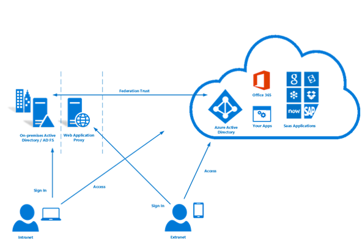

# Identity federation in Azure Australia

Identity Management and Federation with Public Cloud offerings is one of the most crucial first-steps for using the cloud. Microsoft's Azure Active Directory service stores user information to enable access to cloud services and is a pre-requisite for consuming other Azure services.

This article covers the key design points for implementing Azure Active Directory, synchronising users from an Active Directory Domain Services domain, and implementing secure authentication. Specific focus is placed on the recommendations in the Australian Cyber Security Center's Information Security Manual (ISM) and Azure Certification Reports.

The classification of information stored within Azure Active Directory should inform decisions about how it is designed. The following excerpt is provided from the [ACSC Certification Report – Microsoft Azure](https://aka.ms/au-irap):

>**ACSC Certification Report – Microsoft Azure**
>Azure Active Directory (Azure AD) must be configured with Active Directory Federation services when Commonwealth entities classify the use and data content of their Active Directory at PROTECTED. While Active Directory data at the UNCLASSIFIED Dissemination Limiting Markings (UDLM) classification does not require federation, Commonwealth entities can still implement federation to mitigate risks associated with the service being provided from outside of Australia.

As such, what information is synchronised, and the mechanism by which users are authenticated, are the two key concerns covered here.

## Key design considerations

### User synchronisation

When deploying Azure AD Connect, there are several decisions that must be made about the data that will be synchronised. Azure AD Connect is based upon Microsoft Identity Manager and provides a robust feature-set for [transforming](https://docs.microsoft.com/azure/active-directory/hybrid/how-to-connect-sync-best-practices-changing-default-configuration) data between directories.

Microsoft Consulting Services can be engaged to do an ADRAP evaluation of your existing Windows Server Active Directory. The ADRAP assists in determining any issues that may need to be corrected before synchronising with Azure Active Directory. Microsoft Premier Support Agreements will generally include this service.

The [IDFix tool](https://docs.microsoft.com/office365/enterprise/install-and-run-idfix) scans your on-premises Active Directory domain for issues before synchronising with Azure AD. IDFix is a key first step before implementing Azure AD Connect. Although an IDFix scan can identify a large number of issues, many of these issues can either be resolved quickly with scripts, or worked-around using data transforms in Azure AD Connect.

Azure AD requires that users have an externally routable top-level domain to enable authentication. If your domain has a UPN suffix that is not externally routable, the you need to set the [alternative sign in ID](https://docs.microsoft.com/azure/active-directory/hybrid/plan-connect-userprincipalname) in AD Connect to the user's mail attribute. Users then sign in to Azure services with their email address rather than their domain sign in.

The UPN suffix on user accounts can also be altered using tools such as PowerShell however; it can have unforeseen consequences for other connected systems and is no longer considered best practice.

In deciding which attributes to synchronise to Azure Active Directory, it's safest to assume that all attributes are required. It is rare for a directory to contain actual PROTECTED data, however conducting an audit is recommended. If PROTECTED data is found within the directory, assess the impact of omitting or transforming the attribute. As a helpful guide, there is a list of attributes which Microsoft Cloud Services [require](https://docs.microsoft.com/azure/active-directory/hybrid/reference-connect-sync-attributes-synchronized).

### Authentication

It's important to understand the options that are available, and how they can be used to keep end-users secure.
Microsoft offers [three native solutions](https://docs.microsoft.com/azure/active-directory/hybrid/plan-connect-user-signin) to authenticate users against Azure Active Directory:

* Password hash synchronization - The hashed passwords from Active Directory Domain Services are synchronised by Azure AD Connect into Azure Active Directory.
* [Pass-through authentication](https://docs.microsoft.com/azure/active-directory/hybrid/how-to-connect-pta) - Passwords remain within Active Directory Domain Services. Users are authenticated against Active Directory Domain Services via an agent. No passwords are stored within Azure AD.
* [Federated SSO](https://docs.microsoft.com/azure/active-directory/hybrid/how-to-connect-fed-whatis) - Azure Active Directory is federated with Active Directory Federation Services, during sign in, Azure directs users to Active Directory Federation Services to authenticate. No passwords are stored within Azure AD.

Password hash synchronisation can be used in scenarios where OFFICIAL:Sensitive and below data is being stored within the directory. Scenarios where PROTECTED data is being stored will require one of the two remaining options.

All three of these options support [Password Write-Back](https://docs.microsoft.com/azure/active-directory/authentication/concept-sspr-writeback), which the [ACSC Consumer Guide](https://aka.ms/au-irap) recommends being disabled. However; organisations should evaluate the risk of disabling Password Writeback against the productivity gains and reduced support effort of using self-service password resets.

#### Pass-Through Authentication (PTA)

Pass-Through Authentication was released after the IRAP assessment was completed and therefore; should be individually evaluated to determine how the solution fits your organisation's risk profile. Pass-Through Authentication is preferred over Federation by Microsoft due to the improved security posture.

Pass-Through Authentication presents several design factors to be considered:

* Pass-Through Authentication Agent must be able to establish outgoing connections to Microsoft Cloud Services.
* Installing more than one agent to ensure that the service will be Highly Available. It is best practice to deploy at least three agents, and up to a maximum of 12 agents.
* Best Practice is to avoid installing the agent directly onto an Active Directory Domain Controllers. By default when deploying Azure AD Connect with Pass-Through authentication it will install the agent on the AD Connect server.
* Pass-Through Authentication is a lower maintenance option than Active Directory Federation Services because it does not require dedicated server infrastructure, certificate management, or inbound firewall rules.

#### Active Directory Federation Services (ADFS)

Active Directory Federation Services was included within the IRAP assessment and is approved for use in PROTECTED environments.

Active Directory Federation Services presents several design factors to be considered:

* Federation Services will require network ingress for HTTPS traffic from the internet or at minimum Microsoft's service endpoints.
* Federation Services uses PKI and certificates, which require ongoing management and renewal.
* Federation Services should be deployed on dedicated servers, and will require the relevant network infrastructure to make it securely accessible externally.

### Multi-Factor Authentication (MFA)

The ISM section on multi-factor authentication recommends implementing it in the following scenarios based on your risk profile:

* Authenticating Standard Users
* Authenticating Privileged accounts
* Authenticating Users Remote access
* Users doing privileged actions

Azure Active Directory provides Multi-Factor Authentication that can be enabled for either all, or a subset of users (for example, only Privileged Accounts). Microsoft also provides a solution called Conditional Access, which allows more granular control over how Multi-Factor Authentication is applied (for example, only when users sign in from remote IP address ranges).

Azure Multi-Factor Authentication supports the following ISM acceptable forms of validation:

* Phone call
* SMS message
* Microsoft Authenticator Application
* Supported hardware tokens

Privileged Identity Management, a component of Azure Active Directory, can be used to enforce the use of Multi-Factor authentication when users elevate their permissions to meet the fourth recommendation.

## Next steps

Review the article on [Role-Based Access Controls and Privileged Identity Management](role-privileged.md).
