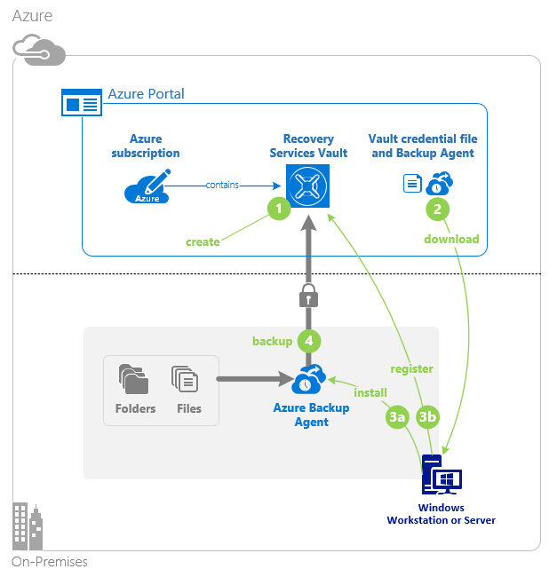
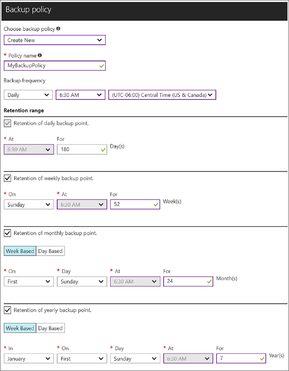

# Backup and disaster recovery in Azure Australia

Having backup and disaster recovery plans with the supporting infrastructure in place is critical for all organisations. The importance of having a backup solution is highlighted by its inclusion in the [Australian Cyber Security Center's Essential 8](https://acsc.gov.au/publications/protect/essential-eight-explained.htm).

Microsoft Azure provides two services that enable resilience: Azure Backup and Azure Site Recovery. These services enable you to protect your data, both on-premises and in the cloud,  for a variety of design scenarios. Azure Backup and Azure Site Recovery both use a common storage and management resource: the Azure Recovery Services Vault. This vault is used to manage, monitor, and segregate Azure Backup and Azure Site Recovery Data.

This article details the key design elements for implementing Azure Backup and Azure Site Recovery in line with the [Australian Signals Directorate's (ASD) Information Security Manual (ISM) Controls](https://acsc.gov.au/infosec/ism/index.htm).

## Azure Backup

Azure Backup resembles a traditional on-premises backup solution and provides the ability to backup both on-premises and Azure hosted data. Azure Backup can be used to back up the following data types to Azure:

* Files and folders
* Supported Windows and Linux operating systems hosted on:
  * Hyper-V and VMWare Hypervisors
  * Physical hardware
* Supported Microsoft applications

### Azure Site Recovery

Azure Site Recovery replicates workloads consisting of either a single virtual machine or multi-tier applications. Replication is supported from on-premises into Azure, between Azure regions, or between on-premises locations orchestrated by Azure Site Recovery. On-premises virtual machines can be replicated to Azure or to a supported on-premises hypervisor. Once configured, Azure Site Recovery orchestrates replication, fail-over, and fail-back.

## Key design considerations

When implementing a backup or disaster recovery solution, the proposed solution needs to consider:

* The scope and volume of data to be captured
* How long the data will be retained
* How this data is securely stored and managed
* The geographical locations where the data is stored
* Routine system testing procedures

The ISM provides guidance on the security considerations that should be made when designing a solution. Microsoft Azure provides means to address these security considerations.

### Data sovereignty

Organisations need to ensure that data sovereignty is maintained when utilising cloud based storage locations. Azure Policy provides the means to restrict the permitted locations where an Azure resource can be created. The built-in Azure Policy "Allowed Locations" is used to ensure that any Azure resources created under the scope of an assigned Azure Policy can only be created in the nominated geographical locations.

The Azure Policy items for geographic restriction for Azure resources are:

* allowedLocations
* allowedSingleLocation

These policies allow Azure administrators to restrict creation to a list of nominated locations or even as single geographic location.

### Redundant and geographically dispersed storage

Data stored in the Azure Recovery Service Vault is always stored on redundant storage. By default the Recovery Service Vault uses Azure Geographically Redundant Storage (GRS). Data stored using GRS is replicated to other Azure data centres in the Recovery Service Vault's [secondary paired region](https://docs.microsoft.com/azure/best-practices-availability-paired-regions). This replicated data is stored as read-only and is only made writeable if there is an Azure failover event. Within the Azure data centre, the data is replicated between separate fault domains and upgrade domains to minimise the chance of hardware or maintenance-based outage. GRS provides at least 99.99999999999999% availability annually.

The Azure Recovery Services Vault can be configured to utilise Locally Redundant Storage (LRS). LRS is a lower-cost storage option with the trade-off of reduced availability. This redundancy model employs the same replication between separate fault domains and upgrade domains but is not replicated between geographic regions. Data located on LRS storage, while not as resilient as GRS, still provides at least 99.999999999% availability annually.

Unlike traditional offsite storage technologies like tape media, the additional copies of the data are created automatically and do not require any additional administrative overhead.

### Restricted access and activity monitoring

Backup data must be protected from corruption, modification, and unapproved deletion. Both Azure Backup and Azure Site Recovery make use of the common Azure management fabric. This fabric provides detailed auditing, logging, and Role-Based Access Control (RBAC) to resources located within Azure. Access to backup data can be restricted to select administrative staff and all actions involving backup data can be logged and audited.

Both Azure Backup and Azure Site Recovery have built-in logging and reporting features. Any issues that occur during backup or replication are reported to administrators using the Azure management fabric.

Azure Recovery Services Vault also has the following additional data security measures in place:

* Backup data is retained for 14 days after a delete operation has occurred
* Alerts and Notifications for critical operations such as "Stop Backup with delete data"
* Security PIN requirements for critical operations
* Minimum retention range checks are in place

These minimum retention range checks include:

* For daily retention, a minimum of seven days of retention
* For weekly retention, a minimum of four weeks of retention
* For monthly retention, a minimum of three months of retention
* For yearly retention, a minimum of one year of retention

All backup data stored within Azure is encrypted at rest using Azure's Storage Service Encryption (SSE). This is enabled for all new and existing storage accounts by default and cannot be disabled. The encrypted data is automatically decrypted during retrieval. By default, data encrypted using SSE is encrypted using a key provided by and managed by Microsoft. Organisations can choose to provide and manage their own encryption key for use with SSE. This provides an optional additional layer of security for the encrypted data. This key can be stored by the customer on-premises or securely within the Azure Key vault.

### Secure data transport

Azure Backup data encrypted in transit using AES 256. This data is secured via the use of a passphrase created by administrative staff when the backup is first configured. Microsoft does not have access to this passphrase meaning the customer must ensure this passphrase is stored securely. The data transfer then takes place between the on-premises environment and the Azure Recovery Services Vault via a secure HTTPS connection.  The data within the Recovery Services Vault is then encrypted at rest using Azure SSE.

Azure Site Recovery data is also always encrypted in transit. All replicated data is securely transported to Azure using HTTPS and TLS. When an Azure customer connects to Azure using an ExpressRoute connection, Azure Site Recovery data is sent via this private connection.  When an Azure customer is connecting to Azure using a VPN connection, the data is replicated between on-premises and the Recovery Services vault securely over the internet.

This secure network data transfer removes the security risk and mitigation requirements for managing traditional offsite backup storage solutions such as tape media.

### Data retention periods

A minimum backup retention period of three months is recommended, however, longer retention periods are commonly required. Azure Backup can provide up to 9999 copies of a backup. If a single Azure Backup of a protected instance was taken daily, this would allow for the retention of 27 years of daily backups. Individual monthly backups of a protected instance allow for 833 years of retention. As backup data is aged out and less granular backups are retained over time, the total retention window for backup data grows.  Azure doesn't limit the length of time data can remain in an Azure Recovery Services Vault, only the total number of backups per instance. There is also no performance difference between restoring from old or new backups, each restore takes the same amount of time to occur.

The Azure Recovery Services Vault has a number of default backup and retention policies in place.  Administrative staff can also create custom backup and retention policies.

A balance between backup frequency and long-term retention requirements needs to be found when configuring Azure Backup and retention policies.

### Backup and restore testing

The ISM recommends testing of backup data to ensure that the protected data is valid when a restore or failover is required. Azure Backup and Azure Site Recovery also provide the capability to test protected data once it has been backed up or replicated. Data managed by Azure Backup can be restored to a nominated location and the consistency of the data can then be validated.

Azure Site Recovery has inbuilt capability to perform failover testing. Workloads replicated to the Recovery Services Vault can be restored to a nominated Azure environment. The target restore environment can be fully isolated from any production environment to ensure there is no impact on production systems while performing a test. Once the test is complete, the test environment and all resources can be immediately deleted to reduce operational costs.

Failover testing and validation can be automated using the Azure Automation service built into the Azure platform. This allows for failover testing to be scheduled to occur automatically to ensure that data is being successfully replicated to Azure.

## Next steps

Review the article on [Ensuring Security with Azure Policy](azure-policy.md).
