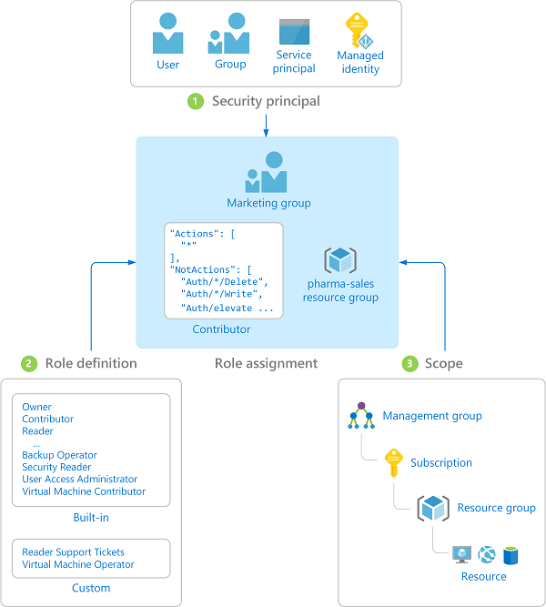
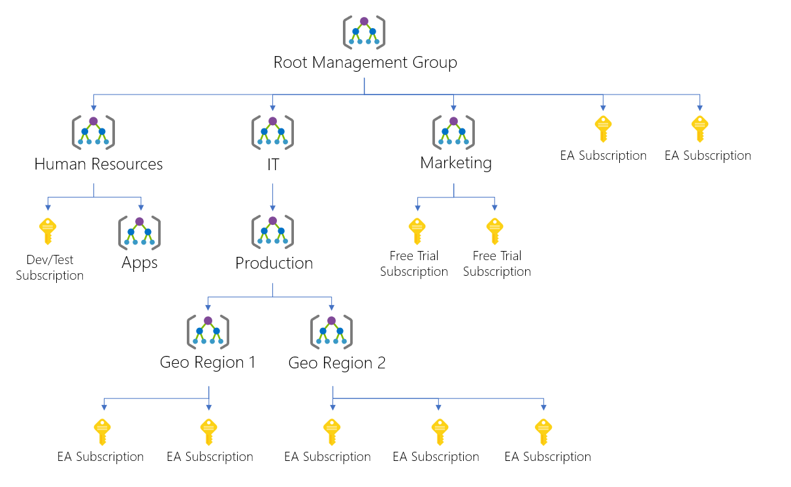

# Azure role-based access control (Azure RBAC) and Privileged Identity Management (PIM)

Managing administrative privilege is a critical step in ensuring security within any IT environment. Restricting administrative privilege via the use of Least Privilege Security is a requirement of the [ACSC ISM](https://acsc.gov.au/infosec/ism/index.htm) and forms part of the [ACSC Essential 8](https://www.acsc.gov.au/infosec/mitigationstrategies.htm) list of security recommendations.

Microsoft provides a suite of controls to implement Just-in-Time and Just-Enough-Access within Microsoft Azure. Understanding these controls is essential for an effective security posture in the Cloud. This guide will provide an overview of the controls themselves and the key design considerations when implementing them.

## Azure RBAC

Azure role-based access control (Azure RBAC) is central to the management of access to all resources within Microsoft Azure and the management of Azure Active Directory (Azure AD). Azure RBAC can be implemented alongside a number of complementary features available in Azure. This article focuses on implementing effective RBAC using Azure Management Groups, Azure Active Directory Groups, and Azure Privileged Identity Management (PIM).

At a high level, implementing Azure RBAC requires three components:



* **Security Principals**: A security principal can be any one of the following; a user, a group, [Service Principals](../active-directory/develop/app-objects-and-service-principals.md), or a [Managed Identity](../active-directory/managed-identities-azure-resources/overview.md). Security Principals should be assigned privileges using Azure Active Directory Groups.

* **Role Definitions**: A Role Definition, also referred to as a Role, is a collection of permissions. These permissions define the operations that can be performed by the Security Principals assigned to the Role Definition. This functionality is provided by Azure Resource Roles and Azure Active Directory Administrator Roles. Azure comes with a set of built-in roles (link) which can be augmented with custom roles.

* **Scope**: The scope is the set of Azure resources that a Role Definition applies to. Azure Roles can be assigned to Azure Resources using Azure Management Groups.

These three components combine to grant Security Principals the access defined in the Role Definitions to all of the resources that fall under the Azure Management Groups' Scope, this is called a Role Assignment. Multiple Role Definitions can be assigned to a Security Principal, and multiple Security Principals can be assigned to a single Scope.

### Azure Active Directory Groups

When assigning privileges to individuals or teams, whenever possible the assignment should be linked to an Azure Active Directory Group and not assigned directly to the user in question. This is the same recommended practice inherited from on-premises Active Directory implementations. Where possible Azure Active Directory Groups should be created per team, complementary to the logical structure of the Azure Management Groups you have created.

In a hybrid cloud scenario, on-premises Windows Server Active Directory Security Groups can be synchronized to your Azure Active Directory instance. If you have already implemented Azure RBAC on-premises using these Windows Server Active Directory Security Groups, these groups, once synchronized, can then be used to implement Azure RBAC for your Azure Resources. Otherwise, your cloud environment can be seen as a clean slate to design and implement a robust privilege management plan built around your Azure Active Directory implementation.

### Azure resource roles versus Azure Active Directory Administrator roles

Microsoft Azure offers a wide variety of built-in roles for [Azure Resources](../role-based-access-control/built-in-roles.md) and [Azure Active Directory Administration](../active-directory/roles/permissions-reference.md). Both types of Role provide specific granular access to either Azure Resources or for Azure AD administrators. It is important to note that Azure Resource roles cannot be used to provide administrative access to Azure AD and Azure AD roles do not provide specific access to Azure resources.

Some examples of the types of access that can be assigned to an Azure resource using a built-in role are:

* Allow one user to manage virtual machines in a subscription and another user to manage virtual networks
* Allow a DBA group to manage SQL databases in a subscription
* Allow a user to manage all resources in a resource group, such as virtual machines, websites, and subnets
* Allow an application to access all resources in a resource group

Examples of the types of access that can be assigned for Azure AD administration are:

* Allow helpdesk staff to reset user passwords
* Allow staff to invite external users to an Azure AD instance for B2B collaboration
* Allow administrative staff read access to sign in and audit reports
* Allow staff to manage all users and groups, including resetting passwords.

It is important to take the time to understand the full list of allowed actions a built-in role provides to ensure that undue access to isn't granted. The list of built-in roles and the access they provide is constantly evolving, the full list of the Roles and their definitions can be viewed by reviewing the documentation linked above or by using the Azure PowerShell cmdlet:

```PowerShell
Get-AzRoleDefinition
```

```output
Name             : AcrDelete
Id               : <<RoleID>>
IsCustom         : False
Description      : acr delete
Actions          : {Microsoft.ContainerRegistry/registries/artifacts/delete}
NotActions       : {}
DataActions      : {}
NotDataActions   : {}
AssignableScopes : {/}
...
```

or the Azure CLI command:

```azurecli-interactive
az role definition list
```

```output
[
  {
    "assignableScopes": [
      "/"
    ],
    "description": "acr delete",
    "id": "/subscriptions/49b12d1b-4030-431c-8448-39056021c4ab/providers/Microsoft.Authorization/roleDefinitions/c2f4ef07-c644-48eb-af81-4b1b4947fb11",
    "name": "c2f4ef07-c644-48eb-af81-4b1b4947fb11",
    "permissions": [
      {
        "actions": [
          "Microsoft.ContainerRegistry/registries/artifacts/delete"
        ],
        "dataActions": [],
        "notActions": [],
        "notDataActions": []
      }
    ],
    "roleName": "AcrDelete",
    "roleType": "BuiltInRole",
    "type": "Microsoft.Authorization/roleDefinitions"
  },
...
```

It is also possible to create custom Azure Resource Roles as required. These custom roles can be created in the Azure portal, via PowerShell, or the Azure CLI. When creating custom Roles, it is vital to ensure the purpose of the Role is unique and that its function is not already provided by an existing Azure Resource Role. This reduces ongoing management complexity and reduces the risk of Security Principals receiving unnecessary privileges. An example would be creating a custom Azure Resource Role that sits between the built-in Azure Resource Roles, "Virtual Machine Contributor" and "Virtual Machine Administrator Login".

The custom Role could be based on the existing Contributor Role, which grants the following access:

| Azure Resource | Access Level |
| --- | --- |
| Virtual Machines | Can Manage but cannot access |
| Virtual Network attached to VM | Cannot access |
| Storage attached to VM | Cannot access |
|

The custom role could preserve this basic access, but allow the designated users some basic additional privileges to modify the network configuration of the virtual machines.

Azure Resource Roles also have the benefit of being able to be assigned to resources via Azure Management Groups.

### Azure Management Groups

Azure Management Groups can be used by an organisation to manage the assignment of Roles to all of the subscriptions and their resources within an Azure Tenancy. Azure Management Groups are designed to allow you to create management hierarchies, including the ability to map your organisational structure hierarchically, within Azure. Creating organisational business units as separate logical entities allows permissions to be applied within an organisation based on each team's specific requirements. Azure Management Groups can be used to define a management hierarchy up to six levels deep.



Azure Management Groups are mapped to Azure Subscriptions within an Azure Tenancy. This allows an organisation to segregate Azure Resources belonging to specific business units and provide a level of granular control over both cost management and privilege assignment.

## Privileged Identity Management (PIM)

Microsoft has implemented Just-In-Time (JIT) and Just-Enough-Access (JEA) through Azure Privileged Identity Management. This service enables administrative staff to control, manage, and monitor privileged access to Azure Resources. PIM allows Security Principals to be made "eligible" for a Role by administrative staff, allowing users to request the activation of the Role through the Azure portal or via PowerShell cmdlets. By default, Role assignment can be activated for a period of between 1 and 72 hours. If necessary, the user can request an extension to their Role assignment and the option to make Role assignment permanent does exist. Optionally, the requirement for Multi-factor Authentication can be enforced when users request the activation of their eligible roles. Once the allocated period of the Role activation expires, the Security Principal no longer has the privileged access granted by the Role.

The use of PIM prevents the common privilege assignment issues that can occur in environments that don't use Just-In-Time access or don't conduct routine audits of privilege assignment. One common issue is the assignment of elevated privileges being forgotten and remaining in place long after the task requiring elevated privileges has been completed. Another issue is the proliferation of elevated privileges within an environment through the cloning of the access assigned to a Security Principal when configuring other similar Security Principals.

## Key design considerations

When designing an Azure RBAC strategy with the intention of enforcing Least Privilege Security, the following security requirements should be considered:

* Requests for privileged access are validated
* Administrative privileges are restricted to the minimum access required to perform the specific duties
* Administrative privileges are restricted to the minimum period of time required to perform the specific duties
* Regular reviews of granted administrative privileges are undertaken

The process of designing an Azure RBAC strategy will necessitate a detailed review of business functions to understand the difference in access between distinct business roles, and the type and frequency of work that requires elevated privileges. The difference in function between a Backup Operator, a Security Administrator, and an Auditor will require different levels of access at different times with varying levels of ongoing review.

## Validate requests for access

Elevated privileges must be explicitly approved. To support this, an approval process must be developed and appropriate staff made responsible for validating that all requests for additional privileges are legitimate. Privileged Identity Management provides multiple options for approving Role assignment. A role activation request can be configured to allow for self-approval or be gated and require nominated approvers to manually review and approve all Role activation requests. Activation requests can also be configured to require additional supporting information is included with the activation request, such as ticket numbers.

### Restrict privilege based on duties

Restricting the level of privilege granted to Security Principals is critical, as the over assignment of privileges is a common IT Security attack vector. The types of resources being managed, and the teams responsible, must be assessed so the minimum level of privileges required for daily duties can be assigned. Additional privileges that go beyond those required for daily duties should only ever be granted for the period of time required to perform a specific task. An example of this would be providing "Contributor" access to a customer's administrator, but allowing them to request "Owner" permissions for an Azure Resource for a specific task requiring temporary high-level access.

This ensures that each individual administrator only has elevated access for the shortest period of time. Adherence to these practices reduces the overall attack surface for any organisations IT infrastructure.

### Regular evaluation of administrative privilege

It is vital that Security Principals within an environment are routinely audited to ensure that the correct level of privilege is currently assigned. Microsoft Azure provides a number of means to audit and evaluate the privileges assigned to Azure Security Principals. Privileged Identity Management allows administrative staff to periodically perform "Access Reviews" of the Roles granted to Security Principals. An Access Review can be undertaken to audit both Azure Resource Role assignment and Azure Active Directory Administrative Role assignment. An Access Review can be configured with the following properties:

* **Review name and review start and end dates**: Reviews should be configured to be long enough for the nominated users to complete them.

* **Role to be reviewed**: Each Access Review focuses on a single Azure Role.

* **Nominated reviewers**: There are three options for performing a review. You can assign the review to someone else to complete, you can do it yourself, or you can have each user review their own access.

* **Require users to provide a reason for access**: Users can be required to enter a reason for maintaining their level of privilege when completing the access review.

The progress of pending Access Reviews can be monitored at any time via a dashboard in the Azure portal. Access to the role being reviewed will remain unchanged until the Access Review has been completed. It is also possible to [audit](../active-directory/privileged-identity-management/pim-how-to-use-audit-log.md) all PIM user assignments and activations within a nominated time period.

## Next steps

Review the article on [System Monitoring in Azure Australia](system-monitor.md).
