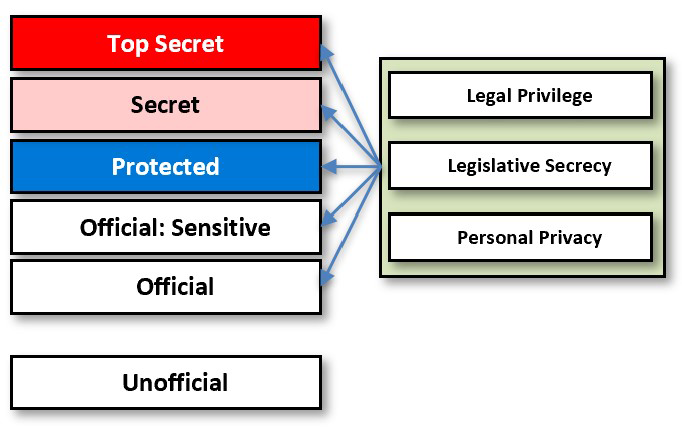
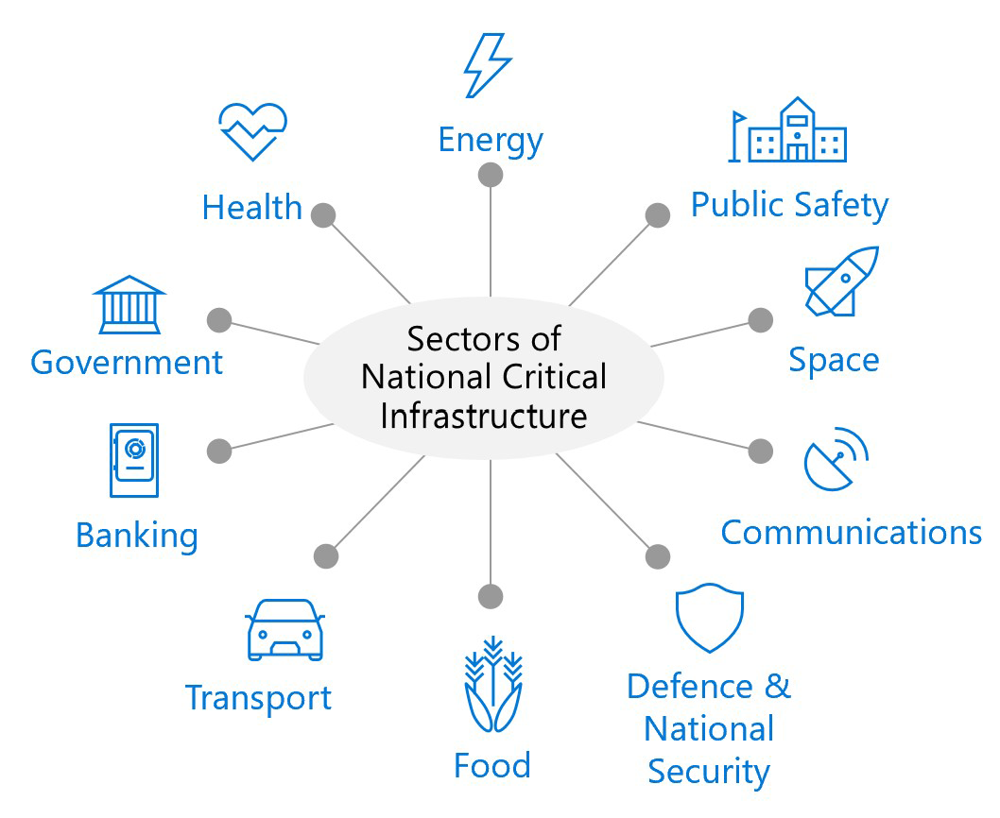
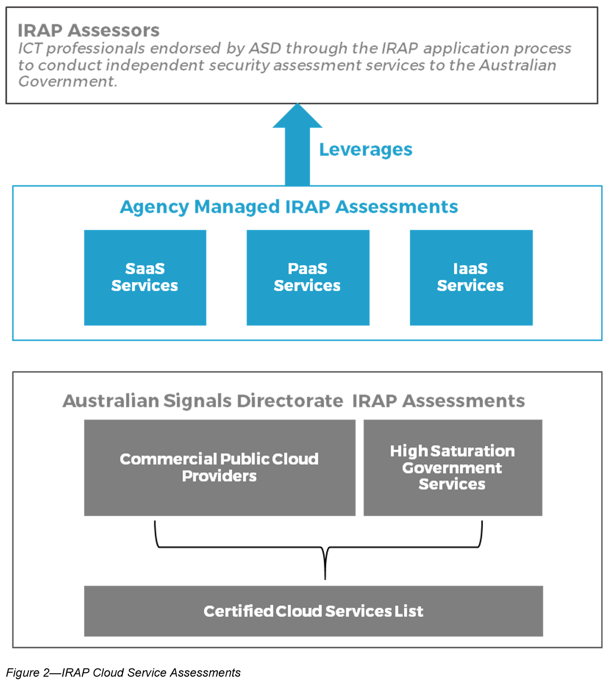

# Azure Australia security explained

This article addresses some of the common questions and areas of interest for Australian Government agencies that investigate with, design for, and deploy to Microsoft Azure Australia.

## IRAP and Certified Cloud Services List documents

The Australian Cyber Security Centre (ACSC) provides a Letter of Certification, a Certification Report, and a Consumer Guide for the service when it's added to the Certified Cloud Services List (CCSL).

Microsoft is currently listed on the CCSL for Azure, Office 365, and Dynamics 365 CRM.

Microsoft makes our audit, assessment, and ACSC certification documents available to customers and partners on an Australia-specific page of the [Microsoft Service Trust Portal](https://aka.ms/au-irap).

## Dissemination Limiting Markers and PROTECTED certification

The process of having systems, including cloud services, approved for use by government organisations is defined in the [Information Security Manual (ISM)](https://acsc.gov.au/infosec/ism/) that's produced and published by the ACSC. The ACSC is the entity within the Australian Signals Directorate (ASD) that's responsible for cyber security and cloud certification.

There are two steps to the approval process:

1. **Security Assessment (IRAP)**: A process in which registered professionals assess systems, services, and solutions against the technical controls in the ISM and evaluate whether the controls were implemented effectively. The assessment also identifies any specific risks for the approval authority to consider prior to issuing an Approval to Operate (ATO).

1. **Approval to Operate**: The process in which a senior officer of a government agency formally recognises and accepts the residual risk of a system to the information it processes, stores, and communicates. An input to this process is the Security Assessment.

The assessment of Azure services at the PROTECTED level identifies that the implementation of the security controls required for the storage and processing of PROTECTED and below data were confirmed to be in place and are operating effectively.

## Australian data classification changes

On October 1, 2018, the Attorney General's Department publicly announced changes to the Protective Security Policy Framework (PSPF), specifically a new [sensitive and classified information system](https://www.protectivesecurity.gov.au/information/sensitive-classified-information/Pages/default.aspx).

All Australian agencies and organisations that operate under the PSPF are affected by these changes. The primary change that affects our current IRAP/CCSL certifications is that the current Dissemination Limiting Markings (DLMs) were retired. The OFFICIAL: Sensitive marking replaces the various DLMs used for the protection of sensitive information. The change also introduced three information management markers that can be applied to all official information at all levels of sensitivity and classification. The PROTECTED classification remains unchanged.

The term "Unclassified" is removed from the new system and the term "Unofficial" is applied to non-Government information, although it doesn't require a formal marking.

## Choose an Azure region for OFFICIAL: Sensitive and PROTECTED workloads

The Azure OFFICIAL: Sensitive and PROTECTED certified services are deployed to all four Australian Data Centre regions: Australia East, Australia South East, Australia Central, and Australia Central 2. The certification report issued by the ACSC recommends that PROTECTED data be deployed to the Azure Government regions in Canberra if a service is available there. For more information about the PROTECTED certified Azure services, see the [Australia page on the Service Trust Portal](https://aka.ms/au-irap).

>[!NOTE]
>Microsoft recommends that government data of all sensitivities and classifications should be deployed to the Australia Central and Australia Central 2 regions because they're designed and operated specifically for the needs of government.

For more information on the special nature of the Azure Australian regions, see [Azure Australia Central regions](https://azure.microsoft.com/global-infrastructure/australia/).

## How Microsoft separates classified and official data

Microsoft operates Azure and Office 365 in Australia as if all data is sensitive or classified, which raises our security controls to that high bar.

The infrastructure that supports Azure potentially serves data of multiple classifications. Because we assume that the customer data is classified, the appropriate controls are in place. Microsoft has adopted a baseline security posture for our services that complies with the PSPF requirements to store and process PROTECTED classified information.

To assure our customers that one tenant in Azure isn't at risk from other tenants, Microsoft implements comprehensive defence-in-depth controls.

Beyond the capabilities implemented within the Microsoft Azure platform, additional customer configurable controls, such as encryption with customer-managed keys, nested virtualisation, and just-in-time administrative access, can further reduce the risk. Within the Azure Government Australia regions in Canberra, a process for formal whitelisting only Australian and New Zealand government and national critical infrastructure organisations is in place. This community cloud provides additional assurance to organisations that are sensitive to cotenant risks.

The Microsoft Azure PROTECTED Certification Report confirms that these controls are effective for the storage and processing of PROTECTED classified data and their isolation.

## Relevance of IRAP/CCSL to state government and critical infrastructure providers

Many state government and critical infrastructure providers incorporate federal government requirements into their security policy and assurance framework. These organisations also handle OFFICIAL, OFFICIAL: Sensitive, and some amount of PROTECTED classified data, either from their interaction with the federal government or in their own right.

The Australian Government is increasingly focusing policy and legislation on the protection of non-Government data that fundamentally affect the security and economic prosperity of Australia. As such, the Azure Australia regions and the CCSL certification are relevant to all of those industries.

The Microsoft certifications demonstrate that Azure services were subjected to a thorough, rigorous, and formal assessment of the security protections in place and they were approved for handling such highly sensitive data.

## Location and control of Microsoft data centres

It's a mandatory requirement of government and critical infrastructure to explicitly know the data centre location and ownership for cloud services processing their data. Microsoft is unique as a hyperscale cloud provider in providing extensive information about these locations and ownership.

Microsoft's Azure Australia regions (Australia Central and Australia Central 2) operate within the facilities of CDC Datacentres. The ownership of CDC Datacentres is Australian controlled with 48% ownership from the Commonwealth Superannuation Corporation, 48% ownership from Infratil (a New Zealand-based, dual Australian and New Zealand Stock Exchange listed long-term infrastructure asset fund), and 4% Australian management. 

The management of CDC Datacentres has contractual assurances in place with the Australian Government that restrict future transfer of ownership and control. This transparency of supply chain and ownership via Microsoft's partnership with CDC Datacentres is in line with the principles of the [Whole-of-Government Hosting Strategy](https://www.dta.gov.au/our-projects/whole-government-hosting-strategy) and the definition of a Certified Sovereign Datacentre.

## Azure services that are included in the current CCSL certification

In June 2017, the ACSC certified 41 Azure services for the storage and processing of data at the Unclassified: DLM level. In April 2018, 24 of those services were certified for PROTECTED classified data.

The availability of ACSC-certified Azure services across our Azure regions in Australia are as follows (services shown in bold are certified at the PROTECTED level).

|Azure Australia Central regions|Non-regional services and other regions|
|---|---|
|API Management, App Gateway, Application Services, **Automation**, **Azure portal**, **Backup**, **Batch**, **Cloud Services**, Cosmos DB, Event Hubs, **ExpressRoute**, HDInsight, **Key Vault**, Load Balancer, Log Analytics, **Multi-factor Authentication**, Redis Cache, **Resource Manager**, **Service Bus**, **Service Fabric**, **Site Recovery**, **SQL Database**, **Storage**, Traffic Manager, **Virtual Machines**, **Virtual Network**, **VPN Gateway**|**Azure Active Directory**, CDN, Data Catalog, **Import Export**, **Information Protection**, **IOT Hub**, Machine Learning, Media Services, **Notification Hubs**, Power BI, **Scheduler**, **Security Centre**, Search, Stream Analytics|
|

Microsoft publishes the [Overview of Microsoft Azure Compliance](https://gallery.technet.microsoft.com/Overview-of-Azure-c1be3942/file/178110/44/Microsoft%20Azure%20Compliance%20Offerings.pdf) that lists all in-scope services for all of the Global, Government, Industry, and Regional compliance and assessment processes that Azure goes through, which includes IRAP/CCSL.

## Azure service not listed or assessed at a lower level than needed

Services that aren't certified, or that have been certified at the OFFICIAL: Sensitive but not the PROTECTED level, can be used alongside or as part of a solution hosting PROTECTED data provided the services are either:

- Not storing or processing PROTECTED data unencrypted, or
- You've completed a risk assessment and approved the service to store PROTECTED data yourself.

You can use a service that isn't included on the CCSL to store and process OFFICIAL data, but the ISM requires you to notify the ACSC in writing that you're doing so before you enter into or renew a contract with a cloud service provider.

Any service that's used by an agency for PROTECTED workloads must be security assessed and approved in line with the processes outlined in the ISM and the Agency-managed IRAP Assessments process in the [DTA Secure Cloud Strategy](https://www.dta.gov.au/files/cloud-strategy/secure-cloud-strategy.pdf).

Microsoft continually assesses our services to ensure the platform is secure and fit-for-purpose for Australian Government use. Contact Microsoft if you require assistance with a service that isn't currently on the CCSL at the PROTECTED level.

Because Microsoft has a range of services certified on the CCSL at both the Unclassified DLM and PROTECTED classifications, the ISM requires that we undertake an IRAP assessment of our services at least every two years. Microsoft undertakes an annual assessment, which is also an opportunity to include additional services for consideration.

## Certified PROTECTED gateway in Azure

Microsoft doesn't operate a government-certified Secure Internet Gateway (SIG) because of restrictions on the number of SIGs permissible under the Gateway Consolidation Program. But the expected and necessary capabilities of a SIG can be configured within Microsoft Azure.

Through the PROTECTED certification of Azure services, the ACSC has specific recommendations to agencies for connecting to Azure and when implementing network segmentation between security domains, for example, between PROTECTED and the Internet. These recommendations include the use of network security groups, firewalls, and virtual private networks. The ACSC recommends the use of a virtual gateway appliance. There are several virtual appliances available in Azure that have a physical equivalent on the ASD Evaluated Products List or have been evaluated against the Common Criteria Protection Profiles and are listed on the Common Criteria portal. These products are mutually recognised by ASD as a signatory to the Common Criteria Recognition Arrangement.

Microsoft has produced guidance on implementing Azure-based capabilities that provide the security functions required to protect the boundary between different security domains, which, when combined, form the equivalent to a certified SIG. A number of partners can assist with design and implementation of these capabilities, and a number of partner solutions are available that do the same.

## Security clearances and citizenship of Microsoft support personnel

Microsoft operates our services globally with screened and trained security personnel. Personnel that have unescorted physical access to facilities in Sydney and Melbourne have Australian Government Baseline security clearances. Personnel within the Australia Central and Australia Central 2 regions have minimum Negative Vetting 1 (NV1) clearances (as appropriate for SECRET data). These clearance requirements provide additional assurance to customers that personnel within data centres operating Azure are highly trustworthy.

Microsoft has a zero standing access policy with access granted through a system of just in time and just enough administration based on role-based access controls. In the vast majority of cases, our administrators don't require access or privileges to customer data in order to troubleshoot and maintain the service. High degrees of automation and scripting of tasks for remote execution negate the need for direct access to customer data.

The Attorney General's Department has confirmed that Microsoft's personnel security policies and procedures within Azure are consistent with the intent of the PSPF Access to Information provisions in INFOSEC-9.

## Store International Traffic of Arms Regulations (ITAR) or Export Administration Regulations (EAR) data

The Azure technical controls that assist customers with meeting their obligations for export-controlled data are the same globally in Azure. Importantly, there's no formal assessment and certification framework for export-controlled data.

For Azure Government and Office 365 US Government for Defense, we've put additional contractual and process measures in place to support customers subject to export controls. Those additional contractual clauses and the guaranteed U.S. national support and administration of the Azure regions isn't in place for Australia.

That doesn't mean that Azure in Australia can't be used for ITAR/EAR, but you need to clearly understand the restrictions imposed on you through your export license. You also must implement additional protections to meet those obligations before you use Azure to store that data. For example, you might need to:

- Build nationality as an attribute into Azure Active Directory.
- Use Azure Information Protection to enforce encryption rules over the data and limit it to only U.S. and whatever other nationalities are included on the export license.
- Encrypt all data on-premises before you store it in Azure by using a customer key or Hold Your Own Key for ITAR data.

Because ITAR isn't a formal certification, you need to understand what the restrictions and limitations associated with the export license are. Then you can work through whether there are sufficient controls in Azure to meet those requirements. In this case, one of the issues to closely consider is the access by our engineers who might not be a nationality approved on the export license.

## Next steps

 For ISM-compliant configuration and implementation of VPN connectivity to Azure Australia, see [Azure VPN Gateway](vpn-gateway.md).
