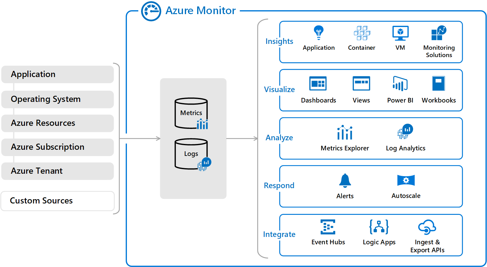
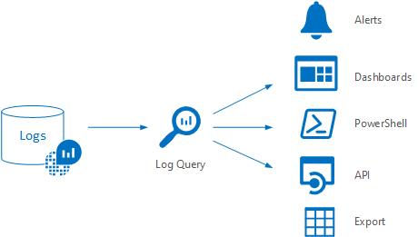

# System monitoring for security in Azure Australia

It is critical that all organisations implement robust security strategies that include real time monitoring and routine security assessments to enhance the day to day operational security of their IT environments. The same security considerations have to be made when moving workloads into a cloud environment. Security within a cloud environment is a joint effort between the customer and the cloud provider. This guide will outline four services which Microsoft Azure provides to facilitate these requirements with consideration to the recommendations contained within the [Australian Cyber Security Centre's (ACSC) Information Security Manual Controls](https://acsc.gov.au/infosec/ism/index.htm) (ISM), specifically, the implementation of centralised event logging, event log auditing, and security vulnerability assessment and management. The Microsoft Azure services are:

* Azure Security Center
* Azure Monitor
* Azure Advisor
* Azure Policy

The ACSC Consumer Guide for Microsoft Azure strongly recommends that these services are utilised for Protected data. These services are designed to enable Azure customers to proactively monitor and analyse their IT environments, and make informed decisions on where to best allocate resources to enhance their environment's security stance. Each of these services is part of a combined solution to provide the customer with the best insight, recommendations, and protection possible.

## Azure Security Center

[Azure Security Center](https://docs.microsoft.com/azure/security-center/security-center-intro) provides a unified security management console that enables Azure customers to monitor and enhance the security of both Azure resources and their hosted data. Azure Security Center provides Azure customers with Secure Score, a score based on an analysis of the state of best practice configuration from Azure Advisor and the overall compliance of Azure Policy.

Azure Security Center provides Azure customers with the following features:

* Security policy, assessment, and recommendations
* Security event collection and search
* Access and application controls
* Advanced Threat Detection
* Just-in-time Virtual Machines access control
* Hybrid Security

The scope of resources monitored by Azure Security Center can even be expanded to include supported on-premises resources in a hybrid-cloud environment. This includes on-premises resources currently being monitored by a supported version of System Center Operations Manager.

The Security Center "Standard" tier also provides cloud-based security controls required by the [ASD Essential 8](https://acsc.gov.au/publications/protect/essential-eight-explained.htm). These include application whitelisting and restriction of administrative privilege via just-in-time access.

### Azure Monitor

[Azure Monitor](https://docs.microsoft.com/azure/azure-monitor/overview) is the centralised logging solution for all Azure Resources, and includes Log Analytics and Application Insights. Two key data types are collected from Azure resources: logs and metrics. Once collected in Azure Monitor, logging information can be used by a wide range of tools and for a variety of purposes.

Azure Monitor also includes the "Azure Activity Log". The SActivity Log stores all subscription level events that have occurred within Azure. It allows Azure customers to see the "who, what and when" behind operations undertaken on their Azure resources. Both resource based logging sent to Azure Monitor and Azure Activity Log events can be analysed using the in-built Kusto query language. These logs can then be exported, used to create custom dashboards and views, and configured to trigger alerts and notifications.

### Azure Advisor

[Azure Advisor](https://docs.microsoft.com/azure/advisor/advisor-overview) analyses supported Azure resources, system-generated log files, and current resource configurations within your Azure subscription. The analysis provided in Azure Advisor is generated in real time and based upon Microsoft's recommended best practices. Any supported Azure resources added to your environment will be analysed and appropriate recommendations will be provided. Azure Advisor recommendations are categorised into four best practice categories:

* Security
* High Availability
* Performance
* Cost

Security recommendations generated by Azure Advisor form part of the overall security analysis provided by Azure Security Center.

The information gathered by Azure Advisor provides administrators with:

* Insight into resource configuration that does not meet recommended best practice
* Guidance on specific remediation actions to undertake
* Rankings indicating which remediation actions should be undertaken as a high priority

### Azure Policy

[Azure Policy](https://docs.microsoft.com/azure/governance/policy/overview) provides the ability to apply rules that govern the types of Azure resources and their allowed configuration. Policy can be used to control resource creation and configuration, or it can be used to audit configuration settings across an environment. These audit results can be used to form the basis of remediation activities. Azure Policy differs from role-based access control (RBAC); Azure Policy is used to restrict resources and their configuration, RBAC is used to restrict privileged access to Azure users.

Whether the specific policy is being enforced or the effect of the policy is being audited, policy compliance is continually monitored, and overall and resource-specific compliance information is provided to administrators. Azure Policy compliance data is provided to Azure Security Center and forms part of the Secure Score.

## Key Design Considerations

When implementing an event log strategy, the ACSC ISM highlights the following considerations:

* Centralised logging facilities
* Specific events to be logged
* Event log protection
* Event log retention
* Event log auditing

In additional to collecting and managing logs, the ISM also recommends routine vulnerability assessment of an organisation's IT environment.

### Centralised Logging

Any logging solution should, wherever possible, consolidate captured logs into a single data repository. This not only reduces operational complexity and prevents the creation of multiple data silos, it enables data collected from multiple sources to be analysed together allowing any correlating events to be identified. This is critical for detecting and managing the scope of any cyber security incidents.

This requirement is met for all Azure customers with Azure Monitor. This offering not only provides a centralised logging repository in Azure for all Azure resources, it also enables you to stream your data to an Azure Event Hub. Azure Event Hubs provides a fully managed, real-time data ingestion service. Once Azure Monitor data is streamed to an Azure Event Hub, the data can also be easily connected to existing supported Security information and event management (SIEM) repositories and additional third party monitoring tools.

Microsoft also offers its own Azure native SIEM solution, Azure Sentinel. Azure Sentinel supports a wide variety of data connectors and can be used to monitor security events across an entire enterprise. By combining the data from supported [data connectors](https://docs.microsoft.com/azure/sentinel/connect-data-sources), Azure Sentinel's built-in machine learning, and the Kusto query language, security administrators are provided with a single solution for alert detection, threat visibility, proactive hunting, and threat response. Sentinel also provides a Hunting and notebook feature that allows security administrators to record all the steps undertaken as part of a security investigation in a reuseable playbook that can be shared within an organisation. Security Administrators can even use the built-in [User Analytics](https://docs.microsoft.com/azure/sentinel/user-analytics) to investigate the actions of a single nominated user.

### Logged Events and Log Detail

The ISM provides a detailed list of the recommended event log types that should be collected as part of any logging strategy. It is also recommended that any logs captured need to contain sufficient detail in order to be of any practical use.

The logs collected in Azure fall under one of following three categories:

* **Control and Management Logs**: These logs provide information about Azure Resource Manager CREATE, UPDATE, and DELETE operations.

* **Data Plane Logs**: These contain events raised as part of Azure resource usage. This includes sources such as Windows event logs including System, Security, and Application logs.

* **Processed Events**: These events contain information about events and alerts that have been automatically processed on the customer's behalf by Azure. An example of a Processed Event is an Azure Security Center Alert.

Azure virtual machine monitoring can also be enhanced by the deployment of the virtual machine agent for both Windows and Linux. This markedly increases the breadth of logging information gathered. Deployment of this agent can be configured to occur automatically via the Azure Security Center.

Microsoft provides detailed information about Azure resource-specific logs and their [schemas](https://docs.microsoft.com/azure/security/azure-log-audit).

### Log Retention and Protection

It is vital that event logs that are collected are stored securely for the required retention period. The ISM advises that a logs are retained for a minimum of seven years. Azure provides a number of means to ensure the long life of your collected logs. By default, the Azure Log events are stored for 90 days. Log data captured by Azure Monitor can be moved and stored on an Azure Storage account as required for long-term retention. Activity logs stored on an Azure Storage Account can be retained for a set number of days, or indefinitely if necessary.

Azure Storage Accounts used to store Azure Log events can be made geo-redundant and can be backed up using Azure Backup. Once captured by Azure Backup, any deletion of backups containing logs requires administrative approval and backups marked for deletion are still held for 14 days allowing for recovery. Azure Backup allows for 9999 copies of a protected instance, providing over 27 years of daily backups.

Role-Based Access Control should be used to control access to resources used for Azure logging. Both Azure Monitor, Azure Storage accounts and any Azure Backups should be configured with the appropriate role-based access controls to ensure the security of the data contained within the logs.

### Log Auditing

Once logs are collected, their true value is realised once they are appropriately analysed. Routine analysis, both automated and manual, and a familiarity with the available tools can assist administrators to detect and manage breaches of organisational security policy, and cyber security incidents. Azure Monitor provides a rich set of tools to analyse collected logs. The result of this analysis can then be shared between systems, visualised, or disseminated in multiple formats.

Log data stored in Azure Monitor is kept in a Log Analytics Workspace. All analysis begins with a query. Azure Monitor queries are written in the Kusto query language. These queries form the basis of all outputs from Azure Monitor, from Azure Dashboards to Alert Rules.

Auditing of logs can be enhanced through the use of Monitoring Solutions. These are pre-packaged solutions that contain collection logic, queries, and data visualisation views. Microsoft [provide](https://docs.microsoft.com/azure/azure-monitor/insights/solutions-inventory) a number of Monitoring Solutions and additional solutions from product vendors can be found in the Azure Marketplace.

### Vulnerability Assessment and Management

The ISM notes that routine vulnerability assessment and management are essential. An organisation's IT environment is constantly evolving and the external security threat is endlessly changing. Microsoft recognises this requirement and Azure Security Center has the tools to perform automated vulnerability assessments as well as the guidance to plan and perform remediation activities.

As mentioned previously, the Secure Score in Azure Security Center provides a list of recommendations sorted by their impact on the overall Secure Score. This provides administrators a concise list of recommendations that, when applied, will yield the greatest immediate benefit, allowing administrative staff to focus on the highest priority recommendations that present the most value in enhancing an organisation's security stance.

Azure Policy also plays a key part in the ongoing vulnerability assessment. The types of policy available in Azure Policy range from enforcing resource tags and values, restricting the Azure regions in which resources can be created, to blocking the creation of particular resource types altogether. A set of Azure policies can be grouped into Initiatives. Initiatives are used to apply related Azure policies that, when applied together as a group, form the basis of a specific security or compliance objective.

Azure Policy has a library of built-in policy definitions, this library of definitions is constantly growing. Azure portal also gives you the option to author your own custom Azure Policy definitions. Once an appropriate policy is found in the existing library or created, the policy can be assigned to Azure resources. These assignments can also be [scoped](https://docs.microsoft.com/azure/governance/policy/tutorials/create-and-manage) at various levels in the resource management hierarchy. Policy assignment is inherited, meaning all child resources within a scope receive the same policy assignment. Resources can also be excluded from scoped policy assignment as required.

All deployed Azure policies contribute to an organisation's Secure Score. In a highly bespoke environment, custom Azure Policy definitions can be created and deployed to provide audit information tailored to specific workloads.

## Getting started

To begin working with Azure Security Center as well as making full use of Azure Monitor, Advisor and Policy, Microsoft recommends the following initial steps:

* Enable Azure Security Center
* Upgrade to the Standard Tier
* Enable Automatic Provisioning of the Microsoft Monitoring Agent to supported Azure Virtual Machines
* Review, prioritise, and mitigate the security recommendations and alerts on the Security Centre dashboard

## Next Steps

Review the article on [Azure Policy and Azure Blueprints](azure-policy.md) for details on implementing governance and control over your Azure Australia resources to ensure policy and regulatory compliance.
