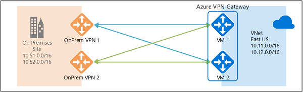

# Azure VPN Gateway in Azure Australia

A critical service with any public cloud is the secure connection of cloud resources and services to existing on-premises systems. The service that provides this capability in Azure is Azure VPN Gateway. This article outlines the key points to consider when you configure a VPN gateway to comply with the Australian Signals Directorate's (ASD) [Information Security Manual (ISM) controls](https://acsc.gov.au/infosec/ism/).

A VPN gateway is used to send encrypted traffic between a virtual network in Azure and another network. Three scenarios are addressed by VPN gateways:

- Site-to-site (S2S)
- Point-to-site (P2S)
- Network-to-network

This article focuses on S2S VPN gateways. Diagram 1 shows an example S2S VPN gateway configuration.


*Diagram 1 – Azure S2S VPN Gateway*

## Key design considerations

There are three networking options to connect Azure to Australian Government customers:

- ICON
- Azure ExpressRoute
- Public internet

The Australian Cyber Security Centre's [Consumer Guide for Azure](https://servicetrust.microsoft.com/viewpage/Australia) recommends that VPN Gateway (or an equivalent PROTECTED certified third-party service) is used in conjunction with the three networking options. This recommendation is to ensure that the connections comply with the ISM controls for encryption and integrity.

### Encryption and integrity

By default, the VPN negotiates the encryption and integrity algorithms and parameters during the connection establishment as part of the IKE handshakes. During the IKE handshake, the configuration and order of preference depends on whether the VPN gateway is the initiator or the responder. This designation is controlled via the VPN device. The final configuration of the connection is controlled by the configuration of the VPN device. For more information on validated VPN devices and their configuration, see [About VPN services](../vpn-gateway/vpn-gateway-about-vpn-devices.md).

VPN gateways can control encryption and integrity by configuring a custom IPsec/IKE policy on the connection.

### Resource operations

VPN gateways create a connection between Azure and non-Azure environments over the public internet. The ISM has controls that relate to the explicit authorization of connections. By default, it's possible to use VPN gateways to create unauthorized tunnels into secure environments. It's critical that organizations use Azure role-based access control (Azure RBAC) to control who can create and modify VPN gateways and their connections. Azure has no built-in role to manage VPN gateways, so a custom role is required.

Access to Owner, Contributor, and Network Contributor roles is tightly controlled. We also recommend that you use Azure Active Directory Privileged Identity Management for more granular access control.

### High availability

Azure VPN gateways can have multiple connections and support multiple on-premises VPN devices to the same on-premises environment. See Diagram 1.

Virtual networks in Azure can have multiple VPN gateways that can be deployed in independent, active-passive, or active-active configurations.

We recommend that you deploy all VPN gateways in a [highly available configuration](../vpn-gateway/vpn-gateway-highlyavailable.md). An example is two on-premises VPN devices connected to two VPN gateways in either active-passive or active-active mode. See Diagram 2.



*Diagram 2 – Active-active VPN gateways and two VPN devices*

### Forced tunneling

Forced tunneling redirects, or forces, all Internet-bound traffic back to the on-premises environment via the VPN gateway for inspection and auditing. Without forced tunneling, Internet-bound traffic from VMs in Azure traverses the Azure network infrastructure directly out to the public internet, without the option to inspect or audit the traffic. Forced tunneling is critical when an organization is required to use a Secure Internet Gateway (SIG) for an environment.

## Detailed configuration

### Service attributes

VPN gateways for S2S connections configured for the Australian Government must have the following attributes:

|Attribute | Must|
|--- | --- |
|gatewayType | "VPN"|
|

Attribute settings required to comply with the ISM controls for PROTECTED are:

|Attribute | Must|
|--- |---|
|vpnType |"RouteBased"|
|vpnClientConfiguration/vpnClientProtocols | "IkeV2"|
|

Azure VPN gateways support a range of cryptographic algorithms from the IPsec and IKE protocol standards. The default policy sets maximum interoperability with a wide range of third-party VPN devices. As a result, it's possible that during the IKE handshake a noncompliant configuration might be negotiated. We highly recommend that you apply [custom IPsec/IKE policy](../vpn-gateway/vpn-gateway-ipsecikepolicy-rm-powershell.md) parameters to vpnClientConfiguration in VPN gateways to ensure the connections meet the ISM controls for on-premises environment connections to Azure. The key attributes are shown in the following table.

|Attribute|Should|Must|
|---|---|---|
|saLifeTimeSeconds|<14,400 secs|>300 secs|
|saDataSizeKilobytes| |>1,024 KB|
|ipsecEncryption| |AES256-GCMAES256|
|ipsecIntegrity| |SHA256-GCMAES256|
|ikeEncryption| |AES256-GCMAES256|
|ikeIntegrity| |SHA256-GCMAES256|
|dhGroup|DHGroup14, DHGroup24, ECP256, ECP384|DHGroup2|
|pfsGroup|PFS2048, PFS24, ECP256, ECP384||
|

For dhGroup and pfsGroup in the previous table, ECP256 and ECP384 are preferred even though other settings can be used.

### Related services

When you design and configure an Azure VPN gateway, a number of related services must also exist and be configured.

|Service | Action required|
|--- | ---|
|Virtual network | VPN gateways are attached to a virtual network. Create a virtual network before you create a new VPN gateway.|
|Public IP address | S2S VPN gateways need a public IP address to establish connectivity between the on-premises VPN device and the VPN gateway. Create a public IP address before you create a S2S VPN gateway.|
|Subnet | Create a subnet of the virtual network for the VPN gateway.|
|

## Implementation steps using PowerShell

### Azure role-based access control

1. Create a custom role. An example is virtualNetworkGateway Contributor. Create a role to be assigned to users who will be allowed to create and modify VPN gateways. The custom role should allow the following operations:

   Microsoft.Network/virtualNetworkGateways/*  
   Microsoft.Network/connections/*  
   Microsoft.Network/localnetworkgateways/*  
   Microsoft.Network/virtualNetworks/subnets/*  
   Microsoft.Network/publicIPAddresses/*  
   Microsoft.Network/publicIPPrefixes/*  
   Microsoft.Network/routeTables/*  

2. Add the custom role to users who are allowed to create and manage VPN gateways and connections to on-premises environments.

### Create a VPN gateway

These steps assume that you already created a virtual network.

1. Create a new public IP address.
2. Create a VPN gateway subnet.
3. Create a VPN gateway IP config file.
4. Create a VPN gateway.
5. Create a local network gateway for the on-premises VPN device.
6. Create an IPsec policy. This step assumes that you're using custom IPsec/IKE policies.
7. Create a connection between the VPN gateway and a local network gateway by using the IPsec policy.

### Enforce tunneling

If forced tunneling is required, before you create the VPN gateway:

1. Create a route table and route rules.
2. Associate a route table with the appropriate subnets.

After you create the VPN gateway:

- Set GatewayDefaultSite to the on-premises environment on the VPN gateway.

### Example PowerShell script

An example of PowerShell script used to create a custom IPsec/IKE policy complies with ISM controls for Australian PROTECTED security classification.

It assumes that the virtual network, VPN gateway, and local gateways exist.

#### Create an IPsec/IKE policy

The following sample script creates an IPsec/IKE policy with the following algorithms and parameters:

- IKEv2: AES256, SHA256, DHGroup ECP256
- IPsec: AES256, SHA256, PFS ECP256, SA Lifetime 14,400 seconds, and 102,400,000 KB

```powershell
$custompolicy = New-AzIpsecPolicy `
                    -IkeEncryption AES256 `
                    -IkeIntegrity SHA256 `
                    -DhGroup ECP256 `
                    -IpsecEncryption AES256 `
                    -IpsecIntegrity SHA256 `
                    -PfsGroup ECP256 `
                    -SALifeTimeSeconds 14400 `
                    -SADataSizeKilobytes 102400000
```

#### Create a S2S VPN connection with the custom IPsec/IKE policy

```powershell
$vpngw = Get-AzVirtualNetworkGateway `
                    -Name "<yourVPNGatewayName>" `
                    -ResourceGroupName "<yourResourceGroupName>"
$localgw = Get-AzLocalNetworkGateway  `
                    -Name "<yourLocalGatewayName>" `
                    -ResourceGroupName "<yourResourceGroupName>"

New-AzVirtualNetworkGatewayConnection `
                    -Name "ConnectionName" `
                    -ResourceGroupName "<yourResourceGroupName>" `
                    -VirtualNetworkGateway1 $vpngw `
                    -LocalNetworkGateway2 $localgw `
                    -Location "Australia Central" `
                    -ConnectionType IPsec `
                    -IpsecPolicies $custompolicy `
                    -SharedKey "AzureA1b2C3"
```

## Next steps

This article covered the specific configuration of VPN Gateway to meet the requirements specified in the Information Security Manual for securing Australian Government PROTECTED data while in transit. For steps on how to configure your VPN gateway, see:

- [Azure virtual network gateway overview](../vpn-gateway/index.yml)  
- [What is VPN Gateway?](../vpn-gateway/vpn-gateway-about-vpngateways.md)  
- [Create a virtual network with a site-to-site VPN connection by using PowerShell](../vpn-gateway/vpn-gateway-create-site-to-site-rm-powershell.md)  
- [Create and manage a VPN gateway](../vpn-gateway/tutorial-create-gateway-portal.md)
