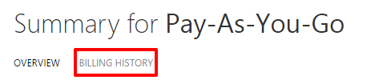
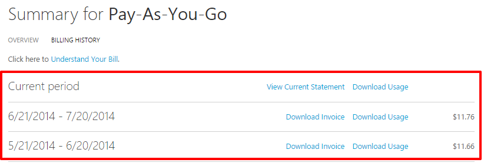
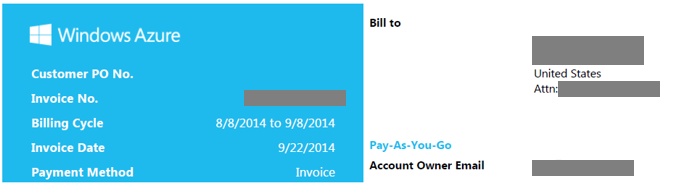
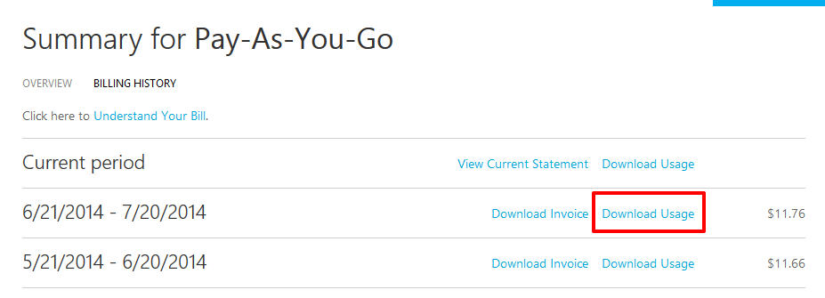

<properties
   pageTitle="Understand Your Azure Bill"
   description="Understand Your Azure Bill"
   services=""
   documentationCenter="Azure"
   authors="kareni"
   manager="jocho"
   editor=""
   tags="billing"/>

<tags
   ms.service="na"
   ms.devlang="na"
   ms.topic="article"
   ms.tgt_pltfrm="na"
   ms.workload="na"
   ms.date="04/07/2015"
   ms.author="kareni"/>

# Understand your bill for Microsoft Azure

The charges for Microsoft Azure subscriptions vary by rate plan. Some rate plans, such as the Visual Studio Ultimate with MSDN, include monthly credits that you can use on any Azure service based on your needs.

Please note that up to 24 hours of latent usage from your prior billing period can be reported in your current billing period.

For more information about consumption, usage, and rate plans, see the [Microsoft Azure Purchase Options page](http://azure.microsoft.com/pricing/purchase-options/).

## Content:

This topic helps you with the following tasks when reading your bill.

-  View or Download a Bill for Azure
-  Customer Information
-  Understand the Invoice Summary
-  Understand the Current Charges
-  Footer Information
-  Understand the Additional Information
-  Understand Detailed Usage Charges
-  Analyze Daily Usage Data

### View or download a bill for Microsoft Azure:

In the [Usage and Billing Portal](https://account.windowsazure.com/subscriptions) you can view current and download past bills.

To view or download a bill:

1. Sign in to the [Usage and Billing Portal](https://account.windowsazure.com/subscriptions) using your Microsoft Account ID or Work or School Account ID.

2. Click on the subscription in which you would like to see details and usage.

3. Click **Billing** History

    

4. The **Billing History** section lists your statements for the last six billing periods plus the current unbilled period. The statement for the current period is an estimate of your charges as of the time the estimate was generated. This information is only updated daily and may not include all of your usage incurred to date. Your monthly bill may differ from this estimate.

    

5. Click **View Current Statement** to view an estimate of your charges as of the time the estimate was generated. This information is only updated daily and may not include all of your usage incurred to date. Your monthly bill may differ from this estimate.

    

    

6. Click **Download Invoice** to view a copy of your previous bill.

    

**Below are sample invoices of the Visual Studio Ultimate with MSDN and Pay-As-You-Go offers.**

*Any unused monthly credits cannot be carried over to subsequent months.

 **OFFER NAME** | **OFFER TYPE** |  **INCLUDES FREE SERVICES** | **DOWNLOAD** |
 :--------- |:-------- | :----------------: | :-------|
Azure MSDN-Visual Studio Ultimate| Benefits Program | Yes* | [Sample file](https://azurepricing.blob.core.windows.net/sampleinvoices/Microsoft_Azure_MSDN_Sample.pdf)
Pay-As-You-Go | Consumption | No| [Sample file](https://azurepricing.blob.core.windows.net/sampleinvoices/Microsoft_Azure_PAYG_Sample.pdf)
Detailed Usage - csv | N/A | N/A | [Sample file](https://azurepricing.blob.core.windows.net/sampleinvoices/Microsoft_Azure_Detailed_Usage_v1_csv.xlsx)

## Header - Customer Information

The customer information section identifies pertinent information in regards to your usage and profile.
    

### Invoice No.
A unique invoice identifier for tracking purposes

### Billing Cycle
The time frame in which usage has taken place.

### Invoice Date
Date that the invoice was generated.

### Payment Method
Type of payment used on the account (i.e. Invoice or Credit Card).

### Bill to
Microsoft Azure payments address.

### Account Owner Email
The account email address that the Microsoft Azure account is registered under.

## Understand the Invoice Summary
The Invoice Summary section of the bill summarizes transactions since your last bill and your current usage charges.

The Balances, Payments & Other Credits section of the bill summarizes transactions since your last bill.

### Previous Balance
Previous balance is the total amount due on your last bill.

### Payments
Payments are your total payments applied to your last bill.

### Outstanding balance (from previous billing cycle)
Any bill adjustments (credits or balances) applied to your account since your last bill.

## Understand the Current Charges
The Current Charges section of the bill contains details about your monthly charges. The links are organized into the following subsections.

### Usage Charges
Usage charges are total monthly charges on a subscription. You are billed in arrears for your past month’s usage.

### Discounts
Service discounts on your usage would be reflected in this line item that are applied to your current bill.

### Adjustments
Miscellaneous adjustments are miscellaneous credits or outstanding charges applied to your current bill. For example, if you have the Visual Studio Ultimate with MSDN offer, you would see a monthly credit in this line item. If you cancel your subscription, you would see charges for monthly usage in excess of the monthly credit included in your offer from the start of your current billing period to your subscription cancellation date.

## Footer Information

## Understand the Additional Information
The additional information page gives you references to other resources to understand your invoice, and links to view your usage as well as other relevant information for your bill.

### Detailed Usage
A link in the description under Detailed Usage directs you the Azure Usage and Billing Portal where you can view your detailed usage for this subscription.

### Additional Information and Useful Resources
This section has links to simple questions regarding compute instance sizes, SQL DB charges, and useful links to help you answer further questions.

### Sold To
This is prepopulated with the profile address on the account.

### Payment Instructions
This section is the payment instructions of where to send checks, wire transfers or overnight checks if your payment method is invoice.

## Understand Detailed Usage Charges

Usage charges are total monthly charges on a subscription less any credit or discount. You are billed in arrears for your past month’s usage.  When you view a list of usage charges in your invoice, the following columns display the details of what you are being billed for.  You can download a [sample file](https://understandingyourbill.blob.core.windows.net/appendices/UnderstandDetailedUsageCharges.xlsx) that shows the values for each column.

### Service Name
Identifies the top-level service for which this usage belongs.

### Service Type
Azure service may be further defined by type in this column, which can affect the rate.

### Resource
Identifies the unit of measure for the resource being consumed.

### Region
Regions which the usage applies and primarily relates to Cloud Services and Virtual Machines, and data transfers (excluding CDN), since these rates can vary by region. Region for CDN map to the data center location where the traffic was served.

### Consumed
Contains the amount of the resource that has been consumed during the billing period.

### Included
Identifies the amount that is included each month with your offer.

### Billable
If the Consumed amount exceeds the included amount, this column displays the difference. You are billed for this amount. For pay-as-you-go offers with no amount included with the offer, this total will be the same as the Consumed quantity.

### Rate
Rate displays the rate you are charged per billable unit.

### Value
Displays the result of multiplying the Billable column by the Rate column. If the Consumed amount does not exceed the included amount, there will be no charge in this column.

## Analyze Daily Usage Data
Depending on your usage, there can be thousands of rows of daily usage data. If you want to analyze this data, click Download Usage to export daily usage data for the current billing period to a comma-separated variable file (CSV), which can then be viewed in Microsoft Office Excel and other programs.  For your reference, you can download a sample CSV file.

In the CSV file, the items are broken down to display a list of how much of each resource was consumed within the current billing period.

The following columns display details that affect the rates at the beginning of the billing period:

**COLUMN NAME** |  **DESCRIPTION** |
:---------------| :----------------|
Billing Period | The billing period when the resource was consumed.
Name |  Identifies the name of the service that was used.
Type |  In some cases, an Azure service may be further defined by type in this column, which can affect the rate.
Resource | Identifies the type of resource that has been consumed. For example, data transfer, compute hours, and storage transactions are resource types.
Region | Identifies the location of the datacenter for certain services that are priced based on datacenter location (e.g., data transfers).
SKU | Identifies the unique system identifier for each Azure resource.
Unit | Identifies the Unit that the service is charged in.  For example, GB, hours, 10,000s
Consumed | Contains the amount of the resource that has been consumed for that day.
Included | Contains the amount of the resource that is included at no charge in your current billing period.
Billable | Contains the amount of the resource that is billable in your current billing period.
Within Commitment | Contains the resource charges that are decremented from your commitment amount associated with your 6 or 12 month offer. Note that your resource charges are decremented from your commitment amount in chronological order.
Currency | Identifies the currency reflected in your current billing period.
Overage | Contains the resource charges that exceed your commitment amount associated with your 6 or 12 month offer.
Commitment Rate | Contains the commitment rate based on your total commitment amount associated with your 6 or 12 month offer.
Rate | Contains the Pay-As-You-Go rate for the resource.
Value | Multiplies the Rate by the Billable column to calculate the extended cost.

Please refer to the detail descriptions of the above columns in the **Usage Charges** section for complete explanations of these columns. The following columns contain additional information that may be helpful. Depending on the resource, some of these columns may be empty.

### Usage Date
The date the usage was emitted

### ResourceGUID
The billed meter GUID

### Sub Region
Identifies the specific location of the service being omitted (i.e. data center location).

### Service
This column is utilized to track the individual Azure platform service that may not be specifically identified in the Name column. This Service column will indicate which specific service the usage pertains.  

### Component
Where applicable, this column identifies further the resource that is being consumed. For hosted compute services for example, this column reports the size of the Virtual Machine, if it is not already stated in Resources.

### Service Info 1
This column provides the project name that the services belongs to on your subscription

### Service Info 2
This column captures 3rd party specific information.

### Additional Info
This column shows additional data for some of the services.

Please see these additional sources of information file for more details. These files are updated on a monthly basis, published on the 25th for the coming month, and are available from May 2015 onwards. Below is the base file URL for the Service Download Fields:

>>  https://azurepricing.blob.core.windows.net/supplemental/MOSPServices_v1_MMYYYY.xlsx

To find the most current version, enter in the Year and Month (looking for May 2015 file, enter in **052015** into the section _**“MMYYYY”**_ in the above URL).  This spreadsheet provides a listing of all possible combinations of the service related fields in the **Usage Download Report**.

<!--Image references-->
