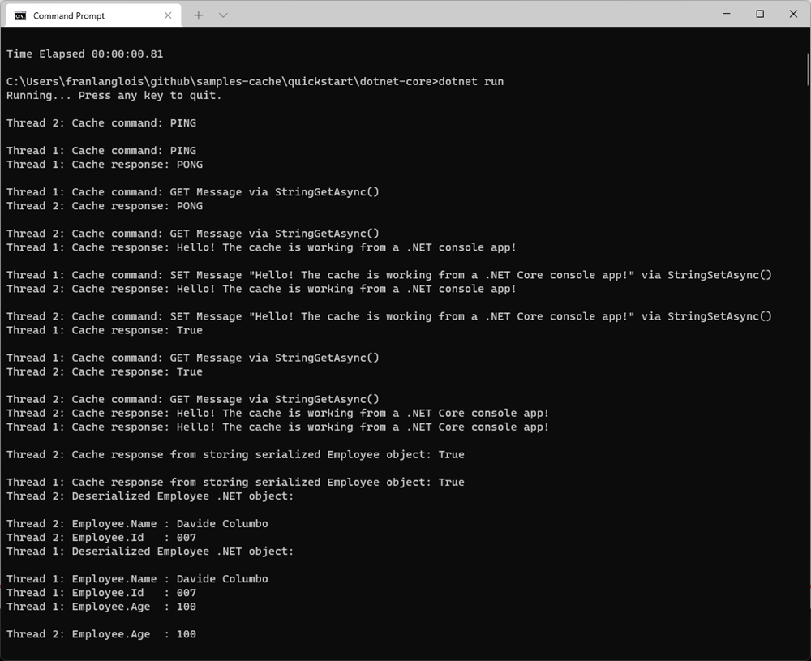
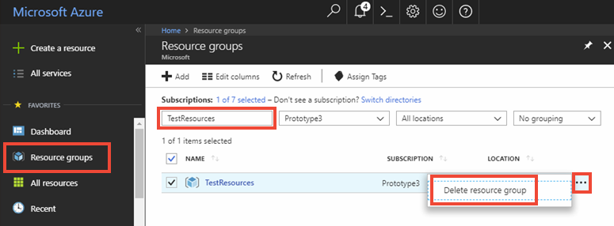

# Quickstart: Use Azure Cache for Redis with a .NET Core app

In this quickstart, you incorporate Azure Cache for Redis into a .NET Core app to have access to a secure, dedicated cache that is accessible from any application within Azure. You specifically use the [StackExchange.Redis](https://github.com/StackExchange/StackExchange.Redis) client with C# code in a .NET Core console app.

## Prerequisites

- Azure subscription - [create one for free](https://azure.microsoft.com/free/)
- [.NET Core SDK](https://dotnet.microsoft.com/download)
- [.NET Framework 4 or higher](https://www.microsoft.com/net/download/dotnet-framework-runtime), which is required by the StackEdchange.Redis client.

## Create a cache
[!INCLUDE [redis-cache-create](../../includes/redis-cache-create.md)]

[!INCLUDE [redis-cache-access-keys](../../includes/redis-cache-access-keys.md)]

Make a note of the **HOST NAME** and the **Primary** access key. You will use these values later to construct the *CacheConnection* secret.


## Create a console app

Open a new command window and execute the following command to create a new .NET Core console app:

```
dotnet new console -o Redistest
```

In your command window, change to the new *Redistest* project directory.


## Add Secret Manager to the project

In this section, you will add the [Secret Manager tool](https://docs.microsoft.com/aspnet/core/security/app-secrets) to your project. The Secret Manager tool stores sensitive data for development work outside of your project tree. This approach helps prevent the accidental sharing of app secrets within source code.

Open your *Redistest.csproj* file. Add a `DotNetCliToolReference` element to include *Microsoft.Extensions.SecretManager.Tools*. Also add a `UserSecretsId` element as shown below, and save the file.

```xml
<Project Sdk="Microsoft.NET.Sdk">

  <PropertyGroup>
    <OutputType>Exe</OutputType>
    <TargetFramework>netcoreapp2.0</TargetFramework>
    <UserSecretsId>Redistest</UserSecretsId>
  </PropertyGroup>
  <ItemGroup>
    <DotNetCliToolReference Include="Microsoft.Extensions.SecretManager.Tools" Version="2.0.0" />
  </ItemGroup>
</Project>
```

Execute the following command to add the *Microsoft.Extensions.Configuration.UserSecrets* package to the project:

```
dotnet add package Microsoft.Extensions.Configuration.UserSecrets
```

Execute the following command to restore your packages:

```
dotnet restore
```

In your command window, execute the following command to store a new secret named *CacheConnection*, after replacing the placeholders (including angle brackets) for your cache name and primary access key:

```
dotnet user-secrets set CacheConnection "<cache name>.redis.cache.windows.net,abortConnect=false,ssl=true,password=<primary-access-key>"
```

Add the following `using` statement to *Program.cs*:

```csharp
using Microsoft.Extensions.Configuration;
```

Add the following members to the `Program` class in *Program.cs*. This code initializes a configuration to access the user secret for the Azure Cache for Redis connection string.

```csharp
        private static IConfigurationRoot Configuration { get; set; }
        const string SecretName = "CacheConnection";

        private static void InitializeConfiguration()
        {
            var builder = new ConfigurationBuilder()
                .AddUserSecrets<Program>();

            Configuration = builder.Build();
        }
```

## Configure the cache client

In this section, you will configure the console application to use the [StackExchange.Redis](https://github.com/StackExchange/StackExchange.Redis) client for .NET.

In your command window, execute the following command in the *Redistest* project directory:

```
dotnet add package StackExchange.Redis
```

Once the installation is completed, the *StackExchange.Redis* cache client is available to use with your project.


## Connect to the cache

Add the following `using` statement to *Program.cs*:

```csharp
using StackExchange.Redis;
```

The connection to the Azure Cache for Redis is managed by the `ConnectionMultiplexer` class. This class should be shared and reused throughout your client application. Do not create a new connection for each operation. 

In *Program.cs*, add the following members to the `Program` class of your console application:

```csharp
        private static Lazy<ConnectionMultiplexer> lazyConnection = new Lazy<ConnectionMultiplexer>(() =>
        {
            string cacheConnection = Configuration[SecretName];
            return ConnectionMultiplexer.Connect(cacheConnection);
        });

        public static ConnectionMultiplexer Connection
        {
            get
            {
                return lazyConnection.Value;
            }
        }
```

This approach to sharing a `ConnectionMultiplexer` instance in your application uses a static property that returns a connected instance. The code provides a thread-safe way to initialize only a single connected `ConnectionMultiplexer` instance. `abortConnect` is set to false, which means that the call succeeds even if a connection to the Azure Cache for Redis is not established. One key feature of `ConnectionMultiplexer` is that it automatically restores connectivity to the cache once the network issue or other causes are resolved.

The value of the *CacheConnection* secret is accessed using the Secret Manager configuration provider and used as the password parameter.

## Executing cache commands

In *Program.cs*, add the following code for the `Main` procedure of the `Program` class for your console application:

```csharp
        static void Main(string[] args)
        {
            InitializeConfiguration();

            // Connection refers to a property that returns a ConnectionMultiplexer
            // as shown in the previous example.
            IDatabase cache = lazyConnection.Value.GetDatabase();

            // Perform cache operations using the cache object...

            // Simple PING command
            string cacheCommand = "PING";
            Console.WriteLine("\nCache command  : " + cacheCommand);
            Console.WriteLine("Cache response : " + cache.Execute(cacheCommand).ToString());

            // Simple get and put of integral data types into the cache
            cacheCommand = "GET Message";
            Console.WriteLine("\nCache command  : " + cacheCommand + " or StringGet()");
            Console.WriteLine("Cache response : " + cache.StringGet("Message").ToString());

            cacheCommand = "SET Message \"Hello! The cache is working from a .NET Core console app!\"";
            Console.WriteLine("\nCache command  : " + cacheCommand + " or StringSet()");
            Console.WriteLine("Cache response : " + cache.StringSet("Message", "Hello! The cache is working from a .NET Core console app!").ToString());

            // Demonstrate "SET Message" executed as expected...
            cacheCommand = "GET Message";
            Console.WriteLine("\nCache command  : " + cacheCommand + " or StringGet()");
            Console.WriteLine("Cache response : " + cache.StringGet("Message").ToString());

            // Get the client list, useful to see if connection list is growing...
            cacheCommand = "CLIENT LIST";
            Console.WriteLine("\nCache command  : " + cacheCommand);
            Console.WriteLine("Cache response : \n" + cache.Execute("CLIENT", "LIST").ToString().Replace("id=", "id="));

            lazyConnection.Value.Dispose();
        }
```

Save *Program.cs*.

Azure Cache for Redis has a configurable number of databases (default of 16) that can be used to logically separate the data within an Azure Cache for Redis. The code connects to the default database, DB 0. For more information, see [What are Redis databases?](cache-faq.md#what-are-redis-databases) and [Default Redis server configuration](cache-configure.md#default-redis-server-configuration).

Cache items can be stored and retrieved by using the `StringSet` and `StringGet` methods.

Redis stores most data as Redis strings, but these strings can contain many types of data, including serialized binary data, which can be used when storing .NET objects in the cache.

Execute the following command in your command window to build the app:

```
dotnet build
```

Then run the app with the following command:

```
dotnet run
```

In the example below, you can see the `Message` key previously had a cached value, which was set using the Redis Console in the Azure portal. The app updated that cached value. The app also executed the `PING` and `CLIENT LIST` commands.


## Work with .NET objects in the cache

Azure Cache for Redis can cache both .NET objects and primitive data types, but before a .NET object can be cached it must be serialized. This .NET object serialization is the responsibility of the application developer, and gives the developer flexibility in the choice of the serializer.

One simple way to serialize objects is to use the `JsonConvert` serialization methods in [Newtonsoft.Json](https://www.nuget.org/packages/Newtonsoft.Json/) and serialize to and from JSON. In this section, you will add a .NET object to the cache.

Execute the following command to add the *Newtonsoft.json* package to the app:

```
dotnet add package Newtonsoft.json
```

Add the following `using` statement to the top of *Program.cs*:

```csharp
using Newtonsoft.Json;
```

Add the following `Employee` class definition to *Program.cs*:

```csharp
        class Employee
        {
            public string Id { get; set; }
            public string Name { get; set; }
            public int Age { get; set; }

            public Employee(string EmployeeId, string Name, int Age)
            {
                this.Id = EmployeeId;
                this.Name = Name;
                this.Age = Age;
            }
        }
```

At the bottom of `Main()` procedure in *Program.cs*, and before the call to `Dispose()`, add the following lines of code to cache and retrieve a serialized .NET object:

```csharp
            // Store .NET object to cache
            Employee e007 = new Employee("007", "Davide Columbo", 100);
            Console.WriteLine("Cache response from storing Employee .NET object : " + 
                cache.StringSet("e007", JsonConvert.SerializeObject(e007)));

            // Retrieve .NET object from cache
            Employee e007FromCache = JsonConvert.DeserializeObject<Employee>(cache.StringGet("e007"));
            Console.WriteLine("Deserialized Employee .NET object :\n");
            Console.WriteLine("\tEmployee.Name : " + e007FromCache.Name);
            Console.WriteLine("\tEmployee.Id   : " + e007FromCache.Id);
            Console.WriteLine("\tEmployee.Age  : " + e007FromCache.Age + "\n");
```

Save *Program.cs* and rebuild the app with the following command:

```
dotnet build
```

Run the app with the following command to test serialization of .NET objects:

```
dotnet run
```




## Clean up resources

If you will be continuing to the next tutorial, you can keep the resources created in this quickstart and reuse them.

Otherwise, if you are finished with the quickstart sample application, you can delete the Azure resources created in this quickstart to avoid charges. 

> [!IMPORTANT]
> Deleting a resource group is irreversible and that the resource group and all the resources in it are permanently deleted. Make sure that you do not accidentally delete the wrong resource group or resources. If you created the resources for hosting this sample inside an existing resource group that contains resources you want to keep, you can delete each resource individually from their respective blades instead of deleting the resource group.
>

Sign in to the [Azure portal](https://portal.azure.com) and click **Resource groups**.

In the **Filter by name...** textbox, type the name of your resource group. The instructions for this article used a resource group named *TestResources*. On your resource group in the result list, click **...** then **Delete resource group**.



You will be asked to confirm the deletion of the resource group. Type the name of your resource group to confirm, and click **Delete**.

After a few moments, the resource group and all of its contained resources are deleted.


<a name="next-steps"></a>

## Next steps

In this quickstart, you learned how to use Azure Cache for Redis from a .NET Core application. Continue to the next quickstart to use Azure Cache for Redis with an ASP.NET web app.

> [!div class="nextstepaction"]
> [Create an ASP.NET web app that uses an Azure Cache for Redis.](./cache-web-app-howto.md)


