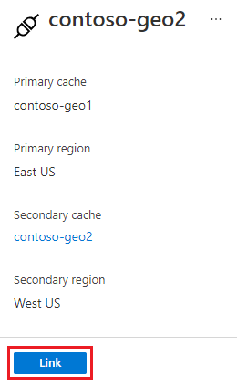

# Configure active geo-replication for Enterprise Azure Cache for Redis instances (Preview)

In this article, you'll learn how to configure an active geo-replicated Azure Cache using the Azure portal.

Active geo-replication groups two or more Enterprise Azure Cache for Redis instances into a single cache that spans across Azure regions. All instance act as the local primaries. An application decides which instance(s) to use for read and write requests.

## Create or join an active geo-replication group

> [!IMPORTANT]
> Active geo-replication must be enabled at the time an Azure Cache for Redis is created.
>
>

1. In the **New Redis Cache** creation UI, click **Configure** to set up **Active geo-replication** in the **Advanced** tab.

1. Click **Enable** in the side panel.

1. Create a new replication group or select an existing one from the list.

    

1. Click **Ok** to finish.

## Remove a cache instance

## Delete a group

## Next steps

Learn more about Azure Cache for Redis features.

* [Azure Cache for Redis service tiers](cache-overview.md#service-tiers)
* [High availability for Azure Cache for Redis](cache-high-availability.md)
