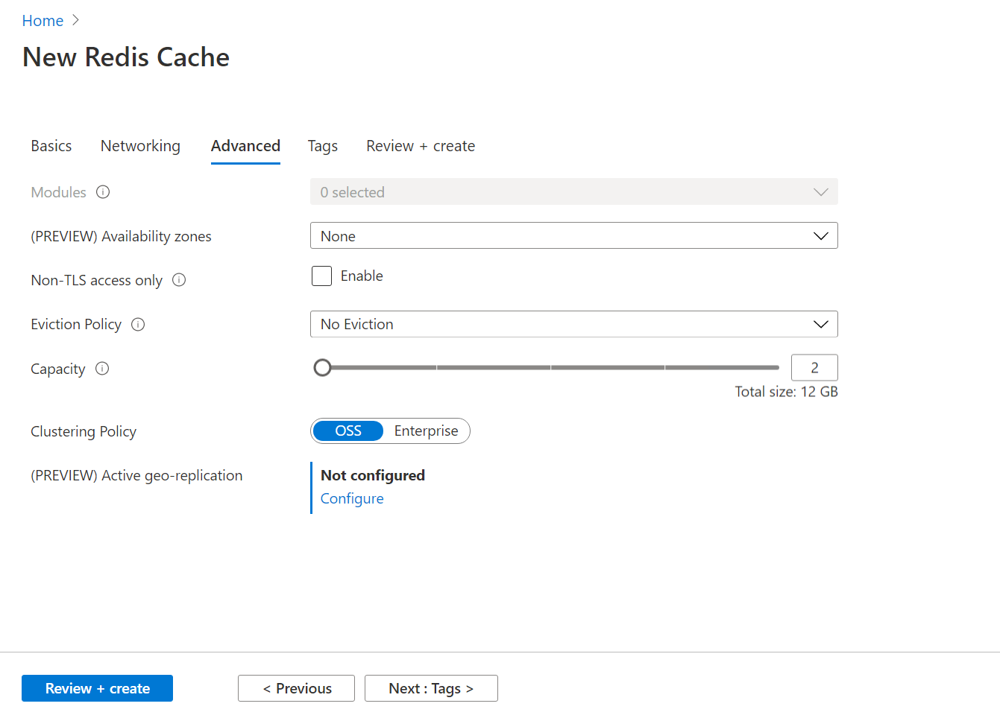
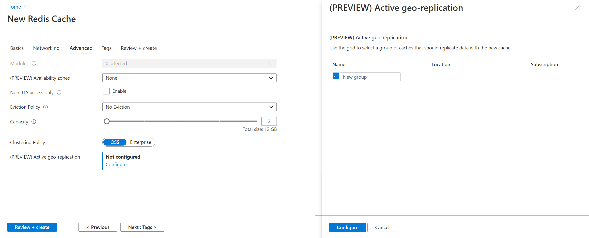
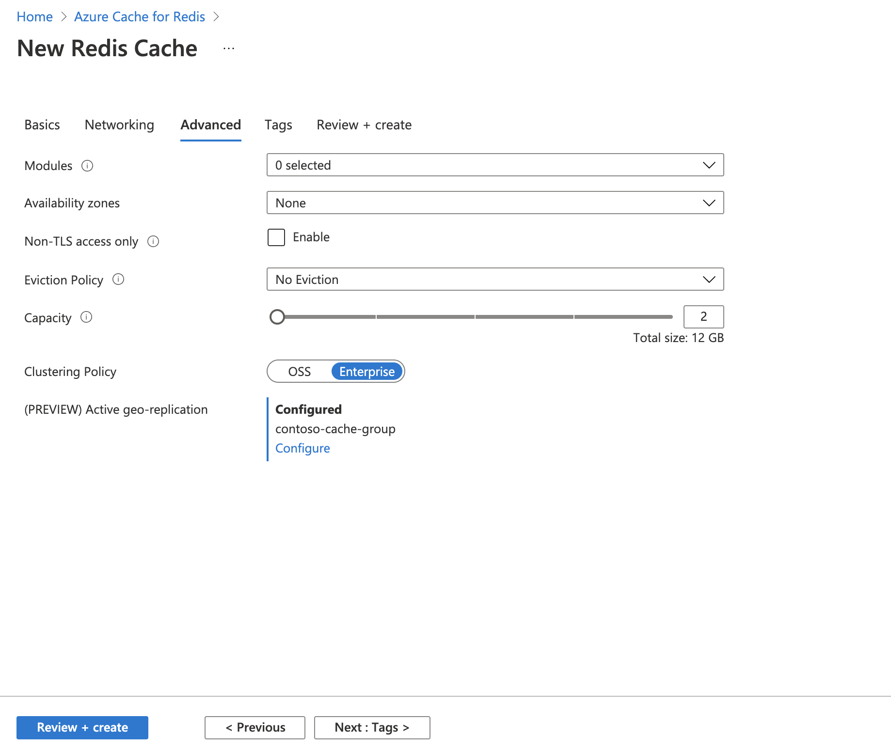

# Configure active geo-replication for Enterprise Azure Cache for Redis instances (Preview)

In this article, you'll learn how to configure an active geo-replicated Azure Cache using the Azure portal.

Active geo-replication groups two or more Enterprise Azure Cache for Redis instances into a single cache that spans across Azure regions. All instance act as the local primaries. An application decides which instance(s) to use for read and write requests.

## Create or join an active geo-replication group

> [!IMPORTANT]
> Active geo-replication must be enabled at the time an Azure Cache for Redis is created.
>
>

1. In the **Advanced** tab of **New Redis Cache** creation UI, select **Enterprise** for **Clustering Policy**.

    

1. Click **Configure** to set up **Active geo-replication**.

1. Create a new replication group, for a first cache instance, or select an existing one from the list.

    

1. Click **Configure** to finish.

    

1. Wait for the first cache to be created successfully. Repeat the above steps for each additional cache instance in the geo-replication group.

## Remove from an active geo-replication group

To remove a cache instance from an active geo-replication group, simply delete the instance. The remaining instances will reconfigure themselves automatically.

## Next steps

Learn more about Azure Cache for Redis features.

* [Azure Cache for Redis service tiers](cache-overview.md#service-tiers)
* [High availability for Azure Cache for Redis](cache-high-availability.md)
