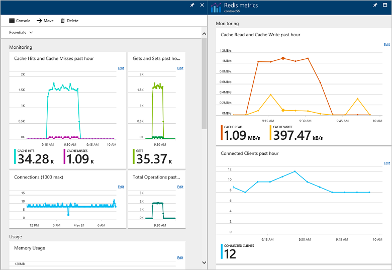
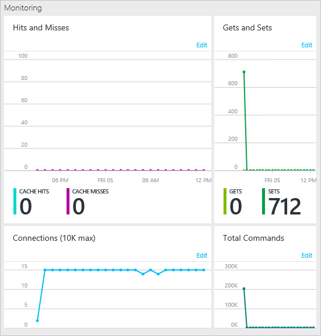
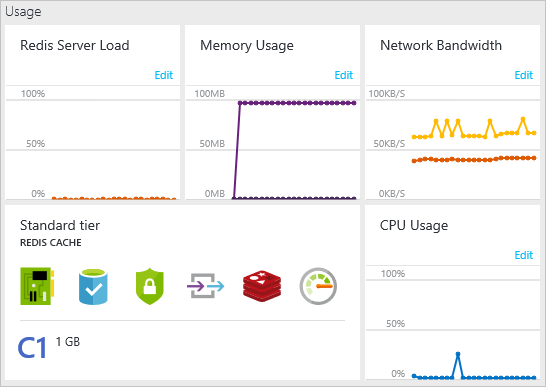
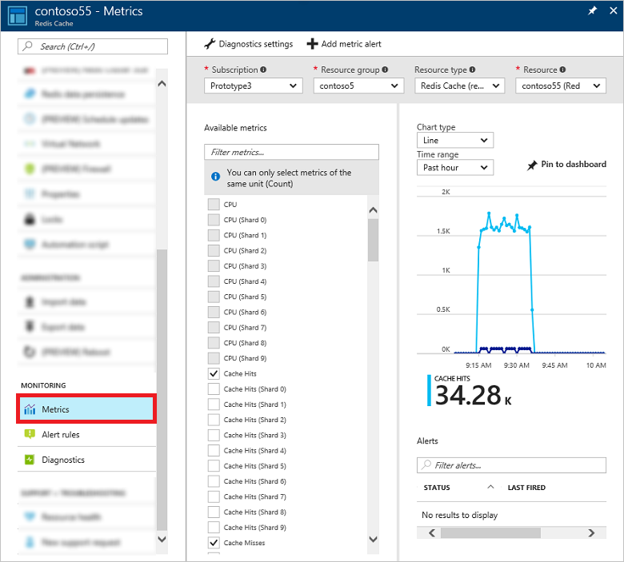
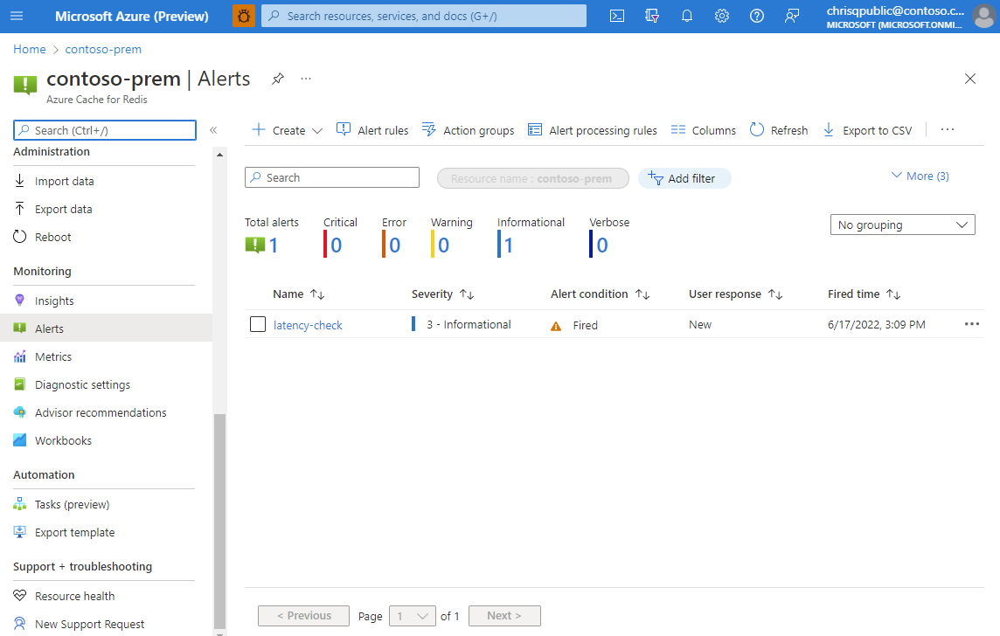

# Monitor Azure Cache for Redis

Azure Cache for Redis uses [Azure Monitor](../azure-monitor/index.yml) to provide several options for monitoring your cache instances. These tools enable you to monitor the health of your Azure Cache for Redis instances and help you manage your caching applications.

Use Azure Monitor to:

- view metrics
- pin metrics charts to the Startboard
- customize the date and time range of monitoring charts
- add and remove metrics from the charts
- and set alerts when certain conditions are met

Metrics for Azure Cache for Redis instances are collected using the Redis [INFO](https://redis.io/commands/info) command. Metrics are collected approximately twice per minute and automatically stored for 30 days so they can be displayed in the metrics charts and evaluated by alert rules.

To configure a different retention policy, see [Export cache metrics](#export-cache-metrics).  

For more information about the different INFO values used for each cache metric, see [Available metrics and reporting intervals](#available-metrics-and-reporting-intervals).

To view cache metrics, [browse](cache-configure.md#configure-azure-cache-for-redis-settings) to your cache instance in the [Azure portal](https://portal.azure.com).  Azure Cache for Redis provides some built-in charts on the left using **Overview** and **Redis metrics**. Each chart can be customized by adding or removing metrics and changing the reporting interval.

## View pre-configured metrics charts

On the left, **Overview** has the following pre-configured monitoring charts.

- [Monitoring charts](#monitoring-charts)
- [Usage charts](#usage-charts)

### Monitoring charts

The **Monitoring** section---in **Overview** on the left---has **Hits and Misses**, **Gets and Sets**, **Connections**, and **Total Commands** charts.

### Usage charts

The **Usage** section---in **Overview** on the left---has **Redis Server Load**, **Memory Usage**, **Network Bandwidth**, and **CPU Usage** charts, and also displays the **Pricing tier** for the cache instance.

The **Pricing tier** displays the cache pricing tier, and can be used to [scale](cache-how-to-scale.md) the cache to a different pricing tier.

## View metrics charts for all your caches with Azure Monitor for Azure Cache for Redis

Use [Azure Monitor for Azure Cache for Redis](../azure-monitor/insights/redis-cache-insights-overview.md) (preview) for a view of the overall performance, failures, capacity, and operational health of all your Azure Cache for Redis resources. View metrics in a customizable, unified, and interactive experience that lets you drill down into details for individual resources. Azure Monitor for Azure Cache for Redis is based on the [workbooks feature of Azure Monitor](../azure-monitor/visualize/workbooks-overview.md) that provides rich visualizations for metrics and other data. To learn more, see the [Explore Azure Monitor for Azure Cache for Redis](../azure-monitor/insights/redis-cache-insights-overview.md) article.

## View metrics with Azure Monitor metrics explorer

For scenarios where you don't need the full flexibility of Azure Monitor for Azure Cache for Redis, you can instead view metrics and create custom charts using the Azure Monitor metrics explorer. Select **Metrics** from the **Resource menu**, and customize your chart using your preferred metrics, reporting interval, chart type, and more.

For more information on working with metrics using Azure Monitor, see [Overview of metrics in Microsoft Azure](../azure-monitor/data-platform.md).

## Export cache metrics

By default, cache metrics in Azure Monitor are [stored for 30 days](../azure-monitor/essentials/data-platform-metrics.md) and then deleted. To persist your cache metrics for longer than 30 days, you can [designate a storage account](../azure-monitor/essentials/resource-logs.md#send-to-azure-storage) and specify a **Retention (days)** policy for your cache metrics.

To configure a storage account for your cache metrics:

1. In the **Azure Cache for Redis** page, under the **Monitoring** heading, select **Diagnostics**.
1. Select **+ Add diagnostic setting**.
1. Name the settings.
1. Check **Archive to a storage account**. You’ll be charged normal data rates for storage and transactions when you send diagnostics to a storage account.
1. Select **Configure** to choose the storage account in which to store the cache metrics.
1. Under the table heading **metric**, check box beside the line items you want to store, such as **AllMetrics**. Specify a **Retention (days)** policy. The maximum days retention you can specify is **365 days**. However, if you want to keep the metrics data forever, set **Retention (days)** to **0**.
1. Select **Save**.

>[!NOTE]
>In addition to archiving your cache metrics to storage, you can also [stream them to an Event hub or send them to Azure Monitor logs](../azure-monitor/essentials/rest-api-walkthrough.md#retrieve-metric-values).
>

To access your metrics, you can view them in the Azure portal as previously described in this article. You can also access them using the [Azure Monitor Metrics REST API](../azure-monitor/essentials/stream-monitoring-data-event-hubs.md).

> [!NOTE]
> If you change storage accounts, the data in the previously configured storage account remains available for download, but it is not displayed in the Azure portal.  
>

## Available metrics and reporting intervals

Cache metrics are reported using several reporting intervals, including **Past hour**, **Today**, **Past week**, and **Custom**. On the left, you find the **Metric** selection for each metrics chart displays the average, minimum, and maximum values for each metric in the chart, and some metrics display a total for the reporting interval.

Each metric includes two versions. One metric measures performance for the entire cache, and for caches that use [clustering](cache-how-to-premium-clustering.md), a second version of the metric that includes `(Shard 0-9)` in the name measures performance for a single shard in a cache. For example if a cache has four shards, `Cache Hits` is the total number of hits for the entire cache, and `Cache Hits (Shard 3)` is just the hits for that shard of the cache.

> [!NOTE]
> When you're seeing the aggregation type :
>
> - Count” show 2, it indicates the metric received 2 data points for your time granularity (1 minute).
> - “Max” shows the maximum value of a data point in the time granularity,
> - “Min” shows the minimum value of a data point in the time granularity,
> - “Average” shows the average value of all data points in the time granularity.
> - “Sum” shows the sum of all data points in the time granularity and may be misleading depending on the specific metric.
> Under normal conditions, “Average” and “Max” will be very similar because only one node emits these metrics (the master node). In a scenario where the number of connected clients changes rapidly, “Max,” “Average,” and “Min” would show very different values and this is also expected behavior.
>
> Generally, “Average” will show you a smooth chart of your desired metric and reacts well to changes in time granularity. “Max” and “Min” may hide large changes in the metric if the time granularity is large but can be used with a small time granularity to help pinpoint exact times when large changes occur in the metric.
>
> “Count” and “Sum” may be misleading for certain metrics (connected clients included).
>
> Hence, we suggested you to have a look at the Average metrics and not the Sum metrics.

> [!NOTE]
> Even when the cache is idle with no connected active client applications, you may see some cache activity, such as connected clients, memory usage, and operations being performed. This activity is normal during the operation of an Azure Cache for Redis instance.
>
>

| Metric | Description |
| --- | --- |
| Cache Hits |The number of successful key lookups during the specified reporting interval. This number maps to `keyspace_hits` from the Redis [INFO](https://redis.io/commands/info) command. |
| Cache Latency (Preview) | The latency of the cache calculated using the internode latency of the cache. This metric is measured in microseconds, and has three dimensions: `Avg`, `Min`, and `Max`. The dimensions represent the average, minimum, and maximum latency of the cache during the specified reporting interval. |
| Cache Misses |The number of failed key lookups during the specified reporting interval. This number maps to `keyspace_misses` from the Redis INFO command. Cache misses don't necessarily mean there's an issue with the cache. For example, when using the cache-aside programming pattern, an application looks first in the cache for an item. If the item isn't there (cache miss), the item is retrieved from the database and added to the cache for next time. Cache misses are normal behavior for the cache-aside programming pattern. If the number of cache misses is higher than expected, examine the application logic that populates and reads from the cache. If items are being evicted from the cache because of memory pressure, then there may be some cache misses, but a better metric to monitor for memory pressure would be `Used Memory` or `Evicted Keys`. |
| Cache Read |The amount of data read from the cache in Megabytes per second (MB/s) during the specified reporting interval. This value is derived from the network interface cards that support the virtual machine that hosts the cache and isn't Redis specific. **This value corresponds to the network bandwidth used by this cache. If you want to set up alerts for server-side network bandwidth limits, then create it using this `Cache Read` counter. See [this table](./cache-planning-faq.yml#azure-cache-for-redis-performance) for the observed bandwidth limits for various cache pricing tiers and sizes.** |
| Cache Write |The amount of data written to the cache in Megabytes per second (MB/s) during the specified reporting interval. This value is derived from the network interface cards that support the virtual machine that hosts the cache and isn't Redis specific. This value corresponds to the network bandwidth of data sent to the cache from the client. |
| Connected Clients |The number of client connections to the cache during the specified reporting interval. This number maps to `connected_clients` from the Redis INFO command. Once the [connection limit](cache-configure.md#default-redis-server-configuration) is reached, later attempts to connect to the cache fail. Even if there are no active client applications, there may still be a few instances of connected clients because of internal processes and connections. |
| CPU |The CPU utilization of the Azure Cache for Redis server as a percentage during the specified reporting interval. This value maps to the operating system `\Processor(_Total)\% Processor Time` performance counter. |
| Errors | Specific failures and performance issues that the cache could be experiencing during a specified reporting interval. This metric has eight dimensions representing different error types, but could have more added in the future. The error types represented now are as follows:  <ul><li>**Failover** – when a cache fails over (subordinate promotes to primary)</li><li>**Dataloss** – when there's data loss on the cache</li><li>**UnresponsiveClients** – when the clients aren't reading data from the server fast enough</li><li>**AOF** – when there's an issue related to AOF persistence</li><li>**RDB** – when there's an issue related to RDB persistence</li><li>**Import** – when there's an issue related to Import RDB</li><li>**Export** – when there's an issue related to Export RDB</li></ul> |
| Evicted Keys |The number of items evicted from the cache during the specified reporting interval because of the `maxmemory` limit. This number maps to `evicted_keys` from the Redis INFO command. |
| Expired Keys |The number of items expired from the cache during the specified reporting interval. This value maps to `expired_keys` from the Redis INFO command.|
| Gets |The number of get operations from the cache during the specified reporting interval. This value is the sum of the following values from the Redis INFO all command: `cmdstat_get`, `cmdstat_hget`, `cmdstat_hgetall`, `cmdstat_hmget`, `cmdstat_mget`, `cmdstat_getbit`, and `cmdstat_getrange`, and is equivalent to the sum of cache hits and misses during the reporting interval. |
| Operations per Second | The total number of commands processed per second by the cache server during the specified reporting interval.  This value maps to "instantaneous_ops_per_sec" from the Redis INFO command. |
| Redis Server Load |The percentage of cycles in which the Redis server is busy processing and not waiting idle for messages. If this counter reaches 100, it means the Redis server has hit a performance ceiling and the CPU can't process work any faster. If you're seeing high Redis Server Load, then you see timeout exceptions in the client. In this case, you should consider scaling up or partitioning your data into multiple caches. |
| Sets |The number of set operations to the cache during the specified reporting interval. This value is the sum of the following values from the Redis INFO all command: `cmdstat_set`, `cmdstat_hset`, `cmdstat_hmset`, `cmdstat_hsetnx`, `cmdstat_lset`, `cmdstat_mset`, `cmdstat_msetnx`, `cmdstat_setbit`, `cmdstat_setex`, `cmdstat_setrange`, and `cmdstat_setnx`. |
| Total Keys  | The maximum number of keys in the cache during the past reporting time period. This number maps to `keyspace` from the Redis INFO command. Because of a limitation in the underlying metrics system for caches with clustering enabled, Total Keys return the maximum number of keys of the shard that had the maximum number of keys during the reporting interval.  |
| Total Operations |The total number of commands processed by the cache server during the specified reporting interval. This value maps to `total_commands_processed` from the Redis INFO command. When Azure Cache for Redis is used purely for pub/sub there will be no metrics for `Cache Hits`, `Cache Misses`, `Gets`, or `Sets`, but there will be `Total Operations` metrics that reflect the cache usage for pub/sub operations. |
| Used Memory |The amount of cache memory in MB that is used for key/value pairs in the cache during the specified reporting interval. This value maps to `used_memory` from the Redis INFO command. This value doesn't include metadata or fragmentation. |
| Used Memory Percentage | The % of total memory that is being used during the specified reporting interval.  This value references the `used_memory` value from the Redis INFO command to calculate the percentage. |
| Used Memory RSS |The amount of cache memory used in MB during the specified reporting interval, including fragmentation and metadata. This value maps to `used_memory_rss` from the Redis INFO command. |

## Alerts

You can configure to receive alerts based on metrics and activity logs. Azure Monitor allows you to configure an alert to do the following when it triggers:

- Send an email notification
- Call a webhook
- Invoke an Azure Logic App

To configure Alert rules for your cache, select **Alert rules** from the **Resource menu**.

For more information about configuring and using Alerts, see [Overview of Alerts](../azure-monitor/alerts/alerts-classic-portal.md).

## Activity Logs

Activity logs provide insight into the operations that completed on your Azure Cache for Redis instances. It was previously known as "audit logs" or "operational logs". Using activity logs, you can determine the "what, who, and when" for any write operations (PUT, POST, DELETE) taken on your Azure Cache for Redis instances.

> [!NOTE]
> Activity logs do not include read (GET) operations.
>

To view activity logs for your cache, select **Activity logs** from the **Resource menu**.

For more information about Activity logs, see [Overview of the Azure Activity Log](../azure-monitor/essentials/platform-logs-overview.md).