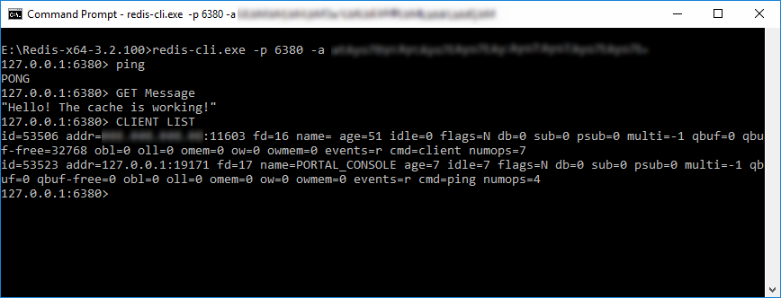
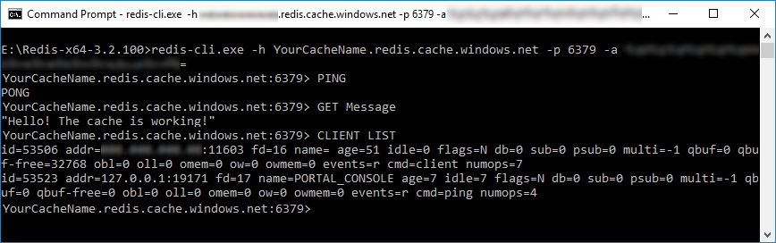

# Use the Redis command-line tool with Azure Cache for Redis

Use the popular `redis-cli.exe` command-line tool to interact with an Azure Cache for Redis as a client. The tool is available for Windows platforms by downloading the [Redis command-line tools for Windows](https://github.com/MSOpenTech/redis/releases/).

If you want to run the command-line tool on another platform, download open-source Redis from [https://redis.io/download](https://redis.io/download).

## Gather cache access information

[!INCLUDE [updated-for-az](../../includes/updated-for-az.md)]

You can gather the information needed to access the cache using three methods:

1. Azure CLI using [az redis list-keys](/cli/azure/redis#az-redis-list-keys)
2. Azure PowerShell using [Get-AzRedisCacheKey](/powershell/module/az.rediscache/Get-AzRedisCacheKey)
3. Using the Azure portal

In this section, you retrieve the keys from the Azure portal.

[!INCLUDE [redis-cache-create](includes/redis-cache-access-keys.md)]

## Enable access for redis-cli.exe

With Azure Cache for Redis, only the TLS port (6380) is enabled by default. The `redis-cli.exe` command-line tool doesn't support TLS. You have two configuration choices to use it:

1. [Enable the non-TLS port (6379)](cache-configure.md#access-ports) - **This configuration is not recommended** because in this configuration, the access keys are sent via TCP in clear text. This change can compromise access to your cache. The only scenario where you might consider this configuration is when you’re just accessing a test cache.

2. Download and install [stunnel](https://www.stunnel.org/downloads.html).

    Run **stunnel GUI Start** to start the server.

    Right-click the taskbar icon for the *stunnel* server and select **Show Log Window**.

    On the *stunnel* Log Window menu, select **Configuration** > **Edit Configuration** to open the current configuration file.

    Add the following entry for `redis-cli.exe` under the **Service definitions** section. Insert your actual cache name in place of `yourcachename`. 

    ```properties
    [redis-cli]
    client = yes
    accept = 127.0.0.1:6380
    connect = yourcachename.redis.cache.windows.net:6380
    ```

    Save and close the configuration file.
  
    On the stunnel Log Window menu, select **Configuration** > **Reload Configuration**.

## Connect using the Redis command-line tool.

When using *stunnel*, run `redis-cli.exe`, and pass only your *port*, and *access key* (primary or secondary) to connect to the cache.

```console
redis-cli.exe -p 6380 -a YourAccessKey
```



If you're using a test cache with the **unsecure** non-TLS port, run `redis-cli.exe` and pass your *host name*, *port*, and *access key* (primary or secondary) to connect to the test cache.

```console
redis-cli.exe -h yourcachename.redis.cache.windows.net -p 6379 -a YourAccessKey
```



## Next steps

Learn more about using the [Redis Console](cache-configure.md#redis-console) to issue commands.
