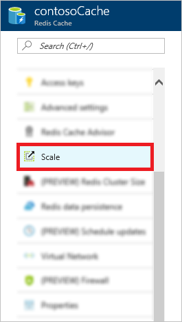

# How to Scale Azure Cache for Redis
Azure Cache for Redis has different cache offerings, which provide flexibility in the choice of cache size and features. After a cache is created, you can scale the size and the pricing tier of the cache if the requirements of your application change. This article shows you how to scale your cache using the Azure portal, and tools such as Azure PowerShell, and Azure CLI.

## When to scale
You can use the [monitoring](cache-how-to-monitor.md) features of Azure Cache for Redis to monitor the health and performance of your cache and help determine when to scale the cache. 

You can monitor the following metrics to help determine if you need to scale.

* Redis Server Load
* Memory Usage
* Network Bandwidth
* CPU Usage

If you determine that your cache is no longer meeting your application's requirements, you can scale to a larger or smaller cache pricing tier that is right for your application. For more information on determining which cache pricing tier to use, see [What Azure Cache for Redis offering and size should I use](cache-faq.md#what-azure-cache-for-redis-offering-and-size-should-i-use).

## Scale a cache
To scale your cache, [browse to the cache](cache-configure.md#configure-azure-cache-for-redis-settings) in the [Azure portal](https://portal.azure.com) and click **Scale** from the **Resource menu**.

Select the desired pricing tier from the **Select pricing tier** blade and click **Select**.

![Pricing tier][redis-cache-pricing-tier-blade]

You can scale to a different pricing tier with the following restrictions:

* You can't scale from a higher pricing tier to a lower pricing tier.
  * You can't scale from a **Premium** cache down to a **Standard** or a **Basic** cache.
  * You can't scale from a **Standard** cache down to a **Basic** cache.
* You can scale from a **Basic** cache to a **Standard** cache but you can't change the size at the same time. If you need a different size, you can do a subsequent scaling operation to the desired size.
* You can't scale from a **Basic** cache directly to a **Premium** cache. First, scale from **Basic** to **Standard** in one scaling operation, and then from **Standard** to **Premium** in a subsequent scaling operation.
* You can't scale from a larger size down to the **C0 (250 MB)** size.
 
While the cache is scaling to the new pricing tier, a **Scaling** status is displayed in the **Azure Cache for Redis** blade.

![Scaling][redis-cache-scaling]

When scaling is complete, the status changes from **Scaling** to **Running**.

## How to automate a scaling operation
In addition to scaling your cache instances in the Azure portal, you can scale using PowerShell cmdlets, Azure CLI, and by using the Microsoft Azure Management Libraries (MAML). 

* [Scale using PowerShell](#scale-using-powershell)
* [Scale using Azure CLI](#scale-using-azure-cli)
* [Scale using MAML](#scale-using-maml)

### Scale using PowerShell

[!INCLUDE [updated-for-az](../../includes/updated-for-az.md)]

You can scale your Azure Cache for Redis instances with PowerShell by using the [Set-AzRedisCache](https://docs.microsoft.com/powershell/module/az.rediscache/set-azrediscache) cmdlet when the `Size`, `Sku`, or `ShardCount` properties are modified. The following example shows how to scale a cache named `myCache` to a 2.5 GB cache. 

    Set-AzRedisCache -ResourceGroupName myGroup -Name myCache -Size 2.5GB

For more information on scaling with PowerShell, see [To scale an Azure Cache for Redis using Powershell](cache-how-to-manage-redis-cache-powershell.md#scale).

### Scale using Azure CLI
To scale your Azure Cache for Redis instances using Azure CLI, call the `azure rediscache set` command and pass in the desired configuration changes that include a new size, sku, or cluster size, depending on the desired scaling operation.

For more information on scaling with Azure CLI, see [Change settings of an existing Azure Cache for Redis](cache-manage-cli.md#scale).

### Scale using MAML
To scale your Azure Cache for Redis instances using the [Microsoft Azure Management Libraries (MAML)](https://azure.microsoft.com/updates/management-libraries-for-net-release-announcement/), call the `IRedisOperations.CreateOrUpdate` method and pass in the new size for the `RedisProperties.SKU.Capacity`.

    static void Main(string[] args)
    {
        // For instructions on getting the access token, see
        // https://azure.microsoft.com/documentation/articles/cache-configure/#access-keys
        string token = GetAuthorizationHeader();

        TokenCloudCredentials creds = new TokenCloudCredentials(subscriptionId,token);

        RedisManagementClient client = new RedisManagementClient(creds);
        var redisProperties = new RedisProperties();

        // To scale, set a new size for the redisSKUCapacity parameter.
        redisProperties.Sku = new Sku(redisSKUName,redisSKUFamily,redisSKUCapacity);
        redisProperties.RedisVersion = redisVersion;
        var redisParams = new RedisCreateOrUpdateParameters(redisProperties, redisCacheRegion);
        client.Redis.CreateOrUpdate(resourceGroupName,cacheName, redisParams);
    }

For more information, see the [Manage Azure Cache for Redis using MAML](https://github.com/rustd/RedisSamples/tree/master/ManageCacheUsingMAML) sample.

## Scaling FAQ
The following list contains answers to commonly asked questions about Azure Cache for Redis scaling.

* [Can I scale to, from, or within a Premium cache?](#can-i-scale-to-from-or-within-a-premium-cache)
* [After scaling, do I have to change my cache name or access keys?](#after-scaling-do-i-have-to-change-my-cache-name-or-access-keys)
* [How does scaling work?](#how-does-scaling-work)
* [Will I lose data from my cache during scaling?](#will-i-lose-data-from-my-cache-during-scaling)
* [Is my custom databases setting affected during scaling?](#is-my-custom-databases-setting-affected-during-scaling)
* [Will my cache be available during scaling?](#will-my-cache-be-available-during-scaling)
* With Geo-replication configured, why am I not able to scale my cache or change the shards in a cluster?
* [Operations that are not supported](#operations-that-are-not-supported)
* [How long does scaling take?](#how-long-does-scaling-take)
* [How can I tell when scaling is complete?](#how-can-i-tell-when-scaling-is-complete)

### Can I scale to, from, or within a Premium cache?
* You can't scale from a **Premium** cache down to a **Basic** or **Standard** pricing tier.
* You can scale from one **Premium** cache pricing tier to another.
* You can't scale from a **Basic** cache directly to a **Premium** cache. First, scale from **Basic** to **Standard** in one scaling operation, and then from **Standard** to **Premium** in a subsequent scaling operation.
* If you enabled clustering when you created your **Premium** cache, you can [change the cluster size](cache-how-to-premium-clustering.md#cluster-size). If your cache was created without clustering enabled, you can configure clustering at a later time.
  
  For more information, see [How to configure clustering for a Premium Azure Cache for Redis](cache-how-to-premium-clustering.md).

### After scaling, do I have to change my cache name or access keys?
No, your cache name and keys are unchanged during a scaling operation.

### How does scaling work?
* When a **Basic** cache is scaled to a different size, it is shut down and a new cache is provisioned using the new size. During this time, the cache is unavailable and all data in the cache is lost.
* When a **Basic** cache is scaled to a **Standard** cache, a replica cache is provisioned and the data is copied from the primary cache to the replica cache. The cache remains available during the scaling process.
* When a **Standard** cache is scaled to a different size or to a **Premium** cache, one of the replicas is shut down and reprovisioned to the new size and the data transferred over, and then the other replica performs a failover before it is reprovisioned, similar to the process that occurs during a failure of one of the cache nodes.

### Will I lose data from my cache during scaling?
* When a **Basic** cache is scaled to a new size, all data is lost and the cache is unavailable during the scaling operation.
* When a **Basic** cache is scaled to a **Standard** cache, the data in the cache is typically preserved.
* When a **Standard** cache is scaled to a larger size or tier, or a **Premium** cache is scaled to a larger size, all data is typically preserved. When scaling a **Standard** or **Premium** cache down to a smaller size, data may be lost depending on how much data is in the cache related to the new size when it is scaled. If data is lost when scaling down, keys are evicted using the [allkeys-lru](https://redis.io/topics/lru-cache) eviction policy. 

### Is my custom databases setting affected during scaling?
If you configured a custom value for the `databases` setting during cache creation, keep in mind that some pricing tiers have different [databases limits](cache-configure.md#databases). Here are some considerations when scaling in this scenario:

* When scaling to a pricing tier with a lower `databases` limit than the current tier:
  * If you are using the default number of `databases`, which is 16 for all pricing tiers, no data is lost.
  * If you are using a custom number of `databases` that falls within the limits for the tier to which you are scaling, this `databases` setting is retained and no data is lost.
  * If you are using a custom number of `databases` that exceeds the limits of the new tier, the `databases` setting is lowered to the limits of the new tier and all data in the removed databases is lost.
* When scaling to a pricing tier with the same or higher `databases` limit than the current tier, your `databases` setting is retained and no data is lost.

While Standard and Premium caches have a 99.9% SLA for availability, there is no SLA for data loss.

### Will my cache be available during scaling?
* **Standard** and **Premium** caches remain available during the scaling operation. However, connection blips can occur while scaling Standard and Premium caches, and also while scaling from Basic to Standard caches. These connection blips are expected to be small and redis clients should be able to re-establish their connection instantly.
* **Basic** caches are offline during scaling operations to a different size. Basic caches remain available when scaling from **Basic** to **Standard** but, may experience a small connection blip. If a connection blip occurs, redis clients should be able to re-establish their connection instantly.

### Scaling limitations with Geo-replication

Once you have added a Geo-replication link between two caches, you will no longer be able to initiate a scaling operation or change the number of shards in a cluster. You must unlink the cache to issue these commands. For more information, see [Configure Geo-replication](cache-how-to-geo-replication.md).

### Operations that are not supported
* You can't scale from a higher pricing tier to a lower pricing tier.
  * You can't scale from a **Premium** cache down to a **Standard** or a **Basic** cache.
  * You can't scale from a **Standard** cache down to a **Basic** cache.
* You can scale from a **Basic** cache to a **Standard** cache but you can't change the size at the same time. If you need a different size, you can do a subsequent scaling operation to the desired size.
* You can't scale from a **Basic** cache directly to a **Premium** cache. First scale from **Basic** to **Standard** in one scaling operation, and then scale from **Standard** to **Premium** in a subsequent operation.
* You can't scale from a larger size down to the **C0 (250 MB)** size.

If a scaling operation fails, the service tries to revert the operation, and the cache will revert to the original size.

### How long does scaling take?
Scaling time depends on how much data is in the cache, with larger amounts of data taking a longer time to complete. Scaling takes approximately 20 minutes. For clustered caches, scaling takes approximately 20 minutes per shard.

### How can I tell when scaling is complete?
In the Azure portal, you can see the scaling operation in progress. When scaling is complete, the status of the cache changes to **Running**.

<!-- IMAGES -->

[redis-cache-pricing-tier-blade]: ./media/cache-how-to-scale/redis-cache-pricing-tier-blade.png

[redis-cache-scaling]: ./media/cache-how-to-scale/redis-cache-scaling.png
