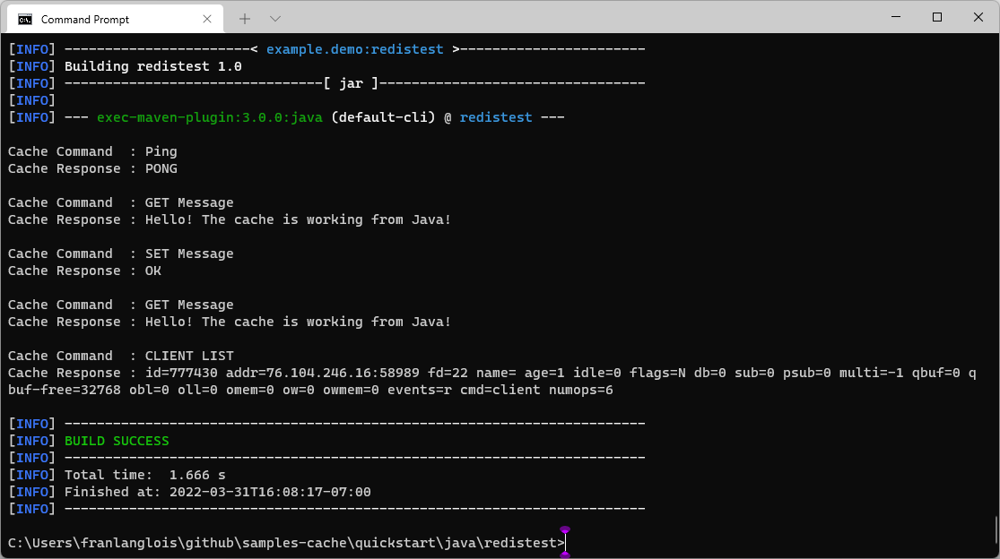
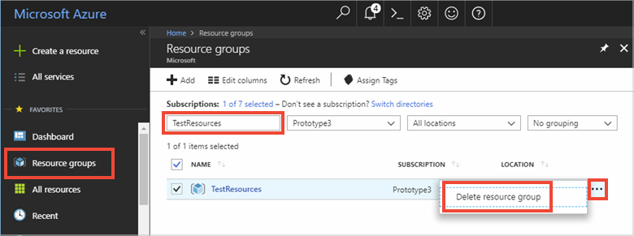

# Quickstart: Use Azure Cache for Redis in Java

In this quickstart, you incorporate Azure Cache for Redis into a Java app using the [Jedis](https://github.com/xetorthio/jedis) Redis client to have access to a secure, dedicated cache that is accessible from any application within Azure.

## Skip to the code on GitHub

If you want to skip straight to the code, see the [Java quickstart](https://github.com/Azure-Samples/azure-cache-redis-samples/tree/main/quickstart/java) on GitHub.

## Prerequisites

- Azure subscription - [create one for free](https://azure.microsoft.com/free/)
- [Apache Maven](https://maven.apache.org/download.cgi)

## Create an Azure Cache for Redis

[!INCLUDE [redis-cache-create](../../includes/redis-cache-create.md)]

[!INCLUDE [redis-cache-access-keys](../../includes/redis-cache-access-keys.md)]

## Setting up the working environment 

Depending on your operating system, add environment variables for your **Host name** and **Primary access key**. Open a command prompt, or a terminal window, and set up the following values:

```CMD 
set REDISCACHEHOSTNAME=<YOUR_HOST_NAME>.redis.cache.windows.net
set REDISCACHEKEY=<YOUR_PRIMARY_ACCESS_KEY>
```

```bash
export REDISCACHEHOSTNAME=<YOUR_HOST_NAME>.redis.cache.windows.net
export REDISCACHEKEY=<YOUR_PRIMARY_ACCESS_KEY>
```

Replace the placeholders with the following values:

- `<YOUR_HOST_NAME>`: The DNS host name, obtained from the *Properties* section of your Azure Cache for Redis resource in the Azure portal.
- `<YOUR_PRIMARY_ACCESS_KEY>`: The primary access key, obtained from the *Access keys* section of your Azure Cache for Redis resource in the Azure portal.

## Create a new Java app

Using Maven, generate a new quickstart app:

```CMD
mvn archetype:generate -DarchetypeGroupId=org.apache.maven.archetypes -DarchetypeArtifactId=maven-archetype-quickstart -DarchetypeVersion=1.3 -DgroupId=example.demo -DartifactId=redistest -Dversion=1.0
```

Change to the new *redistest* project directory.

Open the *pom.xml* file and add a dependency for [Jedis](https://github.com/xetorthio/jedis):

```xml
    <dependency>
        <groupId>redis.clients</groupId>
        <artifactId>jedis</artifactId>
        <version>3.2.0</version>
        <type>jar</type>
        <scope>compile</scope>
    </dependency>
```

Save the *pom.xml* file.

Open *App.java* and replace the code with the following code:

```java
package example.demo;

import redis.clients.jedis.Jedis;
import redis.clients.jedis.JedisShardInfo;

/**
 * Redis test
 *
 */
public class App 
{
    public static void main( String[] args )
    {

        boolean useSsl = true;
        String cacheHostname = System.getenv("REDISCACHEHOSTNAME");
        String cachekey = System.getenv("REDISCACHEKEY");

        // Connect to the Azure Cache for Redis over the TLS/SSL port using the key.
        JedisShardInfo shardInfo = new JedisShardInfo(cacheHostname, 6380, useSsl);
        shardInfo.setPassword(cachekey); /* Use your access key. */
        Jedis jedis = new Jedis(shardInfo);      

        // Perform cache operations using the cache connection object...

        // Simple PING command        
        System.out.println( "\nCache Command  : Ping" );
        System.out.println( "Cache Response : " + jedis.ping());

        // Simple get and put of integral data types into the cache
        System.out.println( "\nCache Command  : GET Message" );
        System.out.println( "Cache Response : " + jedis.get("Message"));

        System.out.println( "\nCache Command  : SET Message" );
        System.out.println( "Cache Response : " + jedis.set("Message", "Hello! The cache is working from Java!"));

        // Demonstrate "SET Message" executed as expected...
        System.out.println( "\nCache Command  : GET Message" );
        System.out.println( "Cache Response : " + jedis.get("Message"));

        // Get the client list, useful to see if connection list is growing...
        System.out.println( "\nCache Command  : CLIENT LIST" );
        System.out.println( "Cache Response : " + jedis.clientList());

        jedis.close();
    }
}
```

This code shows you how to connect to an Azure Cache for Redis instance using the cache host name and key environment variables. The code also stores and retrieves a string value in the cache. The `PING` and `CLIENT LIST` commands are also executed. 

Save *App.java*.

## Build and run the app

Execute the following Maven command to build and run the app:

```CMD
mvn compile
mvn exec:java -D exec.mainClass=example.demo.App
```

In the example below, you can see the `Message` key previously had a cached value, which was set using the Redis Console in the Azure portal. The app updated that cached value. The app also executed the `PING` and `CLIENT LIST` commands.



## Clean up resources

If you will be continuing to the next tutorial, you can keep the resources created in this quickstart and reuse them.

Otherwise, if you are finished with the quickstart sample application, you can delete the Azure resources created in this quickstart to avoid charges. 

> [!IMPORTANT]
> Deleting a resource group is irreversible and that the resource group and all the resources in it are permanently deleted. Make sure that you do not accidentally delete the wrong resource group or resources. If you created the resources for hosting this sample inside an existing resource group that contains resources you want to keep, you can delete each resource individually from their respective blades instead of deleting the resource group.
>

1. Sign in to the [Azure portal](https://portal.azure.com) and select **Resource groups**.

1. In the **Filter by name** textbox, type the name of your resource group. The instructions for this article used a resource group named *TestResources*. On your resource group in the result list, select **...** then **Delete resource group**.

   

1. You will be asked to confirm the deletion of the resource group. Type the name of your resource group to confirm, and select **Delete**.

After a few moments, the resource group and all of its contained resources are deleted.

## Next steps

In this quickstart, you learned how to use Azure Cache for Redis from a Java application. Continue to the next quickstart to use Azure Cache for Redis with an ASP.NET web app.

> [!div class="nextstepaction"]
> [Create an ASP.NET web app that uses an Azure Cache for Redis.](./cache-web-app-howto.md)
