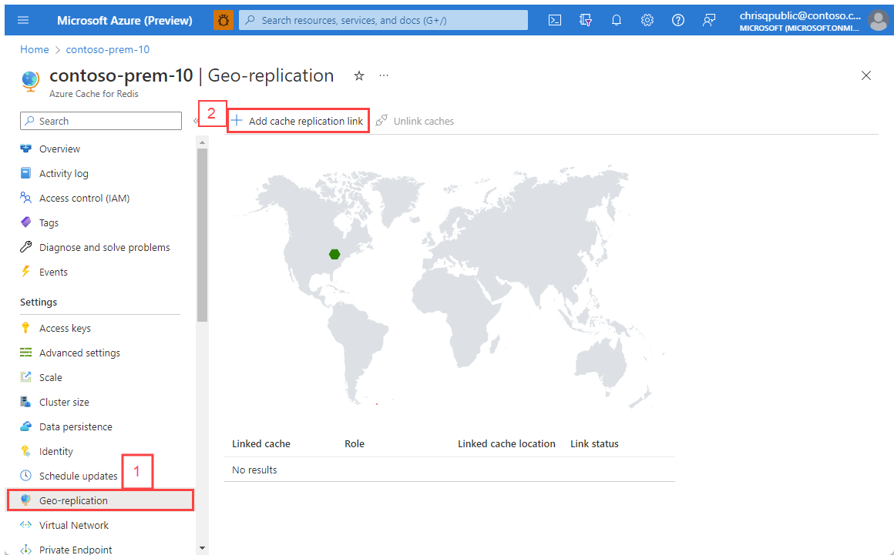
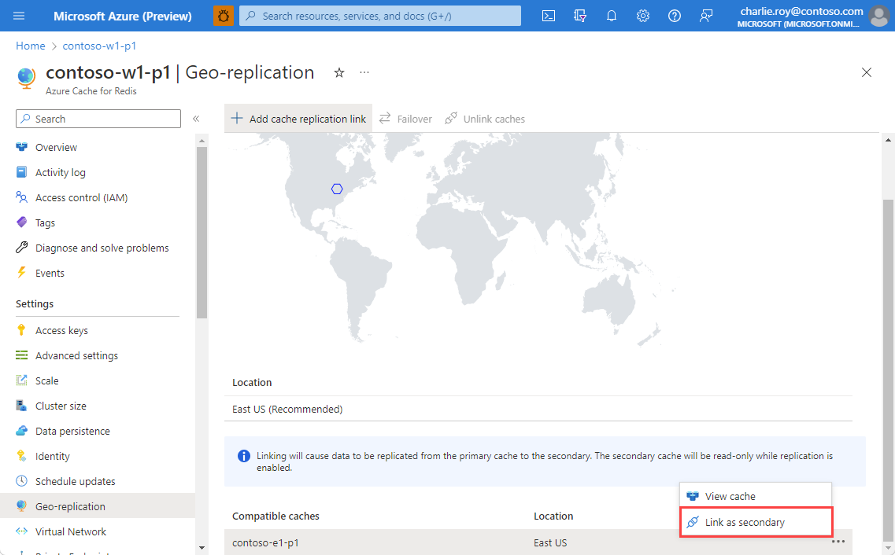
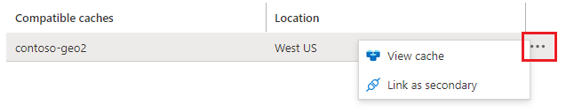
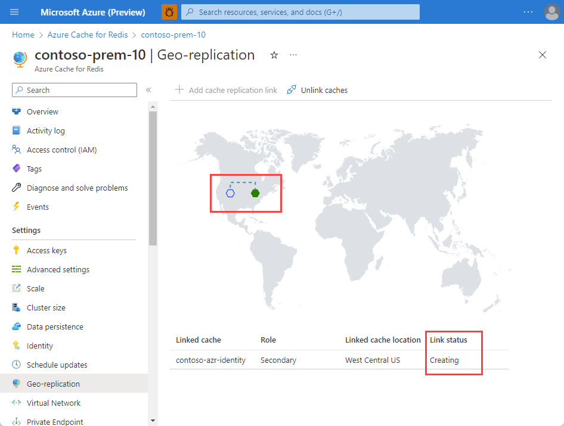
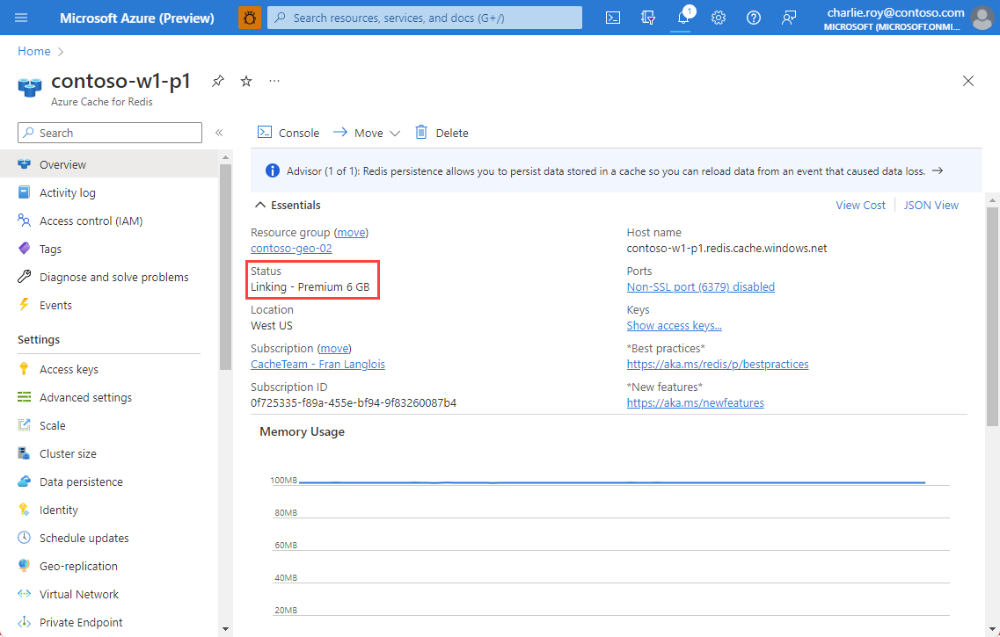
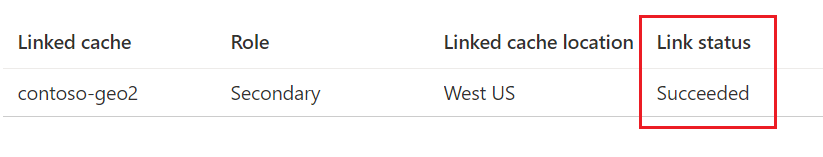
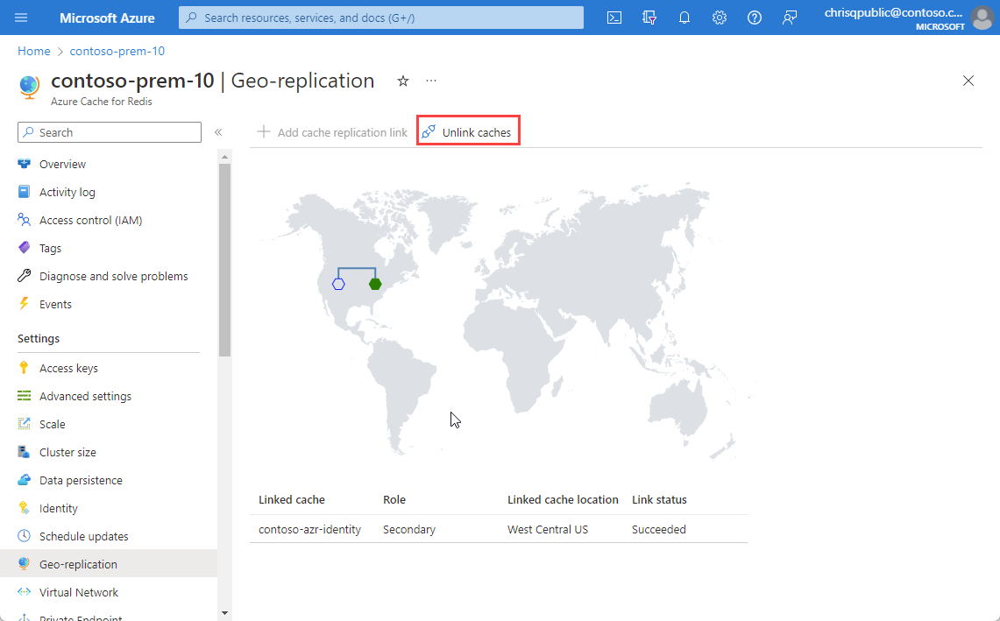

# Move Azure Cache for Redis instances to different regions

In this article, you will learn how to move Azure Cache for Redis resources to a different Azure region. You might move your resources to another region for a number of reasons. For example, to take advantage of a new Azure region, to deploy features or services available in specific regions only, to meet internal policy and governance requirements, or in response to capacity planning requirements.

## Prerequisites 

To configure geo-replication between two caches, the following prerequisites must be met:

- Both caches are [Premium tier](cache-overview.md#service-tiers) caches.
- Both caches are in the same Azure subscription.
- The secondary linked cache is either the same cache size or a larger cache size than the primary linked cache.
- Both caches are created and in a running state.

## Prepare

To move your cache instance to another region, you'll need to [create a second premium cache instance](quickstart-create-redis.md) in the desired region. Once both caches are in a running state, you can set up geo-replication between the two cache instances. 

> [!NOTE]
> Data transfer between Azure regions will be charged at standard [bandwidth rates](https://azure.microsoft.com/pricing/details/bandwidth/).

Some features aren't supported with geo-replication:

- Zone Redundancy isn't supported with geo-replication.
- Persistence isn't supported with geo-replication.
- Clustering is supported if both caches have clustering enabled and have the same number of shards.
- Caches in the same VNET are supported.
- Caches in different VNETs are supported with caveats. See [Can I use geo-replication with my caches in a VNET?](#can-i-use-geo-replication-with-my-caches-in-a-vnet) for more information.

After geo-replication is configured, the following restrictions apply to your linked cache pair:

- The secondary linked cache is read-only; you can read from it, but you can't write any data to it. If you choose to read from the Geo-Secondary instance, it is important to note that whenever a full data sync is happening between the Geo-Primary and the Geo-Secondary (happens when either Geo-Primary or Geo-Secondary is updated and on some reboot scenarios as well), the Geo-Secondary instance will throw errors (stating that a full data sync is in progress) on any Redis operation against it until the full data sync between Geo-Primary and Geo-Secondary is complete. Applications reading from Geo-Secondary should be built to fall back to the Geo-Primary whenever the Geo-Secondary is throwing such errors.
- Any data that was in the secondary linked cache before the link was added is removed. If the geo-replication is later removed however, the replicated data remains in the secondary linked cache.
- You can't [scale](cache-how-to-scale.md) either cache while the caches are linked.
- You can't [change the number of shards](cache-how-to-premium-clustering.md) if the cache has clustering enabled.
- You can't enable persistence on either cache.
- You can [Export](cache-how-to-import-export-data.md#export) from either cache.
- You can't [Import](cache-how-to-import-export-data.md#import) into the secondary linked cache.
- You can't delete either linked cache, or the resource group that contains them, until you unlink the caches. For more information, see [Why did the operation fail when I tried to delete my linked cache?](#why-did-the-operation-fail-when-i-tried-to-delete-my-linked-cache)
- If the caches are in different regions, network egress costs apply to the data moved across regions. For more information, see [How much does it cost to replicate my data across Azure regions?](#how-much-does-it-cost-to-replicate-my-data-across-azure-regions)
- Automatic failover doesn't occur between the primary and secondary linked cache. For more information and information on how to failover a client application, see [How does failing over to the secondary linked cache work?](#how-does-failing-over-to-the-secondary-linked-cache-work)

## Move

1. To link two caches together for geo-replication, fist click **Geo-replication** from the Resource menu of the cache that you intend to be the primary linked cache. Next, click **Add cache replication link** from **Geo-replication** on the left.

    

1. Select the name of your intended secondary cache from the **Compatible caches** list. If your secondary cache isn't displayed in the list, verify that the [Geo-replication prerequisites](#geo-replication-prerequisites) for the secondary cache are met. To filter the caches by region, select the region in the map to display only those caches in the **Compatible caches** list.

    

    You can also start the linking process or view details about the secondary cache by using the context menu.

    

1. Select **Link** to link the two caches together and begin the replication process.

    

## Verify

1. You can view the progress of the replication process using **Geo-replication** on the left.

    

    You can also view the linking status on the left, using **Overview**, for both the primary and secondary caches.

    

    Once the replication process is complete, the **Link status** changes to **Succeeded**.

    

    The primary linked cache remains available for use during the linking process. The secondary linked cache isn't available until the linking process completes.

## Clean up source resources 

Once your new cache in the targeted region is populated with all necessary data, you can remove the link between the two caches and delete the original instance.

1. To remove the link between two caches and stop geo-replication, click **Unlink caches** from the **Geo-replication** on the left .

    

    When the unlinking process completes, the secondary cache is available for both reads and writes.

>[!NOTE]
>When the geo-replication link is removed, the replicated data from the primary linked cache remains in the secondary cache.
>
>

1. Delete the original instance.

## Next steps
* To learn more about geo-replication, see our [geo-replication FAQ](cache-how-to-geo-replication#geo-replication-faq)
* To learn more about our offerings, see [Azure Cache for Redis service tiers](cache-overview.md#service-tiers)

