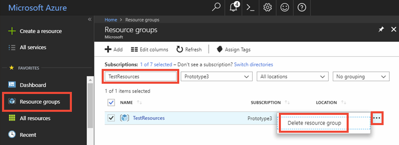

# Quickstart: Use Azure Cache for Redis with Node.js

In this quickstart, you incorporate Azure Cache for Redis into a Node.js app to have access to a secure, dedicated cache that is accessible from any application within Azure.

## Prerequisites

- Azure subscription - [create one for free](https://azure.microsoft.com/free/)
- [node_redis](https://github.com/mranney/node_redis), which you can install with the command `npm install redis`. 

For examples of using other Node.js clients, see the individual documentation for the Node.js clients listed at [Node.js Redis clients](https://redis.io/clients#nodejs).

## Create a cache
[!INCLUDE [redis-cache-create](../../includes/redis-cache-create.md)]

[!INCLUDE [redis-cache-access-keys](../../includes/redis-cache-access-keys.md)]


Add environment variables for your **HOST NAME** and **Primary** access key. You will use these variables from your code instead of including the sensitive information directly in your code.

```
set REDISCACHEHOSTNAME=contosoCache.redis.cache.windows.net
set REDISCACHEKEY=XXXXXXXXXXXXXXXXXXXXXXXXXXXXXXXXXXXXXXXXXXXX
```

## Connect to the cache

The latest builds of [node_redis](https://github.com/mranney/node_redis) provide support for connecting to Azure Cache for Redis using TLS. The following example shows how to connect to Azure Cache for Redis using the TLS endpoint of 6380. 

```js
var redis = require("redis");

// Add your cache name and access key.
var client = redis.createClient(6380, process.env.REDISCACHEHOSTNAME,
    {auth_pass: process.env.REDISCACHEKEY, tls: {servername: process.env.REDISCACHEHOSTNAME}});
```

Don't create a new connections for each operation in your code. Instead, reuse connections as much as possible. 

## Create a new Node.js app

Create a new script file named *redistest.js*. Use the command `npm install redis bluebird` to install required packages.

Add the following example JavaScript to the file. This code shows you how to connect to an Azure Cache for Redis instance using the cache host name and key environment variables. The code also stores and retrieves a string value in the cache. The `PING` and `CLIENT LIST` commands are also executed. For more examples of using Redis with the [node_redis](https://github.com/mranney/node_redis) client, see [https://redis.js.org/](https://redis.js.org/).

```js
var redis = require("redis");
var bluebird = require("bluebird");

// Convert Redis client API to use promises, to make it usable with async/await syntax
bluebird.promisifyAll(redis.RedisClient.prototype);
bluebird.promisifyAll(redis.Multi.prototype);

async function testCache() {

    // Connect to the Azure Cache for Redis over the TLS port using the key.
    var cacheConnection = redis.createClient(6380, process.env.REDISCACHEHOSTNAME, 
        {auth_pass: process.env.REDISCACHEKEY, tls: {servername: process.env.REDISCACHEHOSTNAME}});
        
    // Perform cache operations using the cache connection object...

    // Simple PING command
    console.log("\nCache command: PING");
    console.log("Cache response : " + await cacheConnection.pingAsync());

    // Simple get and put of integral data types into the cache
    console.log("\nCache command: GET Message");
    console.log("Cache response : " + await cacheConnection.getAsync("Message"));    

    console.log("\nCache command: SET Message");
    console.log("Cache response : " + await cacheConnection.setAsync("Message",
        "Hello! The cache is working from Node.js!"));    

    // Demonstrate "SET Message" executed as expected...
    console.log("\nCache command: GET Message");
    console.log("Cache response : " + await cacheConnection.getAsync("Message"));    

    // Get the client list, useful to see if connection list is growing...
    console.log("\nCache command: CLIENT LIST");
    console.log("Cache response : " + await cacheConnection.clientAsync("LIST"));    
}

testCache();
```

Run the script with Node.js.

```
node redistest.js
```

In the example below, you can see the `Message` key previously had a cached value, which was set using the Redis Console in the Azure portal. The app updated that cached value. The app also executed the `PING` and `CLIENT LIST` commands.


## Clean up resources

If you will be continuing to the next tutorial, you can keep the resources created in this quickstart and reuse them.

Otherwise, if you are finished with the quickstart sample application, you can delete the Azure resources created in this quickstart to avoid charges. 

> [!IMPORTANT]
> Deleting a resource group is irreversible and that the resource group and all the resources in it are permanently deleted. Make sure that you do not accidentally delete the wrong resource group or resources. If you created the resources for hosting this sample inside an existing resource group that contains resources you want to keep, you can delete each resource individually from their respective blades instead of deleting the resource group.
>

Sign in to the [Azure portal](https://portal.azure.com) and select **Resource groups**.

In the **Filter by name** text box, enter the name of your resource group. The instructions for this article used a resource group named *TestResources*. On your resource group in the result list, select **...** then **Delete resource group**.



You will be asked to confirm the deletion of the resource group. Enter the name of your resource group to confirm, and select **Delete**.

After a few moments, the resource group and all of its contained resources are deleted.

## Next steps

In this quickstart, you learned how to use Azure Cache for Redis from a Node.js application. Continue to the next quickstart to use Azure Cache for Redis with an ASP.NET web app.

> [!div class="nextstepaction"]
> [Create an ASP.NET web app that uses an Azure Cache for Redis.](./cache-web-app-howto.md)
