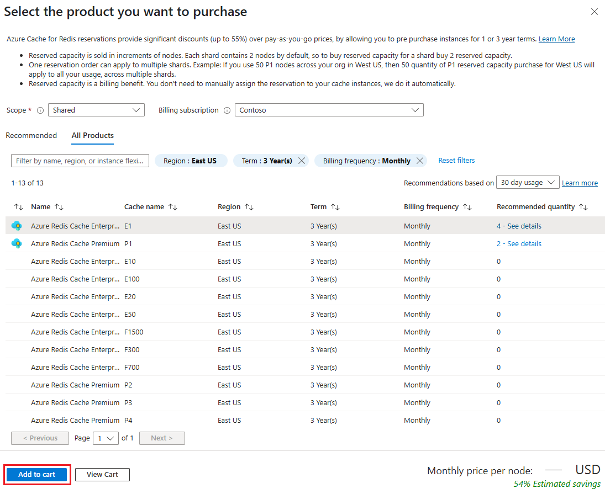

# Prepay for Azure Cache for Redis compute resources with reserved capacity

Azure Cache for Redis now helps you save money by prepaying for compute resources compared to pay-as-you-go prices. With Azure Cache for Redis reserved capacity, you make an upfront commitment on cache for a one or three year period to get a significant discount on the compute costs. To purchase Azure Cache for Redis reserved capacity, you need to specify the Azure region, service tier, and term.

You do not need to assign the reservation to specific Azure Cache for Redis instances. An already running Azure Cache for Redis or ones that are newly deployed will automatically get the benefit of reserved pricing, up to the reserved cache size. By purchasing a reservation, you are pre-paying for the compute costs for a period of one or three years. As soon as you buy a reservation, the Azure Cache for Redis compute charges that match the reservation attributes are no longer charged at the pay-as-you go rates. A reservation does not cover networking or storage charges associated with the cache. At the end of the reservation term, the billing benefit expires and the Azure Cache for Redis is billed at the pay-as-you go price. Reservations do not auto-renew. For pricing information, see the [Azure Cache for Redis reserved capacity offering](https://azure.microsoft.com/pricing/details/cache).

You can buy Azure Cache for Redis reserved capacity in the [Azure portal](https://portal.azure.com/). To buy the reserved capacity:

* You must be in the owner role for at least one Enterprise or individual subscription with pay-as-you-go rates.
* For Enterprise subscriptions, **Add Reserved Instances** must be enabled in the [EA portal](https://ea.azure.com/). Or, if that setting is disabled, you must be an EA Admin on the subscription.
* For Cloud Solution Provider (CSP) program, only the admin agents or sales agents can purchase Azure Cache for Redis reserved capacity.

For the details on how enterprise customers and Pay-As-You-Go customers are charged for reservation purchases, see [understand Azure reservation usage for your Enterprise enrollment](https://docs.microsoft.com/azure/billing/billing-understand-reserved-instance-usage-ea) and [understand Azure reservation usage for your Pay-As-You-Go subscription](https://docs.microsoft.com/azure/billing/billing-understand-reserved-instance-usage).

## Determine the right cache size before purchase

The size of reservation should be based on the total amount of compute used by the existing or soon-to-be-deployed cache within a specific region and using the same service tier.

For example, let's suppose that you are running one general purpose, Gen5 – 32 vCore cache, and two memory optimized, Gen5 – 16 vCore caches. Further, let's supposed that you plan to deploy within the next month an additional general purpose, Gen5 – 32 vCore database server, and one memory optimized, Gen5 – 16 vCore database server. Let's suppose that you know that you will need these resources for at least 1 year. In this case, you should purchase a 64 (2x32) vCores, 1 year reservation for single database general purpose - Gen5 and a 48 (2x16 + 16) vCore 1 year reservation for single database memory optimized - Gen5

## Buy Azure Cache for Redis reserved capacity

1. Sign in to the [Azure portal](https://portal.azure.com/).
2. Select **All services** > **Reservations**.
3. Select **Add** and then in the Purchase reservations pane, select **Azure Cache for Redis** to purchase a new reservation for your caches.
4. Fill-in the required fields. Existing or new databases that match the attributes you select qualify to get the reserved capacity discount. The actual number of your Azure Cache for Redis instances that get the discount depend on the scope and quantity selected.

The following table describes required fields.

| Field | Description |
| :------------ | :------- |
| Subscription   | The subscription used to pay for the Azure Cache for Redis reserved capacity reservation. The payment method on the subscription is charged the upfront costs for the Azure Cache for Redis reserved capacity reservation. The subscription type must be an enterprise agreement (offer numbers: MS-AZR-0017P or MS-AZR-0148P) or an individual agreement with pay-as-you-go pricing (offer numbers: MS-AZR-0003P or MS-AZR-0023P). For an enterprise subscription, the charges are deducted from the enrollment's monetary commitment balance or charged as overage. For an individual subscription with pay-as-you-go pricing, the charges are billed to the credit card or invoice payment method on the subscription.
| Scope | The reservation’s scope can cover one subscription or multiple subscriptions (shared scope). If you select:    **Shared**, the reservation discount is applied to Azure Cache for Redis instances running in any subscriptions within your billing context. For enterprise customers, the shared scope is the enrollment and includes all subscriptions within the enrollment. For Pay-As-You-Go customers, the shared scope is all Pay-As-You-Go subscriptions created by the account administrator.   **Single subscription**, the reservation discount is applied to Azure Cache for Redis instances in this subscription.    **Single resource group**, the reservation discount is applied to Azure Cache for Redis instances in the selected subscription and the selected resource group within that subscription.
| Region | The Azure region that’s covered by the Azure Cache for Redis reserved capacity reservation.
| Pricing tier | The service tier for the Azure Cache for Redis servers.
| Term | One year or three years
| Quantity | The amount of compute resources being purchased within the Azure Cache for Redis reserved capacity reservation. The quantity is a number of caches in the selected Azure region and service tier that are being reserved and will get the billing discount. For example, if you are running or planning to run an Azure Cache for Redis servers with the total cache capacity of 26 GB in the East US region, then you would specify quantity as 26 to maximize the benefit for all caches.

## Cancel, exchange, or refund reservations

You can cancel, exchange, or refund reservations with certain limitations. For more information, see [Self-service exchanges and refunds for Azure Reservations](https://docs.microsoft.com/azure/billing/billing-azure-reservations-self-service-exchange-and-refund).

## Cache size flexibility

Cache size flexibility helps you scale up or down within a service tier and region, without losing the reserved capacity benefit.

## Need help? Contact us

If you have questions or need help, [create a support request](https://portal.azure.com/#blade/Microsoft_Azure_Support/HelpAndSupportBlade/newsupportrequest).

## Next steps

The reservation discount is applied automatically to the Azure Cache for Redis instances that match the reservation scope and attributes. You can update the scope of the reservation through the Azure portal, PowerShell, Azure CLI, or the API.

*  To learn how reserved capacity discounts are applied to Azure Cache for Redis, see [Understand the Azure reservation discount](../cost-management-billing/reservations/understand-azure-cache-for-redis-reservation-charges.md)

* To learn more about Azure Reservations, see the following articles:

    * [What are Azure Reservations?](https://docs.microsoft.com/azure/billing/billing-save-compute-costs-reservations)
    * [Manage Azure Reservations](https://docs.microsoft.com/azure/billing/billing-manage-reserved-vm-instance)
    * [Understand Azure Reservations discount](https://docs.microsoft.com/azure/billing/billing-understand-reservation-charges)
    * [Understand reservation usage for your Pay-As-You-Go subscription](https://docs.microsoft.com/azure/billing/billing-understand-reservation-charges-mysql)
    * [Understand reservation usage for your Enterprise enrollment](https://docs.microsoft.com/azure/billing/billing-understand-reserved-instance-usage-ea)
    * [Azure Reservations in Partner Center Cloud Solution Provider (CSP) program](https://docs.microsoft.com/partner-center/azure-reservations)

