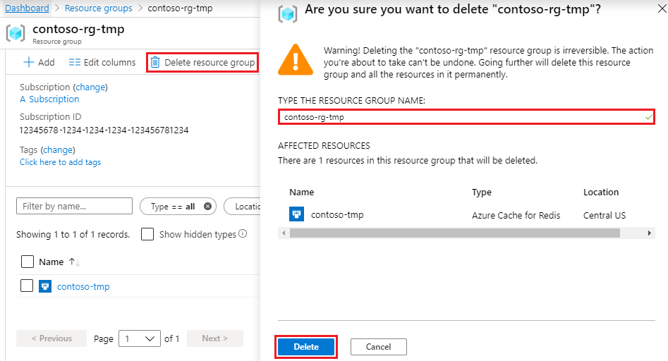

# Quickstart: Use Azure Cache for Redis with Rust

In this article, you'll learn how to use the [Rust programming language](https://www.rust-lang.org/) to interact with [Azure Cache for Redis](./cache-overview.md). You'll also learn about commonly used Redis data structures: 

* [String](https://redis.io/topics/data-types-intro#redis-strings) 
* [Hash](https://redis.io/topics/data-types-intro#redis-hashes) 
* [List](https://redis.io/topics/data-types-intro#redis-lists) 

You'll use the [redis-rs](https://github.com/mitsuhiko/redis-rs) library for Redis in this sample. This client exposes both high-level and low-level APIs, and you'll see both these styles in action.

## Skip to the code on GitHub

If you want to skip straight to the code, see the [Rust quickstart](https://github.com/Azure-Samples/azure-redis-cache-rust-quickstart/) on GitHub.

## Prerequisites

- Azure subscription - [create one for free](https://azure.microsoft.com/free/)
- [Rust](https://www.rust-lang.org/tools/install) (version 1.39 or above)
- [Git](https://git-scm.com/downloads)

## Create an Azure Cache for Redis instance
[!INCLUDE [redis-cache-create](includes/redis-cache-create.md)]

[!INCLUDE [redis-cache-create](includes/redis-cache-access-keys.md)]

## Review the code (optional)

If you're interested in learning how the code works, you can review the following snippets. Otherwise, feel free to skip ahead to [Run the application](#run-the-application).

The `connect` function is used to establish a connection to Azure Cache for Redis. It expects host name and the password (Access Key) to be passed in via environment variables `REDIS_HOSTNAME` and `REDIS_PASSWORD` respectively. The format for the connection URL is `rediss://<username>:<password>@<hostname>` - Azure Cache for Redis only accepts secure connections with [TLS 1.2 as the minimum required version](cache-remove-tls-10-11.md).

The call to [redis::Client::open](https://docs.rs/redis/0.19.0/redis/struct.Client.html#method.open) does basic validation while [get_connection()](https://docs.rs/redis/0.19.0/redis/struct.Client.html#method.get_connection) actually starts the connection. The program stops if the connectivity fails for any reason. For example, one reason might be an incorrect password.

```rust
fn connect() -> redis::Connection {
    let redis_host_name =
        env::var("REDIS_HOSTNAME").expect("missing environment variable REDIS_HOSTNAME");
    let redis_password =
        env::var("REDIS_PASSWORD").expect("missing environment variable REDIS_PASSWORD");
    let redis_conn_url = format!("rediss://:{}@{}", redis_password, redis_host_name);

    redis::Client::open(redis_conn_url)
        .expect("invalid connection URL")
        .get_connection()
        .expect("failed to connect to redis")
}
```

The function `basics` covers the [SET](https://redis.io/commands/set), [GET](https://redis.io/commands/get), and [INCR](https://redis.io/commands/incr) commands. 

The low-level API is used for `SET` and `GET`, which sets and retrieves the value for a key named `foo`. 

The `INCRBY` command is executed using a high-level API that is, [incr](https://docs.rs/redis/0.19.0/redis/trait.Commands.html#method.incr) increments the value of a key (named `counter`) by `2` followed by a call to [get](https://docs.rs/redis/0.19.0/redis/trait.Commands.html#method.get) to retrieve it.

```rust
fn basics() {
    let mut conn = connect();
    let _: () = redis::cmd("SET")
        .arg("foo")
        .arg("bar")
        .query(&mut conn)
        .expect("failed to execute SET for 'foo'");

    let bar: String = redis::cmd("GET")
        .arg("foo")
        .query(&mut conn)
        .expect("failed to execute GET for 'foo'");
    println!("value for 'foo' = {}", bar);

    let _: () = conn
        .incr("counter", 2)
        .expect("failed to execute INCR for 'counter'");
    let val: i32 = conn
        .get("counter")
        .expect("failed to execute GET for 'counter'");
    println!("counter = {}", val);
}
```

The below code snippet demonstrates the functionality of a Redis `HASH` data structure. [HSET](https://redis.io/commands/hset) is invoked using the low-level API to store information (`name`, `version`, `repo`) about Redis drivers (clients). For example, details for the Rust driver (one being used in this sample code!) is captured in form of a [BTreeMap](https://doc.rust-lang.org/std/collections/struct.BTreeMap.html) and then passed on to the low-level API. It's then retrieved using [HGETALL](https://redis.io/commands/hgetall).

`HSET` can also be executed using a high-level API using [hset_multiple](https://docs.rs/redis/0.19.0/redis/trait.Commands.html#method.hset_multiple) that accepts an array of tuples. [hget](https://docs.rs/redis/0.19.0/redis/trait.Commands.html#method.hget) is then executed to fetch the value for a single attribute (the `repo` in this case).

```rust
fn hash() {
    let mut conn = connect();

    let mut driver: BTreeMap<String, String> = BTreeMap::new();
    let prefix = "redis-driver";
    driver.insert(String::from("name"), String::from("redis-rs"));
    driver.insert(String::from("version"), String::from("0.19.0"));
    driver.insert(
        String::from("repo"),
        String::from("https://github.com/mitsuhiko/redis-rs"),
    );

    let _: () = redis::cmd("HSET")
        .arg(format!("{}:{}", prefix, "rust"))
        .arg(driver)
        .query(&mut conn)
        .expect("failed to execute HSET");

    let info: BTreeMap<String, String> = redis::cmd("HGETALL")
        .arg(format!("{}:{}", prefix, "rust"))
        .query(&mut conn)
        .expect("failed to execute HGETALL");
    println!("info for rust redis driver: {:?}", info);

    let _: () = conn
        .hset_multiple(
            format!("{}:{}", prefix, "go"),
            &[
                ("name", "go-redis"),
                ("version", "8.4.6"),
                ("repo", "https://github.com/go-redis/redis"),
            ],
        )
        .expect("failed to execute HSET");

    let repo_name: String = conn
        .hget(format!("{}:{}", prefix, "go"), "repo")
        .expect("HGET failed");
    println!("go redis driver repo name: {:?}", repo_name);
}
```

In the function below, you can see how to use a `LIST` data structure. [LPUSH](https://redis.io/commands/lpush) is executed (with the low-level API) to add an entry to the list and the high-level [lpop](https://docs.rs/redis/0.19.0/redis/trait.Commands.html#method.lpop) method is used to retrieve that from the list. Then, the [rpush](https://docs.rs/redis/0.19.0/redis/trait.Commands.html#method.rpush) method is used to add a couple of entries to the list, which are then fetched using the low-level [lrange](https://docs.rs/redis/0.19.0/redis/trait.Commands.html#method.lrange) method.

```rust
fn list() {
    let mut conn = connect();
    let list_name = "items";

    let _: () = redis::cmd("LPUSH")
        .arg(list_name)
        .arg("item-1")
        .query(&mut conn)
        .expect("failed to execute LPUSH for 'items'");

    let item: String = conn
        .lpop(list_name)
        .expect("failed to execute LPOP for 'items'");
    println!("first item: {}", item);

    let _: () = conn.rpush(list_name, "item-2").expect("RPUSH failed");
    let _: () = conn.rpush(list_name, "item-3").expect("RPUSH failed");

    let len: isize = conn
        .llen(list_name)
        .expect("failed to execute LLEN for 'items'");
    println!("no. of items in list = {}", len);

    let items: Vec<String> = conn
        .lrange(list_name, 0, len - 1)
        .expect("failed to execute LRANGE for 'items'");

    println!("listing items in list");
    for item in items {
        println!("item: {}", item)
    }
}
```

Here you can see some of the `SET` operations. The [sadd](https://docs.rs/redis/0.19.0/redis/trait.Commands.html#method.sadd) (high-level API) method is used to add couple of entries to a `SET` named `users`. [SISMEMBER](https://redis.io/commands/hset) is then executed (low-level API) to check whether `user1` exists. Finally, [smembers](https://docs.rs/redis/0.19.0/redis/trait.Commands.html#method.smembers) is used to fetch and iterate over all the set entries in the form of a Vector ([Vec\<String\>](https://doc.rust-lang.org/std/vec/struct.Vec.html)).

```rust
fn set() {
    let mut conn = connect();
    let set_name = "users";

    let _: () = conn
        .sadd(set_name, "user1")
        .expect("failed to execute SADD for 'users'");
    let _: () = conn
        .sadd(set_name, "user2")
        .expect("failed to execute SADD for 'users'");

    let ismember: bool = redis::cmd("SISMEMBER")
        .arg(set_name)
        .arg("user1")
        .query(&mut conn)
        .expect("failed to execute SISMEMBER for 'users'");
    println!("does user1 exist in the set? {}", ismember);

    let users: Vec<String> = conn.smembers(set_name).expect("failed to execute SMEMBERS");
    println!("listing users in set");

    for user in users {
        println!("user: {}", user)
    }
}
```

`sorted_set` function below demonstrates the Sorted Set data structure. [ZADD](https://redis.io/commands/zadd) is invoked with the low-level API to add a random integer score for a player (`player-1`). Next, the [zadd](https://docs.rs/redis/0.19.0/redis/trait.Commands.html#method.zadd) method (high-level API) is used to add more players (`player-2` to `player-5`) and their respective (randomly generated) scores. The number of entries in the sorted set is determined using [ZCARD](https://redis.io/commands/zcard). That's used as the limit to the [ZRANGE](https://redis.io/commands/zrange) command (invoked with the low-level API) to list out the players with their scores in ascending order.

```rust
fn sorted_set() {
    let mut conn = connect();
    let sorted_set = "leaderboard";

    let _: () = redis::cmd("ZADD")
        .arg(sorted_set)
        .arg(rand::thread_rng().gen_range(1..10))
        .arg("player-1")
        .query(&mut conn)
        .expect("failed to execute ZADD for 'leaderboard'");

    for num in 2..=5 {
        let _: () = conn
            .zadd(
                sorted_set,
                String::from("player-") + &num.to_string(),
                rand::thread_rng().gen_range(1..10),
            )
            .expect("failed to execute ZADD for 'leaderboard'");
    }

    let count: isize = conn
        .zcard(sorted_set)
        .expect("failed to execute ZCARD for 'leaderboard'");

    let leaderboard: Vec<(String, isize)> = conn
        .zrange_withscores(sorted_set, 0, count - 1)
        .expect("ZRANGE failed");

    println!("listing players and scores in ascending order");

    for item in leaderboard {
        println!("{} = {}", item.0, item.1)
    }
}
```

## Clone the sample application

Start by cloning the application from GitHub.

1. Open a command prompt and create a new folder named `git-samples`.

    ```bash
    md "C:\git-samples"
    ```

1. Open a git terminal window, such as git bash. Use the `cd` to change into the new folder where you'll be cloning the sample app.

    ```bash
    cd "C:\git-samples"
    ```

1. Run the following command to clone the sample repository. This command creates a copy of the sample app on your computer.

    ```bash
    git clone https://github.com/Azure-Samples/azure-redis-cache-rust-quickstart.git
    ```

## Run the application

The application accepts connectivity and credentials in the form of environment variables. 

1. Fetch the **Host name** and **Access Keys** (available via Access Keys) for Azure Cache for Redis instance in the [Azure portal](https://portal.azure.com/).

1. Set them to the respective environment variables:

    ```shell
    set REDIS_HOSTNAME=<Host name>:<port> (e.g. <name of cache>.redis.cache.windows.net:6380)
    set REDIS_PASSWORD=<Primary Access Key>
    ```

1. In the terminal window, change to the correct folder. For example:

    ```shell
    cd "C:\git-samples\azure-redis-cache-rust-quickstart"
    ```

1. In the terminal, run the following command to start the application.

    ```shell
    cargo run
    ```
    
    You'll see this output:
    
    ```bash
    ******* Running SET, GET, INCR commands *******
    value for 'foo' = bar
    counter = 2
    ******* Running HASH commands *******
    info for rust redis driver: {"name": "redis-rs", "repo": "https://github.com/mitsuhiko/redis-rs", "version": "0.19.0"}
    go redis driver repo name: "https://github.com/go-redis/redis"
    ******* Running LIST commands *******
    first item: item-1
    no. of items in list = 2
    listing items in list
    item: item-2
    item: item-3
    ******* Running SET commands *******
    does user1 exist in the set? true
    listing users in set
    user: user2
    user: user1
    user: user3
    ******* Running SORTED SET commands *******
    listing players and scores
    player-2 = 2
    player-4 = 4
    player-1 = 7
    player-5 = 6
    player-3 = 8
    ```
    
    If you want to run a specific function, comment out other functions in the `main` function:
    
    ```rust
    fn main() {
        basics();
        hash();
        list();
        set();
        sorted_set();
    }
    ```

## Clean up resources

You can delete the resource group and resources when you're finished with them. By deleting what you created in this quickstart, you avoid being charged for them.

> [!IMPORTANT]
> Deleting a resource group is irreversible, and the resource group and all the resources in it are permanently deleted. If you created your Azure Cache for Redis instance in an existing resource group that you want to keep, you can delete just the cache by selecting **Delete** from the cache **Overview** page. 

To delete the resource group and its Redis Cache for Azure instance:

1. From the [Azure portal](https://portal.azure.com), search for and select **Resource groups**.
1. In the **Filter by name** text box, enter the name of the resource group that contains your cache instance. Then, select it from the search results. 
1. On your resource group page, select **Delete resource group**.
1. Type the resource group name, and then select **Delete**.
   
   

## Next steps

In this quickstart, you learned how to use the Rust driver for Redis to connect and execute operations in Azure Cache for Redis.

> [!div class="nextstepaction"]
> [Create a simple ASP.NET web app that uses an Azure Cache for Redis.](./cache-web-app-howto.md)
