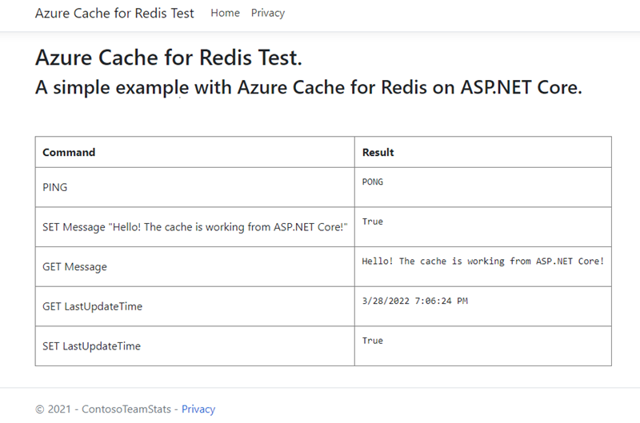

# Quickstart: Use Azure Cache for Redis with an ASP.NET Core web app 

In this quickstart, you incorporate Azure Cache for Redis into an ASP.NET Core web application that connects to Azure Cache for Redis to store and retrieve data from the cache.

## Skip to the code on GitHub

If you want to skip straight to the code, see the [ASP.NET Core quickstart](https://github.com/Azure-Samples/azure-cache-redis-samples/tree/main/quickstart/aspnet-core) on GitHub.

## Prerequisites

- Azure subscription - [create one for free](https://azure.microsoft.com/free/)
- [.NET Core SDK](https://dotnet.microsoft.com/download)

## Create a cache

[!INCLUDE [redis-cache-create](../../includes/redis-cache-create.md)]

[!INCLUDE [redis-cache-access-keys](../../includes/redis-cache-access-keys.md)]

Make a note of the **HOST NAME** and the **Primary** access key. You will use these values later to construct the *CacheConnection* secret.

## Create an ASP.NET Core web app

Open a new command window and execute the following command to create a new ASP.NET Core Web App (Model-View-Controller):

```dotnetcli
dotnet new mvc -o ContosoTeamStats
```

In your command window, change to the new *ContosoTeamStats* project directory.

[!INCLUDE[Add Secret Manager support to an ASP.NET Core project](../../includes/azure-app-configuration-add-secret-manager.md)]

Execute the following command to add the *Microsoft.Extensions.Configuration.UserSecrets* package to the project:

```dotnetcli
dotnet add package Microsoft.Extensions.Configuration.UserSecrets
```

Execute the following command to restore your packages:

```dotnetcli
dotnet restore
```

In your command window, execute the following command to store a new secret named *CacheConnection*, after replacing the placeholders (including angle brackets) for your cache name and primary access key:

```dotnetcli
dotnet user-secrets set CacheConnection "<cache name>.redis.cache.windows.net,abortConnect=false,ssl=true,allowAdmin=true,password=<primary-access-key>"
```

## Configure the cache client

In this section, you will configure the application to use the [StackExchange.Redis](https://github.com/StackExchange/StackExchange.Redis) client for .NET.

In your command window, execute the following command in the *ContosoTeamStats* project directory:

```dotnetcli
dotnet add package StackExchange.Redis
```

Once the installation is completed, the *StackExchange.Redis* cache client is available to use with your project.

## Update the HomeController and Layout

Add the following `using` statements to *Controllers\HomeController.cs*:

```csharp
using System.Net.Sockets;
using System.Text;
using System.Threading;

using Microsoft.Extensions.Configuration;

using StackExchange.Redis;
```

Replace:

```csharp
private readonly ILogger<HomeController> _logger;

public HomeController(ILogger<HomeController> logger)
{
    _logger = logger;
}
```

with:

```csharp
private readonly ILogger<HomeController> _logger;
private static IConfiguration Configuration { get; set; }

public HomeController(ILogger<HomeController> logger, IConfiguration configuration)
{
    _logger = logger;
    if (Configuration == null)
        Configuration = configuration;
}
```

Add the following members to the `HomeController` class to support a new `RedisCache` action that runs some commands against the new cache.

```csharp
public ActionResult RedisCache()
{
    ViewBag.Message = "A simple example with Azure Cache for Redis on ASP.NET Core.";

    IDatabase cache = GetDatabase();

    // Perform cache operations using the cache object...

    // Simple PING command
    ViewBag.command1 = "PING";
    ViewBag.command1Result = cache.Execute(ViewBag.command1).ToString();

    // Simple get and put of integral data types into the cache
    ViewBag.command2 = "GET Message";
    ViewBag.command2Result = cache.StringGet("Message").ToString();

    ViewBag.command3 = "SET Message \"Hello! The cache is working from ASP.NET Core!\"";
    ViewBag.command3Result = cache.StringSet("Message", "Hello! The cache is working from ASP.NET Core!").ToString();

    // Demonstrate "SET Message" executed as expected...
    ViewBag.command4 = "GET Message";
    ViewBag.command4Result = cache.StringGet("Message").ToString();

    // Get the client list, useful to see if connection list is growing...
    // Note that this requires allowAdmin=true in the connection string
    ViewBag.command5 = "CLIENT LIST";
    StringBuilder sb = new StringBuilder();
    var endpoint = (System.Net.DnsEndPoint)GetEndPoints()[0];
    IServer server = GetServer(endpoint.Host, endpoint.Port);
    ClientInfo[] clients = server.ClientList();

    sb.AppendLine("Cache response :");
    foreach (ClientInfo client in clients)
    {
        sb.AppendLine(client.Raw);
    }

    ViewBag.command5Result = sb.ToString();

    return View();
}

private const string SecretName = "CacheConnection";

private static long lastReconnectTicks = DateTimeOffset.MinValue.UtcTicks;
private static DateTimeOffset firstErrorTime = DateTimeOffset.MinValue;
private static DateTimeOffset previousErrorTime = DateTimeOffset.MinValue;

private static readonly object reconnectLock = new object();

// In general, let StackExchange.Redis handle most reconnects,
// so limit the frequency of how often ForceReconnect() will
// actually reconnect.
public static TimeSpan ReconnectMinFrequency => TimeSpan.FromSeconds(60);

// If errors continue for longer than the below threshold, then the
// multiplexer seems to not be reconnecting, so ForceReconnect() will
// re-create the multiplexer.
public static TimeSpan ReconnectErrorThreshold => TimeSpan.FromSeconds(30);

public static int RetryMaxAttempts => 5;

private static Lazy<ConnectionMultiplexer> lazyConnection = CreateConnection();

public static ConnectionMultiplexer Connection
{
    get
    {
        return lazyConnection.Value;
    }
}

private static Lazy<ConnectionMultiplexer> CreateConnection()
{
    return new Lazy<ConnectionMultiplexer>(() =>
    {
        string cacheConnection = Configuration[SecretName];
        return ConnectionMultiplexer.Connect(cacheConnection);
    });
}

private static void CloseConnection(Lazy<ConnectionMultiplexer> oldConnection)
{
    if (oldConnection == null)
        return;

    try
    {
        oldConnection.Value.Close();
    }
    catch (Exception)
    {
        // Example error condition: if accessing oldConnection.Value causes a connection attempt and that fails.
    }
}

/// <summary>
/// Force a new ConnectionMultiplexer to be created.
/// NOTES:
///     1. Users of the ConnectionMultiplexer MUST handle ObjectDisposedExceptions, which can now happen as a result of calling ForceReconnect().
///     2. Don't call ForceReconnect for Timeouts, just for RedisConnectionExceptions or SocketExceptions.
///     3. Call this method every time you see a connection exception. The code will:
///         a. wait to reconnect for at least the "ReconnectErrorThreshold" time of repeated errors before actually reconnecting
///         b. not reconnect more frequently than configured in "ReconnectMinFrequency"
/// </summary>
public static void ForceReconnect()
{
    var utcNow = DateTimeOffset.UtcNow;
    long previousTicks = Interlocked.Read(ref lastReconnectTicks);
    var previousReconnectTime = new DateTimeOffset(previousTicks, TimeSpan.Zero);
    TimeSpan elapsedSinceLastReconnect = utcNow - previousReconnectTime;

    // If multiple threads call ForceReconnect at the same time, we only want to honor one of them.
    if (elapsedSinceLastReconnect < ReconnectMinFrequency)
        return;

    lock (reconnectLock)
    {
        utcNow = DateTimeOffset.UtcNow;
        elapsedSinceLastReconnect = utcNow - previousReconnectTime;

        if (firstErrorTime == DateTimeOffset.MinValue)
        {
            // We haven't seen an error since last reconnect, so set initial values.
            firstErrorTime = utcNow;
            previousErrorTime = utcNow;
            return;
        }

        if (elapsedSinceLastReconnect < ReconnectMinFrequency)
            return; // Some other thread made it through the check and the lock, so nothing to do.

        TimeSpan elapsedSinceFirstError = utcNow - firstErrorTime;
        TimeSpan elapsedSinceMostRecentError = utcNow - previousErrorTime;

        bool shouldReconnect =
            elapsedSinceFirstError >= ReconnectErrorThreshold // Make sure we gave the multiplexer enough time to reconnect on its own if it could.
            && elapsedSinceMostRecentError <= ReconnectErrorThreshold; // Make sure we aren't working on stale data (e.g. if there was a gap in errors, don't reconnect yet).

        // Update the previousErrorTime timestamp to be now (e.g. this reconnect request).
        previousErrorTime = utcNow;

        if (!shouldReconnect)
            return;

        firstErrorTime = DateTimeOffset.MinValue;
        previousErrorTime = DateTimeOffset.MinValue;

        Lazy<ConnectionMultiplexer> oldConnection = lazyConnection;
        CloseConnection(oldConnection);
        lazyConnection = CreateConnection();
        Interlocked.Exchange(ref lastReconnectTicks, utcNow.UtcTicks);
    }
}

// In real applications, consider using a framework such as
// Polly to make it easier to customize the retry approach.
private static T BasicRetry<T>(Func<T> func)
{
    int reconnectRetry = 0;
    int disposedRetry = 0;

    while (true)
    {
        try
        {
            return func();
        }
        catch (Exception ex) when (ex is RedisConnectionException || ex is SocketException)
        {
            reconnectRetry++;
            if (reconnectRetry > RetryMaxAttempts)
                throw;
            ForceReconnect();
        }
        catch (ObjectDisposedException)
        {
            disposedRetry++;
            if (disposedRetry > RetryMaxAttempts)
                throw;
        }
    }
}

public static IDatabase GetDatabase()
{
    return BasicRetry(() => Connection.GetDatabase());
}

public static System.Net.EndPoint[] GetEndPoints()
{
    return BasicRetry(() => Connection.GetEndPoints());
}

public static IServer GetServer(string host, int port)
{
    return BasicRetry(() => Connection.GetServer(host, port));
}
```

Open *Views\Shared\\_Layout.cshtml*.

Replace:

```cshtml
<a class="navbar-brand" asp-area="" asp-controller="Home" asp-action="Index">ContosoTeamStats</a>
```

with:

```cshtml
<a class="navbar-brand" asp-area="" asp-controller="Home" asp-action="RedisCache">Azure Cache for Redis Test</a>
```

## Add a new RedisCache view and update the styles

Create a new file *Views\Home\RedisCache.cshtml* with the following content:

```cshtml
@{
    ViewBag.Title = "Azure Cache for Redis Test";
}

<h2>@ViewBag.Title.</h2>
<h3>@ViewBag.Message</h3>
<br /><br />
<table border="1" cellpadding="10" class="redis-results">
    <tr>
        <th>Command</th>
        <th>Result</th>
    </tr>
    <tr>
        <td>@ViewBag.command1</td>
        <td><pre>@ViewBag.command1Result</pre></td>
    </tr>
    <tr>
        <td>@ViewBag.command2</td>
        <td><pre>@ViewBag.command2Result</pre></td>
    </tr>
    <tr>
        <td>@ViewBag.command3</td>
        <td><pre>@ViewBag.command3Result</pre></td>
    </tr>
    <tr>
        <td>@ViewBag.command4</td>
        <td><pre>@ViewBag.command4Result</pre></td>
    </tr>
    <tr>
        <td>@ViewBag.command5</td>
        <td><pre>@ViewBag.command5Result</pre></td>
    </tr>
</table>
```

Add the following lines to *wwwroot\css\site.css*:

```css
.redis-results pre {
  white-space: pre-wrap;
}
```

## Run the app locally

Execute the following command in your command window to build the app:

```dotnetcli
dotnet build
```

Then run the app with the following command:

```dotnetcli
dotnet run
```

Browse to `https://localhost:5001` in your web browser.

Select **Azure Cache for Redis Test** in the navigation bar of the web page to test cache access.

In the example below, you can see the `Message` key previously had a cached value, which was set using the Redis Console in the Azure portal. The app updated that cached value. The app also executed the `PING` and `CLIENT LIST` commands.



## Clean up resources

If you're continuing to the next tutorial, you can keep the resources that you created in this quickstart and reuse them.

Otherwise, if you're finished with the quickstart sample application, you can delete the Azure resources that you created in this quickstart to avoid charges.

> [!IMPORTANT]
> Deleting a resource group is irreversible. When you delete a resource group, all the resources in it are permanently deleted. Make sure that you do not accidentally delete the wrong resource group or resources. If you created the resources for hosting this sample inside an existing resource group that contains resources you want to keep, you can delete each resource individually on the left instead of deleting the resource group.

### To delete a resource group

1. Sign in to the [Azure portal](https://portal.azure.com), and then select **Resource groups**.

2. In the **Filter by name...** box, type the name of your resource group. The instructions for this article used a resource group named *TestResources*. On your resource group, in the results list, select **...**, and then select **Delete resource group**.

    

You're asked to confirm the deletion of the resource group. Type the name of your resource group to confirm, and then select **Delete**.

After a few moments, the resource group and all of its resources are deleted.

## Next steps

For information on deploying to Azure, see:

> [!div class="nextstepaction"]
> [Tutorial: Build an ASP.NET Core and SQL Database app in Azure App Service](../app-service/tutorial-dotnetcore-sqldb-app.md)

For information about storing the cache connection secret in Azure Key Vault, see:

> [!div class="nextstepaction"]
> [Azure Key Vault configuration provider in ASP.NET Core](/aspnet/core/security/key-vault-configuration)

Want to scale your cache from a lower tier to a higher tier?

> [!div class="nextstepaction"]
> [How to Scale Azure Cache for Redis](./cache-how-to-scale.md)

Want to optimize and save on your cloud spending?

> [!div class="nextstepaction"]
> [Start analyzing costs with Cost Management](../cost-management-billing/costs/quick-acm-cost-analysis.md?WT.mc_id=costmanagementcontent_docsacmhorizontal_-inproduct-learn)