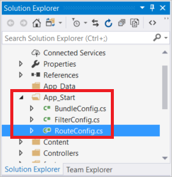
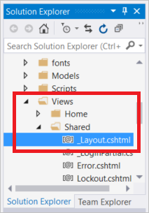
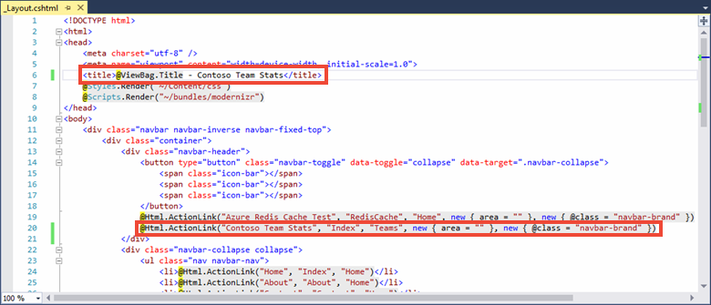
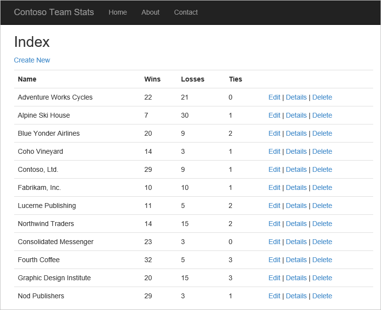
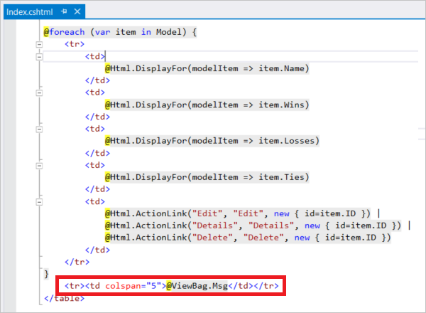
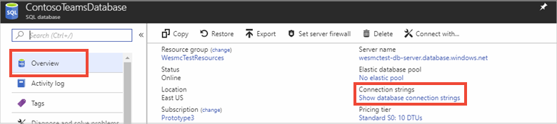
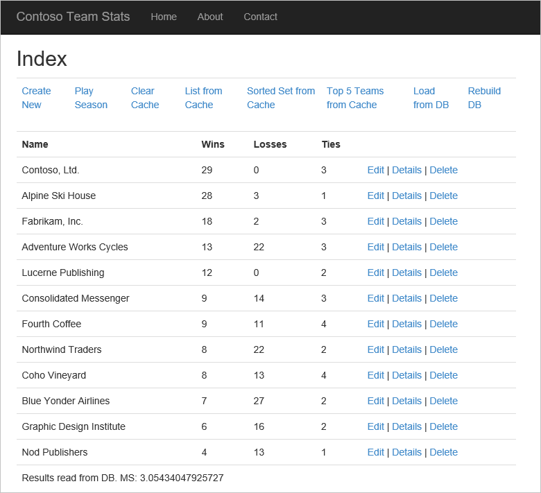
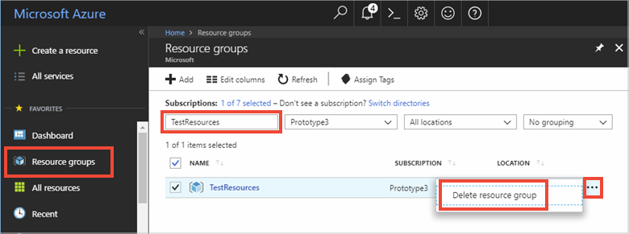

# Tutorial: Create a cache-aside leaderboard on ASP.NET

In this tutorial you will update the *ContosoTeamStats* ASP.NET web app, created in the [ASP.NET quickstart for Azure Cache for Redis](cache-web-app-howto.md), to include a leaderboard that uses the [cache-aside pattern](https://docs.microsoft.com/azure/architecture/patterns/cache-aside) with Azure Cache for Redis. The sample application displays a list of team statistics from a database and demonstrates different ways to use Azure Cache for Redis to store and retrieve data from the cache to improve performance. When you complete the tutorial you have a running web app that reads and writes to a database, optimized with Azure Cache for Redis, and hosted in Azure.

In this tutorial, you learn how to:

> [!div class="checklist"]
> * Improve data throughput and reduce database load by storing and retrieving data using Azure Cache for Redis.
> * Use a Redis sorted set to retrieve the top five teams.
> * Provision the Azure resources for the application using a Resource Manager template.
> * Publish the application to Azure using Visual Studio.

[!INCLUDE [quickstarts-free-trial-note](../../includes/quickstarts-free-trial-note.md)]

## Prerequisites

To complete this tutorial, you must have the following prerequisites:

* This tutorial continues where you left off in [ASP.NET quickstart for Azure Cache for Redis](cache-web-app-howto.md). If you haven't already, follow the quickstart first.
* Install [Visual Studio 2019](https://www.visualstudio.com/downloads/) with the following workloads:
    * ASP.NET and web development
    * Azure Development
    * .NET desktop development with SQL Server Express LocalDB or [SQL Server 2017 Express edition](https://www.microsoft.com/sql-server/sql-server-editions-express).

## Add a leaderboard to the project

In this section of the tutorial, you configure the *ContosoTeamStats* project with a leaderboard that reports the win, loss, and tie statistics for a list of fictional teams.

### Add the Entity Framework to the project

1. In Visual Studio, open the *ContosoTeamStats* Solution that you created in the [ASP.NET quickstart for Azure Cache for Redis](cache-web-app-howto.md).
2. Click **Tools > NuGet Package Manager > Package Manager Console**.
3. Run the following command from the **Package Manager Console** window to install EntityFramework:

    ```powershell
    Install-Package EntityFramework
    ```

For more information about this package, see the [EntityFramework](https://www.nuget.org/packages/EntityFramework/) NuGet page.

### Add the Team model

1. Right-click **Models** in **Solution Explorer**, and choose **Add**, **Class**.

1. Enter `Team` for the class name and click **Add**.

    

1. Replace the `using` statements at the top of the *Team.cs* file with the following `using` statements:

    ```csharp
    using System;
    using System.Collections.Generic;
    using System.Data.Entity;
    using System.Data.Entity.SqlServer;
    ```

1. Replace the definition of the `Team` class with the following code snippet that contains an updated `Team` class definition as well as some other Entity Framework helper classes. This tutorial is using the code first approach with Entity Framework. This approach allows Entity Framework to create the database from your code. For more information on the code first approach to Entity Framework that's used in this tutorial, see [Code first to a new database](/ef/ef6/modeling/code-first/workflows/new-database).

    ```csharp
    public class Team
    {
        public int ID { get; set; }
        public string Name { get; set; }
        public int Wins { get; set; }
        public int Losses { get; set; }
        public int Ties { get; set; }

        static public void PlayGames(IEnumerable<Team> teams)
        {
            // Simple random generation of statistics.
            Random r = new Random();

            foreach (var t in teams)
            {
                t.Wins = r.Next(33);
                t.Losses = r.Next(33);
                t.Ties = r.Next(0, 5);
            }
        }
    }

    public class TeamContext : DbContext
    {
        public TeamContext()
            : base("TeamContext")
        {
        }

        public DbSet<Team> Teams { get; set; }
    }

    public class TeamInitializer : CreateDatabaseIfNotExists<TeamContext>
    {
        protected override void Seed(TeamContext context)
        {
            var teams = new List<Team>
            {
                new Team{Name="Adventure Works Cycles"},
                new Team{Name="Alpine Ski House"},
                new Team{Name="Blue Yonder Airlines"},
                new Team{Name="Coho Vineyard"},
                new Team{Name="Contoso, Ltd."},
                new Team{Name="Fabrikam, Inc."},
                new Team{Name="Lucerne Publishing"},
                new Team{Name="Northwind Traders"},
                new Team{Name="Consolidated Messenger"},
                new Team{Name="Fourth Coffee"},
                new Team{Name="Graphic Design Institute"},
                new Team{Name="Nod Publishers"}
            };

            Team.PlayGames(teams);

            teams.ForEach(t => context.Teams.Add(t));
            context.SaveChanges();
        }
    }

    public class TeamConfiguration : DbConfiguration
    {
        public TeamConfiguration()
        {
            SetExecutionStrategy("System.Data.SqlClient", () => new SqlAzureExecutionStrategy());
        }
    }
    ```

1. In **Solution Explorer**, double-click **Web.config** to open it.

    

1. Add the following `connectionStrings` section inside the `configuration` section. The name of the connection string must match the name of the Entity Framework database context class, which is `TeamContext`.

    This connection string assumes you have met the [Prerequisites](#prerequisites) and installed SQL Server Express LocalDB, which is part of the *.NET desktop development* workload installed with Visual Studio 2019.

    ```xml
    <connectionStrings>
        <add name="TeamContext" connectionString="Data Source=(LocalDB)\MSSQLLocalDB;AttachDbFilename=|DataDirectory|\Teams.mdf;Integrated Security=True" providerName="System.Data.SqlClient" />
    </connectionStrings>
    ```

    The following example shows the new `connectionStrings` section following `configSections` inside the `configuration` section:

    ```xml
    <configuration>
        <configSections>
        <section name="entityFramework" type="System.Data.Entity.Internal.ConfigFile.EntityFrameworkSection, EntityFramework, Version=6.0.0.0, Culture=neutral, PublicKeyToken=b77a5c561934e089" requirePermission="false" />
        </configSections>
        <connectionStrings>
        <add name="TeamContext" connectionString="Data Source=(LocalDB)\MSSQLLocalDB;AttachDbFilename=|DataDirectory|\Teams.mdf;Integrated Security=True"     providerName="System.Data.SqlClient" />
        </connectionStrings>
        ...
    ```

### Add the TeamsController and views

1. In Visual Studio, build the project. 

1. In **Solution Explorer**, right-click the **Controllers** folder and choose **Add**, **Controller**.

1. Choose **MVC 5 Controller with views, using Entity Framework**, and click **Add**. If you get an error after clicking **Add**, ensure that you have built the project first.

    

1. Select **Team (ContosoTeamStats.Models)** from the **Model class** drop-down list. Select **TeamContext (ContosoTeamStats.Models)** from the **Data context class** drop-down list. Type `TeamsController` in the **Controller** name textbox (if it is not automatically populated). Click **Add** to create the controller class and add the default views.

    

1. In **Solution Explorer**, expand **Global.asax** and double-click **Global.asax.cs** to open it.

    

1. Add the following two `using` statements at the top of the file under the other `using` statements:

    ```csharp
    using System.Data.Entity;
    using ContosoTeamStats.Models;
    ```

1. Add the following line of code at the end of the `Application_Start` method:

    ```csharp
    Database.SetInitializer<TeamContext>(new TeamInitializer());
    ```

1. In **Solution Explorer**, expand `App_Start` and double-click `RouteConfig.cs`.

    

1. In the `RegisterRoutes` method, replace `controller = "Home"` in the `Default` route with `controller = "Teams"` as shown in the following example:

    ```csharp
    routes.MapRoute(
        name: "Default",
        url: "{controller}/{action}/{id}",
        defaults: new { controller = "Teams", action = "Index", id = UrlParameter.Optional }
    );
    ```

### Configure the Layout view

1. In **Solution Explorer**, expand the **Views** folder and then the **Shared** folder, and double-click **_Layout.cshtml**. 

    

1. Change the contents of the `title` element and replace `My ASP.NET Application` with `Contoso Team Stats` as shown in the following example:

    ```html
    <title>@ViewBag.Title - Contoso Team Stats</title>
    ```

1. In the `body` section, add the following new `Html.ActionLink` statement for *Contoso Team Stats* just below the link for *Azure Cache for Redis Test*.

    ```csharp
    @Html.ActionLink("Contoso Team Stats", "Index", "Teams", new { area = "" }, new { @class = "navbar-brand" })`
    ```

    

1. Press **Ctrl+F5** to build and run the application. This version of the application reads the results directly from the database. Note the **Create New**, **Edit**, **Details**, and **Delete** actions that were automatically added to the application by the **MVC 5 Controller with views, using Entity Framework** scaffold. In the next section of the tutorial, you'll add Azure Cache for Redis to optimize the data access and provide additional features to the application.

    

## Configure the app for Azure Cache for Redis

In this section of the tutorial, you configure the sample application to store and retrieve Contoso team statistics from an Azure Cache for Redis instance by using the [StackExchange.Redis](https://github.com/StackExchange/StackExchange.Redis) cache client.

### Add a cache connection to the Teams Controller

You already installed the *StackExchange.Redis* client library package in the quickstart. You also have already configured the *CacheConnection* app setting to be used locally, and with the published App Service. Use this same client library and *CacheConnection* information in the *TeamsController*.

1. In **Solution Explorer**, expand the **Controllers** folder and double-click **TeamsController.cs** to open it.

    

1. Add the following two `using` statements to **TeamsController.cs**:

    ```csharp
    using System.Configuration;
    using StackExchange.Redis;
    ```

1. Add the following two properties to the `TeamsController` class:

    ```csharp
    // Redis Connection string info
    private static Lazy<ConnectionMultiplexer> lazyConnection = new Lazy<ConnectionMultiplexer>(() =>
    {
        string cacheConnection = ConfigurationManager.AppSettings["CacheConnection"].ToString();
        return ConnectionMultiplexer.Connect(cacheConnection);
    });

    public static ConnectionMultiplexer Connection
    {
        get
        {
            return lazyConnection.Value;
        }
    }
    ```

### Update the TeamsController to read from the cache or the database

In this sample, team statistics can be retrieved from the database or from the cache. Team statistics are stored in the cache as a serialized `List<Team>`, and also as a sorted set using Redis data types. When retrieving items from a sorted set, you can retrieve some, all, or query for certain items. In this sample, you'll query the sorted set for the top 5 teams ranked by number of wins.

It is not required to store the team statistics in multiple formats in the cache in order to use Azure Cache for Redis. This tutorial uses multiple formats to demonstrate some of the different ways and different data types you can use to cache data.

1. Add the following `using` statements to the `TeamsController.cs` file at the top with the other `using` statements:

    ```csharp
    using System.Diagnostics;
    using Newtonsoft.Json;
    ```

1. Replace the current `public ActionResult Index()` method implementation with the following implementation:

    ```csharp
    // GET: Teams
    public ActionResult Index(string actionType, string resultType)
    {
        List<Team> teams = null;

        switch(actionType)
        {
            case "playGames": // Play a new season of games.
                PlayGames();
                break;

            case "clearCache": // Clear the results from the cache.
                ClearCachedTeams();
                break;

            case "rebuildDB": // Rebuild the database with sample data.
                RebuildDB();
                break;
        }

        // Measure the time it takes to retrieve the results.
        Stopwatch sw = Stopwatch.StartNew();

        switch(resultType)
        {
            case "teamsSortedSet": // Retrieve teams from sorted set.
                teams = GetFromSortedSet();
                break;

            case "teamsSortedSetTop5": // Retrieve the top 5 teams from the sorted set.
                teams = GetFromSortedSetTop5();
                break;

            case "teamsList": // Retrieve teams from the cached List<Team>.
                teams = GetFromList();
                break;

            case "fromDB": // Retrieve results from the database.
            default:
                teams = GetFromDB();
                break;
        }

        sw.Stop();
        double ms = sw.ElapsedTicks / (Stopwatch.Frequency / (1000.0));

        // Add the elapsed time of the operation to the ViewBag.msg.
        ViewBag.msg += " MS: " + ms.ToString();

        return View(teams);
    }
    ```

1. Add the following three methods to the `TeamsController` class to implement the `playGames`, `clearCache`, and `rebuildDB` action types from the switch statement added in the previous code snippet.

    The `PlayGames` method updates the team statistics by simulating a season of games, saves the results to the database, and clears the now outdated data from the cache.

    ```csharp
    void PlayGames()
    {
        ViewBag.msg += "Updating team statistics. ";
        // Play a "season" of games.
        var teams = from t in db.Teams
                    select t;

        Team.PlayGames(teams);

        db.SaveChanges();

        // Clear any cached results
        ClearCachedTeams();
    }
    ```

    The `RebuildDB` method reinitializes the database with the default set of teams, generates statistics for them, and clears the now outdated data from the cache.

    ```csharp
    void RebuildDB()
    {
        ViewBag.msg += "Rebuilding DB. ";
        // Delete and re-initialize the database with sample data.
        db.Database.Delete();
        db.Database.Initialize(true);

        // Clear any cached results
        ClearCachedTeams();
    }
    ```

    The `ClearCachedTeams` method removes any cached team statistics from the cache.

    ```csharp
    void ClearCachedTeams()
    {
        IDatabase cache = Connection.GetDatabase();
        cache.KeyDelete("teamsList");
        cache.KeyDelete("teamsSortedSet");
        ViewBag.msg += "Team data removed from cache. ";
    }
    ```

1. Add the following four methods to the `TeamsController` class to implement the various ways of retrieving the team statistics from the cache and the database. Each of these methods returns a `List<Team>`, which is then displayed by the view.

    The `GetFromDB` method reads the team statistics from the database.
    ```csharp
    List<Team> GetFromDB()
    {
        ViewBag.msg += "Results read from DB. ";
        var results = from t in db.Teams
            orderby t.Wins descending
            select t;

        return results.ToList<Team>();
    }
    ```

    The `GetFromList` method reads the team statistics from cache as a serialized `List<Team>`. If the statistics are not present in the cache, a cache miss occurs. For a cache miss, the team statistics are read from the database and then stored in the cache for the next request. In this sample, JSON.NET serialization is used to serialize the .NET objects to and from the cache. For more information, see [How to work with .NET objects in Azure Cache for Redis](cache-dotnet-how-to-use-azure-redis-cache.md#work-with-net-objects-in-the-cache).

    ```csharp
    List<Team> GetFromList()
    {
        List<Team> teams = null;

        IDatabase cache = Connection.GetDatabase();
        string serializedTeams = cache.StringGet("teamsList");
        if (!String.IsNullOrEmpty(serializedTeams))
        {
            teams = JsonConvert.DeserializeObject<List<Team>>(serializedTeams);

            ViewBag.msg += "List read from cache. ";
        }
        else
        {
            ViewBag.msg += "Teams list cache miss. ";
            // Get from database and store in cache
            teams = GetFromDB();

            ViewBag.msg += "Storing results to cache. ";
            cache.StringSet("teamsList", JsonConvert.SerializeObject(teams));
        }
        return teams;
    }
    ```

    The `GetFromSortedSet` method reads the team statistics from a cached sorted set. If there is a cache miss, the team statistics are read from the database and stored in the cache as a sorted set.

    ```csharp
    List<Team> GetFromSortedSet()
    {
        List<Team> teams = null;
        IDatabase cache = Connection.GetDatabase();
        // If the key teamsSortedSet is not present, this method returns a 0 length collection.
        var teamsSortedSet = cache.SortedSetRangeByRankWithScores("teamsSortedSet", order: Order.Descending);
        if (teamsSortedSet.Count() > 0)
        {
            ViewBag.msg += "Reading sorted set from cache. ";
            teams = new List<Team>();
            foreach (var t in teamsSortedSet)
            {
                Team tt = JsonConvert.DeserializeObject<Team>(t.Element);
                teams.Add(tt);
            }
        }
        else
        {
            ViewBag.msg += "Teams sorted set cache miss. ";

            // Read from DB
            teams = GetFromDB();

            ViewBag.msg += "Storing results to cache. ";
            foreach (var t in teams)
            {
                Console.WriteLine("Adding to sorted set: {0} - {1}", t.Name, t.Wins);
                cache.SortedSetAdd("teamsSortedSet", JsonConvert.SerializeObject(t), t.Wins);
            }
        }
        return teams;
    }
    ```

    The `GetFromSortedSetTop5` method reads the top five teams from the cached sorted set. It starts by checking the cache for the existence of the `teamsSortedSet` key. If this key is not present, the `GetFromSortedSet` method is called to read the team statistics and store them in the cache. Next, the cached sorted set is queried for the top five teams, which are returned.

    ```csharp
    List<Team> GetFromSortedSetTop5()
    {
        List<Team> teams = null;
        IDatabase cache = Connection.GetDatabase();

        // If the key teamsSortedSet is not present, this method returns a 0 length collection.
        var teamsSortedSet = cache.SortedSetRangeByRankWithScores("teamsSortedSet", stop: 4, order: Order.Descending);
        if(teamsSortedSet.Count() == 0)
        {
            // Load the entire sorted set into the cache.
            GetFromSortedSet();

            // Retrieve the top 5 teams.
            teamsSortedSet = cache.SortedSetRangeByRankWithScores("teamsSortedSet", stop: 4, order: Order.Descending);
        }

        ViewBag.msg += "Retrieving top 5 teams from cache. ";
        // Get the top 5 teams from the sorted set
        teams = new List<Team>();
        foreach (var team in teamsSortedSet)
        {
            teams.Add(JsonConvert.DeserializeObject<Team>(team.Element));
        }
        return teams;
    }
    ```

### Update the Create, Edit, and Delete methods to work with the cache

The scaffolding code that was generated as part of this sample includes methods to add, edit, and delete teams. Anytime a team is added, edited, or removed, the data in the cache becomes outdated. In this section, you'll modify these three methods to clear the cached teams so that the cache will be refreshed.

1. Browse to the `Create(Team team)` method in the `TeamsController` class. Add a call to the `ClearCachedTeams` method, as shown in the following example:

    ```csharp
    // POST: Teams/Create
    // To protect from overposting attacks, please enable the specific properties you want to bind to, for 
    // more details see https://go.microsoft.com/fwlink/?LinkId=317598.
    [HttpPost]
    [ValidateAntiForgeryToken]
    public ActionResult Create([Bind(Include = "ID,Name,Wins,Losses,Ties")] Team team)
    {
        if (ModelState.IsValid)
        {
            db.Teams.Add(team);
            db.SaveChanges();
            // When a team is added, the cache is out of date.
            // Clear the cached teams.
            ClearCachedTeams();
            return RedirectToAction("Index");
        }

        return View(team);
    }
    ```

2. Browse to the `Edit(Team team)` method in the `TeamsController` class. Add a call to the `ClearCachedTeams` method, as shown in the following example:

    ```csharp
    // POST: Teams/Edit/5
    // To protect from overposting attacks, please enable the specific properties you want to bind to, for 
    // more details see https://go.microsoft.com/fwlink/?LinkId=317598.
    [HttpPost]
    [ValidateAntiForgeryToken]
    public ActionResult Edit([Bind(Include = "ID,Name,Wins,Losses,Ties")] Team team)
    {
        if (ModelState.IsValid)
        {
            db.Entry(team).State = EntityState.Modified;
            db.SaveChanges();
            // When a team is edited, the cache is out of date.
            // Clear the cached teams.
            ClearCachedTeams();
            return RedirectToAction("Index");
        }
        return View(team);
    }
    ```

3. Browse to the `DeleteConfirmed(int id)` method in the `TeamsController` class. Add a call to the `ClearCachedTeams` method, as shown in the following example:

    ```csharp
    // POST: Teams/Delete/5
    [HttpPost, ActionName("Delete")]
    [ValidateAntiForgeryToken]
    public ActionResult DeleteConfirmed(int id)
    {
        Team team = db.Teams.Find(id);
        db.Teams.Remove(team);
        db.SaveChanges();
        // When a team is deleted, the cache is out of date.
        // Clear the cached teams.
        ClearCachedTeams();
        return RedirectToAction("Index");
    }
    ```

### Add caching methods to the Teams Index view

1. In **Solution Explorer**, expand the **Views** folder, then the **Teams** folder, and double-click **Index.cshtml**.

    

1. Near the top of the file, look for the following paragraph element:

    

    This link creates a new team. Replace the paragraph element with the following table. This table has action links for creating a new team, playing a new season of games, clearing the cache, retrieving the teams from the cache in several formats, retrieving the teams from the database, and rebuilding the database with fresh sample data.

    ```html
    <table class="table">
        <tr>
            <td>
                @Html.ActionLink("Create New", "Create")
            </td>
            <td>
                @Html.ActionLink("Play Season", "Index", new { actionType = "playGames" })
            </td>
            <td>
                @Html.ActionLink("Clear Cache", "Index", new { actionType = "clearCache" })
            </td>
            <td>
                @Html.ActionLink("List from Cache", "Index", new { resultType = "teamsList" })
            </td>
            <td>
                @Html.ActionLink("Sorted Set from Cache", "Index", new { resultType = "teamsSortedSet" })
            </td>
            <td>
                @Html.ActionLink("Top 5 Teams from Cache", "Index", new { resultType = "teamsSortedSetTop5" })
            </td>
            <td>
                @Html.ActionLink("Load from DB", "Index", new { resultType = "fromDB" })
            </td>
            <td>
                @Html.ActionLink("Rebuild DB", "Index", new { actionType = "rebuildDB" })
            </td>
        </tr>
    </table>
    ```

1. Scroll to the bottom of the **Index.cshtml** file and add the following `tr` element so that it is the last row in the last table in the file:

    ```html
    <tr><td colspan="5">@ViewBag.Msg</td></tr>
    ```
    This row displays the value of `ViewBag.Msg` which contains a status report about the current operation. The `ViewBag.Msg` is set when you click any of the action links from the previous step.

    

1. Press **F6** to build the project.

## Run the app locally

Run the application locally on your machine to verify the functionality that has been added to support the teams.

In this test, the application and database, are both running locally. However, the Azure Cache for Redis is hosted remotely in Azure. Therefore, the cache will likely under-perform the database slightly. For best performance, the client application and Azure Cache for Redis instance should be in the same location. In the next section, you will deploy all resources to Azure to see the improved performance from using a cache.

To run the app locally:

1. Press **Ctrl+F5** to run the application.

    

1. Test each of the new methods that were added to the view. Since the cache is remote in these tests, the database should slightly outperform the cache.

## Publish and run in Azure

### Provision a SQL Azure database for the app

In this section, you will provision a new SQL Azure database for the app to use while hosted in Azure.

1. In the [Azure portal](https://portal.azure.com/), Click **Create a resource** in the upper left-hand corner of the Azure portal.

1. On the **New** page, click **Databases** > **SQL Database**.

1. Use the following settings for the new SQL Database:

   | Setting       | Suggested value | Description |
   | ------------ | ------------------ | ------------------------------------------------- |
   | **Database name** | *ContosoTeamsDatabase* | For valid database names, see [Database Identifiers](https://docs.microsoft.com/sql/relational-databases/databases/database-identifiers). |
   | **Subscription** | *Your subscription*  | Select the same subscription you used to create the cache and host the App Service. |
   | **Resource group**  | *TestResourceGroup* | Click **Use existing** and use the same resource group where you placed your cache and App Service. |
   | **Select source** | **Blank database** | Start with a blank database. |

1. Under **Server**, click **Configure required settings** > **Create a new server** and provide the following information and then click the **Select** button:

   | Setting       | Suggested value | Description |
   | ------------ | ------------------ | ------------------------------------------------- |
   | **Server name** | Any globally unique name | For valid server names, see [Naming rules and restrictions](https://docs.microsoft.com/azure/architecture/best-practices/naming-conventions). |
   | **Server admin login** | Any valid name | For valid login names, see [Database Identifiers](https://docs.microsoft.com/sql/relational-databases/databases/database-identifiers). |
   | **Password** | Any valid password | Your password must have at least 8 characters and must contain characters from three of the following categories: upper case characters, lower case characters, numbers, and non-alphanumeric characters. |
   | **Location** | *East US* | Select the same region where you created the cache and App Service. |

1. Click **Pin to dashboard** and then **Create** to create the new database and server.

1. Once the new database is created, click **Show database connection strings** and copy the **ADO.NET** connection string.

    

1. In the Azure portal, navigate to your App Service and click **Application Settings**, then **Add new connection string** under the Connection strings section.

1. Add a new connection string named *TeamContext* to match the Entity Framework database context class. Paste the connection string for your new database as the value. Be sure to replace the following placeholders in the connection string and click **Save**:

    | Placeholder | Suggested value |
    | --- | --- |
    | *{your_username}* | Use the **server admin login** for the database server you just created. |
    | *{your_password}* | Use the password for the database server you just created. |

    By adding the username and password as an Application Setting, your username and password are not included in your code. This approach helps protect those credentials.

### Publish the application updates to Azure

In this step of the tutorial, you'll publish the application updates to Azure to run it in the cloud.

1. Right-click the **ContosoTeamStats** project in Visual Studio and choose **Publish**.

    

2. Click **Publish** to use the same publishing profile you created in the quickstart.

3. Once publishing is complete, Visual Studio launches the app in your default web browser.

    

    The following table describes each action link from the sample application:

    | Action | Description |
    | --- | --- |
    | Create New |Create a new Team. |
    | Play Season |Play a season of games, update the team stats, and clear any outdated team data from the cache. |
    | Clear Cache |Clear the team stats from the cache. |
    | List from Cache |Retrieve the team stats from the cache. If there is a cache miss, load the stats from the database and save to the cache for next time. |
    | Sorted Set from Cache |Retrieve the team stats from the cache using a sorted set. If there is a cache miss, load the stats from the database and save to the cache using a sorted set. |
    | Top 5 Teams from Cache |Retrieve the top 5 teams from the cache using a sorted set. If there is a cache miss, load the stats from the database and save to the cache using a sorted set. |
    | Load from DB |Retrieve the team stats from the database. |
    | Rebuild DB |Rebuild the database and reload it with sample team data. |
    | Edit / Details / Delete |Edit a team, view details for a team, delete a team. |

Click some of the actions and experiment with retrieving the data from the different sources. Note the differences in the time it takes to complete the various ways of retrieving the data from the database and the cache.

## Clean up resources

When you are finished with the sample tutorial application, you can delete the Azure resources used in order to conserve cost and resources. All of your resources should be contained in the same resource group, you can delete them together in one operation by deleting the resource group. The instructions for this topic used a resource group named *TestResources*.

> [!IMPORTANT]
> Deleting a resource group is irreversible and that the resource group and all the resources in it are permanently deleted. Make sure that you do not accidentally delete the wrong resource group or resources. If you created the resources for hosting this sample inside an existing resource group, that contains resources you want to keep, you can delete each resource individually from their respective blades.
>

1. Sign in to the [Azure portal](https://portal.azure.com) and click **Resource groups**.
2. Type the name of your resource group into the **Filter items...** textbox.
3. Click **...** to the right of your resource group and click **Delete resource group**.

    

4. You will be asked to confirm the deletion of the resource group. Type the name of your resource group to confirm, and click **Delete**.

    After a few moments, the resource group and all of its contained resources are deleted.

## Next steps

> [!div class="nextstepaction"]
> [How to Scale Azure Cache for Redis](./cache-how-to-scale.md)
