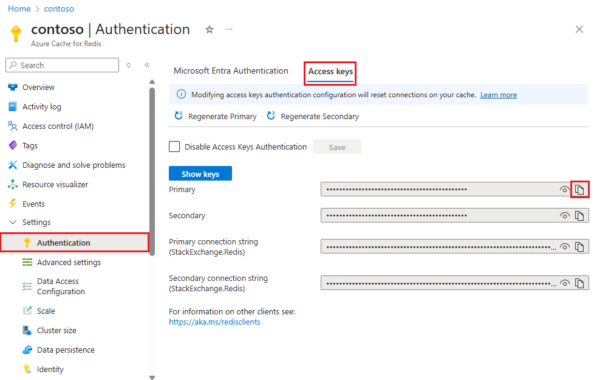
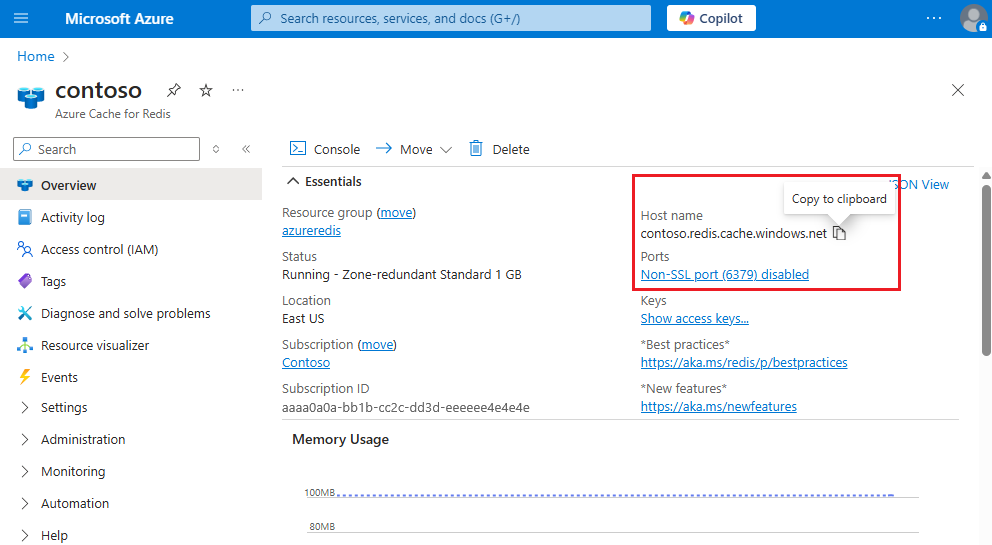

### Retrieve host name, ports, and access keys from the Azure portal

To connect to an Azure Cache for Redis instance, cache clients need the host name, ports, and a key for the cache. Some clients might refer to these items by slightly different names. You can get the host name, ports, and keys from the [Azure portal](https://portal.azure.com).

- To get the access keys, from your cache left navigation, select **Access keys**. 
  
  

- To get the host name and ports, from your cache left navigation, select **Properties**. The host name is of the form *\<DNS name>.redis.cache.windows.net*.

  

