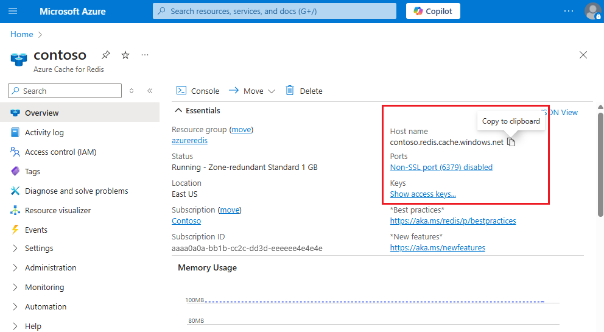

### Retrieve host name, ports, and access keys from the Azure portal

To connect your Azure Cache for Redis server, the cache client needs the host name, ports, and a key for the cache. Some clients might refer to these items by slightly different names. You can get the host name, ports, and keys from the [Azure portal](https://portal.azure.com).

- To get the access keys, select **Authentication** from the Resource menu. Then, select the **Access keys** tab.
  
  

- To get the host name and ports for your cache, select **Overview** from the Resource menu. The host name is of the form *\<DNS name>.redis.cache.windows.net*.

  
