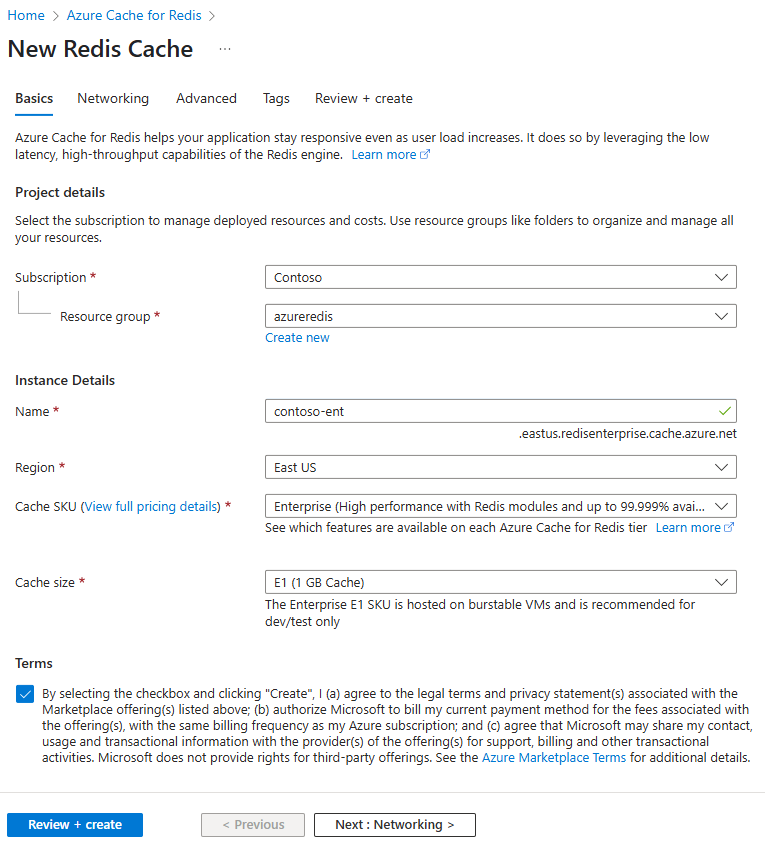

# Quickstart: Create an Enterprise tier cache (private preview)

Azure Cache for Redis' Enterprise tiers provide fully-integrated and fully-managed [Redis Enterprise](https://redislabs.com/redis-enterprise/) on Azure. They're currently available as a private preview. There are two new tiers in this preview:
* Enterprise, which uses volatile memory (DRAM) on a virtual machine to store data
* Enterprise SSD, which uses both volatile and non-volatile memory (NVMe) to store data.

There is no cost for joining the private preview. If you're interested, please register through the [Azure Marketplace](https://aka.ms/redispreviewsignup/). We have very limited number of participant spots and can't guarantee that you'll be accepted into the preview.

## Prerequisites

You'll need an Azure subscription before you begin. If you don't have one, create a free account [create one for free](https://azure.microsoft.com/free/) first.

## Create a cache
1. To create a cache, sign in to the Azure portal using the link in your preview invitation and select **Create a resource**. 
   
1. On the **New** page, select **Databases** and then select **Azure Cache for Redis**.
   
   
   
1. On the **New Redis Cache** page, configure the settings for your new cache.
   
   | Setting      | Suggested value  | Description |
   | ------------ |  ------- | -------------------------------------------------- |
   | **Subscription** | Drop down and select your subscription. | The subscription under which to create this new Azure Cache for Redis instance. | 
   | **Resource group** | Drop down and select a resource group, or select **Create new** and enter a new resource group name. | Name for the resource group in which to create your cache and other resources. By putting all your app resources in one resource group, you can easily manage or delete them together. | 
   | **DNS name** | Enter a globally unique name. | The cache name must be a string between 1 and 63 characters that contains only numbers, letters, or hyphens. The name must start and end with a number or letter, and can't contain consecutive hyphens. Your cache instance's *host name* will be *\<DNS name>.<Azure region>.redisenterprise.cache.azure.net*. | 
   | **Location** | Drop down and select a location. | Enterprise tiers are available in West US, East US 2, and West Europe. |
   | **Cache tier** | Drop down and select an *Enterprise DRAM* or *Enterprise SSD* tier and a size. |  The tier determines the size, performance, and features that are available for the cache. |
   
    

1. Select **Next: Networking** and skip.

> [!NOTE] 
> Support for private link will come later.
>

1. Select **Next: Advanced**.
   
   You can keep the default settings or change them as appropriate. If you turn on **Allow access only via TLS**, you must use TLS to access the new cache from your application.

> [!NOTE] 
> Redis Modules aren't supported in Enterprise SSD tier yet. If you plan to use a Redis Module,
> be sure to choose an Enterprise tier cache.
>

    
   
1. Select **Next: Tags** and skip.

1. Select **Next: Summary**.

    

1. Click the checkbox under **Terms**, review the settings, and then select **Review + create**.
   
   It takes some time for the cache to create. You can monitor progress on the Azure Cache for Redis **Overview** page. When **Status** shows as **Running**, the cache is ready to use.

## Next steps

In this quickstart, you learned how to create an Enterprise tier instance of Azure Cache for Redis.

> [!div class="nextstepaction"]
> [Create an ASP.NET web app that uses an Azure Cache for Redis.](./cache-web-app-howto.md)

