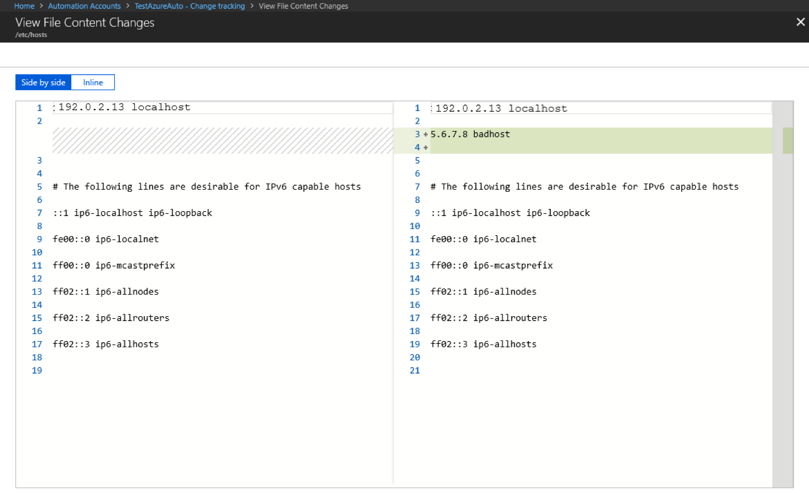

# What is Azure Change Tracking and Inventory?

Azure Change Tracking and Inventory (CTI) is an Azure service that improves auditing and governance for in-guest operations by monitoring configuration changes and providing detailed inventory logs across servers in Azure, on-premises, and other cloud environments. It helps you detect configuration drift and maintain visibility into system assets. 

> [!IMPORTANT]
> Use Change Tracking and Inventory with the Change Tracking extension version 2.20.0.0 or later.

The service provides two core capabilities: change tracking and inventory.

## Change tracking

- Monitors configuration changes, including file modifications, registry keys, software installations, and Windows services or Linux daemons.
- Provides detailed logs of what changed and when to quickly detect configuration drift or unauthorized changes. 
- Change tracking metadata is ingested into the `ConfigurationChange` table in the connected Log Analytics workspace. For more information, see [ConfigurationChange](/azure/azure-monitor/reference/tables/configurationchange).

> [!NOTE]
> Change Tracking and Inventory logs data for both system-level and user-level applications. System-level data is always logged, but user-level applications appear only when a user signs in to a machine. When the user signs out, those applications are marked as **Removed**.

## Inventory

- Collects and maintains an updated inventory of installed software, operating system details, and other machine configuration data in connected Log Analytics workspaces. 
- Provides an overview of system assets to support compliance, audits, and proactive maintenance. 
- Ingests inventory metadata into the `ConfigurationData` table in the connected Log Analytics workspace. For more information, see [ConfigurationData](/azure/azure-monitor/reference/tables/configurationdata).

For more information about the enhanced discovery and onboarding experience in Change Tracking and Inventory for managing in-guest actions, see the [Microsoft Community Hub blog](https://techcommunity.microsoft.com/blog/azuregovernanceandmanagementblog/change-tracking--inventory-enhanced-discovery--onboarding-to-manage-in-guest-act/4400398).

## Key benefits of Azure Change Tracking and Inventory

- **Compatibility with Azure Monitor Agent (AMA)**: It's compatible with the [Azure Monitor Agent (AMA)](/azure/azure-monitor/agents/agents-overview), which enhances security and reliability and facilitates a multihoming experience for data storage.
- **Compatibility with the Change Tracking extension**: It's compatible with the Change Tracking extension deployed through Azure Policy on the client's virtual machine (VM). After you switch to AMA, the Change Tracking extension sends software, files, and registry data to AMA.
- **Multihoming support with Azure Monitor Logs**: It standardizes management from one central workspace. You can [transition from Azure Monitor Logs to AMA](/azure/azure-monitor/agents/azure-monitor-agent-migration) so that all VMs point to a single workspace for data collection and maintenance.
- **Data collection rule (DCR) management**: It uses [data collection rules (DCRs)](/azure/azure-monitor/essentials/data-collection-rule-overview) to configure or customize various aspects of data collection. A DCR is an Azure Monitor configuration that defines what monitoring data is collected, from which machines, and where it is sent. For example, you can change the file collection frequency.

For information on supported operating systems, see [Support matrix and regions](../azure-change-tracking-inventory/change-tracking-inventory-support-matrix.md) for Change Tracking and Inventory.

## Enable Azure Change Tracking and Inventory

You can enable Change Tracking and Inventory in the following ways:

- **Azure Arc-enabled servers (non-Azure machines)**: In the Azure portal, on the **Change Tracking and Inventory Center | Machines** pane, select **Policy** > **Definition Type** > **Category** > **Change Tracking and Inventory**. Under **Initiative**, select **Enable Change Tracking and Inventory for Arc-enabled virtual machines**. To enable a single machine, see [Enable Change Tracking and Inventory for a single Azure Arc-enabled VM by using the portal](quickstart-monitor-changes-collect-inventory-azure-change-tracking-inventory.md#enable-change-tracking-and-inventory-for-a-single-azure-arc-enabled-vm-by-using-the-portal). To enable multiple machines, see [Enable Change Tracking and Inventory for multiple Azure Arc-enabled VMs by using the CLI](quickstart-monitor-changes-collect-inventory-azure-change-tracking-inventory.md#enable-change-tracking-and-inventory-for-multiple-azure-arc-enabled-vms-by-using-the-cli). To enable at scale, use the deploy-if-not-exists (DINE) policy-based approach.

- **Single Azure VM**: In the Azure portal, select the VM from the **Virtual machines pane**, and then enable Change Tracking and Inventory for that VM. This scenario supports both Linux and Windows VMs. To learn more, see [Enable Change Tracking and Inventory for a single Azure VM by using the portal](quickstart-monitor-changes-collect-inventory-azure-change-tracking-inventory.md#enable-change-tracking-and-inventory-for-a-single-azure-vm-by-using-the-portal). 

- **Multiple Azure VMs**: In the Azure portal, select multiple VMs from the **Virtual machines pane** to enable Change Tracking and Inventory for those machines. To learn more, see [Enable Change Tracking and Inventory for multiple Azure VMs by using the portal](quickstart-monitor-changes-collect-inventory-azure-change-tracking-inventory.md#enable-change-tracking-and-inventory-for-multiple-azure-vms-by-using-the-portal).

## What Change Tracking and Inventory tracks

Azure Change Tracking and Inventory tracks changes to files, file content, registry keys, software, Windows services, and Linux daemons.

### Track file changes

To track file changes on Windows and Linux, Change Tracking and Inventory uses SHA256 hashes of the files and compares them with the hashes collected during the previous inventory scan to detect file changes.

### Track file content changes

By using Change Tracking and Inventory, you can view the contents of Windows and Linux files. For each file change, Change Tracking and Inventory stores file content in an [Azure Storage account](../storage/common/storage-account-create.md). When you track a file, you can view and compare file contents before and after a change. You can view content inline or side by side. For more information, see [Tutorial: Change a workspace and configure data collection rule](tutorial-change-workspace-configure-data-collection-rule.md).

### Track registry keys

Change Tracking and Inventory monitors changes to Windows registry keys. Monitoring registry keys can help identify configuration changes and extensibility points where non-Microsoft code can activate. The following table lists preconfigured (but not enabled) registry keys. To track these keys, you must enable each key. 

> [!NOTE]
> A registry key is a container in the Windows Registry that works like a folder in a file system. It organizes configuration settings and data for hardware, software, and users. The keys contain registry values, like files, and subkeys.

> [!div class="mx-tdBreakAll"]
> |Registry key | Purpose |
> | --- | --- |
> |`HKEY_LOCAL_MACHINE\Software\Microsoft\Windows\CurrentVersion\Group Policy\Scripts\Startup` | Monitors scripts that run at startup.
> |`HKEY_LOCAL_MACHINE\Software\Microsoft\Windows\CurrentVersion\Group Policy\Scripts\Shutdown` | Monitors scripts that run at shutdown.
> |`HKEY_LOCAL_MACHINE\SOFTWARE\Wow6432Node\Microsoft\Windows\CurrentVersion\Run` | Monitors keys that are loaded before the user signs in to the Windows account. The key is used for 32-bit applications running on 64-bit computers.
> |`HKEY_LOCAL_MACHINE\SOFTWARE\Microsoft\Active Setup\Installed Components` | Monitors changes to application settings.
> |`HKEY_LOCAL_MACHINE\Software\Classes\Directory\ShellEx\ContextMenuHandlers` | Monitors context menu handlers that hook directly into Windows Explorer and usually run in-process with `explorer.exe`.
> |`HKEY_LOCAL_MACHINE\Software\Classes\Directory\Shellex\CopyHookHandlers` | Monitors copy hook handlers that hook directly into Windows Explorer and usually run in-process with `explorer.exe`.
> |`HKEY_LOCAL_MACHINE\Software\Microsoft\Windows\CurrentVersion\Explorer\ShellIconOverlayIdentifiers` | Monitors for icon overlay handler registration.
> |`HKEY_LOCAL_MACHINE\Software\Wow6432Node\Microsoft\Windows\CurrentVersion\Explorer\ShellIconOverlayIdentifiers` | Monitors for icon overlay handler registration for 32-bit applications running on 64-bit computers.
> |`HKEY_LOCAL_MACHINE\Software\Microsoft\Windows\CurrentVersion\Explorer\Browser Helper Objects` | Monitors for new browser helper object plugins for Internet Explorer. Used to access the Document Object Model (DOM) of the current pane and to control navigation.
> |`HKEY_LOCAL_MACHINE\Software\Wow6432Node\Microsoft\Windows\CurrentVersion\Explorer\Browser Helper Objects` | Monitors for new browser helper object plugins for Internet Explorer. Used to access the DOM of the current pane and to control navigation for 32-bit applications running on 64-bit computers.
> |`HKEY_LOCAL_MACHINE\Software\Microsoft\Internet Explorer\Extensions` | Monitors for new Internet Explorer extensions, such as custom tool menus and custom toolbar buttons.
> |`HKEY_LOCAL_MACHINE\Software\Wow6432Node\Microsoft\Internet Explorer\Extensions` | Monitors for new Internet Explorer extensions, such as custom tool menus and custom toolbar buttons for 32-bit applications running on 64-bit computers.
> |`HKEY_LOCAL_MACHINE\Software\Microsoft\Windows NT\CurrentVersion\Drivers32` | Monitors 32-bit drivers associated with wavemapper, wave1 and wave2, msacm.imaadpcm, .msadpcm, .msgsm610, and vidc. Similar to the `[drivers]` section in the `system.ini` file.
> |`HKEY_LOCAL_MACHINE\Software\Wow6432Node\Microsoft\Windows NT\CurrentVersion\Drivers32` | Monitors 32-bit drivers associated with wavemapper, wave1 and wave2, msacm.imaadpcm, .msadpcm, .msgsm610, and vidc for 32-bit applications running on 64-bit computers. Similar to the `[drivers]` section in the `system.ini` file.
> |`HKEY_LOCAL_MACHINE\System\CurrentControlSet\Control\Session Manager\KnownDlls` | Monitors the list of known or commonly used system DLLs. Monitoring prevents people from exploiting weak application directory permissions by dropping in Trojan horse versions of system DLLs.
> |`HKEY_LOCAL_MACHINE\SOFTWARE\Microsoft\Windows NT\CurrentVersion\Winlogon\Notify` | Monitors the list of packages that can receive event notifications from `winlogon.exe`, the interactive sign-in support model for Windows.

### Track software changes

Change Tracking and Inventory tracks installed software on Windows and Linux machines by collecting software inventory and comparing each collection cycle with the previous state. This capability helps you detect software installs, removals, and version changes across machines and maintain software inventory visibility in your environment. For more information about collection limits and frequencies, see [Support matrix and regions](change-tracking-inventory-support-matrix.md).

### Track Windows services and Linux daemons

Change Tracking and Inventory tracks changes to Windows services and Linux daemons, including state and configuration-related changes, and records those changes in configuration-change events for analysis and alerting. Tracking these changes helps you identify service-related changes across machines.

## Related content

- To enable Azure Change Tracking and Inventory from the Azure portal, see [Quickstart: Enable Azure Change Tracking and Inventory](quickstart-monitor-changes-collect-inventory-azure-change-tracking-inventory.md).
- Review the [support matrix and regions](../azure-change-tracking-inventory/change-tracking-inventory-support-matrix.md) for Change Tracking and Inventory.
- To disable Change Tracking and Inventory by using AMA, see [Disable Azure Change Tracking and Inventory by using the Azure Monitor Agent](disable-azure-change-tracking-inventory-monitoring-agent.md).
