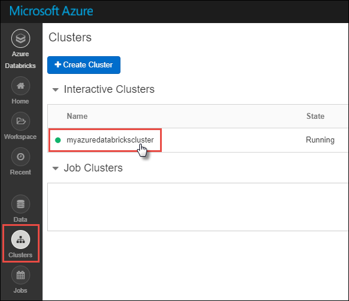
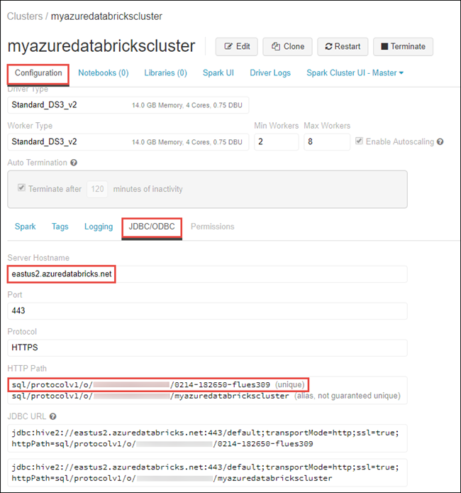
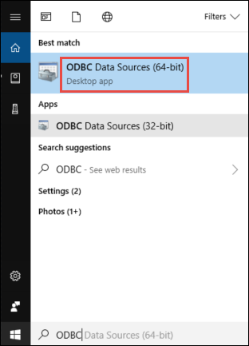
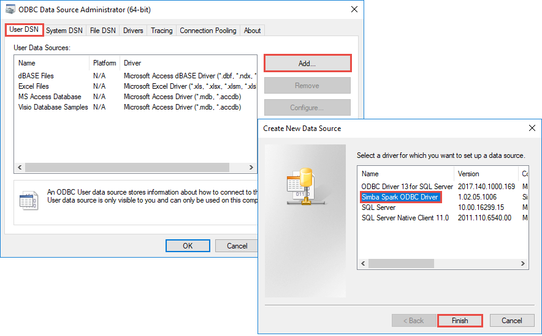
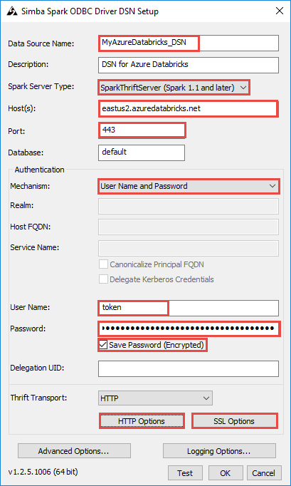
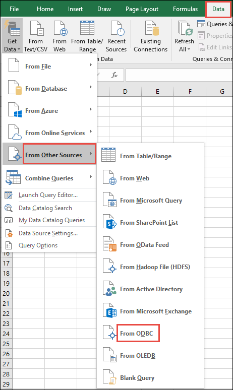
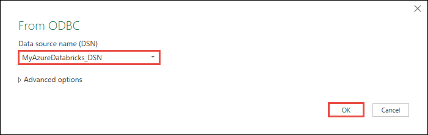
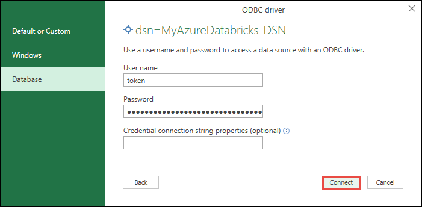
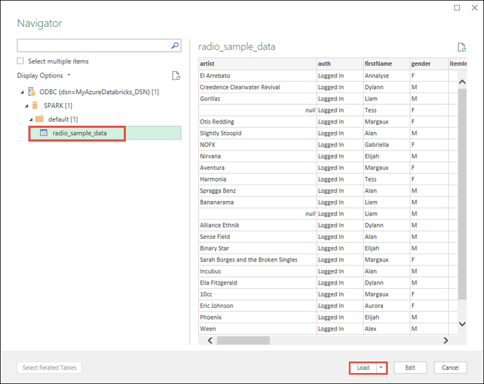

# Connect to Azure Databricks from Excel, Python, or R

In this article, you learn how to use the Databricks ODBC driver to connect Azure Databricks with Microsoft Excel, Python, or R language. Once you establish the connection, you can access the data in Azure Databricks from the Excel, Python, or R clients. You can also use the clients to further analyze the data. 

## Prerequisites

* You must have an Azure Databricks workspace, a Spark cluster, and sample data associated with your cluster. If you do not already have these prerequisites, complete the quickstart at [Run a Spark job on Azure Databricks using the Azure portal](quickstart-create-databricks-workspace-portal.md).

* Download the Databricks ODBC driver from [Databricks driver download page](https://databricks.com/spark/odbc-driver-download). Install the 32-bit or 64-bit version depending on the application from where you want to connect to Azure Databricks. For example, to connect from Excel, install the 32-bit version of the driver. To connect from R and Python, install the 64-bit version of the driver.

* Set up a personal access token in Databricks. For instructions, see [Token management](https://docs.azuredatabricks.net/api/latest/authentication.html#token-management).

## Set up a DSN

A data source name (DSN) contains the information about a specific data source. An ODBC driver needs this DSN to connect to a data source. In this section, you set up a DSN that can be used with the Databricks ODBC driver to connect to Azure Databricks from clients like Microsoft Excel, Python, or R.

1. From the Azure Databricks workspace, navigate to the Databricks cluster.

    

2. Under the **Configuration** tab, click the **JDBC/ODBC** tab and copy the values for **Server Hostname** and **HTTP Path**. You need these values to complete the steps in this article.

    

3. On your computer, start **ODBC Data Sources** application (32-bit or 64-bit) depending on the application. To connect from Excel, use the 32-bit version. To connect from R and Python, use the 64-bit version.

    

4. Under the **User DSN** tab, click **Add**. In the **Create New Data Source** dialog box, select the **Simba Spark ODBC Driver**, and then click **Finish**.

    

5. In the **Simba Spark ODBC Driver** dialog box, provide the following values:

    

    The following table provides information on the values to provide in the dialog box.
    
    |Field  | Value  |
    |---------|---------|
    |**Data Source Name**     | Provide a name for the data source.        |
    |**Host(s)**     | Provide the value that you copied from the Databricks workspace for *Server hostname*.        |
    |**Port**     | Enter *443*.        |
    |**Authentication** > **Mechanism**     | Select *User name and password*.        |
    |**User name**     | Enter *token*.        |
    |**Password**     | Enter the token value that you copied from the Databricks workspace. |
    
    Perform the following additional steps in the DSN setup dialog box.
    
    * Click **HTTP Options**. In the dialog box that opens up, paste the value for *HTTP Path* that you copied from Databricks workspace. Click **OK**.
    * Click **SSL Options**. In the dialog box that opens up, select the **Enable SSL** check box. Click **OK**.
    * Click **Test** to test the connection to Azure Databricks. Click **OK** to save the configuration.
    * In the **ODBC Data Source Administrator** dialog box, click **OK**.

You now have your DSN set up. In the next sections, you use this DSN to connect to Azure Databricks from Excel, Python, or R.

## Connect from Microsoft Excel

In this section, you pull data from Azure Databricks into Microsoft Excel using the DSN you created earlier. Before you begin, make sure you have Microsoft Excel installed on your computer. You can use a trial version of Excel from [Microsoft Excel trial link](https://products.office.com/excel).

1. Open a blank workbook in Microsoft Excel. From the **Data** ribbon, click **Get Data**. Click **From Other Sources** and then click **From ODBC**.

    

2. In the **From ODBC** dialog box, select the DSN that you created earlier and then click **OK**.

    

3. If you are prompted for credentials, for user name enter **token**. For password, provide the token value that you retrieved from the Databricks workspace.

    

4. From the navigator window, select the table in Databricks that you want to load to Excel, and then click **Load**. 

    

Once you have the data in your Excel workbook, you can perform analytical operations on it.

## Connect from R

> [!NOTE]
> This section provides information on how to integrate an R Studio client running on your desktop with Azure Databricks. For instructions on how to use R Studio on the Azure Databricks cluster itself, see [R Studio on Azure Databricks](https://docs.azuredatabricks.net/spark/latest/sparkr/rstudio.html).

In this section, you use an R language IDE to reference data available in Azure Databricks. Before you begin, you must have the following installed on the computer.

* An IDE for R language. This article uses RStudio for Desktop. You can install it from [R Studio download](https://www.rstudio.com/products/rstudio/download/).
* If you use RStudio for Desktop as your IDE, also install Microsoft R Client from [https://aka.ms/rclient/](https://aka.ms/rclient/). 

Open RStudio and do the following steps:

- Reference the `RODBC` package. This enables you to connect to Azure Databricks using the DSN you created earlier.
- Establish a connection using the DSN.
- Run a SQL query on the data in Azure Databricks. In the following snippet, *radio_sample_data* is a table that already exists in Azure Databricks.
- Perform some operations on the query to verify the output. 

The following code snippet performs these tasks:

    # reference the 'RODBC' package
    require(RODBC)
    
    # establish a connection using the DSN you created earlier
    conn <- odbcConnect("<ENTER DSN NAME HERE>")
    
    # run a SQL query using the connection you created
    res <- sqlQuery(conn, "SELECT * FROM radio_sample_data")
    
    # print out the column names in the query output
    names(res) 
        
    # print out the number of rows in the query output
    nrow (res)

## Connect from Python

In this section, you use a Python IDE (such as IDLE) to reference data available in Azure Databricks. Before you begin, complete the following prerequisites:

* Install Python from [here](https://www.python.org/downloads/). Installing Python from this link also installs IDLE.

* From a command prompt on the computer, install the `pyodbc` package. Run the following command:

      pip install pyodbc

Open IDLE and do the following steps:

- Import the `pyodbc` package. This enables you to connect to Azure Databricks using the DSN you created earlier.
- Establish a connection using the DSN you created earlier.
-  Run a SQL query using the connection you created. In the following snippet, *radio_sample_data* is a table that already exists in Azure Databricks.
- Perform operations on the query to verify the output.

The following code snippet performs these tasks:

```python
# import the `pyodbc` package:
import pyodbc

# establish a connection using the DSN you created earlier
conn = pyodbc.connect("DSN=<ENTER DSN NAME HERE>", autocommit=True)

# run a SQL query using the connection you created
cursor = conn.cursor()
cursor.execute("SELECT * FROM radio_sample_data")

# print the rows retrieved by the query.
for row in cursor.fetchall():
    print(row)
```

## Next steps

* To learn about sources from where you can import data into Azure Databricks, see [Data sources for Azure Databricks](https://docs.azuredatabricks.net/spark/latest/data-sources/index.html#)


