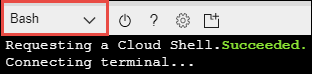

# Use Databricks CLI from Azure Cloud Shell

Learn how to use the Databricks CLI from Azure Cloud Shell to perform operations on Databricks.

## Prerequisites

* An Azure Databricks workspace and cluster. For instructions, see [Get started with Azure Databricks](quickstart-create-databricks-workspace-portal.md). 

* Set up a personal access token in Databricks. For instructions, see [Token management](/azure/databricks/dev-tools/api/latest/authentication).

## Use the Azure Cloud Shell

1. Log in to the [Azure  portal](https://portal.azure.com).
 
2. From the top-right corner, click the **Cloud Shell** icon.

   

3. Make sure you select **Bash** for the Cloud Shell environment. You can select from the drop-down option, as shown in the following screenshot.

    

4. Create a virtual environment in which you can install the Databricks CLI. In the snippet below, you create a virtual environment called `databrickscli`.

       virtualenv -p /usr/bin/python2.7 databrickscli

5. Switch to the virtual environment you created.

       source databrickscli/bin/activate

6. Install the Databricks CLI.

       pip install databricks-cli

7. Set up authentication with Databricks by using the access token that you must have created, listed as part of prerequisites. Use the following command:

       databricks configure --token

    You will receive the following prompts:

    * First, you are prompted to enter the Databricks host. Enter the value in the format `https://eastus2.azuredatabricks.net`. Here, **East US 2** is the Azure region where you created your Azure Databricks workspace.

    * Next, you are prompted to enter a token. Enter the token that you created earlier.

Once you complete these steps, you can start using Databricks CLI from Azure Cloud Shell.

## Use Databricks CLI

You can now start using the Databricks CLI. For example, run the following command to list all the Databricks clusters that you have in your workspace.

    databricks clusters list

You can also use the following command to access the Databricks filesystem (DBFS).

    databricks fs ls

For a complete reference on commands, see [Databricks CLI](/azure/databricks/dev-tools/databricks-cli).

## Next steps

* To learn more about Azure CLI, see [Azure CLI overview](../cloud-shell/overview.md)
* To see a list of commands for Azure CLI, see [Azure CLI reference](https://docs.microsoft.com/cli/azure/reference-index?view=azure-cli-latest)
* To see a list of commands for Databricks CLI, see [Databricks CLI](/azure/databricks/dev-tools/databricks-cli)

