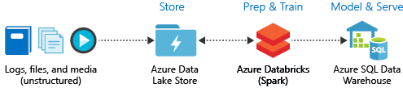
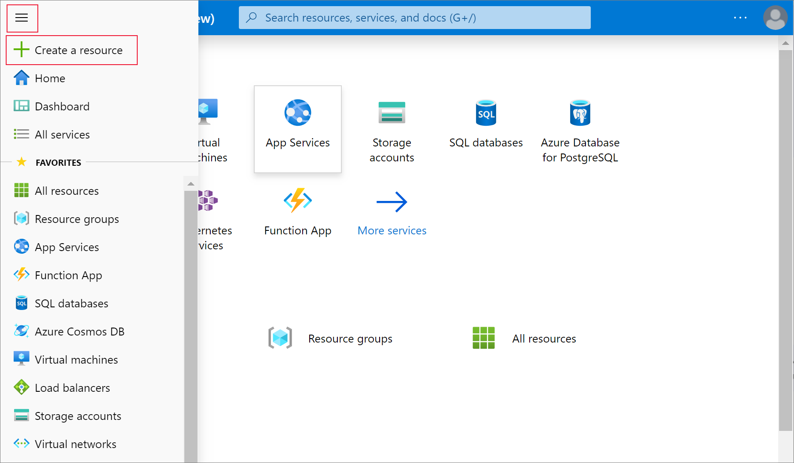
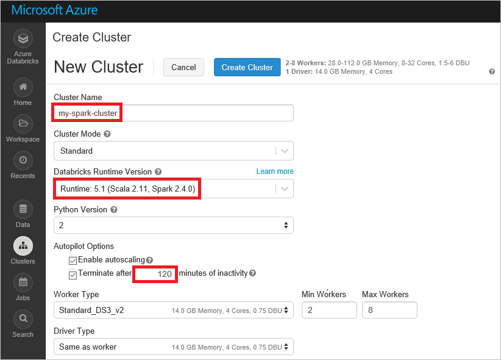
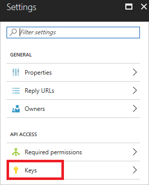
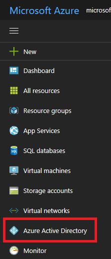
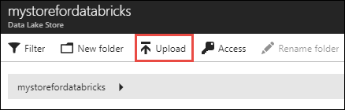
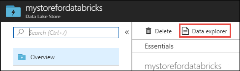
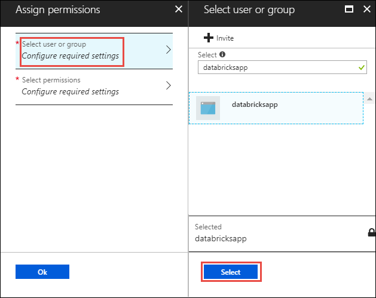
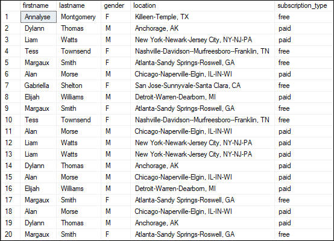

# Tutorial: Extract, transform, and load data using Azure Databricks

In this tutorial, you perform an ETL (extract, transform, and load data) operation using Azure Databricks. You extract data from Azure Data Lake Store into Azure Databricks, run transformations on the data in Azure Databricks, and then load the transformed data into Azure SQL Data Warehouse. 

The steps in this tutorial use the SQL Data Warehouse connector for Azure Databricks to transfer data to Azure Databricks. This connector, in turn, uses Azure Blob Storage as temporary storage for the data being transferred between an Azure Databricks cluster and Azure SQL Data Warehouse.

The following illustration shows the application flow:

This tutorial covers the following tasks: 

> [!div class="checklist"]
> * Create an Azure Databricks workspace
> * Create a Spark cluster in Azure Databricks
> * Create an Azure Data Lake Store account
> * Upload data to Azure Data Lake Store
> * Create a notebook in Azure Databricks
> * Extract data from Data Lake Store
> * Transform data in Azure Databricks
> * Load data into Azure SQL Data Warehouse

If you don't have an Azure subscription, [create a free account](https://azure.microsoft.com/free/) before you begin.

## Prerequisites

Before you start with this tutorial, make sure to meet the following requirements:
- Create an Azure SQL Data Warehouse, create a server-level firewall rule, and connect to the server as a server admin. Follow the instructions at [Quickstart: Create an Azure SQL Data Warehouse](../sql-data-warehouse/create-data-warehouse-portal.md)
- Create a database master key for the Azure SQL Data Warehouse. Follow the instructions at [Create a Database Master Key](https://docs.microsoft.com/sql/relational-databases/security/encryption/create-a-database-master-key).
- Create an Azure Blob storage account, and a container within it. Also, retrieve the access key to access the storage account. Follow the instructions at [Quickstart: Create an Azure Blob storage account](../storage/blobs/storage-quickstart-blobs-portal.md).

## Log in to the Azure portal

Log in to the [Azure portal](https://portal.azure.com/).

## Create an Azure Databricks workspace

In this section, you create an Azure Databricks workspace using the Azure portal. 

1. In the Azure portal, select **Create a resource** > **Data + Analytics** > **Azure Databricks**.

    

3. Under **Azure Databricks Service**, provide the values to create a Databricks workspace.

    

    Provide the following values: 
     
    |Property  |Description  |
    |---------|---------|
    |**Workspace name**     | Provide a name for your Databricks workspace        |
    |**Subscription**     | From the drop-down, select your Azure subscription.        |
    |**Resource group**     | Specify whether you want to create a new resource group or use an existing one. A resource group is a container that holds related resources for an Azure solution. For more information, see [Azure Resource Group overview](../azure-resource-manager/resource-group-overview.md). |
    |**Location**     | Select **East US 2**. For other available regions, see [Azure services available by region](https://azure.microsoft.com/regions/services/).        |
    |**Pricing Tier**     |  Choose between **Standard** or **Premium**. For more information on these tiers, see [Databricks pricing page](https://azure.microsoft.com/pricing/details/databricks/).       |

    Select **Pin to dashboard** and then select **Create**.

4. The account creation takes a few minutes. During account creation, the portal displays the **Submitting deployment for Azure Databricks** tile on the right side. You may need to scroll right on your dashboard to see the tile. There is also a progress bar displayed near the top of the screen. You can watch either area for progress.

    

## Create a Spark cluster in Databricks

1. In the Azure portal, go to the Databricks workspace that you created, and then select **Launch Workspace**.

2. You are redirected to the Azure Databricks portal. From the portal, select **Cluster**.

    

3. In the **New cluster** page, provide the values to create a cluster.

    

    Accept all other defaults other than the following values:

    * Enter a name for the cluster.
    * For this article, create a cluster with **4.0** runtime. 
    * Make sure you select the **Terminate after ____ minutes of inactivity** checkbox. Provide a duration (in minutes) to terminate the cluster, if the cluster is not being used.
    
    Select **Create cluster**. Once the cluster is running, you can attach notebooks to the cluster and run Spark jobs.

## Create an Azure Data Lake Store account

In this section, you create an Azure Data Lake Store account and associate an Azure Active Directory service principal with it. Later in this tutorial, you use this service principal in Azure Databricks to access Azure Data Lake Store. 

1. From the [Azure portal](https://portal.azure.com), select **Create a resource** > **Storage** > **Data Lake Store**.
3. In the **New Data Lake Store** blade, provide the values as shown in the following screenshot:
   
    

    Provide the following values: 
     
    |Property  |Description  |
    |---------|---------|
    |**Name**     | Enter a unique name for the Data Lake Store account.        |
    |**Subscription**     | From the drop-down, select your Azure subscription.        |
    |**Resource group**     | For this tutorial, select the same resource group you used while creating the Azure Databricks workspace.  |
    |**Location**     | Select **East US 2**.  |
    |**Pricing package**     |  Select **Pay-as-you-go**. |
    | **Encryption Settings** | Keep the default settings. |

    Select **Pin to dashboard** and then select **Create**.

You now create an Azure Active Directory service principal and associate with the Data Lake Store account you created.

### Create an Azure Active Directory service principal
   
1. From the [Azure portal](https://portal.azure.com), select **All services**, and then search for **Azure Active Directory**.

2. Select **App registrations**.

   

3. Select **New application registration**.

   

4. Provide a name and URL for the application. Select **Web app / API** for the type of application you want to create. Provide a sign-on URL, and then select **Create**.

   

To access the Data Lake Store account from Azure Databricks, you must have the following values for the Azure Active Directory service principal you created:
- Application ID
- Authentication key
- Tenant ID

In the following sections, you retrieve these values for the Azure Active Directory service principal you created earlier.

### Get application ID and authentication key for the service principal

When programmatically logging in, you need the ID for your application and an authentication key. To get those values, use the following steps:

1. From **App registrations** in Azure Active Directory, select your application.

   

2. Copy the **Application ID** and store it in your application code. Some [sample applications](#log-in-as-the-application) refer to this value as the client ID.

   

3. To generate an authentication key, select **Settings**.

   

4. To generate an authentication key, select **Keys**.

   

5. Provide a description of the key, and a duration for the key. When done, select **Save**.

   

   After saving the key, the value of the key is displayed. Copy this value because you are not able to retrieve the key later. You provide the key value with the application ID to log in as the application. Store the key value where your application can retrieve it.

   

### Get tenant ID

When programmatically logging in, you need to pass the tenant ID with your authentication request.

1. Select **Azure Active Directory**.

   

1. To get the tenant ID, select **Properties** for your Azure AD tenant.

   

1. Copy the **Directory ID**. This value is your tenant ID.

    

## Upload data to Data Lake Store

In this section, you upload a sample data file to Data Lake Store. You use this file later in Azure Databricks to run some transformations. The sample data (**small_radio_json.json**) that you use in this tutorial is available in this [Github repo](https://github.com/Azure/usql/blob/master/Examples/Samples/Data/json/radiowebsite/small_radio_json.json).

1. From the [Azure portal](https://portal.azure.com), select the Data Lake Store account you created.

2. From the **Overview** tab, click **Data Explorer**.

    

3. Within the Data Explorer, click **Upload**.

    

4. In **Upload files**, browse to the location of your sample data file, and then select **Add selected files**.

    

5. In this tutorial, you uploaded the data file to the root of the Data Lake Store. So, the file is now available at `adl://<YOUR_DATA_LAKE_STORE_ACCOUNT_NAME>.azuredatalakestore.net/small_radio_json.json`.

## Associate service principal with Azure Data Lake Store

In this section, you associate the data in Azure Data Lake Store account with the Azure Active Directory service principal you created. This ensures that you can access the Data Lake Store account from Azure Databricks. For the scenario in this article, you read the data in Data Lake Store to populate a table in SQL Data Warehouse. According to [Overview of Access Control in Data Lake Store](../data-lake-store/data-lake-store-access-control.md#common-scenarios-related-to-permissions), to have read access on a file in Data Lake Store, you must have:

- **Execute** permissions on all the folders in the folder structure leading up to the file.
- **Read** permissions on the file itself.

Perform the following steps to grant these permissions.

1. From the [Azure portal](https://portal.azure.com), select the Data Lake Store account you created, and then select **Data Explorer**.

    

2. In this scenario, because the sample data file is at the root of the folder structure, you only need to assign **Execute** permissions at the folder root. To do so, from the root of data explorer, select **Access**.

    

3. Under **Access**, select **Add**.

    

4. Under **Assign permissions**, click **Select user or group** and search for the Azure Active Directory service principal you created earlier.

    

    Select the AAD service principal you want to assign and click **Select**.

5. Under **Assign permissions**, click **Select permissions** > **Execute**. Keep the other default values and select **OK** under **Select permissions** and then under **Assign permissions**.

    

6. Go back to the Data Explorer and now click the file on which you want to assign the read permission. Under **File Preview**, select **Access**.

    

7. Under **Access**, select **Add**. Under **Assign permissions**, click **Select user or group** and search for the Azure Active Directory service principal you created earlier.

    

    Select the AAD service principal you want to assign and click **Select**.

8. Under **Assign permissions**, click **Select permissions** > **Read**. Select **OK** under **Select permissions** and then under **Assign permissions**.

    

    The service principal now has sufficient permissions to read the sample data file from Azure Data Lake Store.

## Extract data from Data Lake Store

In this section, you create a notebook in Azure Databricks workspace and then run code snippets to extract data from Data Lake Store into Azure Databricks.

1. In the [Azure portal](https://portal.azure.com), go to the Azure Databricks workspace you created, and then select **Launch Workspace**.

2. In the left pane, select **Workspace**. From the **Workspace** drop-down, select **Create** > **Notebook**.

    

2. In the **Create Notebook** dialog box, enter a name for the notebook. Select **Scala** as the language, and then select the Spark cluster that you created earlier.

    

    Select **Create**.

3. Add the following snippet in an empty code cell and replace the placeholder values with the values you saved earlier for the Azure Active Directory service principal.

        spark.conf.set("dfs.adls.oauth2.access.token.provider.type", "ClientCredential")
        spark.conf.set("dfs.adls.oauth2.client.id", "<APPLICATION-ID>")
        spark.conf.set("dfs.adls.oauth2.credential", "<AUTHENTICATION-KEY>")
        spark.conf.set("dfs.adls.oauth2.refresh.url", "https://login.microsoftonline.com/<TENANT-ID>/oauth2/token")

    Press **SHIFT + ENTER** to run the code cell.

4. You can now load the sample json file in Data Lake Store as a dataframe in Azure Databricks. Past the following snippet in a new code cell, replace the placeholder value, and then press **SHIFT + ENTER**.

        val df = spark.read.json("adl://<DATA LAKE STORE NAME>.azuredatalakestore.net/small_radio_json.json")

5. Run the following code snippet to see the contents of the data frame.

        df.show()

    You see an output similar to the following snippet:

        +---------------------+---------+---------+------+-------------+----------+---------+-------+--------------------+------+--------+-------------+---------+--------------------+------+-------------+------+
        |               artist|     auth|firstName|gender|itemInSession|  lastName|   length|  level|            location|method|    page| registration|sessionId|                song|status|           ts|userId|
        +---------------------+---------+---------+------+-------------+----------+---------+-------+--------------------+------+--------+-------------+---------+--------------------+------+-------------+------+
        | El Arrebato         |Logged In| Annalyse|     F|            2|Montgomery|234.57914| free  |  Killeen-Temple, TX|   PUT|NextSong|1384448062332|     1879|Quiero Quererte Q...|   200|1409318650332|   309|
        | Creedence Clearwa...|Logged In|   Dylann|     M|            9|    Thomas|340.87138| paid  |       Anchorage, AK|   PUT|NextSong|1400723739332|       10|        Born To Move|   200|1409318653332|    11|
        | Gorillaz            |Logged In|     Liam|     M|           11|     Watts|246.17751| paid  |New York-Newark-J...|   PUT|NextSong|1406279422332|     2047|                DARE|   200|1409318685332|   201|
        ...
        ...

You have now extracted the data from Azure Data Lake Store into Azure Databricks.

## Transform data in Azure Databricks

The raw sample data **small_radio_json.json** captures the audience for a radio station and has a variety of columns. In this section, you transform the data to only retrieve specific columns in from the dataset. 

1. Start by retrieving only the columns *firstName*, *lastName*, *gender*, *location*, and *level* from the dataframe you already created.

        val specificColumnsDf = df.select("firstname", "lastname", "gender", "location", "level")
        specificColumnsDf.show()

    You get an output as shown in the following snippet:

        +---------+----------+------+--------------------+-----+
        |firstname|  lastname|gender|            location|level|
        +---------+----------+------+--------------------+-----+
        | Annalyse|Montgomery|     F|  Killeen-Temple, TX| free|
        |   Dylann|    Thomas|     M|       Anchorage, AK| paid|
        |     Liam|     Watts|     M|New York-Newark-J...| paid|
        |     Tess|  Townsend|     F|Nashville-Davidso...| free|
        |  Margaux|     Smith|     F|Atlanta-Sandy Spr...| free|
        |     Alan|     Morse|     M|Chicago-Napervill...| paid|
        |Gabriella|   Shelton|     F|San Jose-Sunnyval...| free|
        |   Elijah|  Williams|     M|Detroit-Warren-De...| paid|
        |  Margaux|     Smith|     F|Atlanta-Sandy Spr...| free|
        |     Tess|  Townsend|     F|Nashville-Davidso...| free|
        |     Alan|     Morse|     M|Chicago-Napervill...| paid|
        |     Liam|     Watts|     M|New York-Newark-J...| paid|
        |     Liam|     Watts|     M|New York-Newark-J...| paid|
        |   Dylann|    Thomas|     M|       Anchorage, AK| paid|
        |     Alan|     Morse|     M|Chicago-Napervill...| paid|
        |   Elijah|  Williams|     M|Detroit-Warren-De...| paid|
        |  Margaux|     Smith|     F|Atlanta-Sandy Spr...| free|
        |     Alan|     Morse|     M|Chicago-Napervill...| paid|
        |   Dylann|    Thomas|     M|       Anchorage, AK| paid|
        |  Margaux|     Smith|     F|Atlanta-Sandy Spr...| free|
        +---------+----------+------+--------------------+-----+

2.  You can further transform this data to rename the column **level** to **subscription_type**.

        val renamedColumnsDf = specificColumnsDf.withColumnRenamed("level", "subscription_type")
        renamedColumnsDf.show()

    You get an output as shown in the following snippet.

        +---------+----------+------+--------------------+-----------------+
        |firstname|  lastname|gender|            location|subscription_type|
        +---------+----------+------+--------------------+-----------------+
        | Annalyse|Montgomery|     F|  Killeen-Temple, TX|             free|
        |   Dylann|    Thomas|     M|       Anchorage, AK|             paid|
        |     Liam|     Watts|     M|New York-Newark-J...|             paid|
        |     Tess|  Townsend|     F|Nashville-Davidso...|             free|
        |  Margaux|     Smith|     F|Atlanta-Sandy Spr...|             free|
        |     Alan|     Morse|     M|Chicago-Napervill...|             paid|
        |Gabriella|   Shelton|     F|San Jose-Sunnyval...|             free|
        |   Elijah|  Williams|     M|Detroit-Warren-De...|             paid|
        |  Margaux|     Smith|     F|Atlanta-Sandy Spr...|             free|
        |     Tess|  Townsend|     F|Nashville-Davidso...|             free|
        |     Alan|     Morse|     M|Chicago-Napervill...|             paid|
        |     Liam|     Watts|     M|New York-Newark-J...|             paid|
        |     Liam|     Watts|     M|New York-Newark-J...|             paid|
        |   Dylann|    Thomas|     M|       Anchorage, AK|             paid|
        |     Alan|     Morse|     M|Chicago-Napervill...|             paid|
        |   Elijah|  Williams|     M|Detroit-Warren-De...|             paid|
        |  Margaux|     Smith|     F|Atlanta-Sandy Spr...|             free|
        |     Alan|     Morse|     M|Chicago-Napervill...|             paid|
        |   Dylann|    Thomas|     M|       Anchorage, AK|             paid|
        |  Margaux|     Smith|     F|Atlanta-Sandy Spr...|             free|
        +---------+----------+------+--------------------+-----------------+

## Load data into Azure SQL Data Warehouse

In this section, you upload the transformed data into Azure SQL Data Warehouse. Using the Azure SQL Data Warehouse connector for Azure Databricks, you can directly upload a dataframe as a table in SQL data warehouse.

As mentioned earlier, the SQL date warehouse connector uses Azure Blob Storage as temporary storage location to upload data between Azure Databricks and Azure SQL Data Warehouse. So, you start by providing the configuration to connect to the storage account. You must have already created the account as part of the prerequisites for this article.

1. Provide the configuration to access the Azure Storage account from Azure Databricks.

        val blobStorage = "<STORAGE ACCOUNT NAME>.blob.core.windows.net"
        val blobContainer = "<CONTAINER NAME>"
        val blobAccessKey =  "<ACCESS KEY>"

2. Specify a temporary folder that will be used while moving data between Azure Databricks and Azure SQL Data Warehouse.

        val tempDir = "wasbs://" + blobContainer + "@" + blobStorage +"/tempDirs"

3. Run the following snippet to store Azure Blob storage access keys in the configuration. This ensures that you do not have to keep the access key in the notebook in plain text.

        val acntInfo = "fs.azure.account.key."+ blobStorage
        sc.hadoopConfiguration.set(acntInfo, blobAccessKey)

4. Provide the values to connect to the Azure SQL Data Warehouse instance. You must have created a SQL data warehouse as part of the prerequisites.

        //SQL Data Warehouse related settings
        val dwDatabase = "<DATABASE NAME>"
        val dwServer = "<DATABASE SERVER NAME>" 
        val dwUser = "<USER NAME>"
        val dwPass = "<PASSWORD>"
        val dwJdbcPort =  "1433"
        val dwJdbcExtraOptions = "encrypt=true;trustServerCertificate=true;hostNameInCertificate=*.database.windows.net;loginTimeout=30;"
        val sqlDwUrl = "jdbc:sqlserver://" + dwServer + ".database.windows.net:" + dwJdbcPort + ";database=" + dwDatabase + ";user=" + dwUser+";password=" + dwPass + ";$dwJdbcExtraOptions"
        val sqlDwUrlSmall = "jdbc:sqlserver://" + dwServer + ".database.windows.net:" + dwJdbcPort + ";database=" + dwDatabase + ";user=" + dwUser+";password=" + dwPass

5. Run the following snippet to load the transformed dataframe, **renamedColumnsDf**, as a table in SQL data warehouse. This snippet creates a table called **SampleTable** in the SQL database. Please note that Azure SQL DW requires a master key.  You can create a master key by executing "CREATE MASTER KEY;" command in SQL Server Management Studio.

        spark.conf.set(
          "spark.sql.parquet.writeLegacyFormat",
          "true")
        
        renamedColumnsDf.write
            .format("com.databricks.spark.sqldw")
            .option("url", sqlDwUrlSmall) 
            .option("dbtable", "SampleTable")
            .option( "forward_spark_azure_storage_credentials","True")
            .option("tempdir", tempDir)
            .mode("overwrite")
            .save()

6. Connect to the SQL database and verify that you see a **SampleTable**.

    

7. Run a select query to verify the contents of the table. It should have the same data as the **renamedColumnsDf** dataframe.

    

## Clean up resources

After you have finished running the tutorial, you can terminate the cluster. To do so, from the Azure Databricks workspace, from the left pane, select **Clusters**. For the cluster you want to terminate, move the cursor over the ellipsis under **Actions** column, and select the **Terminate** icon.

If you do not manually terminate the cluster it will automatically stop, provided you selected the **Terminate after __ minutes of inactivity** checkbox while creating the cluster. In such a case, the cluster automatically stops if it has been inactive for the specified time.

## Next steps 
In this tutorial, you learned how to:

> [!div class="checklist"]
> * Create an Azure Databricks workspace
> * Create a Spark cluster in Azure Databricks
> * Create an Azure Data Lake Store account
> * Upload data to Azure Data Lake Store
> * Create a notebook in Azure Databricks
> * Extract data from Data Lake Store
> * Transform data in Azure Databricks
> * Load data into Azure SQL Data Warehouse

Advance to the next tutorial to learn about streaming real-time data into Azure Databricks using Azure Event Hubs.

> [!div class="nextstepaction"]
>[Stream data into Azure Databricks using Event Hubs](databricks-stream-from-eventhubs.md)
