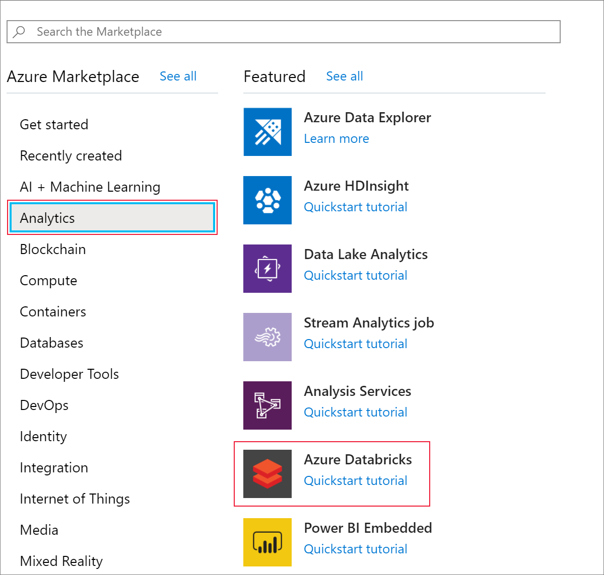

# Tutorial: Extract, transform, and load data by using Azure Databricks

In this tutorial, you perform an ETL (extract, transform, and load data) operation by using Azure Databricks. You extract data from Azure Data Lake Storage Gen2 into Azure Databricks, run transformations on the data in Azure Databricks, and load the transformed data into Azure Synapse Analytics.

The steps in this tutorial use the Azure Synapse connector for Azure Databricks to transfer data to Azure Databricks. This connector, in turn, uses Azure Blob Storage as temporary storage for the data being transferred between an Azure Databricks cluster and Azure Synapse.

The following illustration shows the application flow:


This tutorial covers the following tasks:

> [!div class="checklist"]
> * Create an Azure Databricks service.
> * Create a Spark cluster in Azure Databricks.
> * Create a file system in the Data Lake Storage Gen2 account.
> * Upload sample data to the Azure Data Lake Storage Gen2 account.
> * Create a service principal.
> * Extract data from the Azure Data Lake Storage Gen2 account.
> * Transform data in Azure Databricks.
> * Load data into Azure Synapse.

If you don't have an Azure subscription, create a [free account](https://azure.microsoft.com/free/?WT.mc_id=A261C142F) before you begin.

> [!Note]
> This tutorial cannot be carried out using **Azure Free Trial Subscription**.
> If you have a free account, go to your profile and change your subscription to **pay-as-you-go**. For more information, see [Azure free account](https://azure.microsoft.com/free/). Then, [remove the spending limit](https://docs.microsoft.com/azure/billing/billing-spending-limit#why-you-might-want-to-remove-the-spending-limit), and [request a quota increase](https://docs.microsoft.com/azure/azure-portal/supportability/resource-manager-core-quotas-request) for vCPUs in your region. When you create your Azure Databricks workspace, you can select the **Trial (Premium - 14-Days Free DBUs)** pricing tier to give the workspace access to free Premium Azure Databricks DBUs for 14 days.
     
## Prerequisites

Complete these tasks before you begin this tutorial:

* Create an Azure Synapse, create a server-level firewall rule, and connect to the server as a server admin. See [Quickstart: Create and query a Synapse SQL pool using the Azure portal](../synapse-analytics/sql-data-warehouse/create-data-warehouse-portal.md).

* Create a master key for the Azure Synapse. See [Create a database master key](https://docs.microsoft.com/sql/relational-databases/security/encryption/create-a-database-master-key).

* Create an Azure Blob storage account, and a container within it. Also, retrieve the access key to access the storage account. See [Quickstart: Upload, download, and list blobs with the Azure portal](../storage/blobs/storage-quickstart-blobs-portal.md).

* Create an Azure Data Lake Storage Gen2 storage account. See [Quickstart: Create an Azure Data Lake Storage Gen2 storage account](../storage/blobs/data-lake-storage-quickstart-create-account.md).

* Create a service principal. See [How to: Use the portal to create an Azure AD application and service principal that can access resources](https://docs.microsoft.com/azure/active-directory/develop/howto-create-service-principal-portal).

   There's a couple of specific things that you'll have to do as you perform the steps in that article.

   * When performing the steps in the [Assign the application to a role](https://docs.microsoft.com/azure/active-directory/develop/howto-create-service-principal-portal#assign-a-role-to-the-application) section of the article, make sure to assign the **Storage Blob Data Contributor** role to the service principal in the scope of the Data Lake Storage Gen2 account. If you assign the role to the parent resource group or subscription, you'll receive permissions-related errors until those role assignments propagate to the storage account.

      If you'd prefer to use an access control list (ACL) to associate the service principal with a specific file or directory, reference [Access control in Azure Data Lake Storage Gen2](../storage/blobs/data-lake-storage-access-control.md).

   * When performing the steps in the [Get values for signing in](https://docs.microsoft.com/azure/active-directory/develop/howto-create-service-principal-portal#get-values-for-signing-in) section of the article, paste the tenant ID, app ID, and secret values into a text file.

* Sign in to the [Azure portal](https://portal.azure.com/).

## Gather the information that you need

Make sure that you complete the prerequisites of this tutorial.

   Before you begin, you should have these items of information:

   :heavy_check_mark:  The database name, database server name, user name, and password of your Azure Synapse.

   :heavy_check_mark:  The access key of your blob storage account.

   :heavy_check_mark:  The name of your Data Lake Storage Gen2 storage account.

   :heavy_check_mark:  The tenant ID of your subscription.

   :heavy_check_mark:  The application ID of the app that you registered with Azure Active Directory (Azure AD).

   :heavy_check_mark:  The authentication key for the app that you registered with Azure AD.

## Create an Azure Databricks service

In this section, you create an Azure Databricks service by using the Azure portal.

1. From the Azure portal menu, select **Create a resource**.

    

    Then, select **Analytics** > **Azure Databricks**.

    


2. Under **Azure Databricks Service**, provide the following values to create a Databricks service:

    |Property  |Description  |
    |---------|---------|
    |**Workspace name**     | Provide a name for your Databricks workspace.        |
    |**Subscription**     | From the drop-down, select your Azure subscription.        |
    |**Resource group**     | Specify whether you want to create a new resource group or use an existing one. A resource group is a container that holds related resources for an Azure solution. For more information, see [Azure Resource Group overview](../azure-resource-manager/management/overview.md). |
    |**Location**     | Select **West US 2**.  For other available regions, see [Azure services available by region](https://azure.microsoft.com/regions/services/).      |
    |**Pricing Tier**     |  Select **Standard**.     |

3. The account creation takes a few minutes. To monitor the operation status, view the progress bar at the top.

4. Select **Pin to dashboard** and then select **Create**.

## Create a Spark cluster in Azure Databricks

1. In the Azure portal, go to the Databricks service that you created, and select **Launch Workspace**.

2. You're redirected to the Azure Databricks portal. From the portal, select **Cluster**.

    

3. In the **New cluster** page, provide the values to create a cluster.

    

4. Fill in values for the following fields, and accept the default values for the other fields:

    * Enter a name for the cluster.

    * Make sure you select the **Terminate after \_\_ minutes of inactivity** check box. If the cluster isn't being used, provide a duration (in minutes) to terminate the cluster.

    * Select **Create cluster**. After the cluster is running, you can attach notebooks to the cluster and run Spark jobs.

## Create a file system in the Azure Data Lake Storage Gen2 account

In this section, you create a notebook in Azure Databricks workspace and then run code snippets to configure the storage account

1. In the [Azure portal](https://portal.azure.com), go to the Azure Databricks service that you created, and select **Launch Workspace**.

2. On the left, select **Workspace**. From the **Workspace** drop-down, select **Create** > **Notebook**.

    

3. In the **Create Notebook** dialog box, enter a name for the notebook. Select **Scala** as the language, and then select the Spark cluster that you created earlier.

    

4. Select **Create**.

5. The following code block sets default service principal credentials for any ADLS Gen 2 account accessed in the Spark session. The second code block appends the account name to the setting to specify credentials for a specific ADLS Gen 2 account.  Copy and paste either code block into the first cell of your Azure Databricks notebook.

   **Session configuration**

   ```scala
   val appID = "<appID>"
   val secret = "<secret>"
   val tenantID = "<tenant-id>"

   spark.conf.set("fs.azure.account.auth.type", "OAuth")
   spark.conf.set("fs.azure.account.oauth.provider.type", "org.apache.hadoop.fs.azurebfs.oauth2.ClientCredsTokenProvider")
   spark.conf.set("fs.azure.account.oauth2.client.id", "<appID>")
   spark.conf.set("fs.azure.account.oauth2.client.secret", "<secret>")
   spark.conf.set("fs.azure.account.oauth2.client.endpoint", "https://login.microsoftonline.com/<tenant-id>/oauth2/token")
   spark.conf.set("fs.azure.createRemoteFileSystemDuringInitialization", "true")
   ```

   **Account configuration**

   ```scala
   val storageAccountName = "<storage-account-name>"
   val appID = "<app-id>"
   val secret = "<secret>"
   val fileSystemName = "<file-system-name>"
   val tenantID = "<tenant-id>"

   spark.conf.set("fs.azure.account.auth.type." + storageAccountName + ".dfs.core.windows.net", "OAuth")
   spark.conf.set("fs.azure.account.oauth.provider.type." + storageAccountName + ".dfs.core.windows.net", "org.apache.hadoop.fs.azurebfs.oauth2.ClientCredsTokenProvider")
   spark.conf.set("fs.azure.account.oauth2.client.id." + storageAccountName + ".dfs.core.windows.net", "" + appID + "")
   spark.conf.set("fs.azure.account.oauth2.client.secret." + storageAccountName + ".dfs.core.windows.net", "" + secret + "")
   spark.conf.set("fs.azure.account.oauth2.client.endpoint." + storageAccountName + ".dfs.core.windows.net", "https://login.microsoftonline.com/" + tenantID + "/oauth2/token")
   spark.conf.set("fs.azure.createRemoteFileSystemDuringInitialization", "true")
   dbutils.fs.ls("abfss://" + fileSystemName  + "@" + storageAccountName + ".dfs.core.windows.net/")
   spark.conf.set("fs.azure.createRemoteFileSystemDuringInitialization", "false")
   ```

6. In this code block, replace the `<app-id>`, `<secret>`, `<tenant-id>`, and `<storage-account-name>` placeholder values in this code block with the values that you collected while completing the prerequisites of this tutorial. Replace the `<file-system-name>` placeholder value with whatever name you want to give the file system.

   * The `<app-id>`, and `<secret>` are from the app that you registered with active directory as part of creating a service principal.

   * The `<tenant-id>` is from your subscription.

   * The `<storage-account-name>` is the name of your Azure Data Lake Storage Gen2 storage account.

7. Press the **SHIFT + ENTER** keys to run the code in this block.

## Ingest sample data into the Azure Data Lake Storage Gen2 account

Before you begin with this section, you must complete the following prerequisites:

Enter the following code into a notebook cell:

    %sh wget -P /tmp https://raw.githubusercontent.com/Azure/usql/master/Examples/Samples/Data/json/radiowebsite/small_radio_json.json

In the cell, press **SHIFT + ENTER** to run the code.

Now in a new cell below this one, enter the following code, and replace the values that appear in brackets with the same values you used earlier:

    dbutils.fs.cp("file:///tmp/small_radio_json.json", "abfss://" + fileSystemName + "@" + storageAccountName + ".dfs.core.windows.net/")

In the cell, press **SHIFT + ENTER** to run the code.

## Extract data from the Azure Data Lake Storage Gen2 account

1. You can now load the sample json file as a data frame in Azure Databricks. Paste the following code in a new cell. Replace the placeholders shown in brackets with your values.

   ```scala
   val df = spark.read.json("abfss://" + fileSystemName + "@" + storageAccountName + ".dfs.core.windows.net/small_radio_json.json")
   ```
2. Press the **SHIFT + ENTER** keys to run the code in this block.

3. Run the following code to see the contents of the data frame:

    ```scala
    df.show()
    ```
   You see an output similar to the following snippet:

   ```output
   +---------------------+---------+---------+------+-------------+----------+---------+-------+--------------------+------+--------+-------------+---------+--------------------+------+-------------+------+
   |               artist|     auth|firstName|gender|itemInSession|  lastName|   length|  level|            location|method|    page| registration|sessionId|                song|status|           ts|userId|
   +---------------------+---------+---------+------+-------------+----------+---------+-------+--------------------+------+--------+-------------+---------+--------------------+------+-------------+------+
   | El Arrebato         |Logged In| Annalyse|     F|            2|Montgomery|234.57914| free  |  Killeen-Temple, TX|   PUT|NextSong|1384448062332|     1879|Quiero Quererte Q...|   200|1409318650332|   309|
   | Creedence Clearwa...|Logged In|   Dylann|     M|            9|    Thomas|340.87138| paid  |       Anchorage, AK|   PUT|NextSong|1400723739332|       10|        Born To Move|   200|1409318653332|    11|
   | Gorillaz            |Logged In|     Liam|     M|           11|     Watts|246.17751| paid  |New York-Newark-J...|   PUT|NextSong|1406279422332|     2047|                DARE|   200|1409318685332|   201|
   ...
   ...
   ```

   You have now extracted the data from Azure Data Lake Storage Gen2 into Azure Databricks.

## Transform data in Azure Databricks

The raw sample data **small_radio_json.json** file captures the audience for a radio station and has a variety of columns. In this section, you transform the data to only retrieve specific columns from the dataset.

1. First, retrieve only the columns **firstName**, **lastName**, **gender**, **location**, and **level** from the dataframe that you created.

   ```scala
   val specificColumnsDf = df.select("firstname", "lastname", "gender", "location", "level")
   specificColumnsDf.show()
   ```

   You receive output as shown in the following snippet:

   ```output
   +---------+----------+------+--------------------+-----+
   |firstname|  lastname|gender|            location|level|
   +---------+----------+------+--------------------+-----+
   | Annalyse|Montgomery|     F|  Killeen-Temple, TX| free|
   |   Dylann|    Thomas|     M|       Anchorage, AK| paid|
   |     Liam|     Watts|     M|New York-Newark-J...| paid|
   |     Tess|  Townsend|     F|Nashville-Davidso...| free|
   |  Margaux|     Smith|     F|Atlanta-Sandy Spr...| free|
   |     Alan|     Morse|     M|Chicago-Napervill...| paid|
   |Gabriella|   Shelton|     F|San Jose-Sunnyval...| free|
   |   Elijah|  Williams|     M|Detroit-Warren-De...| paid|
   |  Margaux|     Smith|     F|Atlanta-Sandy Spr...| free|
   |     Tess|  Townsend|     F|Nashville-Davidso...| free|
   |     Alan|     Morse|     M|Chicago-Napervill...| paid|
   |     Liam|     Watts|     M|New York-Newark-J...| paid|
   |     Liam|     Watts|     M|New York-Newark-J...| paid|
   |   Dylann|    Thomas|     M|       Anchorage, AK| paid|
   |     Alan|     Morse|     M|Chicago-Napervill...| paid|
   |   Elijah|  Williams|     M|Detroit-Warren-De...| paid|
   |  Margaux|     Smith|     F|Atlanta-Sandy Spr...| free|
   |     Alan|     Morse|     M|Chicago-Napervill...| paid|
   |   Dylann|    Thomas|     M|       Anchorage, AK| paid|
   |  Margaux|     Smith|     F|Atlanta-Sandy Spr...| free|
   +---------+----------+------+--------------------+-----+
   ```

2. You can further transform this data to rename the column **level** to **subscription_type**.

   ```scala
   val renamedColumnsDF = specificColumnsDf.withColumnRenamed("level", "subscription_type")
   renamedColumnsDF.show()
   ```

   You receive output as shown in the following snippet.

   ```output
   +---------+----------+------+--------------------+-----------------+
   |firstname|  lastname|gender|            location|subscription_type|
   +---------+----------+------+--------------------+-----------------+
   | Annalyse|Montgomery|     F|  Killeen-Temple, TX|             free|
   |   Dylann|    Thomas|     M|       Anchorage, AK|             paid|
   |     Liam|     Watts|     M|New York-Newark-J...|             paid|
   |     Tess|  Townsend|     F|Nashville-Davidso...|             free|
   |  Margaux|     Smith|     F|Atlanta-Sandy Spr...|             free|
   |     Alan|     Morse|     M|Chicago-Napervill...|             paid|
   |Gabriella|   Shelton|     F|San Jose-Sunnyval...|             free|
   |   Elijah|  Williams|     M|Detroit-Warren-De...|             paid|
   |  Margaux|     Smith|     F|Atlanta-Sandy Spr...|             free|
   |     Tess|  Townsend|     F|Nashville-Davidso...|             free|
   |     Alan|     Morse|     M|Chicago-Napervill...|             paid|
   |     Liam|     Watts|     M|New York-Newark-J...|             paid|
   |     Liam|     Watts|     M|New York-Newark-J...|             paid|
   |   Dylann|    Thomas|     M|       Anchorage, AK|             paid|
   |     Alan|     Morse|     M|Chicago-Napervill...|             paid|
   |   Elijah|  Williams|     M|Detroit-Warren-De...|             paid|
   |  Margaux|     Smith|     F|Atlanta-Sandy Spr...|             free|
   |     Alan|     Morse|     M|Chicago-Napervill...|             paid|
   |   Dylann|    Thomas|     M|       Anchorage, AK|             paid|
   |  Margaux|     Smith|     F|Atlanta-Sandy Spr...|             free|
   +---------+----------+------+--------------------+-----------------+
   ```

## Load data into Azure Synapse

In this section, you upload the transformed data into Azure Synapse. You use the Azure Synapse connector for Azure Databricks to directly upload a dataframe as a table in a Synapse Spark pool.

As mentioned earlier, the Azure Synapse connector uses Azure Blob storage as temporary storage to upload data between Azure Databricks and Azure Synapse. So, you start by providing the configuration to connect to the storage account. You must already have already created the account as part of the prerequisites for this article.

1. Provide the configuration to access the Azure Storage account from Azure Databricks.

   ```scala
   val blobStorage = "<blob-storage-account-name>.blob.core.windows.net"
   val blobContainer = "<blob-container-name>"
   val blobAccessKey =  "<access-key>"
   ```

2. Specify a temporary folder to use while moving data between Azure Databricks and Azure Synapse.

   ```scala
   val tempDir = "wasbs://" + blobContainer + "@" + blobStorage +"/tempDirs"
   ```

3. Run the following snippet to store Azure Blob storage access keys in the configuration. This action ensures that you don't have to keep the access key in the notebook in plain text.

   ```scala
   val acntInfo = "fs.azure.account.key."+ blobStorage
   sc.hadoopConfiguration.set(acntInfo, blobAccessKey)
   ```

4. Provide the values to connect to the Azure Synapse instance. You must have created an Azure Synapse Analytics service as a prerequisite. Use the fully qualified server name for **dwServer**. For example, `<servername>.database.windows.net`.

   ```scala
   //Azure Synapse related settings
   val dwDatabase = "<database-name>"
   val dwServer = "<database-server-name>"
   val dwUser = "<user-name>"
   val dwPass = "<password>"
   val dwJdbcPort =  "1433"
   val dwJdbcExtraOptions = "encrypt=true;trustServerCertificate=true;hostNameInCertificate=*.database.windows.net;loginTimeout=30;"
   val sqlDwUrl = "jdbc:sqlserver://" + dwServer + ":" + dwJdbcPort + ";database=" + dwDatabase + ";user=" + dwUser+";password=" + dwPass + ";$dwJdbcExtraOptions"
   val sqlDwUrlSmall = "jdbc:sqlserver://" + dwServer + ":" + dwJdbcPort + ";database=" + dwDatabase + ";user=" + dwUser+";password=" + dwPass
   ```

5. Run the following snippet to load the transformed dataframe, **renamedColumnsDF**, as a table in Azure Synapse. This snippet creates a table called **SampleTable** in the SQL database.

   ```scala
   spark.conf.set(
       "spark.sql.parquet.writeLegacyFormat",
       "true")

   renamedColumnsDF.write.format("com.databricks.spark.sqldw").option("url", sqlDwUrlSmall).option("dbtable", "SampleTable")       .option( "forward_spark_azure_storage_credentials","True").option("tempdir", tempDir).mode("overwrite").save()
   ```

   > [!NOTE]
   > This sample uses the `forward_spark_azure_storage_credentials` flag, which causes Azure Synapse to access data from blob storage using an Access Key. This is the only supported method of authentication.
   >
   > If your Azure Blob Storage is restricted to select virtual networks, Azure Synapse requires [Managed Service Identity instead of Access Keys](../azure-sql/database/vnet-service-endpoint-rule-overview.md#impact-of-using-vnet-service-endpoints-with-azure-storage). This will cause the error "This request is not authorized to perform this operation."

6. Connect to the SQL database and verify that you see a database named **SampleTable**.

   

7. Run a select query to verify the contents of the table. The table should have the same data as the **renamedColumnsDF** dataframe.

    

## Clean up resources

After you finish the tutorial, you can terminate the cluster. From the Azure Databricks workspace, select **Clusters** on the left. For the cluster to terminate, under **Actions**, point to the ellipsis (...) and select the **Terminate** icon.


If you don't manually terminate the cluster, it automatically stops, provided you selected the **Terminate after \_\_ minutes of inactivity** check box when you created the cluster. In such a case, the cluster automatically stops if it's been inactive for the specified time.

## Next steps

In this tutorial, you learned how to:

> [!div class="checklist"]
> * Create an Azure Databricks service
> * Create a Spark cluster in Azure Databricks
> * Create a notebook in Azure Databricks
> * Extract data from a Data Lake Storage Gen2 account
> * Transform data in Azure Databricks
> * Load data into Azure Synapse

Advance to the next tutorial to learn about streaming real-time data into Azure Databricks using Azure Event Hubs.

> [!div class="nextstepaction"]
>[Stream data into Azure Databricks using Event Hubs](databricks-stream-from-eventhubs.md)
