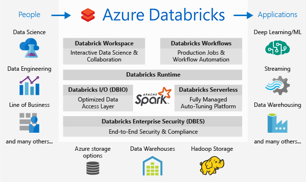

# Overview of Azure Databricks

Azure Databricks is a unified data analytics platform built on top of Apache Spark that unifies data science, data engineering, and business intelligence into a collaborative workspace and a highly preformative runtime that enables anyone to easily build and deploy advanced analytics solutions.

Databricks is developed by the people who created Apache Spark, the processing engine of choice for large-scale data workloads. Databricks is the most advanced, performant, reliable, and secure Spark platform available. Optimized for the Azure Platform, Azure Databricks provides a high-performance processing engine to improve and scale your analytics.

## Why use Azure Databricks?

Azure Databricks incorporates features that handle the operational tasks of your Spark deployments with minimal guidance from data engineers and data scientists. By simplifying the operational management of your Spark clusters, teams can focus on building data products instead of maintaining infrastructure and managing operations.

### Productivity

Azure Databricks enables you to spend less time processing data and more time delivering insights that drive innovation. You can achieve more with instant setup and streamlined workflows. Azure Databricks enables you to take on ambitious big data analytics challenges with a high-performance processing engine.

1. **Save time and cut costs**. Launch a new Spark environment with a single click. You can reduce cost and complexity of creating and maintaining Spark clusters by using a fully managed, cloud-native, Azure Databricks service. You can also use notebooks to unify the process, from data gathering and model creation, and instantly deploy to production.

2. **Accelerate data processing on fast Spark engines**. Azure Databricks enables you to use fast analytics engine optimized for Spark to target data of almost any size, or a project using a complete set of analytics technologies including SQL, Streaming, MLlib, and Graph.

3. **Improve sharing and insights through visualization**. You can use the notebooks in Azure Databricks to create visualizations to present your data. Also, through rich integration with PowerBI, Azure Databricks allows you to discover and share your insights.

### Security

Azure Databricks offers unmatched support and security for your data and analytics, complying with even the most rigorous enterprise SLAs. You can use built-in rich Azure Active Directory integration to build greater security into your solution. You can also enable users to be more productive with fine-grained user permissions through Azure Databricks rules-based access.

* **Encryption**: Provides strong encryption at rest and in flight with standards compliance, including SSL. 
* **Integrated Identity Management**: Facilitates integration with Azure Active Directory.
* **Role-Based Access Control**: Enables fine-grain management access to every component of the enterprise data infrastructure, including files, clusters, code, application deployments, dashboards, and reports. 
* **Data Governance**: Provides the ability to monitor and audit all actions taken in every aspect of the enterprise data infrastructure.
* **Compliance Standards**: Databricks has SOC 2 Type 1 certification and can offer a HIPAA-compliant service.

### Apache Spark orchestration in Azure

Azure Databricks offers a highly secure and reliable production Spark environment in the cloud. 

* Powerful cluster management capabilities enable you to create new clusters in seconds, dynamically scale them up and down, and share them across teams. 
* Intuitive interfaces enable your teams to use Spark with Power BI and other traditional BI tools, or programmatically use the clusters via restful APIs. 
* Secure data integration capabilities built on top of Spark so you can unify your data without centralization. 
* Instant access to the latest Spark features with each release

### Integrated workspace

Through a collaborative and integrated environment, Azure Databricks streamlines the process of exploring data, prototyping, and running data-driven applications in Spark. 

* Easy data exploration allows teams to determine what the data lets you do.
* Document your progress in notebooks--in R, Python, Scala, or SQL.
* Visualize data in just a few clicks, and use familiar tools like matplotlib, ggoplot, or d3.
* Interactive dashboards enable teams to create dynamic reports.
* Teams can easily use Spark and interact with the data simultaneously.

### Custom Spark applications
Azure Databricks provides a flexible job scheduler that enables transition from prototyping to production deployment without incremental work. 

* Monitor progress through custom alerts for job completion and failure, and easily view historical and in-progress results. 
* Enable production deployments, especially long-running applications such as streaming, to be automatically relaunched whenever a failure happens.
* Run notebooks as Spark jobs.

## Next steps

* [Get started with Azure Databricks](quickstart-create-databricks-workspace-portal.md)
* [Work with Spark clusters](https://docs.azuredatabricks.net/user-guide/clusters/index.html)
* [Work with notebooks](https://docs.azuredatabricks.net/user-guide/notebooks/index.html)
* [Create Spark jobs](https://docs.azuredatabricks.net/user-guide/jobs.html)

 

