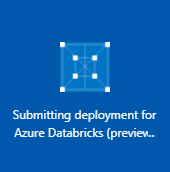
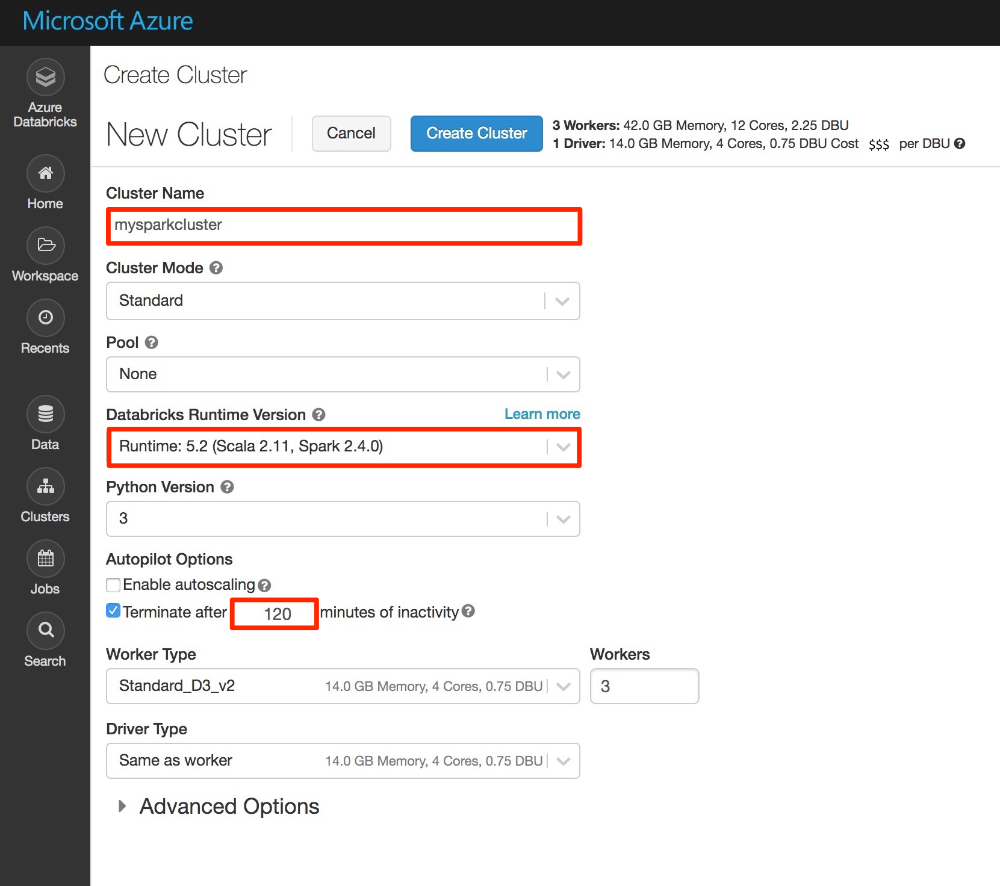
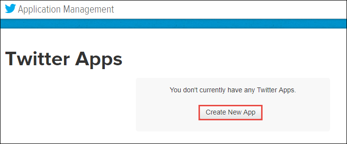
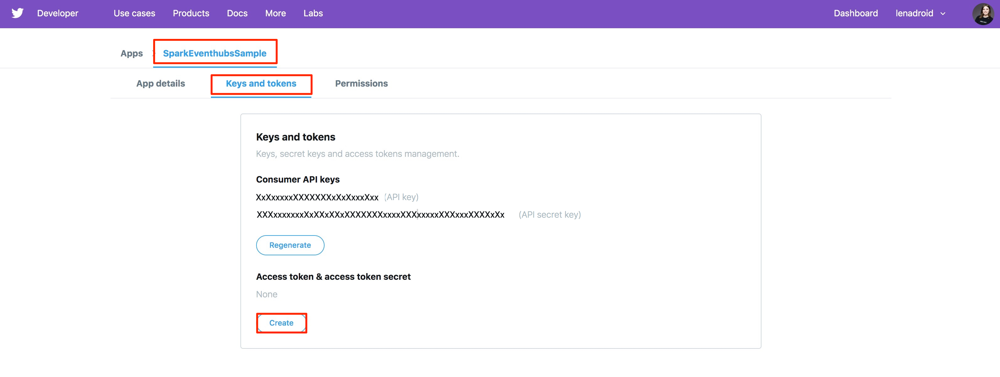
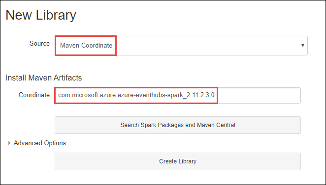
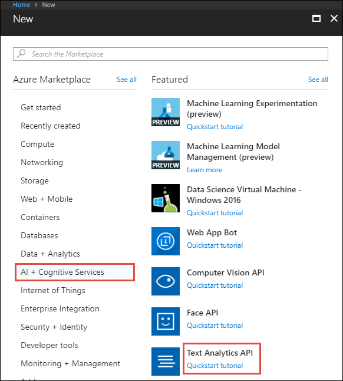
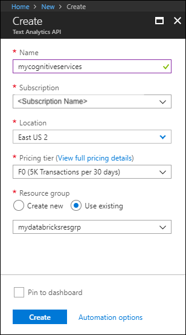
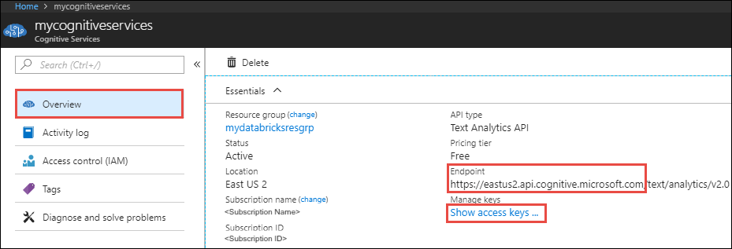
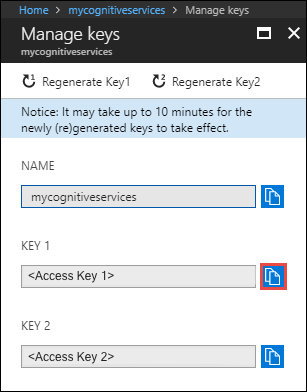
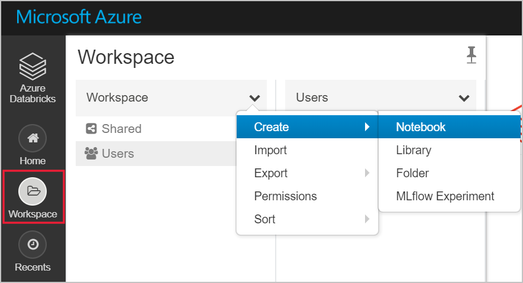

# Tutorial: Sentiment analysis on streaming data using Azure Databricks

In this tutorial, you learn how to run sentiment analysis on a stream of data using Azure Databricks in near real time. You set up data ingestion system using Azure Event Hubs. You consume the messages from Event Hubs into Azure Databricks using the Spark Event Hubs connector. Finally, you use Microsoft Cognitive Service APIs to run sentiment analysis on the streamed data.

By the end of this tutorial, you would have streamed tweets from Twitter that have the term "Azure" in them and ran sentiment analysis on the tweets.

The following illustration shows the application flow:


This tutorial covers the following tasks:

> [!div class="checklist"]
> * Create an Azure Databricks workspace
> * Create a Spark cluster in Azure Databricks
> * Create a Twitter app to access streaming data
> * Create notebooks in Azure Databricks
> * Attach libraries for Event Hubs and Twitter API
> * Create a Microsoft Cognitive Services account and retrieve the access key
> * Send tweets to Event Hubs
> * Read tweets from Event Hubs
> * Run sentiment analysis on tweets

If you don't have an Azure subscription, [create a free account](https://azure.microsoft.com/free/) before you begin.

> [!Note]
> This tutorial cannot be carried out using **Azure Free Trial Subscription**.
> To use a free account to create the Azure Databricks cluster, before creating the cluster, go to your profile and change your subscription to **pay-as-you-go**. For more information, see [Azure free account](https://azure.microsoft.com/free/).

## Prerequisites

Before you start with this tutorial, make sure to meet the following requirements:
- An Azure Event Hubs namespace.
- An Event Hub within the namespace.
- Connection string to access the Event Hubs namespace. The connection string should have a format similar to `Endpoint=sb://<namespace>.servicebus.windows.net/;SharedAccessKeyName=<key name>;SharedAccessKey=<key value>`.
- Shared access policy name and policy key for Event Hubs.

You can meet these requirements by completing the steps in the article, [Create an Azure Event Hubs namespace and event hub](../event-hubs/event-hubs-create.md).

## Sign in to the Azure portal

Sign in to the [Azure portal](https://portal.azure.com/).

## Create an Azure Databricks workspace

In this section, you create an Azure Databricks workspace using the Azure portal.

1. In the Azure portal, select **Create a resource** > **Data + Analytics** > **Azure Databricks**.

    

3. Under **Azure Databricks Service**, provide the values to create a Databricks workspace.

    

    Provide the following values:

    |Property  |Description  |
    |---------|---------|
    |**Workspace name**     | Provide a name for your Databricks workspace        |
    |**Subscription**     | From the drop-down, select your Azure subscription.        |
    |**Resource group**     | Specify whether you want to create a new resource group or use an existing one. A resource group is a container that holds related resources for an Azure solution. For more information, see [Azure Resource Group overview](../azure-resource-manager/resource-group-overview.md). |
    |**Location**     | Select **East US 2**. For other available regions, see [Azure services available by region](https://azure.microsoft.com/regions/services/).        |
    |**Pricing Tier**     |  Choose between **Standard** or **Premium**. For more information on these tiers, see [Databricks pricing page](https://azure.microsoft.com/pricing/details/databricks/).       |

    Select **Pin to dashboard** and then select **Create**.

4. The account creation takes a few minutes. During account creation, the portal displays the **Submitting deployment for Azure Databricks** tile on the right side. You may need to scroll right on your dashboard to see the tile. There is also a progress bar displayed near the top of the screen. You can watch either area for progress.

    

## Create a Spark cluster in Databricks

1. In the Azure portal, go to the Databricks workspace that you created, and then select **Launch Workspace**.

2. You are redirected to the Azure Databricks portal. From the portal, select **Cluster**.

    

3. In the **New cluster** page, provide the values to create a cluster.

    

    Accept all other default values other than the following:

   * Enter a name for the cluster.
   * For this article, create a cluster with **4.0 (beta)** runtime.
   * Make sure you select the **Terminate after \_\_ minutes of inactivity** checkbox. Provide a duration (in minutes) to terminate the cluster, if the cluster is not being used.

     Select **Create cluster**. Once the cluster is running, you can attach notebooks to the cluster and run Spark jobs.

## Create a Twitter application

To receive a stream of tweets, you must create an application in Twitter. Follow the steps to create a Twitter application and record the values that you need to complete this tutorial.

1. From a web browser, go to [Twitter Application Management](https://apps.twitter.com/), and select **Create New App**.

    

2. In the **Create an application** page, provide the details for the new app, and then select **Create your Twitter application**.

    

3. In the application page, select the **Keys and Access Tokens** tab and copy the values for **Consumer Key** and **Consumer Secret**. Also, select **Create my access token** to generate the access tokens. Copy the values for **Access Token** and **Access Token Secret**.

    

Save the values that you retrieved for the Twitter application. You need the values later in the tutorial.

## Attach libraries to Spark cluster

In this tutorial, you use the Twitter APIs to send tweets to Event Hubs. You also use the [Apache Spark Event Hubs connector](https://github.com/Azure/azure-event-hubs-spark) to read and write data into Azure Event Hubs. To use these APIs as part of your cluster, add them as libraries to Azure Databricks and then associate them with your Spark cluster. The following instructions show how to add the library to the **Shared** folder in your workspace.

1. In the Azure Databricks workspace, select **Workspace**, and then right-click **Shared**. From the context menu, select **Create** > **Library**.

   

2. In the New Library page, for **Source** select **Maven Coordinate**. For **Coordinate**, enter the coordinate for the package you want to add. Here is the Maven coordinates for the libraries used in this tutorial:

   * Spark Event Hubs connector - `com.microsoft.azure:azure-eventhubs-spark_2.11:2.3.5`
   * Twitter API - `org.twitter4j:twitter4j-core:4.0.6`

     

3. Select **Create Library**.

4. Select the folder where you added the library, and then select the library name.

    

5. On the library page, select the cluster where you want to use the library. Once the library is successfully associated with the cluster, the status immediately changes to **Attached**.

    

6. Repeat these steps for the Twitter package, `twitter4j-core:4.0.6`.

## Get a Cognitive Services access key

In this tutorial, you use the [Azure Cognitive Services Text Analytics APIs](../cognitive-services/text-analytics/overview.md) to run sentiment analysis on a stream of tweets in near real time. Before you use the APIs, you must create a Azure Cognitive Services account on Azure and retrieve an access key to use the Text Analytics APIs.

1. Sign in to the [Azure portal](https://portal.azure.com/).

2. Select **+ Create a resource**.

3. Under Azure Marketplace, Select **AI + Cognitive Services** > **Text Analytics API**.

    

4. In the **Create** dialog box, provide the following values:

    

   - Enter a name for the Cognitive Services account.
   - Select the Azure subscription under which the account is created.
   - Select an Azure location.
   - Select a pricing tier for the service. For more information about Cognitive Services pricing, see [pricing page](https://azure.microsoft.com/pricing/details/cognitive-services/).
   - Specify whether you want to create a new resource group or select an existing one.

     Select **Create**.

5. After the account is created, from the **Overview** tab, select **Show access keys**.

    

    Also, copy a part of the endpoint URL, as shown in the screenshot. You need this URL in the tutorial.

6. Under **Manage keys**, select the copy icon against the key you want to use.

    

7. Save the values for the endpoint URL and the access key, you retrieved in this step. You need it later in this tutorial.

## Create notebooks in Databricks

In this section, you create two notebooks in Databricks workspace with the following names

- **SendTweetsToEventHub** - A producer notebook you use to get tweets from Twitter and stream them to Event Hubs.
- **AnalyzeTweetsFromEventHub** - A consumer notebook you use to read the tweets from Event Hubs and run sentiment analysis.

1. In the left pane, select **Workspace**. From the **Workspace** drop-down, select **Create**, and then select **Notebook**.

    

2. In the **Create Notebook** dialog box, enter **SendTweetsToEventHub**, select **Scala** as the language, and select the Spark cluster that you created earlier.

    

    Select **Create**.

3. Repeat the steps to create the **AnalyzeTweetsFromEventHub** notebook.

## Send tweets to Event Hubs

In the **SendTweetsToEventHub** notebook, paste the following code, and replace the placeholder with values for your Event Hubs namespace and Twitter application that you created earlier. This notebook streams tweets with the keyword "Azure" into Event Hubs in real time.

```scala
import java.util._
import scala.collection.JavaConverters._
import com.microsoft.azure.eventhubs._
import java.util.concurrent._

val namespaceName = "<EVENT HUBS NAMESPACE>"
val eventHubName = "<EVENT HUB NAME>"
val sasKeyName = "<POLICY NAME>"
val sasKey = "<POLICY KEY>"
val connStr = new ConnectionStringBuilder()
            .setNamespaceName(namespaceName)
            .setEventHubName(eventHubName)
            .setSasKeyName(sasKeyName)
            .setSasKey(sasKey)

val pool = Executors.newScheduledThreadPool(1)
val eventHubClient = EventHubClient.create(connStr.toString(), pool)

def sendEvent(message: String) = {
  val messageData = EventData.create(message.getBytes("UTF-8"))
  eventHubClient.get().send(messageData)
  System.out.println("Sent event: " + message + "\n")
}

import twitter4j._
import twitter4j.TwitterFactory
import twitter4j.Twitter
import twitter4j.conf.ConfigurationBuilder

// Twitter configuration!
// Replace values below with yours

val twitterConsumerKey = "<CONSUMER KEY>"
val twitterConsumerSecret = "<CONSUMER SECRET>"
val twitterOauthAccessToken = "<ACCESS TOKEN>"
val twitterOauthTokenSecret = "<TOKEN SECRET>"

val cb = new ConfigurationBuilder()
  cb.setDebugEnabled(true)
  .setOAuthConsumerKey(twitterConsumerKey)
  .setOAuthConsumerSecret(twitterConsumerSecret)
  .setOAuthAccessToken(twitterOauthAccessToken)
  .setOAuthAccessTokenSecret(twitterOauthTokenSecret)

val twitterFactory = new TwitterFactory(cb.build())
val twitter = twitterFactory.getInstance()

// Getting tweets with keyword "Azure" and sending them to the Event Hub in realtime!

val query = new Query(" #Azure ")
query.setCount(100)
query.lang("en")
var finished = false
while (!finished) {
  val result = twitter.search(query)
  val statuses = result.getTweets()
  var lowestStatusId = Long.MaxValue
  for (status <- statuses.asScala) {
    if(!status.isRetweet()){
      sendEvent(status.getText())
    }
    lowestStatusId = Math.min(status.getId(), lowestStatusId)
    Thread.sleep(2000)
  }
  query.setMaxId(lowestStatusId - 1)
}

// Closing connection to the Event Hub
 eventHubClient.get().close()
```

To run the notebook, press **SHIFT + ENTER**. You see an output as shown in the following snippet. Each event in the output is a tweet that is ingested into the Event Hubs.

    Sent event: @Microsoft and @Esri launch Geospatial AI on Azure https://t.co/VmLUCiPm6q via @geoworldmedia #geoai #azure #gis #ArtificialIntelligence

    Sent event: Public preview of Java on App Service, built-in support for Tomcat and OpenJDK
    https://t.co/7vs7cKtvah
    #cloudcomputing #Azure

    Sent event: 4 Killer #Azure Features for #Data #Performance https://t.co/kpIb7hFO2j by @RedPixie

    Sent event: Migrate your databases to a fully managed service with Azure SQL Database Managed Instance | #Azure | #Cloud https://t.co/sJHXN4trDk

    Sent event: Top 10 Tricks to #Save Money with #Azure Virtual Machines https://t.co/F2wshBXdoz #Cloud

    ...
    ...

## Read tweets from Event Hubs

In the **AnalyzeTweetsFromEventHub** notebook, paste the following code, and replace the placeholder with values for your Azure Event Hubs that you created earlier. This notebook reads the tweets that you earlier streamed into Event Hubs using the **SendTweetsToEventHub** notebook.

```scala
import org.apache.spark.eventhubs._

// Build connection string with the above information
val namespaceName = "<EVENT HUBS NAMESPACE>"
val eventHubName = "<EVENT HUB NAME>"
val sasKeyName = "<POLICY NAME>"
val sasKey = "<POLICY KEY>"
val connectionString = ConnectionStringBuilder()
            .setNamespaceName(namespaceName)
            .setEventHubName(eventHubName)
            .setSasKeyName(sasKeyName)
            .setSasKey(sasKey)

val customEventhubParameters =
  EventHubsConf(connectionString.toString())
  .setMaxEventsPerTrigger(5)

val incomingStream = spark.readStream.format("eventhubs").options(customEventhubParameters.toMap).load()

incomingStream.printSchema

// Sending the incoming stream into the console.
// Data comes in batches!
incomingStream.writeStream.outputMode("append").format("console").option("truncate", false).start().awaitTermination()
```

You get the following output:

    root
     |-- body: binary (nullable = true)
     |-- offset: long (nullable = true)
     |-- seqNumber: long (nullable = true)
     |-- enqueuedTime: long (nullable = true)
     |-- publisher: string (nullable = true)
     |-- partitionKey: string (nullable = true)

    -------------------------------------------
    Batch: 0
    -------------------------------------------
    +------+------+--------------+---------------+---------+------------+
    |body  |offset|sequenceNumber|enqueuedTime   |publisher|partitionKey|
    +------+------+--------------+---------------+---------+------------+
    |[50 75 62 6C 69 63 20 70 72 65 76 69 65 77 20 6F 66 20 4A 61 76 61 20 6F 6E 20 41 70 70 20 53 65 72 76 69 63 65 2C 20 62 75 69 6C 74 2D 69 6E 20 73 75 70 70 6F 72 74 20 66 6F 72 20 54 6F 6D 63 61 74 20 61 6E 64 20 4F 70 65 6E 4A 44 4B 0A 68 74 74 70 73 3A 2F 2F 74 2E 63 6F 2F 37 76 73 37 63 4B 74 76 61 68 20 0A 23 63 6C 6F 75 64 63 6F 6D 70 75 74 69 6E 67 20 23 41 7A 75 72 65]                              |0     |0             |2018-03-09 05:49:08.86 |null     |null        |
    |[4D 69 67 72 61 74 65 20 79 6F 75 72 20 64 61 74 61 62 61 73 65 73 20 74 6F 20 61 20 66 75 6C 6C 79 20 6D 61 6E 61 67 65 64 20 73 65 72 76 69 63 65 20 77 69 74 68 20 41 7A 75 72 65 20 53 51 4C 20 44 61 74 61 62 61 73 65 20 4D 61 6E 61 67 65 64 20 49 6E 73 74 61 6E 63 65 20 7C 20 23 41 7A 75 72 65 20 7C 20 23 43 6C 6F 75 64 20 68 74 74 70 73 3A 2F 2F 74 2E 63 6F 2F 73 4A 48 58 4E 34 74 72 44 6B]            |168   |1             |2018-03-09 05:49:24.752|null     |null        |
    +------+------+--------------+---------------+---------+------------+

    -------------------------------------------
    Batch: 1
    -------------------------------------------
    ...
    ...

Because the output is in a binary mode, use the following snippet to convert it into string.

```scala
import org.apache.spark.sql.types._
import org.apache.spark.sql.functions._

// Event Hub message format is JSON and contains "body" field
// Body is binary, so we cast it to string to see the actual content of the message
val messages =
  incomingStream
  .withColumn("Offset", $"offset".cast(LongType))
  .withColumn("Time (readable)", $"enqueuedTime".cast(TimestampType))
  .withColumn("Timestamp", $"enqueuedTime".cast(LongType))
  .withColumn("Body", $"body".cast(StringType))
  .select("Offset", "Time (readable)", "Timestamp", "Body")

messages.printSchema

messages.writeStream.outputMode("append").format("console").option("truncate", false).start().awaitTermination()
```

The output now resembles the following snippet:

    root
     |-- Offset: long (nullable = true)
     |-- Time (readable): timestamp (nullable = true)
     |-- Timestamp: long (nullable = true)
     |-- Body: string (nullable = true)

    -------------------------------------------
    Batch: 0
    -------------------------------------------
    +------+-----------------+----------+-------+
    |Offset|Time (readable)  |Timestamp |Body
    +------+-----------------+----------+-------+
    |0     |2018-03-09 05:49:08.86 |1520574548|Public preview of Java on App Service, built-in support for Tomcat and OpenJDK
    https://t.co/7vs7cKtvah
    #cloudcomputing #Azure          |
    |168   |2018-03-09 05:49:24.752|1520574564|Migrate your databases to a fully managed service with Azure SQL Database Managed Instance | #Azure | #Cloud https://t.co/sJHXN4trDk    |
    |0     |2018-03-09 05:49:02.936|1520574542|@Microsoft and @Esri launch Geospatial AI on Azure https://t.co/VmLUCiPm6q via @geoworldmedia #geoai #azure #gis #ArtificialIntelligence|
    |176   |2018-03-09 05:49:20.801|1520574560|4 Killer #Azure Features for #Data #Performance https://t.co/kpIb7hFO2j by @RedPixie                                                    |
    +------+-----------------+----------+-------+
    -------------------------------------------
    Batch: 1
    -------------------------------------------
    ...
    ...

You have now streamed data from Azure Event Hubs into Azure Databricks at near real time using the Event Hubs connector for Apache Spark. For more information on how to use the Event Hubs connector for Spark, see the [connector documentation](https://github.com/Azure/azure-event-hubs-spark/tree/master/docs).

## Run sentiment analysis on tweets

In this section, you run sentiment analysis on the tweets received using the Twitter API. For this section, you add the code snippets to the same **AnalyzeTweetsFromEventHub** notebook.

Start by adding a new code cell in the notebook and paste the code snippet provided below. This code snippet defines data types for working with the Language and Sentiment API.

```scala
import java.io._
import java.net._
import java.util._

case class Language(documents: Array[LanguageDocuments], errors: Array[Any]) extends Serializable
case class LanguageDocuments(id: String, detectedLanguages: Array[DetectedLanguages]) extends Serializable
case class DetectedLanguages(name: String, iso6391Name: String, score: Double) extends Serializable

case class Sentiment(documents: Array[SentimentDocuments], errors: Array[Any]) extends Serializable
case class SentimentDocuments(id: String, score: Double) extends Serializable

case class RequestToTextApi(documents: Array[RequestToTextApiDocument]) extends Serializable
case class RequestToTextApiDocument(id: String, text: String, var language: String = "") extends Serializable
```

Add a new code cell and paste the snippet provided below. This snippet defines an object that contains functions to call the Text Analysis API to run language detection and sentiment analysis. Make sure you replace the placeholders, `<PROVIDE ACCESS KEY HERE>` and `<PROVIDE REGION HERE>`, with the values you retrieved for your Cognitive Services account.

```scala
import javax.net.ssl.HttpsURLConnection
import com.google.gson.Gson
import com.google.gson.GsonBuilder
import com.google.gson.JsonObject
import com.google.gson.JsonParser
import scala.util.parsing.json._

object SentimentDetector extends Serializable {

    // Cognitive Services API connection settings
    val accessKey = "<PROVIDE ACCESS KEY HERE>"
    val host = "https://<PROVIDE REGION HERE>.api.cognitive.microsoft.com"
    val languagesPath = "/text/analytics/v2.0/languages"
    val sentimentPath = "/text/analytics/v2.0/sentiment"
    val languagesUrl = new URL(host+languagesPath)
    val sentimenUrl = new URL(host+sentimentPath)
    val g = new Gson

    def getConnection(path: URL): HttpsURLConnection = {
        val connection = path.openConnection().asInstanceOf[HttpsURLConnection]
        connection.setRequestMethod("POST")
        connection.setRequestProperty("Content-Type", "text/json")
        connection.setRequestProperty("Ocp-Apim-Subscription-Key", accessKey)
        connection.setDoOutput(true)
        return connection
    }

    def prettify (json_text: String): String = {
        val parser = new JsonParser()
        val json = parser.parse(json_text).getAsJsonObject()
        val gson = new GsonBuilder().setPrettyPrinting().create()
        return gson.toJson(json)
    }

    // Handles the call to Cognitive Services API.
    def processUsingApi(request: RequestToTextApi, path: URL): String = {
        val requestToJson = g.toJson(request)
        val encoded_text = requestToJson.getBytes("UTF-8")
        val connection = getConnection(path)
        val wr = new DataOutputStream(connection.getOutputStream())
        wr.write(encoded_text, 0, encoded_text.length)
        wr.flush()
        wr.close()

        val response = new StringBuilder()
        val in = new BufferedReader(new InputStreamReader(connection.getInputStream()))
        var line = in.readLine()
        while (line != null) {
            response.append(line)
            line = in.readLine()
        }
        in.close()
        return response.toString()
    }

    // Calls the language API for specified documents.
    def getLanguage (inputDocs: RequestToTextApi): Option[Language] = {
        try {
            val response = processUsingApi(inputDocs, languagesUrl)
            // In case we need to log the json response somewhere
            val niceResponse = prettify(response)
            // Deserializing the JSON response from the API into Scala types
            val language = g.fromJson(niceResponse, classOf[Language])
            if (language.documents(0).detectedLanguages(0).iso6391Name == "(Unknown)")
                return None
            return Some(language)
        } catch {
            case e: Exception => return None
        }
    }

    // Calls the sentiment API for specified documents. Needs a language field to be set for each of them.
    def getSentiment (inputDocs: RequestToTextApi): Option[Sentiment] = {
        try {
            val response = processUsingApi(inputDocs, sentimenUrl)
            val niceResponse = prettify(response)
            // Deserializing the JSON response from the API into Scala types
            val sentiment = g.fromJson(niceResponse, classOf[Sentiment])
            return Some(sentiment)
        } catch {
            case e: Exception => return None
        }
    }
}
```

Add another cell to define a Spark UDF (User-defined function) that determines sentiment.

```scala
// User Defined Function for processing content of messages to return their sentiment.
val toSentiment =
    udf((textContent: String) =>
        {
            val inputObject = new RequestToTextApi(Array(new RequestToTextApiDocument(textContent, textContent)))
            val detectedLanguage = SentimentDetector.getLanguage(inputObject)
            detectedLanguage match {
                case Some(language) =>
                    if(language.documents.size > 0) {
                        inputObject.documents(0).language = language.documents(0).detectedLanguages(0).iso6391Name
                        val sentimentDetected = SentimentDetector.getSentiment(inputObject)
                        sentimentDetected match {
                            case Some(sentiment) => {
                                if(sentiment.documents.size > 0) {
                                    sentiment.documents(0).score.toString()
                                }
                                else {
                                    "Error happened when getting sentiment: " + sentiment.errors(0).toString
                                }
                            }
                            case None => "Couldn't detect sentiment"
                        }
                    }
                    else {
                        "Error happened when getting language" + language.errors(0).toString
                    }
                case None => "Couldn't detect language"
            }
        }
    )
```

Add a final code cell to prepare a dataframe with the content of the tweet and the sentiment associated with the tweet.

```scala
// Prepare a dataframe with Content and Sentiment columns
val streamingDataFrame = incomingStream.selectExpr("cast (body as string) AS Content").withColumn("Sentiment", toSentiment($"Content"))

// Display the streaming data with the sentiment
streamingDataFrame.writeStream.outputMode("append").format("console").option("truncate", false).start().awaitTermination()
```

You should see an output like the following snippet:

    -------------------------------------------
    Batch: 0
    -------------------------------------------
    +--------------------------------+------------------+
    |Content                         |Sentiment         |
    +--------------------------------+------------------+
    |Public preview of Java on App Service, built-in support for Tomcat and OpenJDK
    https://t.co/7vs7cKtvah   #cloudcomputing #Azure          |0.7761918306350708|
    |Migrate your databases to a fully managed service with Azure SQL Database Managed Instance | #Azure | #Cloud https://t.co/sJHXN4trDk    |0.8558163642883301|
    |@Microsoft and @Esri launch Geospatial AI on Azure https://t.co/VmLUCiPm6q via @geoworldmedia #geoai #azure #gis #ArtificialIntelligence|0.5               |
    |4 Killer #Azure Features for #Data #Performance https://t.co/kpIb7hFO2j by @RedPixie                                                    |0.5               |
    +--------------------------------+------------------+

A value closer to **1** in the **Sentiment** column suggests a great experience with Azure. A value closer to **0** suggests issues that users faced while working with Microsoft Azure.

That's it! Using Azure Databricks, you have successfully streamed data into Azure Event Hubs, consumed the stream data using the Event Hubs connector, and then ran sentiment analysis on streaming data in near real time.

## Clean up resources

After you have finished running the tutorial, you can terminate the cluster. To do so, from the Azure Databricks workspace, from the left pane, select **Clusters**. For the cluster you want to terminate, move the cursor over the ellipsis under **Actions** column, and select the **Terminate** icon.


If you do not manually terminate the cluster it will automatically stop, provided you selected the **Terminate after \_\_ minutes of inactivity** checkbox while creating the cluster. In such a case, the cluster will automatically stop if it has been inactive for the specified time.

## Next steps
In this tutorial, you learned how to use Azure Databricks to stream data into Azure Event Hubs and then read the streaming data from Event Hubs in real time. You learned how to:
> [!div class="checklist"]
> * Create an Azure Databricks workspace
> * Create a Spark cluster in Azure Databricks
> * Create a Twitter app to access streaming data
> * Create notebooks in Azure Databricks
> * Add and attach libraries for Event Hubs and Twitter API
> * Create a Microsoft Cognitive Services account and retrieve the access key
> * Send tweets to Event Hubs
> * Read tweets from Event Hubs
> * Run sentiment analysis on tweets

Advance to the next tutorial to learn about performing machine learning tasks using Azure Databricks.

> [!div class="nextstepaction"]
>[Machine Learning using Azure Databricks](https://docs.azuredatabricks.net/spark/latest/mllib/decision-trees.html)
