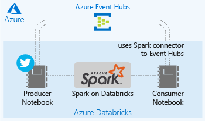
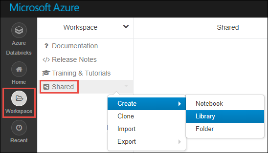
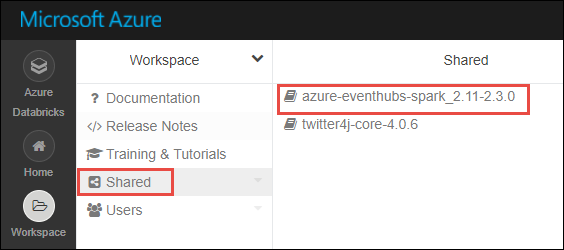
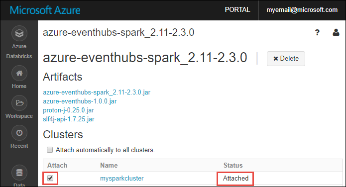

# Stream events into Azure Databricks using Event Hubs

Azure Databricks is an Apache Spark-based analytics platform optimized for the Microsoft Azure cloud services platform. In this tutorial, you learn how to stream real-time data into Azure Databricks using Azure Event Hubs and data from public Twitter API.

This tutorial covers the following tasks: 

> [!div class="checklist"]
> * Create an Azure Databricks workspace
> * Create a Spark cluster in Azure Databricks
> * Create a Twitter app to access real-time data
> * Create notebooks in Azure Databricks
> * Add and attach libraries for Event Hubs and Twitter
> * Send tweets to Event Hubs
> * Receive messages from Event Hubs

If you don't have an Azure subscription, [create a free account](https://azure.microsoft.com/free/) before you begin.

## Prerequisites

Before you start with this tutorial, make sure you have the following:
- An Azure Event Hubs namespace.
- An Event Hub within the namespace.
- Connection string to access the Event Hubs namespace. The connection string should have a format similar to `Endpoint=sb://<namespace>.servicebus.windows.net/;SharedAccessKeyName=<key name>;SharedAccessKey=<key value>”`.
- Policy name and policy key

You can meet these requirements by completing the steps in the article [Create an Azure Event Hubs namespace and event hub](../event-hubs/event-hubs-create.md).

## What does this tutorial do?

In this tutorial, you set up a real-time data ingestion pipeline using Azure Event Hubs. You connect the pipeline to Spark on Azure Databricks to process the messages coming through the pipeline. To simulate a real-time stream of data, you use Twitter APIs to ingest tweets into Event Hubs. The following screenshot shows the application flow.

## Log in to the Azure portal

Log in to the [Azure portal](https://portal.azure.com/).

## Create an Azure Databricks workspace

In this section, you create an Azure Databricks workspace using the Azure portal. 

1. In the Azure portal, click **Create a resource**, click **Data + Analytics**, and then click **Azure Databricks (Preview)**. 

    

2. Under **Azure Databricks (Preview)**, click **Create**.

3. Under **Azure Databricks Service**, provide the following values:

    

    * For **Workspace name**, provide a name for your Databricks workspace.
    * For **Subscription**, from the drop-down, select your Azure subscription.
    * For **Resource group**, specify whether you want to create a new resource group or use an existing one. A resource group is a container that holds related resources for an Azure solution. For more information, see [Azure Resource Group overview](../azure-resource-manager/resource-group-overview.md).
    * For **Location**, select **East US 2**. For other available regions, see [Azure services available by region](https://azure.microsoft.com/regions/services/).

4. Click **Create**.

## Create a Spark cluster in Databricks

1. In the Azure portal, go to the Databricks workspace that you created, and then click **Initialize Workspace**.

2. You are redirected to the Azure Databricks portal. From the portal, click **Cluster**.

    

3. In the **New cluster** page, provide the values to create a cluster.

    

    * Enter a name for the cluster.
    * For this article, create a cluster with **4.0** runtime. 
    * Make sure you select the **Terminate after ____ minutes of inactivity** checkbox. Provide a duration (in minutes) to terminate the cluster, if the cluster is not being used.
    * Accept all other default values. 
    * Click **Create cluster**. Once the cluster is running, you can attach notebooks to the cluster and run Spark jobs.

## Create a Twitter application

To receive a real-time stream of tweets, you must create an application in Twitter. Follow the steps to create a Twitter application and record the values that you need to complete this tutorial.

1. From a web browser, go to [Twitter Application Management](http://twitter.com/app), and click **Create New App**.

    

2. In the **Create an application** page, provide the details for the new app, and then click **Create your Twitter application**.

    

3. In the application page, click the **Keys and Access Tokens** tab and copy the values for **Consume Key** and **Consumer Secret**. Also, click **Create my access token** to generate the access tokens. Copy the values for **Access Token** and **Access Token Secret**.

    

Save the values that you retrieved for the Twitter application. You need this later in the tutorial.

## Add libraries to the cluster

In this tutorial, you use the Twitter APIs to send tweets to Events Hub. You also use the [Apache Spark Event Hubs connector](https://github.com/Azure/azure-event-hubs-spark) to read and write data into Azure Events Hub. To use these APIs as part of your cluster, you must add them as libraries to Azure Databricks and then associate them with your Spark cluster. The instructions below show how to add the library to the **Shared** folder in your workspace.

1.  In the Azure Databricks workspace, click **Workspace**, and then right-click **Shared**. From the context menu, click **Create** > **Library**.

    

2. In the New Library page, for **Source** select **Maven Coordinate**. For **Coordinate**, enter the coordinate for the package you want to add. Here are the Maven coordinates for the libraries used in this tutorial:

    * Spark Event Hubs connector - `com.microsoft.azure:azure-eventhubs-spark_2.11:2.3.0`
    * Twitter API - `org.twitter4j:twitter4j-core:4.0.6`

    

3. Click **Create Library**.

4. Click the folder where you added the library, and then click the library name.

    

5. On the library page, select the cluster where you want to use the library. Once the library is successfully associated with the cluster, the status immediately changes to **Attached**.

    

6. Repeat these steps for the library you added for Twitter API.

## Create notebooks in Databricks

In this section, you create two notebooks in Databricks workspace with the following names

- **SendTweetsToEventHub** - You use this notebook to get tweets from Twitter and stream them to Events Hub.
- **ReadTweetsFromEventHub** - You use this notebook to read the tweets from Events Hub.

1. In the left pane, click **Workspace**. From the **Workspace** drop-down, click **Create**, and then click **Notebook**.

    

2. In the **Create Notebook** dialog box, enter **SendTweetsToEventHub**, select **Scala** as the language, and select the Spark cluster that you created earlier.

    

    Click **Create**.

3. Repeat the steps to create the **ReadTweetsFromEventHub** notebook.

## Send message to Event Hubs

In the **SendTweetsToEventHub** notebook, paste the following code, and replace the placeholder with values for your Event Hubs namesapce and Twitter application that you created earlier. This notebook streams tweets with the keyword "Azure" into Events Hub.

    import java.util._
    import scala.collection.JavaConverters._
    import com.microsoft.azure.eventhubs._
    import java.util.concurrent._
    
    val namespaceName = "<EVENT HUBS NAMESPACE>"
    val eventHubName = "<EVENT HUB NAME>"
    val sasKeyName = "<POLICY NAME>"
    val sasKey = "<POLICY KEY>"
    val connStr = new ConnectionStringBuilder()
                .setNamespaceName(namespaceName)
                .setEventHubName(eventHubName)
                .setSasKeyName(sasKeyName)
                .setSasKey(sasKey)
    
    val pool = Executors.newFixedThreadPool(1)
    val eventHubClient = EventHubClient.create(connStr.toString(), pool)
    
    def sendEvent(message: String) = {
      val messageData = EventData.create(message.getBytes("UTF-8"))
      eventHubClient.get().send(messageData) 
      System.out.println("Sent event: " + message + "\n")
    }
    
    import twitter4j._
    import twitter4j.TwitterFactory
    import twitter4j.Twitter
    import twitter4j.conf.ConfigurationBuilder
    
    // Twitter configuration!
    // Replace values below with yours
    
    val twitterConsumerKey = "<CONSUMER KEY>"
    val twitterConsumerSecret = "<CONSUMER SECRET>"
    val twitterOauthAccessToken = "<ACCESS TOKEN>"
    val twitterOauthTokenSecret = "<TOKEN SECRET>"
    
    val cb = new ConfigurationBuilder()
      cb.setDebugEnabled(true)
      .setOAuthConsumerKey(twitterConsumerKey)
      .setOAuthConsumerSecret(twitterConsumerSecret)
      .setOAuthAccessToken(twitterOauthAccessToken)
      .setOAuthAccessTokenSecret(twitterOauthTokenSecret)
    
    val twitterFactory = new TwitterFactory(cb.build())
    val twitter = twitterFactory.getInstance()
    
    // Getting tweets with keyword "Azure" and sending them to the Event Hub in realtime!
    
    val query = new Query(" #Azure ")
    query.setCount(100)
    query.lang("en")
    var finished = false
    while (!finished) {
      val result = twitter.search(query) 
      val statuses = result.getTweets()
      var lowestStatusId = Long.MaxValue
      for (status <- statuses.asScala) {
        if(!status.isRetweet()){ 
          sendEvent(status.getText())
        }
        lowestStatusId = Math.min(status.getId(), lowestStatusId)
        Thread.sleep(2000)
      }
      query.setMaxId(lowestStatusId - 1)
    }
    
    // Closing connection to the Event Hub
    eventHubClient.get().close()

Press SHIFT + ENTER to run the notebook. You will see the following output.

    Sent event: What Is App Service Environment? https://t.co/NnZvYLaVkJ @PetriFeed  Deploy #Azure apps in an isolated environment… https://t.co/05KgO2aZYK

    Sent event: Wanting to build bots? Get started today with these #Azure Bot Service tutorials: https://t.co/bH5D2gVUZu #SharePoint #Office365

    Sent event: Wanting to build bots? Get started today with these #Azure Bot Service tutorials: https://t.co/kNRXmI5PQ6… https://t.co/WaGRwHgllT

    Sent event: Wanting to build bots? Get started today with these #Azure Bot Service tutorials: https://t.co/bWTCp8GMrv

    Sent event: Getting started with #Azure #IoT #Edge development https://t.co/qVMZnNc7tM https://t.co/xojeJJJ84r

    Sent event: #ICYDK: Full MeitY accreditation enables Indian public sector to deploy on Azure: Microsoft recently became one of… https://t.co/JZSCEfT4VS

## Read message from Event Hubs

In the **ReadTweetsFromEventHub** notebook, paste the following code, and replace the placeholder with values for your Azure Event Hubs that you created earlier. This notebook reads the tweets that you earlier streamed into Events Hub using the **SendTweetsToEventHub** notebook.

    import org.apache.spark.eventhubs._

    // Build connection string with the above information 
    val connectionString = ConnectionStringBuilder("<EVENT HUBS CONNECTION STRING>")
      .setEventHubName("<EVENT HUB NAME>")
      .build
    
    val customEventhubParameters = 
      EventHubsConf(connectionString)
      .setMaxEventsPerTrigger(5)
    
    val incomingStream = spark.readStream.format("eventhubs").options(customEventhubParameters.toMap).load()
    
    incomingStream.printSchema
    
    // Sending the incoming stream into the console.
    // Data comes in batches!
    incomingStream.writeStream.outputMode("append").format("console").option("truncate", false).start().awaitTermination()

You get the following output.

  
    root
     |-- body: binary (nullable = true)
     |-- offset: long (nullable = true)
     |-- seqNumber: long (nullable = true)
     |-- enqueuedTime: long (nullable = true)
     |-- publisher: string (nullable = true)
     |-- partitionKey: string (nullable = true)
   
    -------------------------------------------
    Batch: 0
    -------------------------------------------
    +----------+------+---------+------------+---------+------------+----------+
    |body|offset|seqNumber|enqueuedTime|publisher|partitionKey|properties|
    +------+------+---------+------------+---------+------------+----------+
    |[41 62 6F 75 74 20 74 6F 20 73 74 61 72 74 20 6D 79 20 74 68 69 72 64 20 73 68 69 66 74 20 74 6F 64 61 79 2C 20 64 65 6C 69 76 65 72 69 6E 67 20 61 20 63 75 73 74 6F 6D 20 23 41 7A 75 72 65 20 23 53 65 63 75 72 69 74 79 20 43 65 6E 74 65 72 20 74 72 61 69 6E 69 6E 67 20 66 6F 72 20 61 20 63 75 73 74 6F 6D 65 72 2E 20 46 6F 63 75 73 20 6F 6E E2 80 A6 20 68 74 74 70 73 3A 2F 2F 74 2E 63 6F 2F 48 7A 4E 44 62 6C 75 30 61 32]|0     |0        |1519782402  |null     |null        |[]        |

Because the output is in a binary mode, use the following snippet to convert it into string.

    import org.apache.spark.sql.types._
    import org.apache.spark.sql.functions._
    
    // Event Hub message format is JSON and contains "body" field
    // Body is binary, so we cast it to string to see the actual content of the message
    val messages = 
      incomingStream
      .withColumn("Offset", $"offset".cast(LongType))
      .withColumn("Time (readable)", $"enqueuedTime".cast(TimestampType))
      .withColumn("Timestamp", $"enqueuedTime".cast(LongType))
      .withColumn("Body", $"body".cast(StringType))
      .select("Offset", "Time (readable)", "Timestamp", "Body")
    
    messages.printSchema
    
    messages.writeStream.outputMode("append").format("console").option("truncate", false).start().awaitTermination()

The output now resembles the following snippet.

    root
     |-- Offset: long (nullable = true)
     |-- Time (readable): timestamp (nullable = true)
     |-- Timestamp: long (nullable = true)
     |-- Body: string (nullable = true)
    
    -------------------------------------------
    Batch: 0
    -------------------------------------------
    +------+------------------+-----------+-------+
    |Offset|Time (readable)   |Timestamp  |Body   |
    +------+------------------+-----------+-------+
    |0     |2018-02-28 01:46:42.368|1519782402|About to start my third shift today, delivering a custom #Azure #Security Center training for a customer. Focus on… https://t.co/HzNDblu0a2|
    |184   |2018-02-28 01:46:45.869|1519782405|Read the blog and learn how to securely shift your workload to #Azure: https://t.co/rsmcZA3knd https://t.co/o021XWLjOl                     |
    |0     |2018-02-28 01:46:44.117|1519782404|Looking for investments in the #cloud ? Try these. 4 Top Cloud Stocks to Buy Now @themotleyfool #stocks $MSFT,… https://t.co/PvanIE2KPw    |
    |176   |2018-02-28 01:46:47.867|1519782407|#DataScientists Q&A discussion forum >> Which is the best #BigData Analytics platform for beginners -- #AWS vs… https://t.co/M94LJeWwoH    |
    +------+------------------+-----------+-------+
    
    -------------------------------------------
    Batch: 1
    -------------------------------------------
    ...
    ...

## Next steps 
In this tutorial, you learned how to use Azure Databricks to stream data into Azure Events Hub and then read the streaming data from Events Hub in real time. You learned how to:
> [!div class="checklist"]
> * Create an Azure Databricks workspace
> * Create a Spark cluster in Azure Databricks
> * Create a Twitter app to generate streaming data
> * Create a notebook in Azure Databricks
> * Add libraries for Event Hubs and Twitter
> * Send tweets to Event Hubs
> * Receive messages from Event Hubs

Advance to the next tutorial to learn about performing sentiment analysis on the streamed data using Azure Databricks and [Azure Cognitive Services API](../cognitive-services/text-analytics/overview.md).

> [!div class="nextstepaction"]
>[Sentiment analyis on streaming data using Azure Databricks ](quickstart-create-databricks-workspace-portal.md)
