# Tutorial: Stream data into Azure Databricks using Event Hubs

In this tutorial, you connect a data ingestion system with Azure Databricks to stream data into an Apache Spark cluster in near real-time. You set up data ingestion system using Azure Event Hubs and then connect it to Azure Databricks to process the messages coming through. To access a stream of data, you use Twitter APIs to ingest tweets into Event Hubs. Once you have the data in Azure Databricks, you can run analytical jobs to further analyze the data.

By the end of this tutorial, you would have streamed tweets from Twitter (that have the term "Azure" in them) and read the tweets in Azure Databricks.

The following illustration shows the application flow:

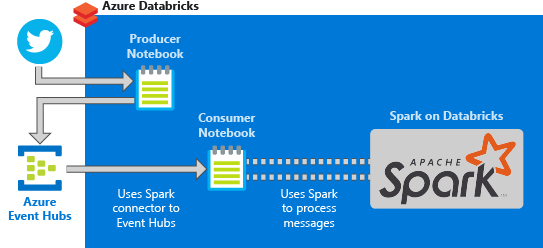

This tutorial covers the following tasks:

> [!div class="checklist"]
> * Create an Azure Databricks workspace
> * Create a Spark cluster in Azure Databricks
> * Create a Twitter app to access streaming data
> * Create notebooks in Azure Databricks
> * Attach libraries for Event Hubs and Twitter API
> * Send tweets to Event Hubs
> * Read tweets from Event Hubs

If you don't have an Azure subscription, [create a free account](https://azure.microsoft.com/free/) before you begin.

> [!Note]
> This tutorial cannot be carried out using **Azure Free Trial Subscription**.
> If you have a free account, go to your profile and change your subscription to **pay-as-you-go**. For more information, see [Azure free account](https://azure.microsoft.com/free/). Then, [remove the spending limit](https://docs.microsoft.com/azure/billing/billing-spending-limit#why-you-might-want-to-remove-the-spending-limit), and [request a quota increase](https://docs.microsoft.com/azure/azure-portal/supportability/resource-manager-core-quotas-request) for vCPUs in your region. When you create your Azure Databricks workspace, you can select the **Trial (Premium - 14-Days Free DBUs)** pricing tier to give the workspace access to free Premium Azure Databricks DBUs for 14 days.

## Prerequisites

Before you start with this tutorial, make sure to meet the following requirements:
- An Azure Event Hubs namespace.
- An Event Hub within the namespace.
- Connection string to access the Event Hubs namespace. The connection string should have a format similar to `Endpoint=sb://<namespace>.servicebus.windows.net/;SharedAccessKeyName=<key name>;SharedAccessKey=<key value>`.
- Shared access policy name and policy key for Event Hubs.

You can meet these requirements by completing the steps in the article, [Create an Azure Event Hubs namespace and event hub](../event-hubs/event-hubs-create.md).

## Sign in to the Azure portal

Sign in to the [Azure portal](https://portal.azure.com/).

## Create an Azure Databricks workspace

In this section, you create an Azure Databricks workspace using the Azure portal.

1. In the Azure portal, select **Create a resource** > **Data + Analytics** > **Azure Databricks**.

    

3. Under **Azure Databricks Service**, provide the values to create a Databricks workspace.

    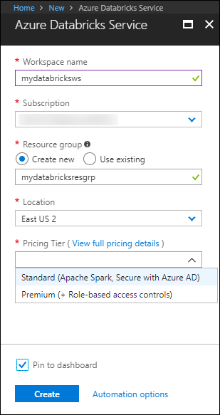

    Provide the following values:

    |Property  |Description  |
    |---------|---------|
    |**Workspace name**     | Provide a name for your Databricks workspace        |
    |**Subscription**     | From the drop-down, select your Azure subscription.        |
    |**Resource group**     | Specify whether you want to create a new resource group or use an existing one. A resource group is a container that holds related resources for an Azure solution. For more information, see [Azure Resource Group overview](../azure-resource-manager/management/overview.md). |
    |**Location**     | Select **East US 2**. For other available regions, see [Azure services available by region](https://azure.microsoft.com/regions/services/).        |
    |**Pricing Tier**     |  Choose between **Standard** or **Premium**. For more information on these tiers, see [Databricks pricing page](https://azure.microsoft.com/pricing/details/databricks/).       |

    Select **Pin to dashboard** and then select **Create**.

4. The account creation takes a few minutes. During account creation, the portal displays the **Submitting deployment for Azure Databricks** tile on the right side. You may need to scroll right on your dashboard to see the tile. There is also a progress bar displayed near the top of the screen. You can watch either area for progress.

    

## Create a Spark cluster in Databricks

1. In the Azure portal, go to the Databricks workspace that you created, and then select **Launch Workspace**.

2. You are redirected to the Azure Databricks portal. From the portal, select **Cluster**.

    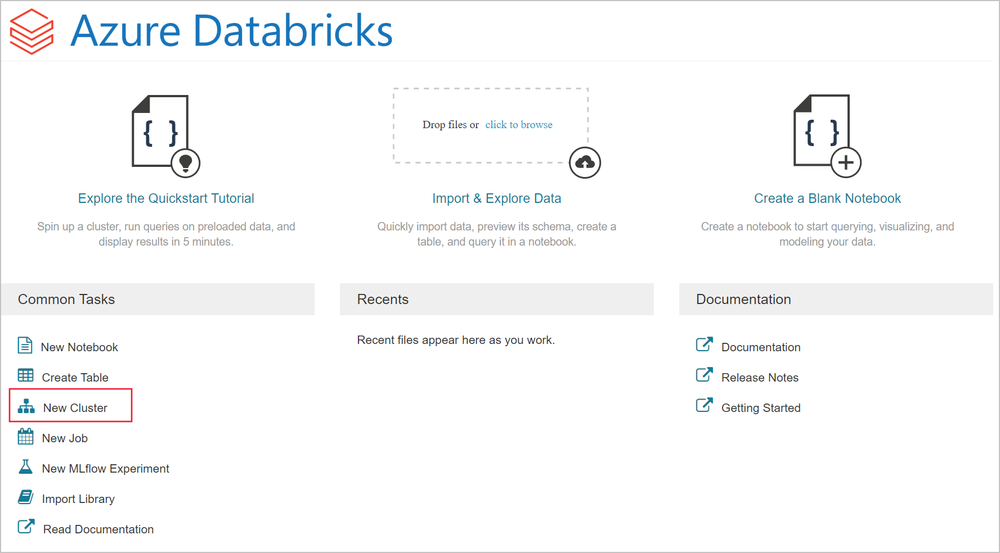

3. In the **New cluster** page, provide the values to create a cluster.

    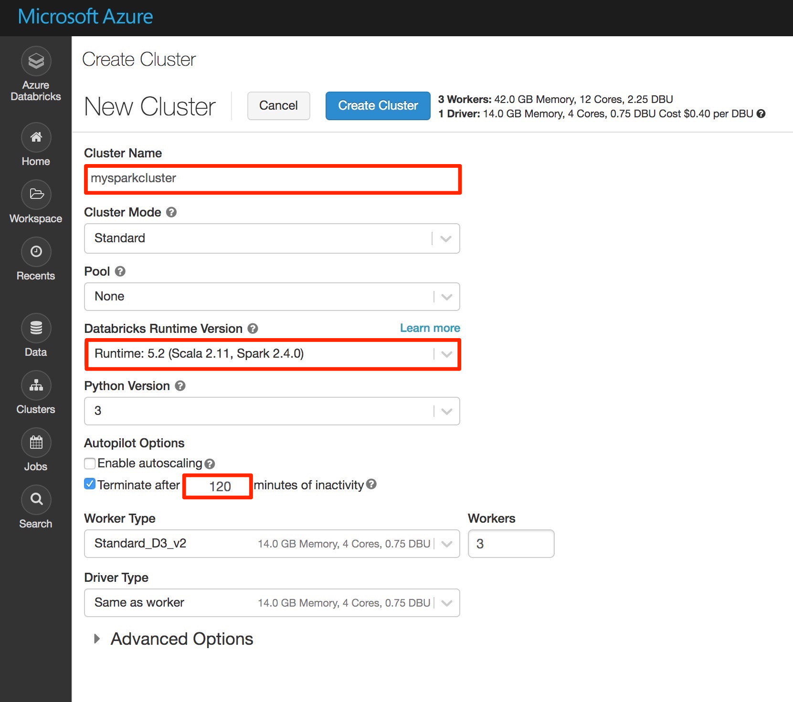

    Accept all other default values other than the following:

   * Enter a name for the cluster.
   * For this article, create a cluster with **6.0** runtime.
   * Make sure you select the **Terminate after \_\_ minutes of inactivity** checkbox. Provide a duration (in minutes) to terminate the cluster, if the cluster is not being used.

   Select cluster worker and driver node size suitable for your technical criteria and [budget](https://azure.microsoft.com/pricing/details/databricks/).

     Select **Create cluster**. Once the cluster is running, you can attach notebooks to the cluster and run Spark jobs.

## Create a Twitter application

To receive a stream of tweets, you create an application in Twitter. Follow the instructions create a Twitter application and record the values that you need to complete this tutorial.

1. From a web browser, go to [Twitter For Developers](https://developer.twitter.com/en/apps), and select **Create an app**. You might see a message saying that you need to apply for a Twitter developer account. Feel free to do so, and after your application has been approved you should see a confirmation email. It could take several days to be approved for a developer account.

    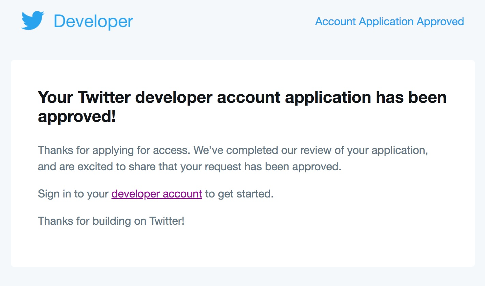

2. In the **Create an application** page, provide the details for the new app, and then select **Create your Twitter application**.

    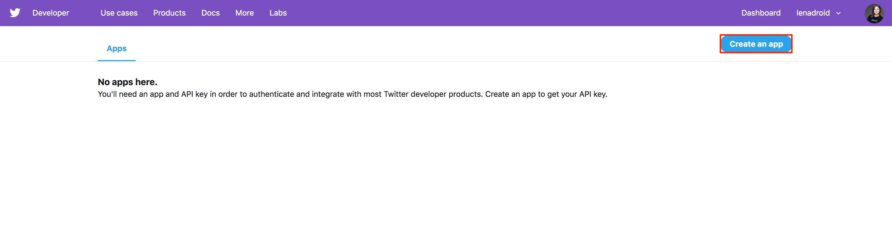

    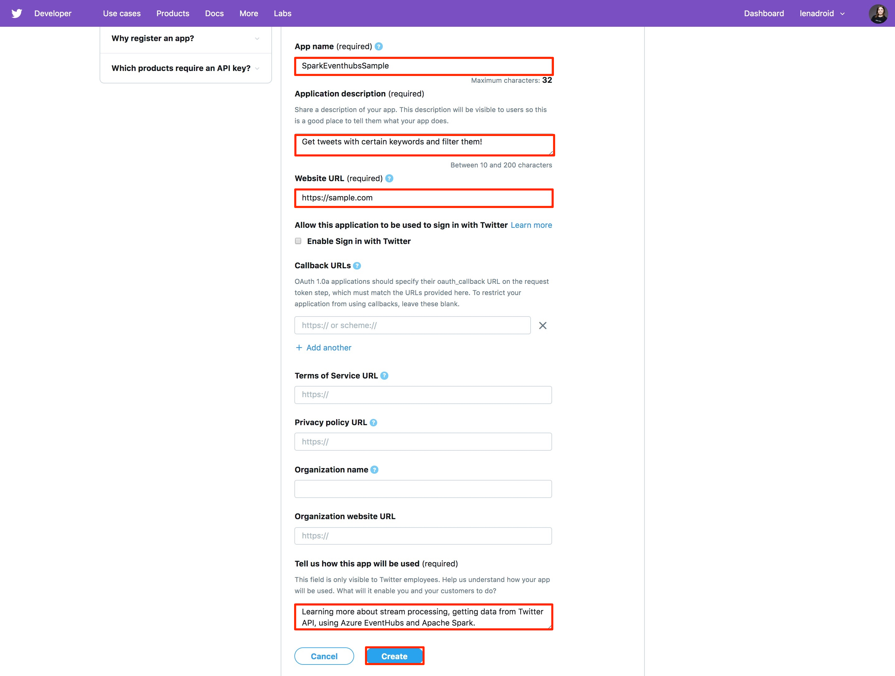

3. In the application page, select the **Keys and Tokens** tab and copy the values for **Consumer API Key** and **Consumer API Secret Key**. Also, select **Create** under **Access Token and Access Token Secret** to generate the access tokens. Copy the values for **Access Token** and **Access Token Secret**.

    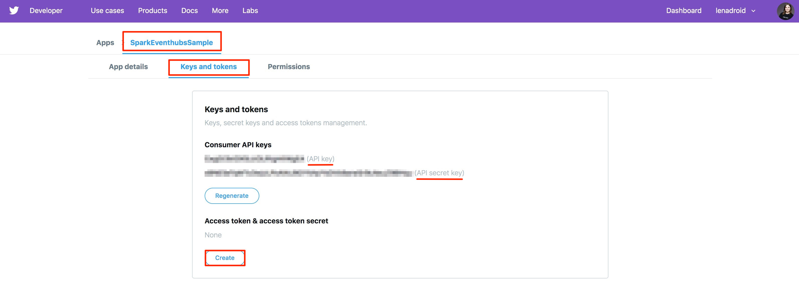

Save the values that you retrieved for the Twitter application. You need the values later in the tutorial.

## Attach libraries to Spark cluster

In this tutorial, you use the Twitter APIs to send tweets to Event Hubs. You also use the [Apache Spark Event Hubs connector](https://github.com/Azure/azure-event-hubs-spark) to read and write data into Azure Event Hubs. To use these APIs as part of your cluster, add them as libraries to Azure Databricks and associate them with your Spark cluster. The following instructions show how to add a library.

1. In the Azure Databricks workspace, select **Clusters**, and choose your existing Spark cluster. Within the cluster menu, choose **Libraries** and click **Install New**.

   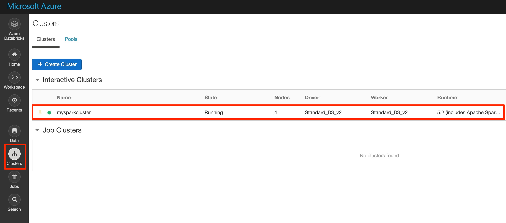

   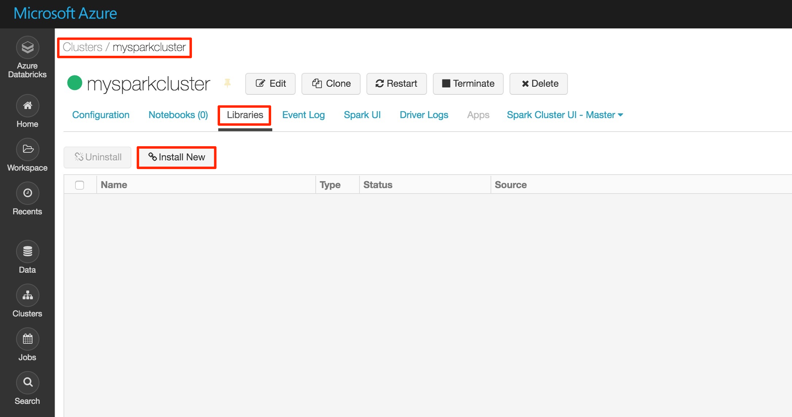

2. In the New Library page, for **Source** select **Maven**. Individually enter the following coordinates for the Spark Event Hubs connector and the Twitter API into **Coordinates**.

   * Spark Event Hubs connector - `com.microsoft.azure:azure-eventhubs-spark_2.11:2.3.12`
   * Twitter API - `org.twitter4j:twitter4j-core:4.0.7`

3. Select **Install**.

4. In the cluster menu, make sure both libraries are installed and attached properly.

    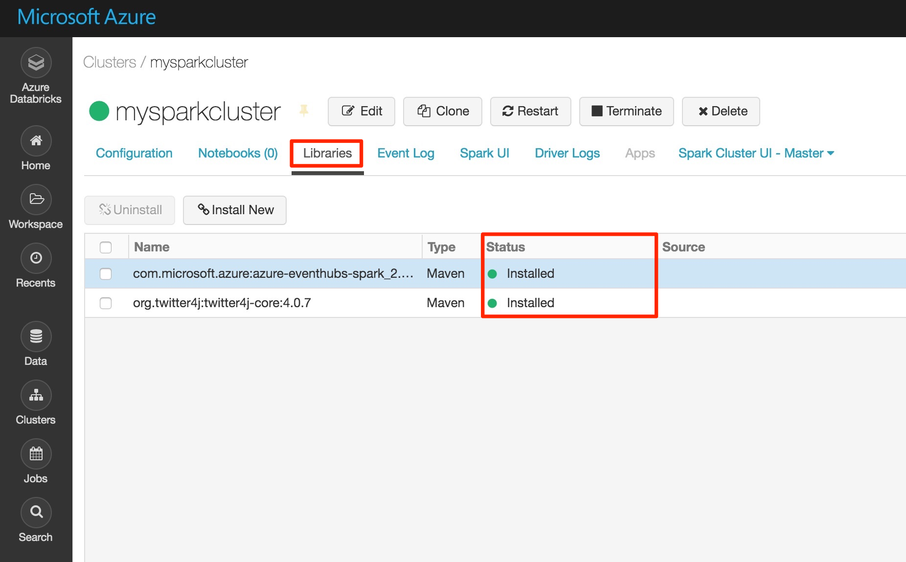

6. Repeat these steps for the Twitter package, `twitter4j-core:4.0.7`.

## Create notebooks in Databricks

In this section, you create two notebooks in Databricks workspace with the following names:

- **SendTweetsToEventHub** - A producer notebook you use to get tweets from Twitter and stream them to Event Hubs.
- **ReadTweetsFromEventHub** - A consumer notebook you use to read the tweets from Event Hubs.

1. In the left pane, select **Workspace**. From the **Workspace** drop-down, select **Create** > **Notebook**.

    

2. In the **Create Notebook** dialog box, enter **SendTweetsToEventHub**, select **Scala** as the language, and select the Spark cluster that you created earlier.

    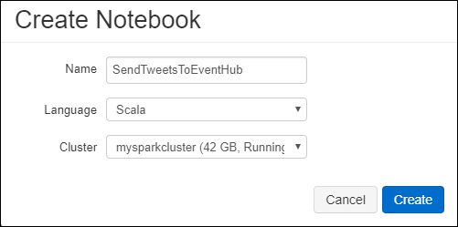

    Select **Create**.

3. Repeat the steps to create the **ReadTweetsFromEventHub** notebook.

## Send tweets to Event Hubs

In the **SendTweetsToEventHub** notebook, paste the following code, and replace the placeholders with values for your Event Hubs namespace and Twitter application that you created earlier. This notebook streams tweets with the keyword "Azure" into Event Hubs in real time.

> [!NOTE]
> Twitter API has certain request restrictions and [quotas](https://developer.twitter.com/en/docs/basics/rate-limiting.html). If you are not satisfied with standard rate limiting in Twitter API, you can generate text content without using Twitter API in this example. To do that, set variable **dataSource** to `test` instead of `twitter` and populate the list **testSource** with preferred test input.

```scala
    import scala.collection.JavaConverters._
    import com.microsoft.azure.eventhubs._
    import java.util.concurrent._
    import scala.collection.immutable._
    import scala.concurrent.Future
    import scala.concurrent.ExecutionContext.Implicits.global

    val namespaceName = "<EVENT HUBS NAMESPACE>"
    val eventHubName = "<EVENT HUB NAME>"
    val sasKeyName = "<POLICY NAME>"
    val sasKey = "<POLICY KEY>"
    val connStr = new ConnectionStringBuilder()
                .setNamespaceName(namespaceName)
                .setEventHubName(eventHubName)
                .setSasKeyName(sasKeyName)
                .setSasKey(sasKey)

    val pool = Executors.newScheduledThreadPool(1)
    val eventHubClient = EventHubClient.create(connStr.toString(), pool)

    def sleep(time: Long): Unit = Thread.sleep(time)

    def sendEvent(message: String, delay: Long) = {
      sleep(delay)
      val messageData = EventData.create(message.getBytes("UTF-8"))
      eventHubClient.get().send(messageData)
      System.out.println("Sent event: " + message + "\n")
    }

    // Add your own values to the list
    val testSource = List("Azure is the greatest!", "Azure isn't working :(", "Azure is okay.")

    // Specify 'test' if you prefer to not use Twitter API and loop through a list of values you define in `testSource`
    // Otherwise specify 'twitter'
    val dataSource = "test"

    if (dataSource == "twitter") {

      import twitter4j._
      import twitter4j.TwitterFactory
      import twitter4j.Twitter
      import twitter4j.conf.ConfigurationBuilder

      // Twitter configuration!
      // Replace values below with you

      val twitterConsumerKey = "<CONSUMER API KEY>"
      val twitterConsumerSecret = "<CONSUMER API SECRET>"
      val twitterOauthAccessToken = "<ACCESS TOKEN>"
      val twitterOauthTokenSecret = "<TOKEN SECRET>"

      val cb = new ConfigurationBuilder()
        cb.setDebugEnabled(true)
        .setOAuthConsumerKey(twitterConsumerKey)
        .setOAuthConsumerSecret(twitterConsumerSecret)
        .setOAuthAccessToken(twitterOauthAccessToken)
        .setOAuthAccessTokenSecret(twitterOauthTokenSecret)

      val twitterFactory = new TwitterFactory(cb.build())
      val twitter = twitterFactory.getInstance()

      // Getting tweets with keyword "Azure" and sending them to the Event Hub in realtime!
      val query = new Query(" #Azure ")
      query.setCount(100)
      query.lang("en")
      var finished = false
      while (!finished) {
        val result = twitter.search(query)
        val statuses = result.getTweets()
        var lowestStatusId = Long.MaxValue
        for (status <- statuses.asScala) {
          if(!status.isRetweet()){
            sendEvent(status.getText(), 5000)
          }
          lowestStatusId = Math.min(status.getId(), lowestStatusId)
        }
        query.setMaxId(lowestStatusId - 1)
      }

    } else if (dataSource == "test") {
      // Loop through the list of test input data
      while (true) {
        testSource.foreach {
          sendEvent(_,5000)
        }
      }

    } else {
      System.out.println("Unsupported Data Source. Set 'dataSource' to \"twitter\" or \"test\"")
    }

    // Closing connection to the Event Hub
    eventHubClient.get().close()
```

To run the notebook, press **SHIFT + ENTER**. You see an output like the snippet below. Each event in the output is a tweet that is ingested into the Event Hubs containing the term "Azure".

    Sent event: @Microsoft and @Esri launch Geospatial AI on Azure https://t.co/VmLUCiPm6q via @geoworldmedia #geoai #azure #gis #ArtificialIntelligence

    Sent event: Public preview of Java on App Service, built-in support for Tomcat and OpenJDK
    https://t.co/7vs7cKtvah
    #cloudcomputing #Azure

    Sent event: 4 Killer #Azure Features for #Data #Performance https://t.co/kpIb7hFO2j by @RedPixie

    Sent event: Migrate your databases to a fully managed service with Azure SQL Managed Instance | #Azure | #Cloud https://t.co/sJHXN4trDk

    Sent event: Top 10 Tricks to #Save Money with #Azure Virtual Machines https://t.co/F2wshBXdoz #Cloud

    ...
    ...

## Read tweets from Event Hubs

In the **ReadTweetsFromEventHub** notebook, paste the following code, and replace the placeholder with values for your Azure Event Hubs that you created earlier. This notebook reads the tweets that you earlier streamed into Event Hubs using the **SendTweetsToEventHub** notebook.

```scala

    import org.apache.spark.eventhubs._
    import com.microsoft.azure.eventhubs._

    // Build connection string with the above information
    val namespaceName = "<EVENT HUBS NAMESPACE>"
    val eventHubName = "<EVENT HUB NAME>"
    val sasKeyName = "<POLICY NAME>"
    val sasKey = "<POLICY KEY>"
    val connStr = new com.microsoft.azure.eventhubs.ConnectionStringBuilder()
                .setNamespaceName(namespaceName)
                .setEventHubName(eventHubName)
                .setSasKeyName(sasKeyName)
                .setSasKey(sasKey)

    val customEventhubParameters =
      EventHubsConf(connStr.toString())
      .setMaxEventsPerTrigger(5)

    val incomingStream = spark.readStream.format("eventhubs").options(customEventhubParameters.toMap).load()

    incomingStream.printSchema

    // Sending the incoming stream into the console.
    // Data comes in batches!
    incomingStream.writeStream.outputMode("append").format("console").option("truncate", false).start().awaitTermination()
```

You get the following output:


    root
     |-- body: binary (nullable = true)
     |-- offset: long (nullable = true)
     |-- seqNumber: long (nullable = true)
     |-- enqueuedTime: long (nullable = true)
     |-- publisher: string (nullable = true)
     |-- partitionKey: string (nullable = true)

    -------------------------------------------
    Batch: 0
    -------------------------------------------
    +------+------+--------------+---------------+---------+------------+
    |body  |offset|sequenceNumber|enqueuedTime   |publisher|partitionKey|
    +------+------+--------------+---------------+---------+------------+
    |[50 75 62 6C 69 63 20 70 72 65 76 69 65 77 20 6F 66 20 4A 61 76 61 20 6F 6E 20 41 70 70 20 53 65 72 76 69 63 65 2C 20 62 75 69 6C 74 2D 69 6E 20 73 75 70 70 6F 72 74 20 66 6F 72 20 54 6F 6D 63 61 74 20 61 6E 64 20 4F 70 65 6E 4A 44 4B 0A 68 74 74 70 73 3A 2F 2F 74 2E 63 6F 2F 37 76 73 37 63 4B 74 76 61 68 20 0A 23 63 6C 6F 75 64 63 6F 6D 70 75 74 69 6E 67 20 23 41 7A 75 72 65]                              |0     |0             |2018-03-09 05:49:08.86 |null     |null        |
    |[4D 69 67 72 61 74 65 20 79 6F 75 72 20 64 61 74 61 62 61 73 65 73 20 74 6F 20 61 20 66 75 6C 6C 79 20 6D 61 6E 61 67 65 64 20 73 65 72 76 69 63 65 20 77 69 74 68 20 41 7A 75 72 65 20 53 51 4C 20 44 61 74 61 62 61 73 65 20 4D 61 6E 61 67 65 64 20 49 6E 73 74 61 6E 63 65 20 7C 20 23 41 7A 75 72 65 20 7C 20 23 43 6C 6F 75 64 20 68 74 74 70 73 3A 2F 2F 74 2E 63 6F 2F 73 4A 48 58 4E 34 74 72 44 6B]            |168   |1             |2018-03-09 05:49:24.752|null     |null        |
    +------+------+--------------+---------------+---------+------------+

    -------------------------------------------
    Batch: 1
    -------------------------------------------
    ...
    ...

Because the output is in a binary mode, use the following snippet to convert it into string.

```scala
    import org.apache.spark.sql.types._
    import org.apache.spark.sql.functions._

    // Event Hub message format is JSON and contains "body" field
    // Body is binary, so we cast it to string to see the actual content of the message
    val messages =
      incomingStream
      .withColumn("Offset", $"offset".cast(LongType))
      .withColumn("Time (readable)", $"enqueuedTime".cast(TimestampType))
      .withColumn("Timestamp", $"enqueuedTime".cast(LongType))
      .withColumn("Body", $"body".cast(StringType))
      .select("Offset", "Time (readable)", "Timestamp", "Body")

    messages.printSchema

    messages.writeStream.outputMode("append").format("console").option("truncate", false).start().awaitTermination()
```

The output now resembles the following snippet:

    root
     |-- Offset: long (nullable = true)
     |-- Time (readable): timestamp (nullable = true)
     |-- Timestamp: long (nullable = true)
     |-- Body: string (nullable = true)

    -------------------------------------------
    Batch: 0
    -------------------------------------------
    +------+-----------------+----------+-------+
    |Offset|Time (readable)  |Timestamp |Body
    +------+-----------------+----------+-------+
    |0     |2018-03-09 05:49:08.86 |1520574548|Public preview of Java on App Service, built-in support for Tomcat and OpenJDK
    https://t.co/7vs7cKtvah
    #cloudcomputing #Azure          |
    |168   |2018-03-09 05:49:24.752|1520574564|Migrate your databases to a fully managed service with Azure SQL Managed Instance | #Azure | #Cloud https://t.co/sJHXN4trDk    |
    |0     |2018-03-09 05:49:02.936|1520574542|@Microsoft and @Esri launch Geospatial AI on Azure https://t.co/VmLUCiPm6q via @geoworldmedia #geoai #azure #gis #ArtificialIntelligence|
    |176   |2018-03-09 05:49:20.801|1520574560|4 Killer #Azure Features for #Data #Performance https://t.co/kpIb7hFO2j by @RedPixie                                                    |
    +------+-----------------+----------+-------+
    -------------------------------------------
    Batch: 1
    -------------------------------------------
    ...
    ...

That's it! Using Azure Databricks, you have successfully streamed data into Azure Event Hubs in near real-time. You then consumed the stream data using the Event Hubs connector for Apache Spark. For more information on how to use the Event Hubs connector for Spark, see the [connector documentation](https://github.com/Azure/azure-event-hubs-spark/tree/master/docs).

## Clean up resources

After you have finished running the tutorial, you can terminate the cluster. To do so, from the Azure Databricks workspace, from the left pane, select **Clusters**. For the cluster you want to terminate, move the cursor over the ellipsis under **Actions** column, and select the **Terminate** icon.


If you do not manually terminate the cluster it will automatically stop, provided you selected the **Terminate after \_\_ minutes of inactivity** checkbox while creating the cluster. In such a case, the cluster will automatically stop if it has been inactive for the specified time.

## Next steps
In this tutorial, you learned how to:

> [!div class="checklist"]
> * Create an Azure Databricks workspace
> * Create a Spark cluster in Azure Databricks
> * Create a Twitter app to generate streaming data
> * Create notebooks in Azure Databricks
> * Add libraries for Event Hubs and Twitter API
> * Send tweets to Event Hubs
> * Read tweets from Event Hubs

Advance to the next tutorial to learn about performing sentiment analysis on the streamed data using Azure Databricks and [Cognitive Services API](../cognitive-services/text-analytics/overview.md).

> [!div class="nextstepaction"]
>[Sentiment analysis on streaming data using Azure Databricks](databricks-sentiment-analysis-cognitive-services.md)
