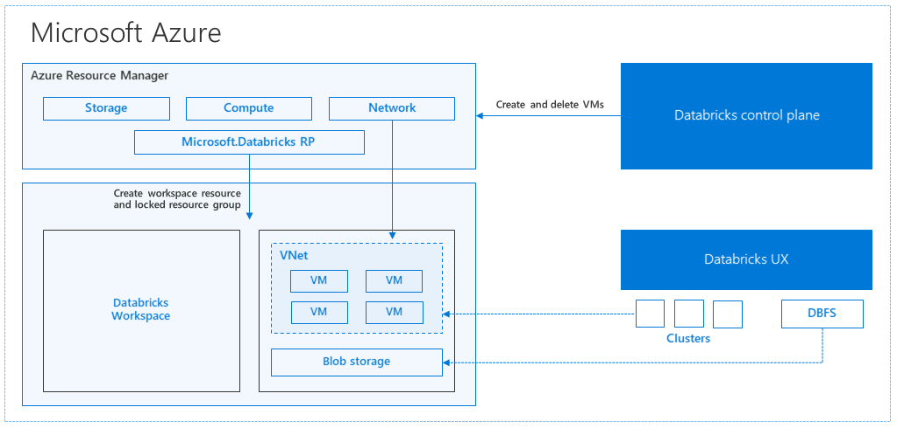

# Regional disaster recovery for Azure Databricks clusters

This article describes a disaster recovery architecture useful for Azure Databricks clusters, and the steps to accomplish that design.

## Azure Databricks overview

Azure Databricks is a fast, easy, and collaborative Apache Spark-based analytics service. For a big data pipeline, the data (raw or structured) is ingested into Azure through Azure Data Factory in batches, or streamed near real-time using Kafka, Event Hub, or IoT Hub. This data lands in a data lake for long term persisted storage, in Azure Blob Storage or Azure Data Lake Storage. As part of your analytics workflow, use Azure Databricks to read data from multiple data sources such as [Azure Blob Storage](../storage/blobs/storage-blobs-introduction.md), [Azure Data Lake Storage](../data-lake-store/index.md), [Azure Cosmos DB](../cosmos-db/index.yml), or [Azure SQL Data Warehouse](../sql-data-warehouse/index.md) and turn it into breakthrough insights using Spark.


## Azure Databricks architecture

At a high level, when you create an Azure Databricks workspace from the Azure portal, a [managed appliance](../managed-applications/overview.md) is deployed as an Azure resource in your subscription, in the chosen Azure region (for example, West US). This appliance is deployed in an [Azure Virtual Network](../virtual-network/virtual-networks-overview.md) with a [Network Security Group](../virtual-network/manage-network-security-group.md) and an Azure Storage account, available in your subscription. The virtual network provides perimeter level security to the Databricks workspace and is protected via network security group. Within the workspace, you can create Databricks clusters by providing the worker and driver VM type and Databricks runtime version. The persisted data is available in your storage account, which can be Azure Blob Storage or Azure Data Lake Store. Once the cluster is created, you can run jobs via notebooks, REST APIs, ODBC/JDBC endpoints by attaching them to a specific cluster.

The Databricks control plane manages and monitors the Databricks workspace environment. Any management operation such as create cluster will be initiated from the control plane. All metadata, such as scheduled jobs, is stored in an Azure Database with geo-replication for fault tolerance.



One of the advantages of this architecture is that users can connect Azure Databricks to any storage resource in their account. A key benefit is that both compute (Azure Databricks) and storage can be scaled independently of each other.

## How to create a regional disaster recovery topology

As you notice in the preceding architecture description, there are a number of components used for a Big Data pipeline with Azure Databricks:  Azure Storage, Azure Database, and other data sources. Azure Databricks is the *compute* for the Big Data pipeline. It is *ephemeral* in nature, meaning that while your data is still available in Azure Storage, the *compute* (Azure Databricks cluster) can be terminated so that you don’t have to pay for compute when you don’t need it. The *compute* (Azure Databricks) and storage sources must be in the same region so that jobs don’t experience high latency.  

To create your own regional disaster recovery topology, follow these requirements:

   1. Provision multiple Azure Databricks workspaces in separate Azure regions. For example, create the primary Azure Databricks workspace in East US2. Create the secondary disaster-recovery Azure Databricks workspace in a separate region, such as West US.

   2. Use [Geo-redundant storage](../storage/common/storage-redundancy-grs.md#read-access-geo-redundant-storage). The data associated Azure Databricks is stored by default in Azure Storage. The results from Databricks jobs are also stored in Azure Blob Storage, so that the processed data is durable and remains highly available after cluster is terminated. As the Storage and Databricks cluster are co-located, you must use Geo-redundant storage so that data can be accessed in secondary region if primary region is no longer accessible.

   3. Once the secondary region is created, you must migrate the users, user folders, notebooks, cluster configuration, jobs configuration, libraries, storage, init scripts, and reconfigure access control. Additional details are outlined in the following section.

## Detailed migration steps

1. **Set up the Databricks command-line interface on your computer**

   This article shows a number of code examples that use the command-line interface for most of the automated steps, since it is an easy-to-user wrapper over Azure Databricks REST API.

   Before performing any migration steps, install the databricks-cli on your desktop computer or a virtual machine where you plan to do the work. For more information, see [Install Databricks CLI](https://docs.azuredatabricks.net/user-guide/dev-tools/databricks-cli.html)

   ```bash
   pip install databricks-cli
   ```

   > [!NOTE]
   > Any python scripts provided in this article are expected to work with Python 2.7+ < 3.x.

2. **Configure two profiles.**

   Configure one for the primary workspace, and another one for the secondary workspace:

   ```bash
   databricks configure --profile primary
   databricks configure --profile secondary
   ```

   The code blocks in this article switch between profiles in each subsequent step using the corresponding workspace command. Be sure that the names of the profiles you create are substituted into each code block.

   ```python
   EXPORT_PROFILE = "primary"
   IMPORT_PROFILE = "secondary"
   ```

   You can manually switch at the command line if needed:

   ```bash
   databricks workspace ls --profile primary
   databricks workspace ls --profile secondary
   ```

3. **Migrate Azure Active Directory users**

   Manually add the same Azure Active Directory users to the secondary workspace that exist in primary workspace.

4. **Migrate the user folders and notebooks**

   Use the following python code to migrate the sandboxed user environments, which include the nested folder structure and notebooks per user.

   > [!NOTE]
   > Libraries are not copied over in this step, as the underlying API doesn't support those.

   Copy and save the following python script to a file, and run it in your Databricks command line. For example, `python scriptname.py`.

   ```python
   from subprocess import call, check_output

   EXPORT_PROFILE = "primary"
   IMPORT_PROFILE = "secondary"

   # Get a list of all users
   user_list_out = check_output(["databricks", "workspace", "ls", "/Users", "--profile", EXPORT_PROFILE])
   user_list = user_list_out.splitlines()

   # Export sandboxed environment (folders, notebooks) for each user and import into new workspace.
   # Libraries are not included with these APIs / commands.

   for user in user_list:
     print "Trying to migrate workspace for user " + user

     call("mkdir -p " + user, shell=True)
     export_exit_status = call("databricks workspace export_dir /Users/" + user + " ./" + user + " --profile " + EXPORT_PROFILE, shell=True)

     if export_exit_status==0:
       print "Export Success"
       import_exit_status = call("databricks workspace import_dir ./" + user + " /Users/" + user + " --profile " + IMPORT_PROFILE, shell=True)
       if import_exit_status==0:
         print "Import Success"
       else:
         print "Import Failure"
     else:
       print "Export Failure"

   print "All done"
   ```

5. **Migrate the cluster configurations**

   Once notebooks have been migrated, you can optionally migrate the cluster configurations to the new workspace. It's almost a fully automated step using databricks-cli, unless you would like to do selective cluster config migration rather than for all.

   > [!NOTE]
   > Unfortunately there is no create cluster config endpoint, and this script tries to create each cluster right away. If there aren't enough cores available in your subscription, the cluster creation may fail. The failure can be ignored, as long as the configuration is transferred successfully.

   The following script provided prints a mapping from old to new cluster IDs, which could be used for job migration later (for jobs that are configured to use existing clusters).

   Copy and save the following python script to a file, and run it in your Databricks command line. For example, `python scriptname.py`.

   ```python
   from subprocess import call, check_output import json

   EXPORT_PROFILE = "primary"
   IMPORT_PROFILE = "secondary"

   # Get all clusters info from old workspace 
   clusters_out = check_output(["databricks", "clusters", "list", "--profile", EXPORT_PROFILE]) clusters_info_list = clusters_out.splitlines()

   # Create a list of all cluster ids 
   clusters_list = [] for cluster_info in clusters_info_list:   clusters_list.append(cluster_info.split(None, 1)[0])

   # Optionally filter cluster ids out manually, so as to create only required ones in new workspace

   # Create a list of mandatory / optional create request elements 
   cluster_req_elems = ["num_workers","autoscale","cluster_name","spark_version","spark_conf"," node_type_id","driver_node_type_id","custom_tags","cluster_log_conf","sp ark_env_vars","autotermination_minutes","enable_elastic_disk"]

   # Try creating all / selected clusters in new workspace with same config as in old one.
   cluster_old_new_mappings = {} for cluster in clusters_list:   print "Trying to migrate cluster " + cluster

   cluster_get_out = check_output(["databricks", "clusters", "get", "--cluster-id", cluster, "--profile", EXPORT_PROFILE])
   print "Got cluster config from old workspace"

   # Remove extra content from the config, as we need to build create request with allowed elements only
   cluster_req_json = json.loads(cluster_get_out)    
   cluster_json_keys = cluster_req_json.keys()   

   for key in cluster_json_keys:     
      if key not in cluster_req_elems:       
         cluster_req_json.pop(key, None)
  
   # Create the cluster, and store the mapping from old to new cluster ids
   cluster_create_out = check_output(["databricks", "clusters", "create", "--json", json.dumps(cluster_req_json), "--profile", IMPORT_PROFILE]) 
   cluster_create_out_json = json.loads(cluster_create_out)   
   cluster_old_new_mappings[cluster] = cluster_create_out_json['cluster_id']

   print "Sent cluster create request to new workspace successfully"

   print "Cluster mappings: " + json.dumps(cluster_old_new_mappings)
   print "All done"
   ```

6. **Migrate the jobs configuration**

   If you migrated cluster configurations in the previous step, you can opt to migrate job configurations to the new workspace. It is a fully automated step using databricks-cli, unless you would like to do selective job config migration rather than doing it for all jobs.

   > [!NOTE]
   > The configuration for a scheduled job contains the "schedule" information as well, so by default that will start working as per configured timing as soon as it's migrated. Hence, the following code block removes any schedule information during the migration (to avoid duplicate runs across old and new workspaces). Configure the schedules for such jobs once you're ready for cutover.

   The job configuration requires settings for a new or an existing cluster. If using existing cluster, the script /code below will attempt to replace the old cluster ID with new cluster ID.

   Copy and save the following python script to a file. Replace the value for `old_cluster_id` and `new_cluster_id`, with the output from cluster migration done in previous step. Run it in your databricks-cli command line, for example, `python scriptname.py`.

   ```python
   from subprocess import call, check_output
   import json

   EXPORT_PROFILE = "primary"
   IMPORT_PROFILE = "secondary"

   # Please replace the old to new cluster id mappings from cluster migration output
   cluster_old_new_mappings = {"old_cluster_id": "new_cluster_id"}

   # Get all jobs info from old workspace
   try:
     jobs_out = check_output(["databricks", "jobs", "list", "--profile", EXPORT_PROFILE])
     jobs_info_list = jobs_out.splitlines()
   except:
     print "No jobs to migrate"
     sys.exit(0)

   # Create a list of all job ids
   jobs_list = []
   for jobs_info in jobs_info_list:
     jobs_list.append(jobs_info.split(None, 1)[0])

   # Optionally filter job ids out manually, so as to create only required ones in new workspace

   # Create each job in the new workspace based on corresponding settings in the old workspace

   for job in jobs_list:
     print "Trying to migrate " + job

     job_get_out = check_output(["databricks", "jobs", "get", "--job-id", job, "--profile", EXPORT_PROFILE])
     print "Got job config from old workspace"

     job_req_json = json.loads(job_get_out)  
     job_req_settings_json = job_req_json['settings']

     # Remove schedule information so job doesn't start before proper cutover
     job_req_settings_json.pop('schedule', None)

     # Replace old cluster id with new cluster id, if job configured to run against an existing cluster
     if 'existing_cluster_id' in job_req_settings_json:
       if job_req_settings_json['existing_cluster_id'] in cluster_old_new_mappings:
         job_req_settings_json['existing_cluster_id'] = cluster_old_new_mappings[job_req_settings_json['existing_cluster_id']]
       else:
         print "Mapping not available for old cluster id " + job_req_settings_json['existing_cluster_id']
         continue

     call(["databricks", "jobs", "create", "--json", json.dumps(job_req_settings_json), "--profile", IMPORT_PROFILE])
     print "Sent job create request to new workspace successfully"

   print "All done"
   ```

7. **Migrate libraries**

   There's currently no straightforward way to migrate libraries from one workspace to another. Instead, reinstall those libraries into the new workspace manually. It is possible to automate using combination of [DBFS CLI](https://github.com/databricks/databricks-cli#dbfs-cli-examples) to upload custom libraries to the workspace and [Libraries CLI](https://github.com/databricks/databricks-cli#libraries-cli).

8. **Migrate Azure blob storage and Azure Data Lake Store mounts**

   Manually remount all [Azure Blob storage](https://docs.azuredatabricks.net/spark/latest/data-sources/azure/azure-storage.html) and [Azure Data Lake Store (Gen 1)](https://docs.azuredatabricks.net/spark/latest/data-sources/azure/azure-datalake.html) mount points using a notebook-based solution. The storage resources would have been mounted in the primary workspace, and that has to be repeated in the secondary workspace. There is no external API for mounts.

9. **Migrate cluster init scripts**

   Any cluster initialization scripts can be migrated from old to new workspace using the [DBFS CLI](https://github.com/databricks/databricks-cli#dbfs-cli-examples). First, copy the needed scripts from `dbfs:/dat abricks/init/..` to your local desktop or virtual machine. Next, copy those scripts into the new workspace at the same path.

   ```bash
   // Primary to local
   dbfs cp -r dbfs:/databricks/init ./old-ws-init-scripts --profile primary

   // Local to Secondary workspace
   dbfs cp -r old-ws-init-scripts dbfs:/databricks/init --profile secondary
   ```

10. **Manually reconfigure and reapply access control.**

   If your existing primary workspace is configured to use the Premium tier (SKU), it's likely you also are using the [Access Control feature](https://docs.azuredatabricks.net/administration-guide/admin-settings/index.html#manage-access-control).

   If you do use the Access Control feature, manually reapply the access control to the resources (Notebooks, Clusters, Jobs, Tables).

## Next steps
For more information, see [Azure Databricks documentation](https://docs.azuredatabricks.net/user-guide/index.html).
