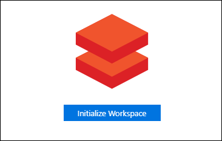
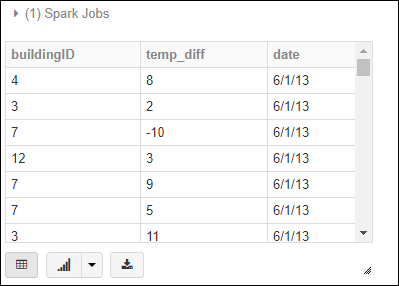
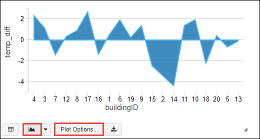

# Get started with Azure Databricks by using the Azure portal

In this article, you learn how to create an Azure Databricks workspace and then an Apache Spark cluster within that workspace. You also learn how to run your first Spark job on the cluster. For more information on Azure Databricks, see [Azure Databricks Overview](databricks-overview.md).

## Prerequisites

* **An Azure subscription**. Before you begin this tutorial, you must have an Azure subscription. See [Create your free Azure account today](https://azure.microsoft.com/free).
* **A Sample CSV file**. You can download the sample file from << HERE >>
* **An Azure Blob Storage account**. For instructions, see [Create an Azure storage account](../storage/common/storage-create-storage-account.md#create-a-storage-account). For more information, see [Introduction to Azure Blob storage](../storage/blobs/storage-blobs-introduction.md).
* **A modern web browser**. The Azure  portal uses HTML5 and Javascript, and may not function correctly in older web browsers.

## Create an Azure Databricks workspace

1. Sign in to the [Azure  portal](https://portal.azure.com).

2. Click **+**, click **Data + Analytics**, and then click **Azure Databricks (Preview)**. Under **Azure Databricks**, click **Create**.

3. Under **Azure Databricks Service**, provide the following values:

    

    * For **Workspace name**, provide a name for your Databricks workspace.
    * For **Subscription**, from the drop-down, select your Azure subscription.
    * For **Resource group**, specify whether you want to create a new resource group or use an existing one. A resource group is a container that holds related resources for an Azure solution. For more information, see [Azure Resource Group overview](../azure-resource-manager/resource-group-overview.md).
    * For **Location**, select **East US 2**.

4. Click **Create**.

## Create an Apache Spark cluster in Databricks

1. In the Azure portal, go to the Databricks workspace that you created, and then click **Initialize Workspace**.

    

2. You are redirected to the Azure Databricks portal. From the portal, click **Cluster**.

    

3. In the **New cluster** page, enter a name for the cluster, accept all other default values, and then click **Create cluster**.

    

    For more information on creating clusters, see [Create a Spark cluster in Azure Databricks](https://docs.azuredatabricks.net/user-guide/clusters/create.html).

4. Once the cluster is running, you can attach notebooks to the cluster and run Spark jobs.

## Run a Spark SQL job on the cluster

In this section, you create a notebook and then run a Spark SQL job on the cluster.

1. In the left pane, click **Workspace**. From the **Workspace** drop-down, click **Create** and then click **Notebook**.

    

2. In the **Create Notebook** dialog box, enter a name, select **Scala** as the language, and select the Spark cluster that you created earlier.

    

    Click **Create**.

3. In the following snippet, replace the placeholder values with your Azure storage account name and the storage account access key. Run SHIFT + ENTER to run the code cell. This snippet configures the notebook to read data from an Azure blob storage.

       spark.conf.set("fs.azure.account.key.{YOUR STORAGE ACCOUNT NAME}.blob.core.windows.net", "{YOUR STORAGE ACCOUNT ACCESS KEY}")
    
    For example:

        spark.conf.set("fs.azure.account.key.mystorageaccount.blob.core.windows.net", "{YOUR STORAGE ACCOUNT ACCESS KEY}")

    For instructions on how to retrieve the storage account key, see [Manage your storage access keys](../storage/common/storage-create-storage-account.md#manage-your-storage-account)

    > [!NOTE]
    > You can also use Azure Data Lake Store with a Spark cluster on Azure Databricks. For instructions, see [Use Data Lake Store with Azure Databricks](https://docs.azuredatabricks.net/spark/latest/data-sources/azure/azure-storage.html#azure-data-lake-store).

4.  Run a SQL statement to create a temporary table using data from the sample CSV data file, HVAC.csv. You can download the sample file from << HERE >>.

        %sql
        CREATE TEMPORARY TABLE hvacTempTable USING csv OPTIONS (path "wasbs://{YOUR CONTAINER NAME}@{YOUR STORAGE ACCOUNT NAME}/Path/to/sample/file/HVAC.csv", header "true", mode "FAILFAST")

    Press SHIFT + ENTER to run the code cell.

    The `%sql` language magic command enables you to run a SQL code from the notebook, even if the notebook is of another type. For more information, see [Mixing languages in a notebook](https://docs.azuredatabricks.net/user-guide/notebooks/index.html#mixing-languages-in-a-notebook).

5. Let's look at a snapshot of the sample CSV data to better understand the query that we run.

    

    The sample data captures the temperature variations of a building. For each building, it lists the target temperature and the actual temperature, in addition to other details.

6.  Run a SQL query on the table you created earlier. The query lists the difference between the target and actual temperature, for each building, on a given date.

        %sql
        SELECT buildingID, (targettemp - actualtemp) AS temp_diff, date FROM hvacTempTable WHERE date = "6/1/13"

    Press SHIFT + ENTER to run the code cell. You see a tabular output, similar the following screenshot:

    

7. You can also change the query output to display in other formats. You can pick the plotting format, and the columns to populate that plot, using the buttons at the bottom of the output cell.

    

    The screenshot shows an area chart with **buildingID** as the key and **temp_diff** as the value.  

## Next steps

In this article, you created a Spark cluster in Azure Databricks and ran a Spark job using data in Azure storage. Look at the following articles to know more about working with Azure Databricks.

* [Use Data Lake Store with Azure Databricks](https://docs.azuredatabricks.net/spark/latest/data-sources/azure/azure-storage.html#azure-data-lake-store)
* [Spark data sources](https://docs.azuredatabricks.net/spark/latest/data-sources/index.html)