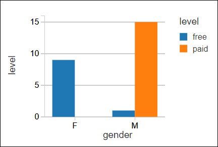

# Quickstart: Run a Spark job on Azure Databricks using the Azure portal

This quickstart shows how to create an Azure Databricks workspace and an Apache Spark cluster within that workspace. Finally, you learn how to run a Spark job on the Databricks cluster. For more information on Azure Databricks, see [What is Azure Databricks?](what-is-azure-databricks.md)

In this quickstart, as part of the Spark job, you analyze a radio channel subscription data to gain insights into free/paid usage based on demographics. 

If you don't have an Azure subscription, [create a free account](https://azure.microsoft.com/free/) before you begin.

## Log in to the Azure portal

Log in to the [Azure  portal](https://portal.azure.com).

## Create an Azure Databricks workspace

In this section, you create an Azure Databricks workspace using the Azure portal. 

1. In the Azure portal, select **Create a resource** > **Data + Analytics** > **Azure Databricks**. 

    

2. Under **Azure Databricks Service**, provide the values to create a Databricks workspace.

    

    Provide the following values: 
     
    |Property  |Description  |
    |---------|---------|
    |**Workspace name**     | Provide a name for your Databricks workspace        |
    |**Subscription**     | From the drop-down, select your Azure subscription.        |
    |**Resource group**     | Specify whether you want to create a new resource group or use an existing one. A resource group is a container that holds related resources for an Azure solution. For more information, see [Azure Resource Group overview](../azure-resource-manager/resource-group-overview.md). |
    |**Location**     | Select **East US 2**. For other available regions, see [Azure services available by region](https://azure.microsoft.com/regions/services/).        |
    |**Pricing Tier**     |  Choose between **Standard** or **Premium**. For more information on these tiers, see [Databricks pricing page](https://azure.microsoft.com/pricing/details/databricks/).       |

    Select **Pin to dashboard** and then click **Create**.

4. The workspace creation takes a few minutes. During workspace creation, the portal displays the **Submitting deployment for Azure Databricks** tile on the right side. You may need to scroll right on your dashboard to see the tile. There is also a progress bar displayed near the top of the screen. You can watch either area for progress.

    

## Create a Spark cluster in Databricks

> [!NOTE] 
> To use a free account to create the Azure Databricks cluster, before creating the cluster, go to your profile and change your subscription to **pay-as-you-go**. For more information, see [Azure free account](https://azure.microsoft.com/free/).  

1. In the Azure portal, go to the Databricks workspace that you created, and then click **Launch Workspace**.

2. You are redirected to the Azure Databricks portal. From the portal, click **Cluster**.

    

3. In the **New cluster** page, provide the values to create a cluster.

    

    Accept all other default values other than the following:

    * Enter a name for the cluster.
    * For this article, create a cluster with **4.0** runtime. 
    * Make sure you select the **Terminate after ____ minutes of inactivity** checkbox. Provide a duration (in minutes) to terminate the cluster, if the cluster is not being used.
    
    Select **Create cluster**. Once the cluster is running, you can attach notebooks to the cluster and run Spark jobs. 

For more information on creating clusters, see [Create a Spark cluster in Azure Databricks](https://docs.azuredatabricks.net/user-guide/clusters/create.html).


## Download a sample data file
Download a sample JSON data file and save it into Azure blob storage.

1. Download this sample JSON data file [from Github](https://raw.githubusercontent.com/Azure/usql/master/Examples/Samples/Data/json/radiowebsite/small_radio_json.json) onto your local computer. Right-click and save as to save the raw file locally. 

2. If you don't already have a storage account, create one. 
   - In the Azure portal, select **Create a resource**.  Select the **Storage** category, and select **Storage Accounts**  
   - Provide a unique name for the storage account.
   - Select **Account Kind**: **Blob Storage**
   - Select a **Resource Group** name. Use the same resource group you created the Databricks workspace.
   
   For more information, see [Create an Azure Blob storage account](../storage/common/storage-quickstart-create-account.md). 

3. Create a storage Container in the Blob Storage account and upload the sample json file into the container. You can use the Azure portal or the  [Microsoft Azure Storage Explorer](../vs-azure-tools-storage-manage-with-storage-explorer.md) to upload the file.

   - Open the storage account in the Azure portal.
   - Select **Blobs**.
   - Select **+ Container** to create a new empty container.
   - Provide a **Name** for the container, such as `databricks`. 
   - Select  **Private (non anonymous access)** access level.
   - Once the container is created, select the container name.
   - Select the **Upload** button.
   - On the **Files** page, select the **Folder icon** to browse and select the sample file `small_radio_json.json` for upload. 
   - Select **Upload** to upload the file.
   
   
## Run a Spark SQL job
Perform the following tasks to create a notebook in Databricks, configure the notebook to read data from an Azure Blob storage account, and then run a Spark SQL job on the data.

1. In the left pane, click **Workspace**. From the **Workspace** drop-down, click **Create**, and then click **Notebook**.

    

2. In the **Create Notebook** dialog box, enter a name, select **Scala** as the language, and select the Spark cluster that you created earlier.

    

    Click **Create**.

3. In this step, associate the Azure Storage account with the Databricks Spark cluster. There are two ways to accomplish this association. You can mount the Azure Storage account to the Databricks Filesystem (DBFS), or directly access the Azure Storage account from the application you create.  

    > [!IMPORTANT]
    >This article uses the approach to **mount the storage with DBFS**. This approach ensures that the mounted storage gets associated with the cluster filesystem itself. Hence, any application accessing the cluster is able to use the associated storage as well. The direct-access approach is limited to the application from where you configure the access.
    >
    > To use the mounting approach, you must create a Spark cluster with Databricks runtime version **4.0**, which is what you chose in this article.

    In the following snippet, replace `{YOUR CONTAINER NAME}`, `{YOUR STORAGE ACCOUNT NAME}`, and `{YOUR STORAGE ACCOUNT ACCESS KEY}` with the appropriate values for your Azure Storage account. Paste the snippet in an empty cell in the notebook and then press SHIFT + ENTER to run the code cell.

    * **Mount the storage account with DBFS (recommended)**. In this snippet, the Azure Storage account path is mounted to `/mnt/mypath`. So, in all future occurrences where you access the Azure Storage account you don't need to give the full path. You can just use `/mnt/mypath`.

          dbutils.fs.mount(
            source = "wasbs://{YOUR CONTAINER NAME}@{YOUR STORAGE ACCOUNT NAME}.blob.core.windows.net/",
            mountPoint = "/mnt/mypath",
            extraConfigs = Map("fs.azure.account.key.{YOUR STORAGE ACCOUNT NAME}.blob.core.windows.net" -> "{YOUR STORAGE ACCOUNT ACCESS KEY}"))

    * **Directly access the storage account**

          spark.conf.set("fs.azure.account.key.{YOUR STORAGE ACCOUNT NAME}.blob.core.windows.net", "{YOUR STORAGE ACCOUNT ACCESS KEY}")

    For instructions on how to retrieve the storage account key, see [Manage your storage access keys](../storage/common/storage-account-manage.md#access-keys).

    > [!NOTE]
    > You can also use Azure Data Lake Store with a Spark cluster on Azure Databricks. For instructions, see [Use Data Lake Store with Azure Databricks](https://go.microsoft.com/fwlink/?linkid=864084).

4. Run a SQL statement to create a temporary table using data from the sample JSON data file, **small_radio_json.json**. In the following snippet, replace the placeholder values with your container name and storage account name. Paste the snippet in a code cell in the notebook, and then press SHIFT + ENTER. In the snippet, `path` denotes the location of the sample JSON file that you uploaded to your Azure Storage account.

    ```sql
    %sql 
    DROP TABLE IF EXISTS radio_sample_data;
    CREATE TABLE radio_sample_data
    USING json
    OPTIONS (
     path "/mnt/mypath/small_radio_json.json"
    )
    ```

    Once the command successfully completes, you have all the data from the JSON file as a table in Databricks cluster.

    The `%sql` language magic command enables you to run a SQL code from the notebook, even if the notebook is of another type. For more information, see [Mixing languages in a notebook](https://docs.azuredatabricks.net/user-guide/notebooks/index.html#mixing-languages-in-a-notebook).

5. Let's look at a snapshot of the sample JSON data to better understand the query that you run. Paste the following snippet in the code cell and press **SHIFT + ENTER**.

    ```sql
    %sql 
    SELECT * from radio_sample_data
    ```

6. You see a tabular output like shown in the following screenshot (only some columns are shown):

    

    Among other details, the sample data captures the gender of the audience of a radio channel (column name, **gender**)  and whether their subscription is free or paid (column name, **level**).

7. You now create a visual representation of this data to show for each gender, how many users have free accounts and how many are paid subscribers. From the bottom of the tabular output, click the **Bar chart** icon, and then click **Plot Options**.

    

8. In **Customize Plot**, drag-and-drop values as shown in the screenshot.

    

    * Set **Keys** to **gender**.
    * Set **Series groupings** to **level**.
    * Set **Values** to **level**.
    * Set **Aggregation** to **COUNT**.

    Click **Apply**.

9. The output shows the visual representation as depicted in the following screenshot:

     

## Clean up resources

After you have finished the article, you can terminate the cluster. To do so, from the Azure Databricks workspace, from the left pane, select **Clusters**. For the cluster you want to terminate, move the cursor over the ellipsis under **Actions** column, and select the **Terminate** icon.


If you do not manually terminate the cluster it will automatically stop, provided you selected the **Terminate after __ minutes of inactivity** checkbox while creating the cluster. In such a case, the cluster automatically stops, if it has been inactive for the specified time.

## Next steps

In this article, you created a Spark cluster in Azure Databricks and ran a Spark job using data in Azure storage. You can also look at [Spark data sources](https://docs.azuredatabricks.net/spark/latest/data-sources/index.html) to learn how to import data from other data sources into Azure Databricks. Advance to the next article to learn how to perform an ETL operation (extract, transform, and load data) using Azure Databricks.

> [!div class="nextstepaction"]
>[Extract, transform, and load data using Azure Databricks](databricks-extract-load-sql-data-warehouse.md)
