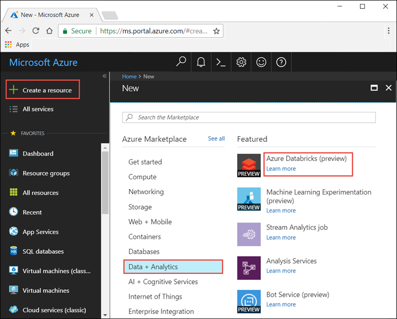
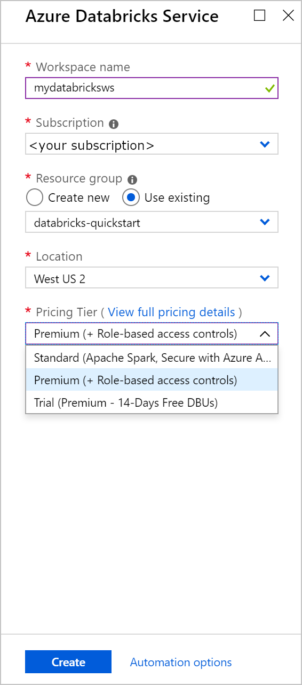
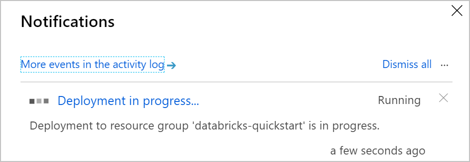
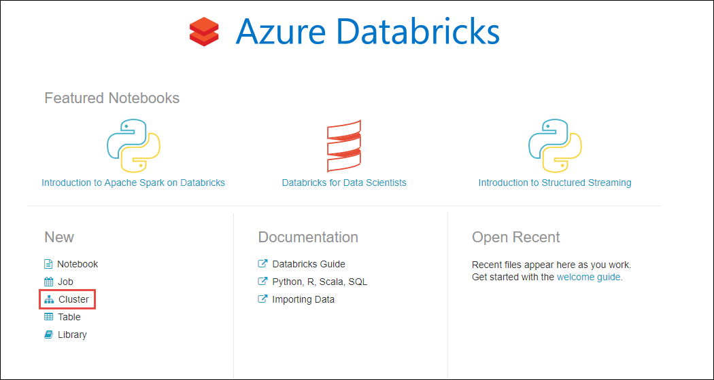
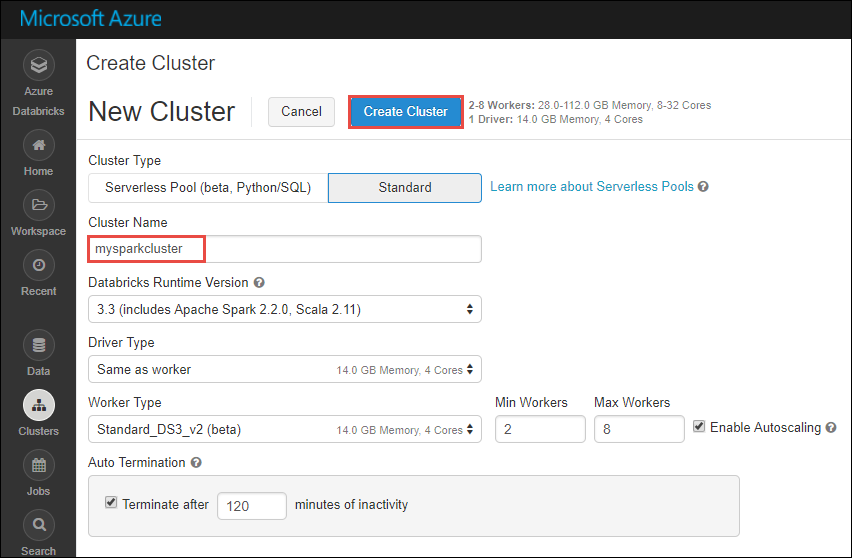
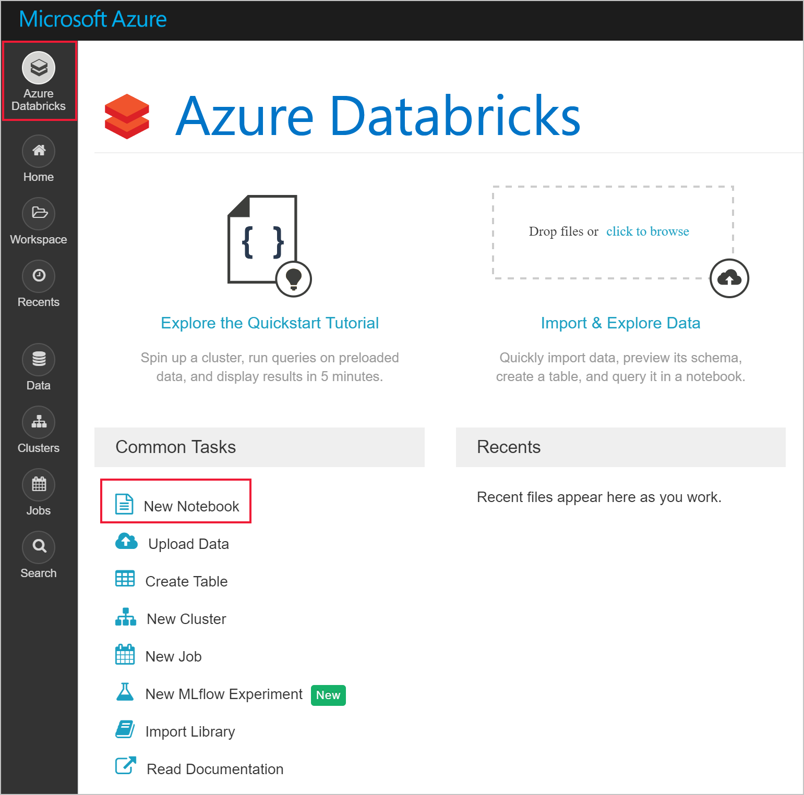
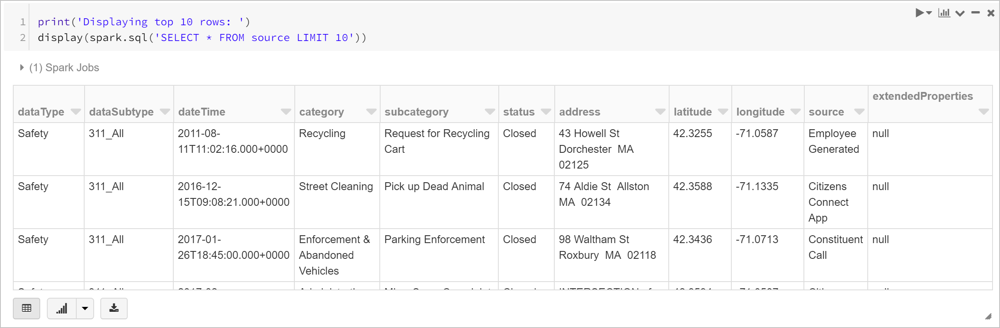
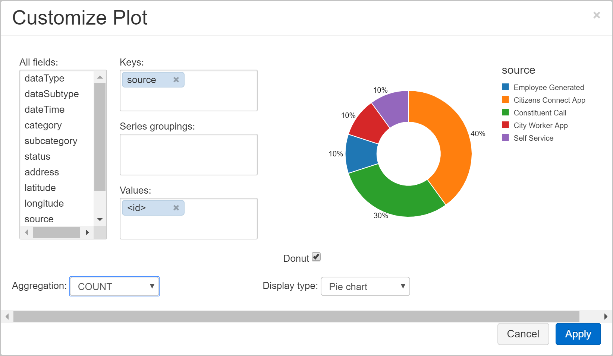

# Quickstart: Run a Spark job on Azure Databricks using the Azure portal

In this quickstart, you use the Azure portal to create an Azure Databricks workspace with an Apache Spark cluster. You run a job on the cluster and use custom charts to produce real-time reports from Boston safety data.

## Prerequisites

- Azure subscription - [create one for free](https://azure.microsoft.com/free/)

## Sign in to the Azure portal

Sign in to the [Azure portal](https://portal.azure.com).

> [!Note]
> This tutorial cannot be carried out using **Azure Free Trial Subscription**.
> If you have a free account, go to your profile and change your subscription to **pay-as-you-go**. For more information, see [Azure free account](https://azure.microsoft.com/free/). Then, [remove the spending limit](https://docs.microsoft.com/azure/billing/billing-spending-limit#why-you-might-want-to-remove-the-spending-limit), and [request a quota increase](https://docs.microsoft.com/azure/azure-portal/supportability/resource-manager-core-quotas-request) for vCPUs in your region. When you create your Azure Databricks workspace, you can select the **Trial (Premium - 14-Days Free DBUs)** pricing tier to give the workspace access to free Premium Azure Databricks DBUs for 14 days.

## Create an Azure Databricks workspace

In this section, you create an Azure Databricks workspace using the Azure portal.

1. In the Azure portal, select **Create a resource** > **Analytics** > **Azure Databricks**.

    

2. Under **Azure Databricks Service**, provide the values to create a Databricks workspace.

    

    Provide the following values:
    
    |Property  |Description  |
    |---------|---------|
    |**Workspace name**     | Provide a name for your Databricks workspace        |
    |**Subscription**     | From the drop-down, select your Azure subscription.        |
    |**Resource group**     | Specify whether you want to create a new resource group or use an existing one. A resource group is a container that holds related resources for an Azure solution. For more information, see [Azure Resource Group overview](../azure-resource-manager/management/overview.md). |
    |**Location**     | Select **West US 2**. For other available regions, see [Azure services available by region](https://azure.microsoft.com/regions/services/).        |
    |**Pricing Tier**     |  Choose between **Standard**, **Premium**, or **Trial**. For more information on these tiers, see [Databricks pricing page](https://azure.microsoft.com/pricing/details/databricks/).       |

3. Select **Review + Create**, and then **Create**. The workspace creation takes a few minutes. During workspace creation, you can view the deployment status in **Notifications**. Once this process is finished, your user account is automatically added as an admin user in the workspace.

    

    When a workspace deployment fails, the workspace is still created in a failed state. Delete the failed workspace and create a new workspace that resolves the deployment errors. When you delete the failed workspace, the managed resource group and any successfully deployed resources are also deleted.

## Create a Spark cluster in Databricks

> [!NOTE]
> To use a free account to create the Azure Databricks cluster, before creating the cluster, go to your profile and change your subscription to **pay-as-you-go**. For more information, see [Azure free account](https://azure.microsoft.com/free/).

1. In the Azure portal, go to the Databricks workspace that you created, and then click **Launch Workspace**.

2. You are redirected to the Azure Databricks portal. From the portal, click **New Cluster**.

    

3. In the **New cluster** page, provide the values to create a cluster.

    

    Accept all other default values other than the following:

   * Enter a name for the cluster.
   * For this article, create a cluster with **5.3** runtime.
   * Make sure you select the **Terminate after \_\_ minutes of inactivity** checkbox. Provide a duration (in minutes) to terminate the cluster, if the cluster is not being used.
    
     Select **Create cluster**. Once the cluster is running, you can attach notebooks to the cluster and run Spark jobs.

For more information on creating clusters, see [Create a Spark cluster in Azure Databricks](/azure/databricks/clusters/create).

## Run a Spark SQL job

Perform the following tasks to create a notebook in Databricks, configure the notebook to read data from an Azure Open Datasets, and then run a Spark SQL job on the data.

1. In the left pane, select **Azure Databricks**. From the **Common Tasks**, select **New Notebook**.

    

2. In the **Create Notebook** dialog box, enter a name, select **Python** as the language, and select the Spark cluster that you created earlier.

    

    Select **Create**.

3. In this step, create a Spark DataFrame with Boston Safety Data from [Azure Open Datasets](https://azure.microsoft.com/services/open-datasets/catalog/boston-safety-data/#AzureDatabricks), and use SQL to query the data.

   The following command sets the Azure storage access information. Paste this PySpark code into the first cell and use **Shift+Enter** to run the code.

   ```python
   blob_account_name = "azureopendatastorage"
   blob_container_name = "citydatacontainer"
   blob_relative_path = "Safety/Release/city=Boston"
   blob_sas_token = r"?st=2019-02-26T02%3A34%3A32Z&se=2119-02-27T02%3A34%3A00Z&sp=rl&sv=2018-03-28&sr=c&sig=XlJVWA7fMXCSxCKqJm8psMOh0W4h7cSYO28coRqF2fs%3D"
   ```

   The following command allows Spark to read from Blob storage remotely. Paste this PySpark code into the next cell and use **Shift+Enter** to run the code.

   ```python
   wasbs_path = 'wasbs://%s@%s.blob.core.windows.net/%s' % (blob_container_name, blob_account_name, blob_relative_path)
   spark.conf.set('fs.azure.sas.%s.%s.blob.core.windows.net' % (blob_container_name, blob_account_name), blob_sas_token)
   print('Remote blob path: ' + wasbs_path)
   ```

   The following command creates a DataFrame. Paste this PySpark code into the next cell and use **Shift+Enter** to run the code.

   ```python
   df = spark.read.parquet(wasbs_path)
   print('Register the DataFrame as a SQL temporary view: source')
   df.createOrReplaceTempView('source')
   ```

4. Run a SQL statement return the top 10 rows of data from the temporary view called **source**. Paste this PySpark code into the next cell and use **Shift+Enter** to run the code.

   ```python
   print('Displaying top 10 rows: ')
   display(spark.sql('SELECT * FROM source LIMIT 10'))
   ```

5. You see a tabular output like shown in the following screenshot (only some columns are shown):

    

6. You now create a visual representation of this data to show how many safety events are reported using the Citizens Connect App and City Worker App instead of other sources. From the bottom of the tabular output, select the **Bar chart** icon, and then click **Plot Options**.

    

8. In **Customize Plot**, drag-and-drop values as shown in the screenshot.

    

   * Set **Keys** to **source**.
   * Set **Values** to **<\id>**.
   * Set **Aggregation** to **COUNT**.
   * Set **Display type** to **Pie chart**.

     Click **Apply**.

## Clean up resources

After you have finished the article, you can terminate the cluster. To do so, from the Azure Databricks workspace, from the left pane, select **Clusters**. For the cluster you want to terminate, move the cursor over the ellipsis under **Actions** column, and select the **Terminate** icon.


If you do not manually terminate the cluster it will automatically stop, provided you selected the **Terminate after \_\_ minutes of inactivity** checkbox while creating the cluster. In such a case, the cluster automatically stops, if it has been inactive for the specified time.

## Next steps

In this article, you created a Spark cluster in Azure Databricks and ran a Spark job using data from Azure Open Datasets. You can also look at [Spark data sources](/azure/databricks/data/data-sources/index) to learn how to import data from other data sources into Azure Databricks. Advance to the next article to learn how to perform an ETL operation (extract, transform, and load data) using Azure Databricks.

> [!div class="nextstepaction"]
>[Extract, transform, and load data using Azure Databricks](databricks-extract-load-sql-data-warehouse.md)
