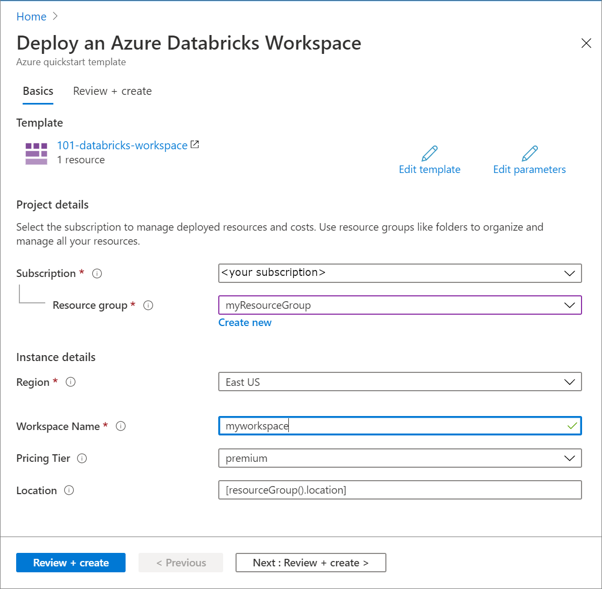
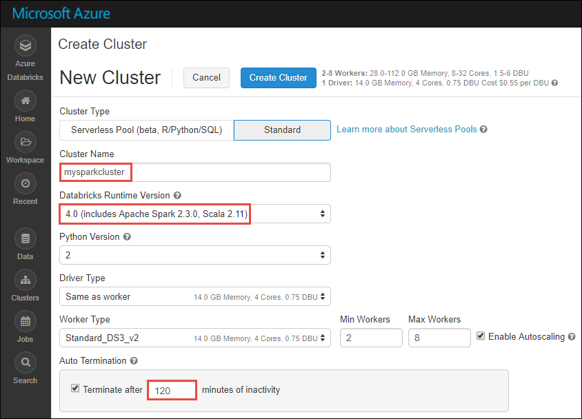
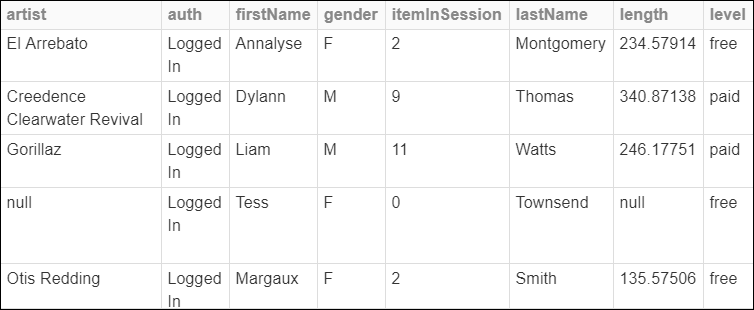
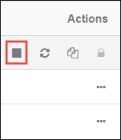

# Quickstart: Run a Spark job on Azure Databricks using the Azure Resource Manager template

In this quickstart, you use an Azure Resource Manager template to create an Azure Databricks workspace with an Apache Spark cluster. You run a job on the cluster and use custom charts to produce real-time reports from free/paid usage based on demographics.

## Prerequisites

- Azure subscription - [create one for free](https://azure.microsoft.com/free/)

## Sign in to the Azure portal

Sign in to the [Azure portal](https://portal.azure.com).

> [!Note]
> This tutorial cannot be carried out using **Azure Free Trial Subscription**.
> If you have a free account, go to your profile and change your subscription to **pay-as-you-go**. For more information, see [Azure free account](https://azure.microsoft.com/free/). Then, [remove the spending limit](https://docs.microsoft.com/azure/billing/billing-spending-limit#why-you-might-want-to-remove-the-spending-limit), and [request a quota increase](https://docs.microsoft.com/azure/azure-portal/supportability/resource-manager-core-quotas-request) for vCPUs in your region. When you create your Azure Databricks workspace, you can select the **Trial (Premium - 14-Days Free DBUs)** pricing tier to give the workspace access to free Premium Azure Databricks DBUs for 14 days.

## Create an Azure Databricks workspace

In this section, you create an Azure Databricks workspace using the Azure Resource Manager template.

1. Click the following image to open the template in the Azure portal.

   <a href="https://portal.azure.com/#create/Microsoft.Template/uri/https%3A%2F%2Fraw.githubusercontent.com%2FAzure%2Fazure-quickstart-templates%2Fmaster%2F101-databricks-workspace%2Fazuredeploy.json" target="_blank"></a>

2. Provide the required values to create your Azure Databricks workspace

   

   Provide the following values:

   |Property  |Description  |
   |---------|---------|
   |**Subscription**     | From the drop-down, select your Azure subscription.        |
   |**Resource group**     | Specify whether you want to create a new resource group or use an existing one. A resource group is a container that holds related resources for an Azure solution. For more information, see [Azure Resource Group overview](../azure-resource-manager/management/overview.md). |
   |**Location**     | Select **East US 2**. For other available regions, see [Azure services available by region](https://azure.microsoft.com/regions/services/).        |
   |**Workspace name**     | Provide a name for your Databricks workspace        |
   |**Pricing Tier**     |  Choose between **Standard** or **Premium**. For more information on these tiers, see [Databricks pricing page](https://azure.microsoft.com/pricing/details/databricks/).       |

3. Select **I agree to the terms and conditions stated above**, select **Pin to dashboard**, and then click **Purchase**.

4. The workspace creation takes a few minutes. During workspace creation, the portal displays the **Submitting deployment for Azure Databricks** tile on the right side. You may need to scroll right on your dashboard to see the tile. There is also a progress bar displayed near the top of the screen. You can watch either area for progress.

   

## Create a Spark cluster in Databricks

1. In the Azure portal, go to the Databricks workspace that you created, and then click **Launch Workspace**.

2. You are redirected to the Azure Databricks portal. From the portal, click **Cluster**.

   

3. In the **New cluster** page, provide the values to create a cluster.

   

   Accept all other default values other than the following:

   * Enter a name for the cluster.
   * For this article, create a cluster with **4.0** runtime.
   * Make sure you select the **Terminate after \_\_ minutes of inactivity** checkbox. Provide a duration (in minutes) to terminate the cluster, if the cluster is not being used.

   Select **Create cluster**. Once the cluster is running, you can attach notebooks to the cluster and run Spark jobs.

For more information on creating clusters, see [Create a Spark cluster in Azure Databricks](/azure/databricks/clusters/create).

## Run a Spark SQL job

Before you begin with this section, you must complete the following prerequisites:

* [Create an Azure Blob storage account](../storage/common/storage-account-create.md).
* Download a sample JSON file [from GitHub](https://github.com/Azure/usql/blob/master/Examples/Samples/Data/json/radiowebsite/small_radio_json.json).
* Upload the sample JSON file to the Azure Blob storage account you created. You can use [Microsoft Azure Storage Explorer](../vs-azure-tools-storage-manage-with-storage-explorer.md) to upload files.

Perform the following tasks to create a notebook in Databricks, configure the notebook to read data from an Azure Blob storage account, and then run a Spark SQL job on the data.

1. In the left pane, click **Workspace**. From the **Workspace** drop-down, click **Create**, and then click **Notebook**.

   

2. In the **Create Notebook** dialog box, enter a name, select **Scala** as the language, and select the Spark cluster that you created earlier.

   

   Click **Create**.

3. In this step, associate the Azure Storage account with the Databricks Spark cluster. There are two ways to accomplish this association. You can mount the Azure Storage account to the Databricks Filesystem (DBFS), or directly access the Azure Storage account from the application you create.

   > [!IMPORTANT]
   >This article uses the approach to **mount the storage with DBFS**. This approach ensures that the mounted storage gets associated with the cluster filesystem itself. Hence, any application accessing the cluster is able to use the associated storage as well. The direct-access approach is limited to the application from where you configure the access.
   >
   > To use the mounting approach, you must create a Spark cluster with Databricks runtime version **4.0**, which is what you chose in this article.

   In the following snippet, replace `{YOUR CONTAINER NAME}`, `{YOUR STORAGE ACCOUNT NAME}`, and `{YOUR STORAGE ACCOUNT ACCESS KEY}` with the appropriate values for your Azure Storage account. Paste the snippet in an empty cell in the notebook and then press SHIFT + ENTER to run the code cell.

   * **Mount the storage account with DBFS (recommended)**. In this snippet, the Azure Storage account path is mounted to `/mnt/mypath`. So, in all future occurrences where you access the Azure Storage account you don't need to give the full path. You can just use `/mnt/mypath`.

          dbutils.fs.mount(
            source = "wasbs://{YOUR CONTAINER NAME}@{YOUR STORAGE ACCOUNT NAME}.blob.core.windows.net/",
            mountPoint = "/mnt/mypath",
            extraConfigs = Map("fs.azure.account.key.{YOUR STORAGE ACCOUNT NAME}.blob.core.windows.net" -> "{YOUR STORAGE ACCOUNT ACCESS KEY}"))

   * **Directly access the storage account**

          spark.conf.set("fs.azure.account.key.{YOUR STORAGE ACCOUNT NAME}.blob.core.windows.net", "{YOUR STORAGE ACCOUNT ACCESS KEY}")

     For information about how to retrieve the storage account access keys, see [Manage storage account access keys](../storage/common/storage-account-keys-manage.md).

   > [!NOTE]
   > You can also use Azure Data Lake Store with a Spark cluster on Azure Databricks. For instructions, see [Use Data Lake Store with Azure Databricks](/azure/databricks/data/data-sources/azure/azure-datalake-gen2).

4. Run a SQL statement to create a temporary table using data from the sample JSON data file, **small_radio_json.json**. In the following snippet, replace the placeholder values with your container name and storage account name. Paste the snippet in a code cell in the notebook, and then press SHIFT + ENTER. In the snippet, `path` denotes the location of the sample JSON file that you uploaded to your Azure Storage account.

   ```sql
   %sql
   DROP TABLE IF EXISTS radio_sample_data;
   CREATE TABLE radio_sample_data
   USING json
   OPTIONS (
    path "/mnt/mypath/small_radio_json.json"
   )
   ```

   Once the command successfully completes, you have all the data from the JSON file as a table in Databricks cluster.

   The `%sql` language magic command enables you to run a SQL code from the notebook, even if the notebook is of another type. For more information, see [Mixing languages in a notebook](/azure/databricks/notebooks/index).

5. Let's look at a snapshot of the sample JSON data to better understand the query that you run. Paste the following snippet in the code cell and press **SHIFT + ENTER**.

   ```sql
   %sql
   SELECT * from radio_sample_data
   ```

6. You see a tabular output like shown in the following screenshot (only some columns are shown):

   

   Among other details, the sample data captures the gender of the audience of a radio channel (column name, **gender**) and whether their subscription is free or paid (column name, **level**).

7. You now create a visual representation of this data to show for each gender, how many users have free accounts and how many are paid subscribers. From the bottom of the tabular output, click the **Bar chart** icon, and then click **Plot Options**.

   

8. In **Customize Plot**, drag-and-drop values as shown in the screenshot.

   

   * Set **Keys** to **gender**.
   * Set **Series groupings** to **level**.
   * Set **Values** to **level**.
   * Set **Aggregation** to **COUNT**.

   Click **Apply**.

9. The output shows the visual representation as depicted in the following screenshot:

   

## Clean up resources

After you have finished the article, you can terminate the cluster. To do so, from the Azure Databricks workspace, from the left pane, select **Clusters**. For the cluster you want to terminate, move the cursor over the ellipsis under **Actions** column, and select the **Terminate** icon.



If you do not manually terminate the cluster it will automatically stop, provided you selected the **Terminate after \_\_ minutes of inactivity** checkbox while creating the cluster. In such a case, the cluster automatically stops, if it has been inactive for the specified time.

## Next steps

In this article, you created a Spark cluster in Azure Databricks and ran a Spark job using data in Azure storage. You can also look at [Spark data sources](/azure/databricks/data/data-sources/index) to learn how to import data from other data sources into Azure Databricks. You can also look at the Resource Manager template to [Create an Azure Databricks workspace with custom VNET address](https://github.com/Azure/azure-quickstart-templates/tree/master/101-databricks-workspace-with-custom-vnet-address). For the JSON syntax and properties to use in a template, see [Microsoft.Databricks/workspaces](/azure/templates/microsoft.databricks/workspaces) template reference.

Advance to the next article to learn how to perform an ETL operation (extract, transform, and load data) using Azure Databricks.

> [!div class="nextstepaction"]
> [Extract, transform, and load data using Azure Databricks](databricks-extract-load-sql-data-warehouse.md)
