# Quickstart: Create an Azure Databricks workspace in your own Virtual Network

The default deployment of Azure Databricks creates a new virtual network that is managed by Databricks. This quickstart shows how to create an Azure Databricks workspace in your own virtual network instead. You also create an Apache Spark cluster within that workspace. 

For more information about why you might choose to create an Azure Databricks workspace in your own virtual network, see [Deploy Azure Databricks in your Azure Virtual Network (VNet Injection)] (/databricks/administration-guide/cloud-configurations/azure/vnet-inject).

If you don't have an Azure subscription, create a [free account](https://azure.microsoft.com/free/databricks/).

## Sign in to the Azure portal

Sign in to the [Azure portal](https://portal.azure.com/).

> [!Note]
> This tutorial cannot be carried out using **Azure Free Trial Subscription**.
> If you have a free account, go to your profile and change your subscription to **pay-as-you-go**. For more information, see [Azure free account](https://azure.microsoft.com/free/). Then, [remove the spending limit](https://docs.microsoft.com/azure/billing/billing-spending-limit#why-you-might-want-to-remove-the-spending-limit), and [request a quota increase](https://docs.microsoft.com/azure/azure-portal/supportability/resource-manager-core-quotas-request) for vCPUs in your region. When you create your Azure Databricks workspace, you can select the **Trial (Premium - 14-Days Free DBUs)** pricing tier to give the workspace access to free Premium Azure Databricks DBUs for 14 days.

## Create a virtual network

1. From the Azure portal menu, select **Create a resource**. Then select **Networking > Virtual network**.

    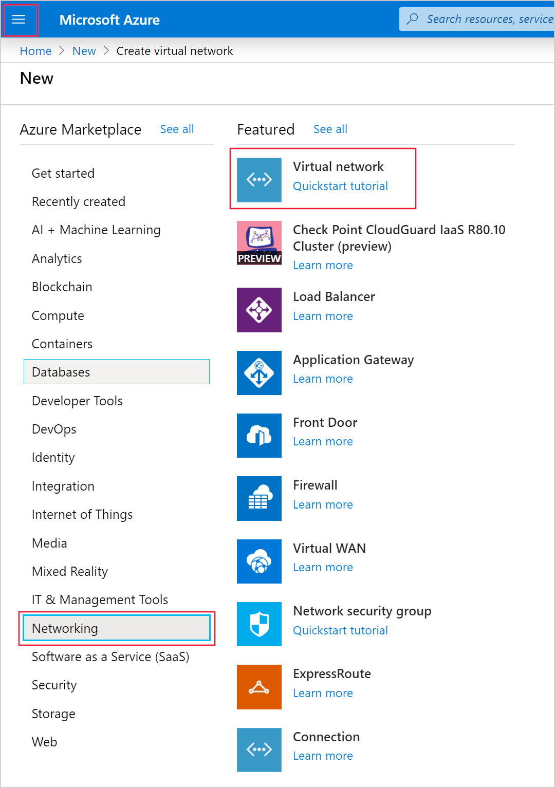

2. Under **Create virtual network**, apply the following settings: 

    |Setting|Suggested value|Description|
    |-------|---------------|-----------|
    |Subscription|\<Your subscription\>|Select the Azure subscription that you want to use.|
    |Resource group|databricks-quickstart|Select **Create New** and enter a new resource group name for your account.|
    |Name|databricks-quickstart|Select a name for your virtual network.|
    |Region|\<Select the region that is closest to your users\>|Select a geographic location where you can host your virtual network. Use the location that's closest to your users.|

    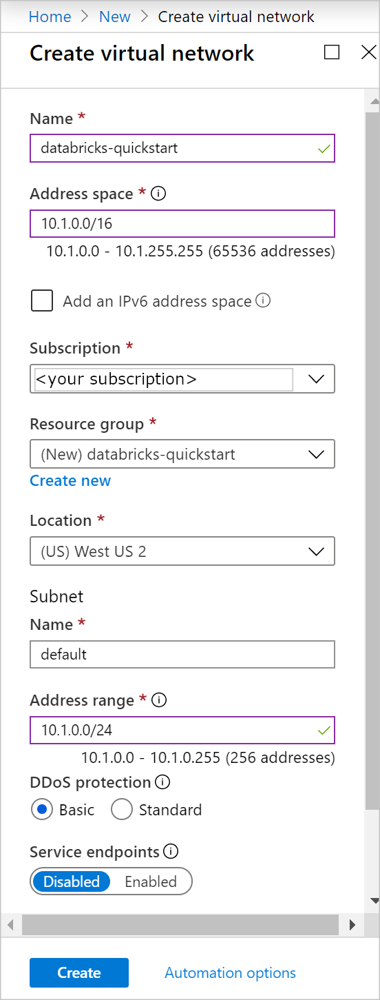

3. Select **Next: IP Addresses >** and apply the following settings. Then select **Review + create**.
    
    |Setting|Suggested value|Description|
    |-------|---------------|-----------|
    |IPv4 address space|10.2.0.0/16|The virtual network's address range in CIDR notation. The CIDR range must be between /16 and /24|
    |Subnet name|default|Select a name for the default subnet in your virtual network.|
    |Subnet Address range|10.2.0.0/24|The subnet's address range in CIDR notation. It must be contained by the address space of the virtual network. The address range of a subnet which is in use can't be edited.|

    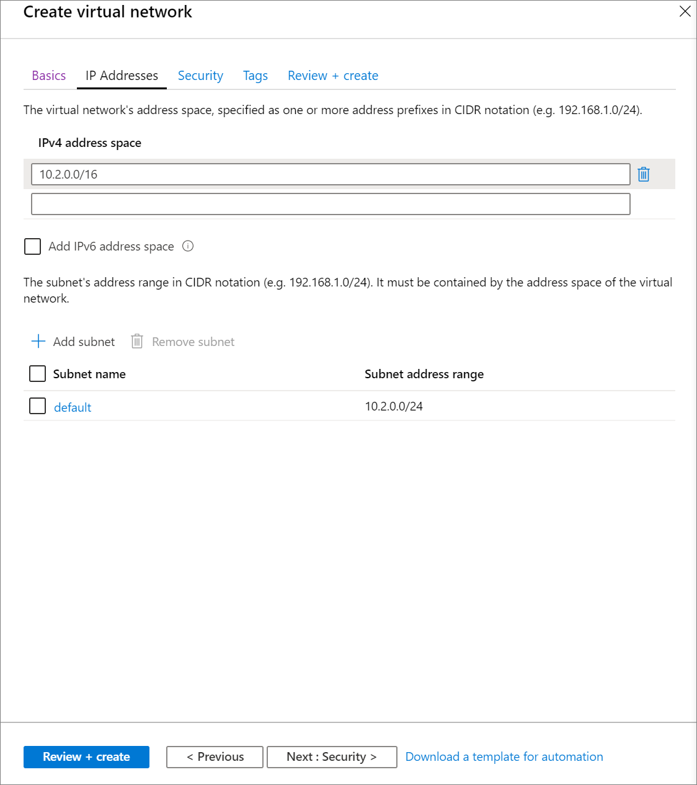

4. On the **Review + create** tab, select **Create** to deploy the virtual network. Once the deployment is complete, navigate to your virtual network and select **Address space** under **Settings**. In the box that says *Add additional address range*, insert `10.179.0.0/16` and select **Save**.

    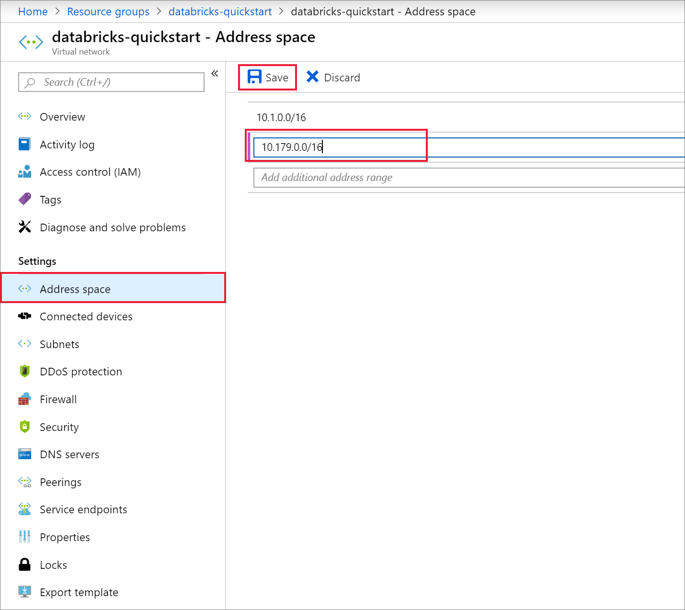

## Create an Azure Databricks workspace

1. From the Azure portal menu, select **Create a resource**. Then select **Analytics > Databricks**.

    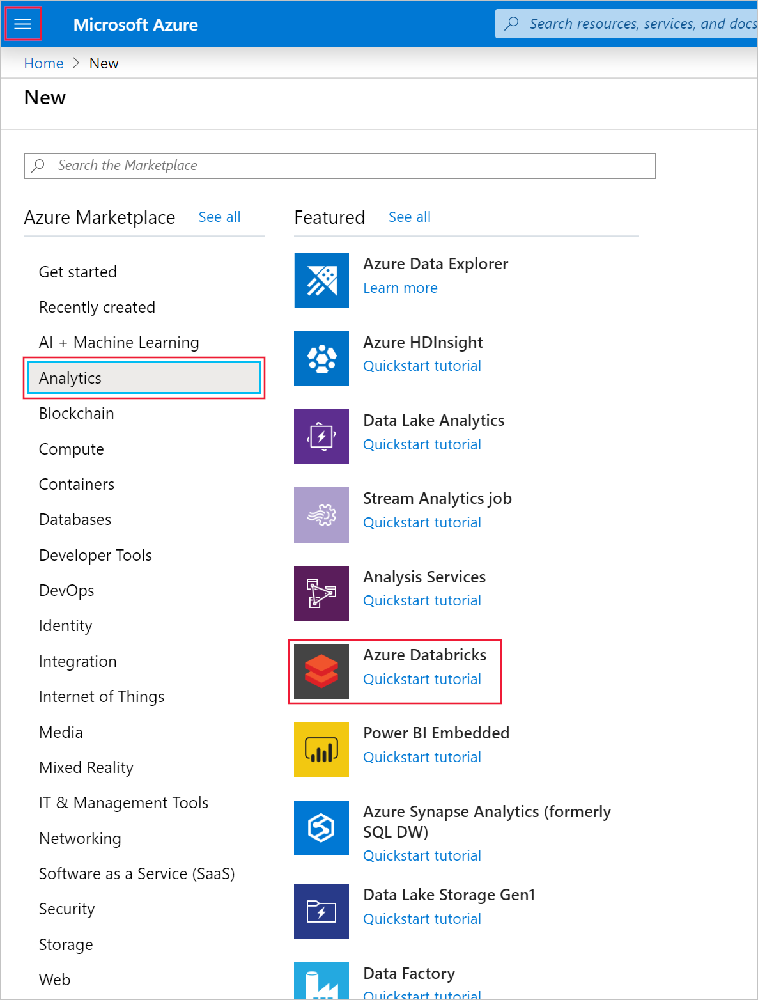

2. Under **Azure Databricks Service**, apply the following settings:

    |Setting|Suggested value|Description|
    |-------|---------------|-----------|
    |Workspace name|databricks-quickstart|Select a name for your Azure Databricks workspace.|
    |Subscription|\<Your subscription\>|Select the Azure subscription that you want to use.|
    |Resource group|databricks-quickstart|Select the same resource group you used for the virtual network.|
    |Location|\<Select the region that is closest to your users\>|Choose the same location as your virtual network.|
    |Pricing Tier|Choose between Standard or Premium.|For more information on pricing tiers, see the [Databricks pricing page](https://azure.microsoft.com/pricing/details/databricks/).|

    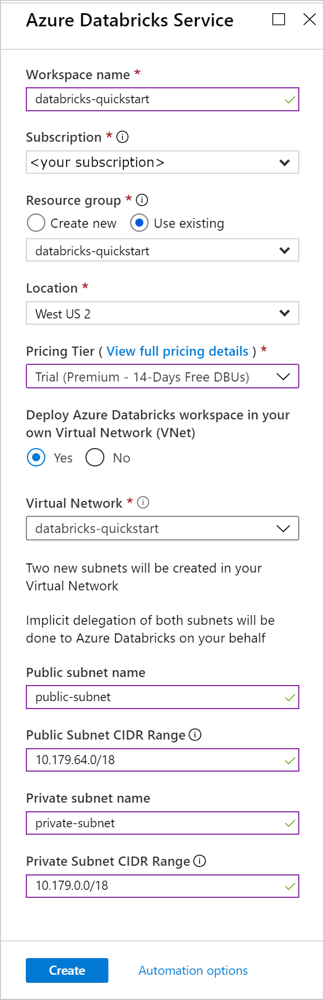

3. Once you've finished entering settings on the **Basics** page, select **Next: Networking >** and apply the following settings:

    |Setting|Suggested value|Description|
    |-------|---------------|-----------|
    |Deploy Azure Databricks workspace in your Virtual Network (VNet)|Yes|This setting allows you to deploy an Azure Databricks workspace in your virtual network.|
    |Virtual Network|databricks-quickstart|Select the virtual network you created in the previous section.|
    |Public Subnet Name|public-subnet|Use the default public subnet name.|
    |Public Subnet CIDR Range|10.179.64.0/18|Use a CIDR range up to and including /26.|
    |Private Subnet Name|private-subnet|Use the default private subnet name.|
    |Private Subnet CIDR Range|10.179.0.0/18|Use a CIDR range up to and including /26.|

    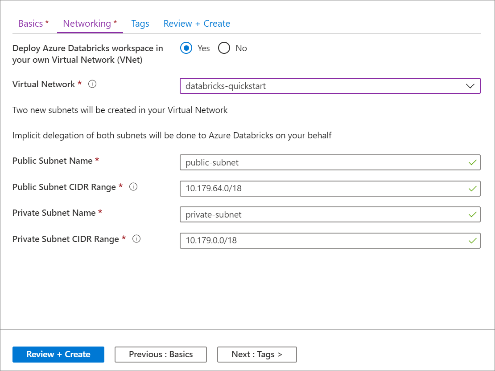

3. Once the deployment is complete, navigate to the Azure Databricks resource. Notice that virtual network peering is disabled. Also notice the resource group and managed resource group in the overview page. 

    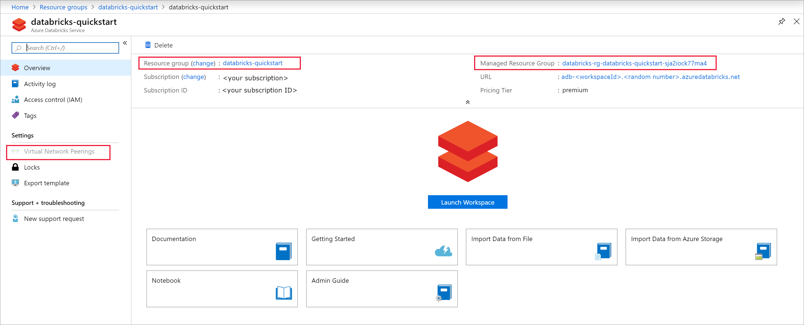

    The managed resource group is not modifiable, and it is not used to create virtual machines. You can only create virtual machines in the resource group you manage.

    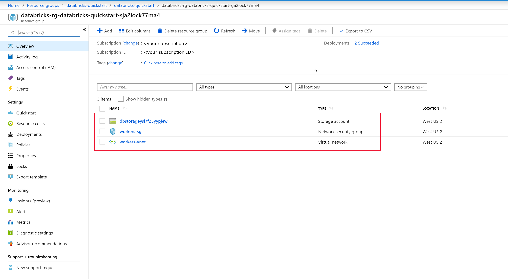

## Create a cluster

> [!NOTE]
> To use a free account to create the Azure Databricks cluster, before creating the cluster, go to your profile and change your subscription to **pay-as-you-go**. For more information, see [Azure free account](https://azure.microsoft.com/free/).

1. Return to your Azure Databricks service and select **Launch Workspace** on the **Overview** page.

2. Select **Clusters** > **+ Create Cluster**. Then create a cluster name, like *databricks-quickstart-cluster*, and accept the remaining default settings. Select **Create Cluster**.

    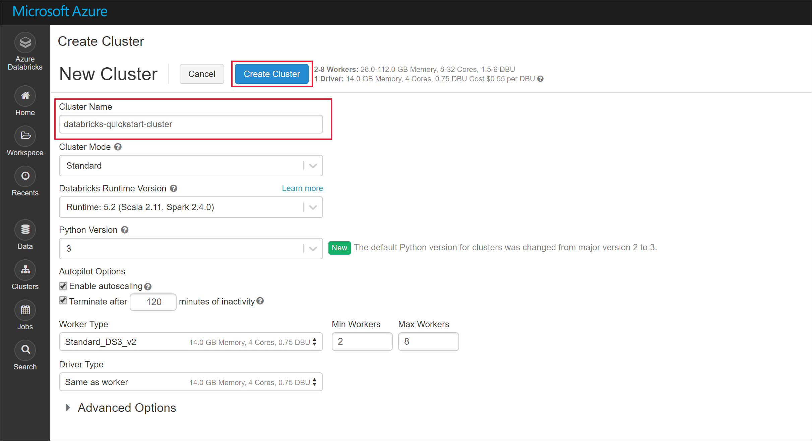

3. Once the cluster is running, return to the managed resource group in the Azure portal. Notice the new virtual machines, disks, IP Address, and network interfaces. A network interface is created in each of the public and private subnets with IP addresses.  

    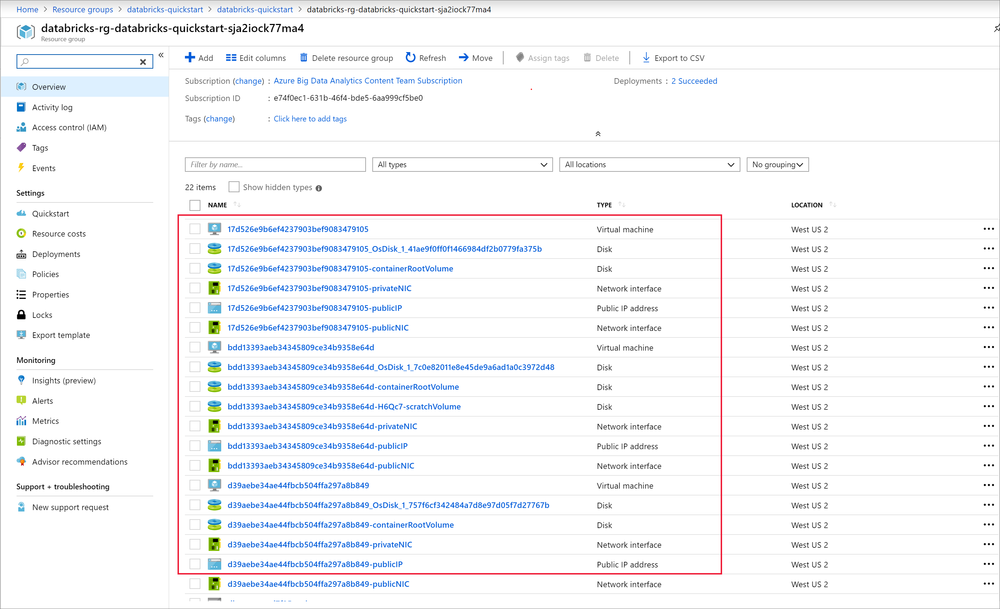

4. Return to your Azure Databricks workspace and select the cluster you created. Then navigate to the **Executors** tab on the **Spark UI** page. Notice that the addresses for the driver and the executors are in the private subnet range. In this example, the driver is 10.179.0.6 and executors are 10.179.0.4 and 10.179.0.5. Your IP addresses could be different.

    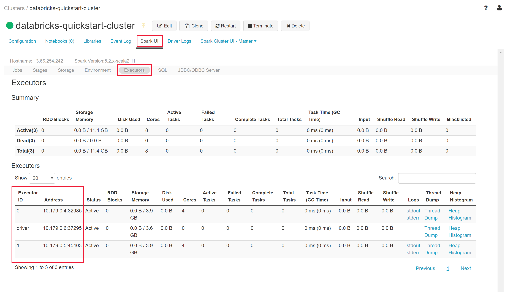

## Clean up resources

After you have finished the article, you can terminate the cluster. To do so, from the Azure Databricks workspace, from the left pane, select **Clusters**. For the cluster you want to terminate, move the cursor over the ellipsis under **Actions** column, and select the **Terminate** icon. This stops the cluster.

If you do not manually terminate the cluster it will automatically stop, provided you selected the **Terminate after \_\_ minutes of inactivity** checkbox while creating the cluster. In such a case, the cluster automatically stops, if it has been inactive for the specified time.

If you do not wish to reuse the cluster, you can delete the resource group you created in the Azure portal.

## Next steps

In this article, you created a Spark cluster in Azure Databricks that you deployed to a virtual network. Advance to the next article to learn how to query a SQL Server Linux Docker container in the virtual network using JDBC from an Azure Databricks notebook.  

> [!div class="nextstepaction"]
>[Query a SQL Server Linux Docker container in a virtual network from an Azure Databricks notebook](vnet-injection-sql-server.md)
