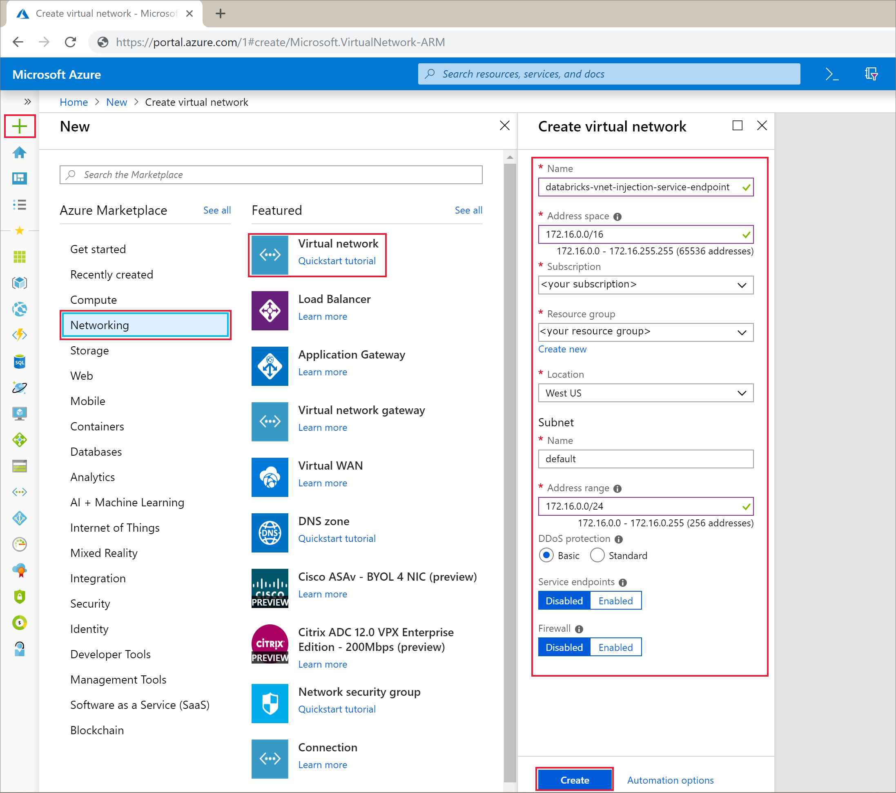

# Tutorial: Implement VNet injected Azure Databricks environment with a service endpoint enabled for Cosmos DB

This tutorial describes how to implement a VNet injected Databricks environment with a Service Endpoint enabled for Cosmos DB.

In this tutorial you learn how to:

## Prerequisites

Before you start, make sure you have the following:

* 

## Create a virtual network

1. Sign in to the [Azure portal](https://portal.azure.com/).

2. On the upper-left side of the screen, select **Create a resource > Networking > Virtual network**.

3. In **Create a virtual network**, enter or select the following parameters:

  |Setting|Value|
  |-------|-----|
  |Name|databricks-vnet-injection-service-endpoint|
  |Address space|172.16.0.0/16|
  |Subscription|*your subscription*|
  |Resource group|*your resource group*|
  |Location|West US|
  |Subnet Name|default|
  |Subnet Address range|172.16.0.0/24|
  |DDos protection|Basic|
  |Service endpoints|Disabled|
  |Firewall|Disabled|

  

## Create VNet injected Databricks cluster

1. Open the Azure portal. On the upper-left side of the screen, select **Create a resource > Analytics > Azure Databricks**.

2. 