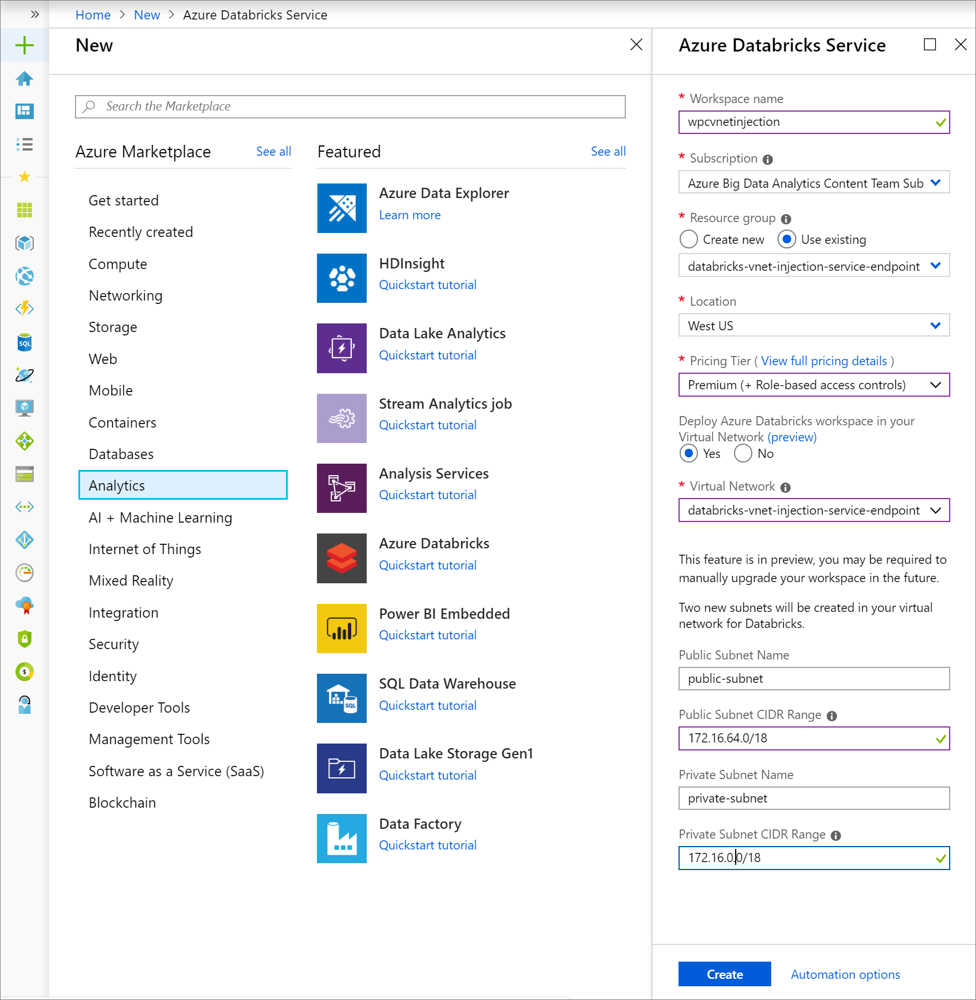
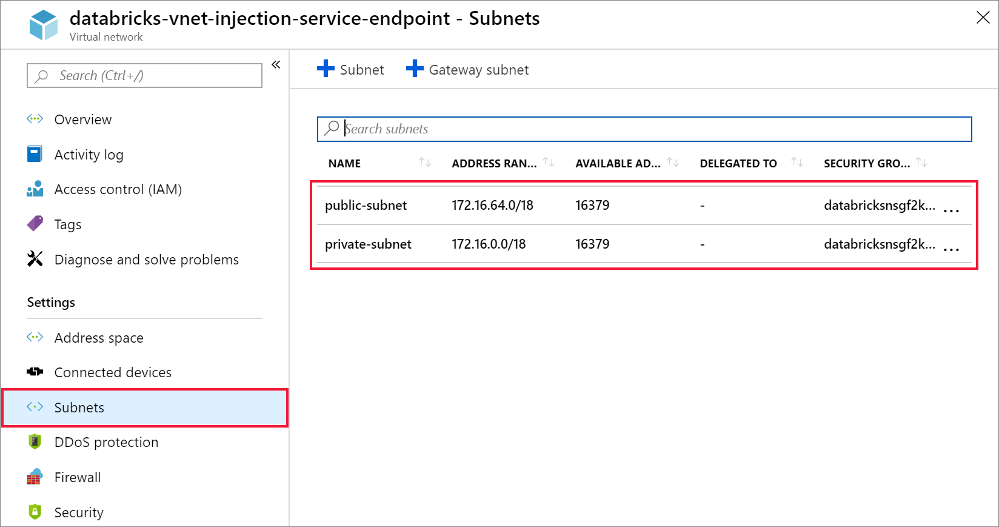
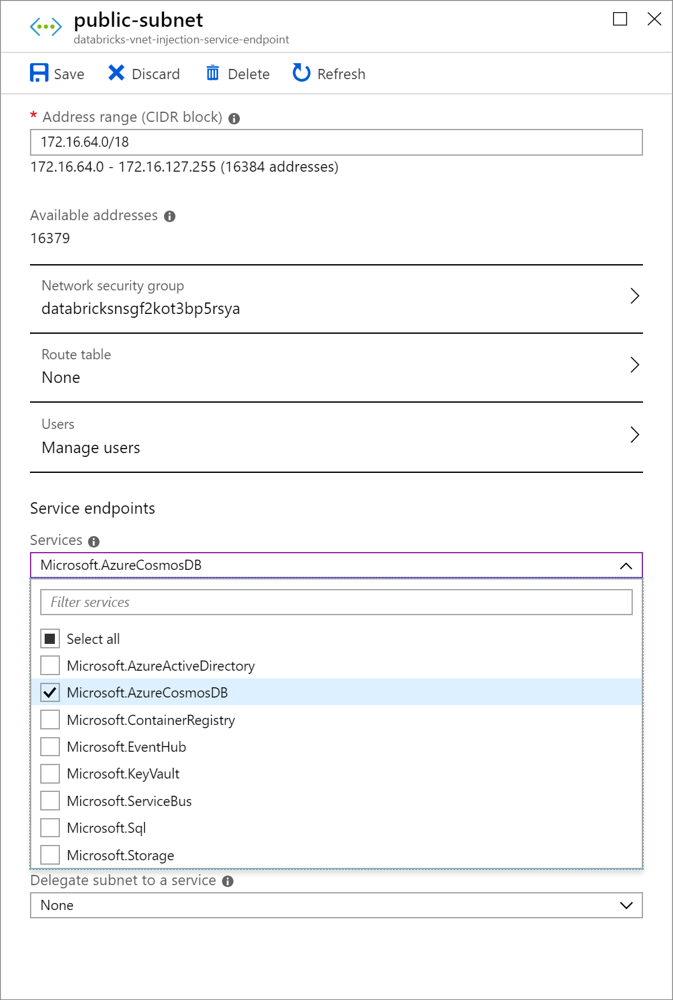
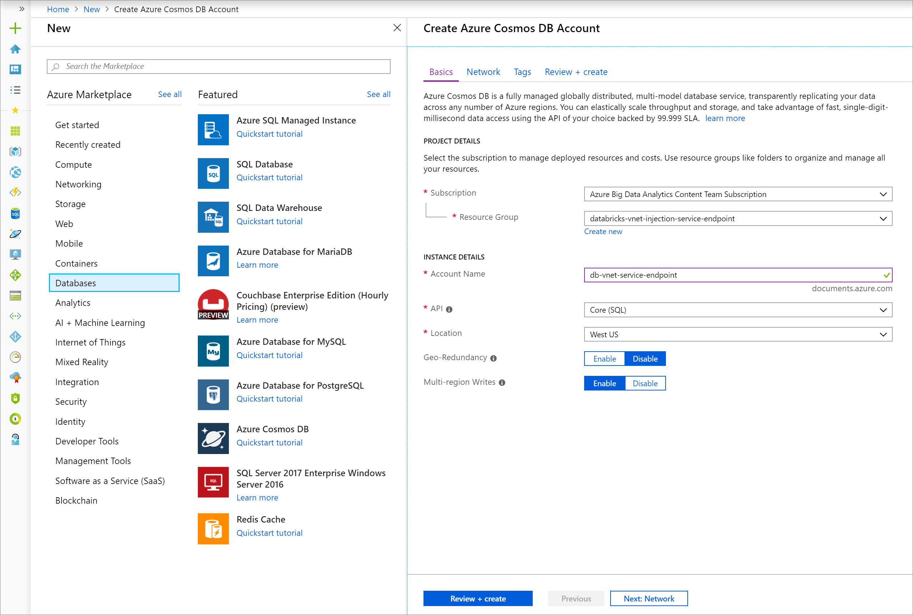
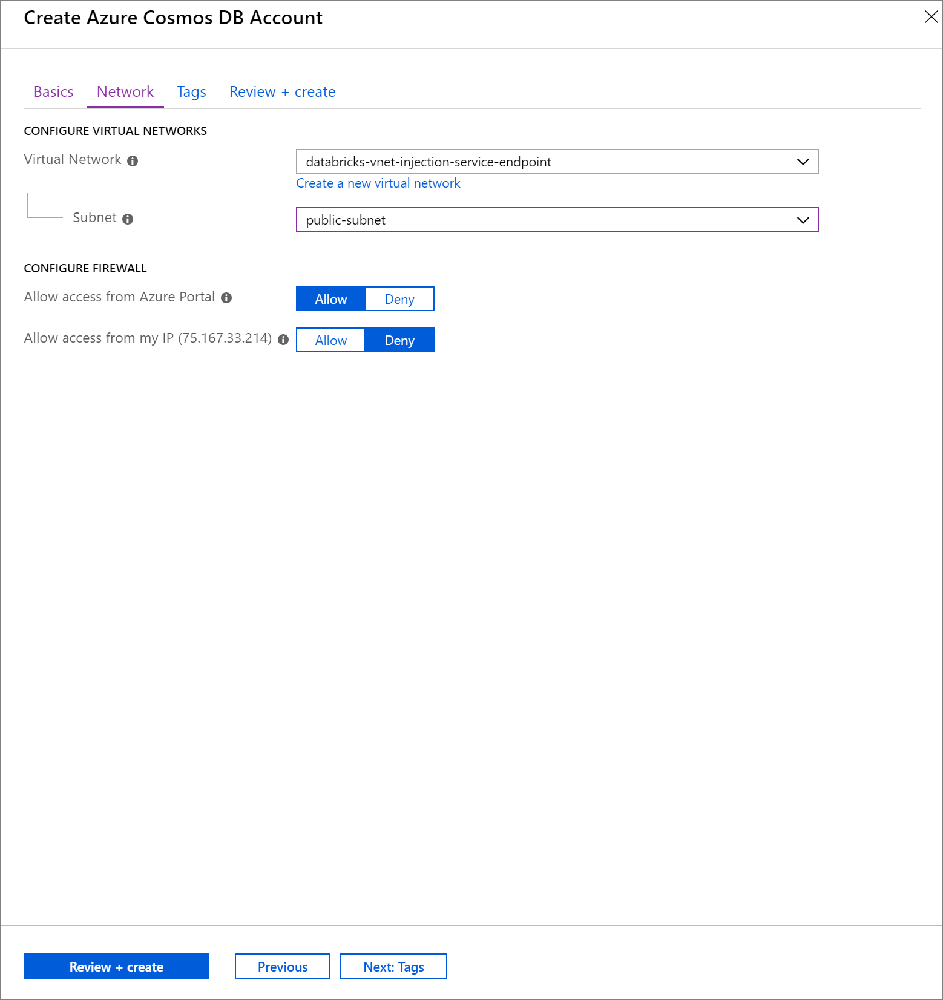
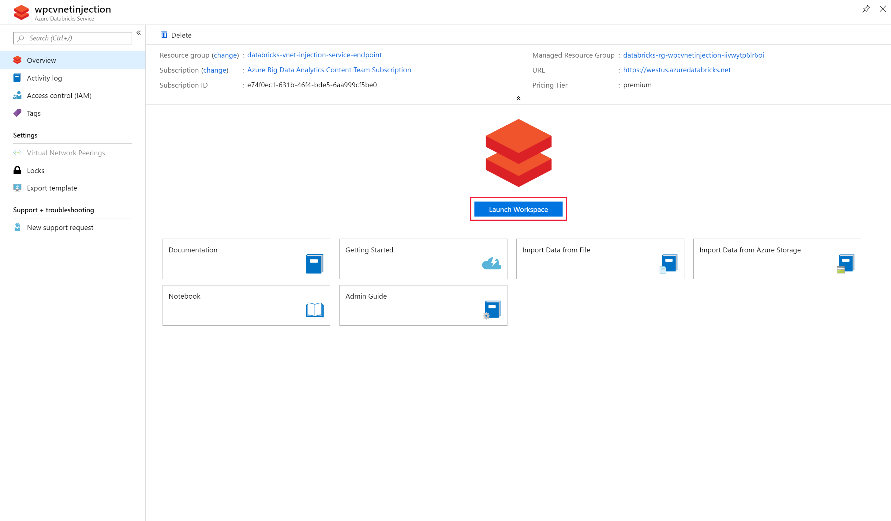
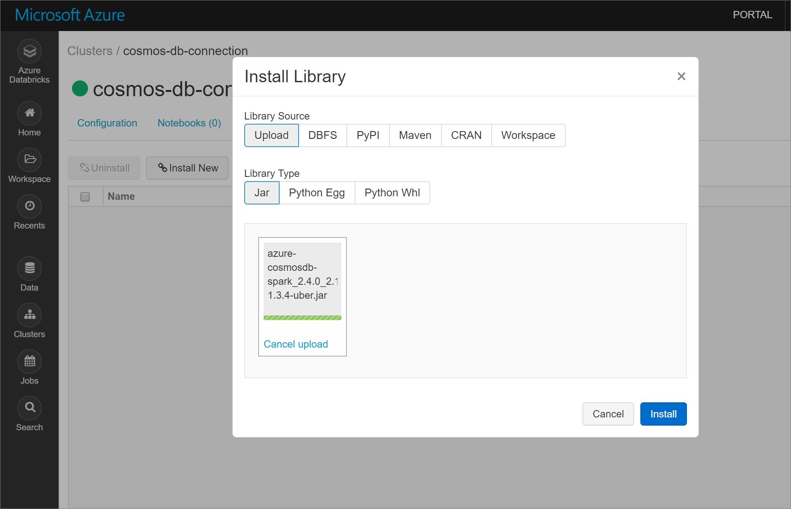
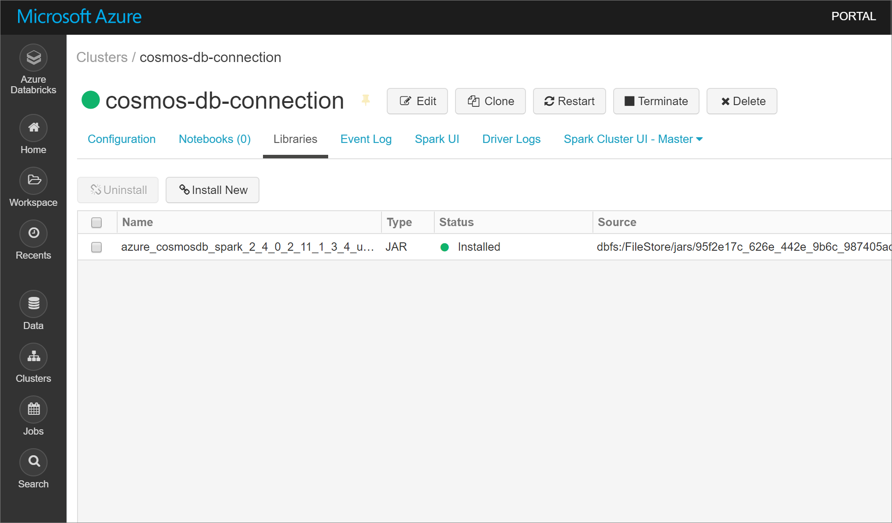

# Tutorial: Implement VNet injected Azure Databricks environment with a service endpoint enabled for Cosmos DB

This tutorial describes how to implement a VNet injected Databricks environment with a Service Endpoint enabled for Cosmos DB.

In this tutorial you learn how to:

## Prerequisites

Before you start, make sure you have the following:

* Download [spark connector](https://search.maven.org/remotecontent?filepath=com/microsoft/azure/azure-cosmosdb-spark_2.4.0_2.11/1.3.4/azure-cosmosdb-spark_2.4.0_2.11-1.3.4-uber.jar).

## Create a virtual network

1. Sign in to the [Azure portal](https://portal.azure.com/).

2. On the upper-left side of the screen, select **Create a resource > Networking > Virtual network**.

3. In **Create a virtual network**, enter or select the following settings:

   |Setting|Value|
   |-------|-----|
   |Name|databricks-vnet-injection-service-endpoint|
   |Address space|172.16.0.0/16|
   |Subscription|*your subscription*|
   |Resource group|*your resource group*|
   |Location|West US|
   |Subnet Name|default|
   |Subnet Address range|172.16.0.0/24|
   |DDos protection|Basic|
   |Service endpoints|Disabled|
   |Firewall|Disabled|

   

4. When your virtual network deployment is complete, navigate to the virtual network and delete the default subnet. Your Azure Databricks deployment will 

## Create VNet injected Databricks cluster

1. Open the Azure portal. On the upper-left side of the screen, select **Create a resource > Analytics > Azure Databricks**.

2. In **Azure Databricks Service**, enter or select the following settings:

   |Setting|Value|Description|
   |-------|-----|-----------|
   |Workspace name|*wpcvnetinjection*|Choose a name for your Azure Databricks workspace.|
   |Subscription|*your subscription*|Choose an Azure subscription.|
   |Resource group|*your resource group*|Choose the resource group you used for the virtual network in the previous step.|
   |Location|West US|Location of Azure Databricks.|
   |Pricing Tier|Premium|Select a pricing tier. The Premium pricing tier is used in this tutorial, but is not necessary to complete the tutorial.|
   |Deploy Azure Databricks workspace in your Virtual Network|Yes|Choose yes to deploy your Azure Databricks workspace in your virtual network.|
   |Virtual Network|databricks-vnet-injection-service-endpoint|Choose the virtual network you created in the previous step.|
   |Public Subnet Name|public-subnet|This is the default public subnet name.|
   |Public Subnet CIDR Range|172.16.64.0/18|Choose a public subnet.|
   |Private Subnet Name|public-subnet|This is the default private subnet name.|Choose a private subnet.|
   |Private Subnet CIDR Range|172.16.0.0/18|

   

3. Select **Create** to deploy the Azure Databricks service.

## Create Cosmos DB service endpoint

1. Once the Azure Databricks deployment is complete, navigate to your virtual network. Notice the public and private subnets that were created through the Databricks deployment.

   

2. Select the *public-subnet* and create a Cosmos DB service endpoint. Then **Save**.
   
   

## Create Cosmos DB account

1. Open the Azure portal. On the upper-left side of the screen, select **Create a resource > Databases > Azure Cosmos DB**.

2. Fill out the **Instance Details** on the **Basics** tab with the following settings:

   |Setting|Value|
   |-------|-----|
   |Subscription|*your subscription*|
   |Resource Group|*your resource group*|
   |Account Name|db-vnet-service-endpoint|
   |API|Core (SQL)|
   |Location|West US|
   |Geo-Redundancy|Disable|
   |Multi-region Writes|Enable|

   

3. Select the **Network** tab and configure your virtual network. Choose the virtual network you created in the first section and *public-subnet*. Notice that *private-subnet* has the note *'Microsoft AzureCosmosDB' endpoint is missing'*. This is because you only enabled the Cosmos DB service endpoint on the *public-subnet*. 

   Ensure you have *Allow access from Azure Portal* enabled. This setting allows you to access your Cosmos DB account from the Azure portal. If this is disabled you will receive errors when attempting to access your account. 

   It is not necessary for this tutorial, but you can also enable *Allow access from my IP* if want the ability to access your Cosmos DB account from your local machine. For example, if you are connecting to your account using the Cosmos DB SDK, you need to enable this setting. If it is disabled, you will receive "Access Denied" errors.

   

4. Select **Review + Create**, and then **Create** to create your Cosmos DB account inside the virtual network.

## Create a cluster and add library

1. Navigate to your Azure Databricks service in the Azure portal and select **Launch Workspace**.

   

2. Create a new cluster. Choose a Cluster Name and accept the remaining default settings.

   

3. After your cluster is created, navigate to the cluster page and select the **Libraries** tab. Select **Install New** and upload the Spark connector jar file to install the library.

    

    You can verify that the library was installed on the **Libraries** tab.

    

4. 