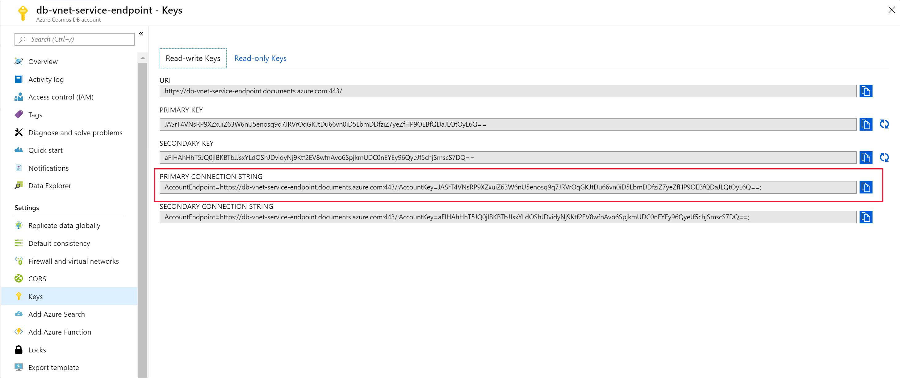
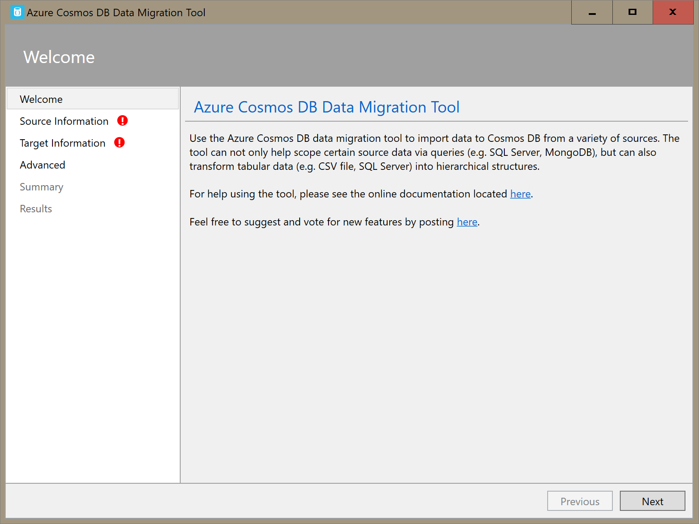
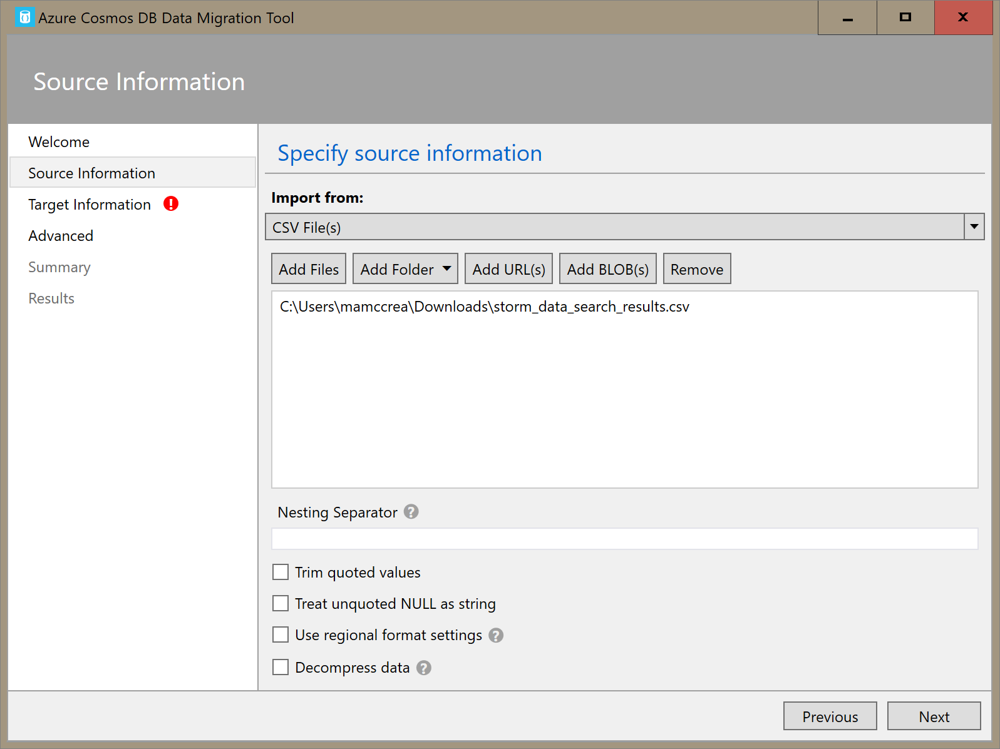
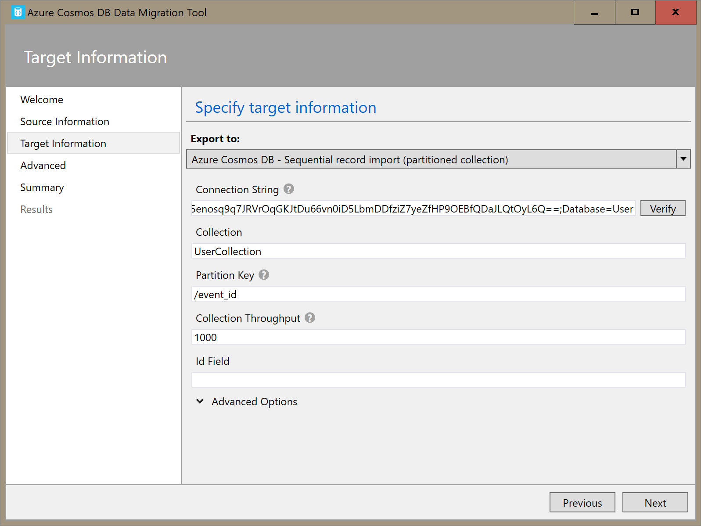
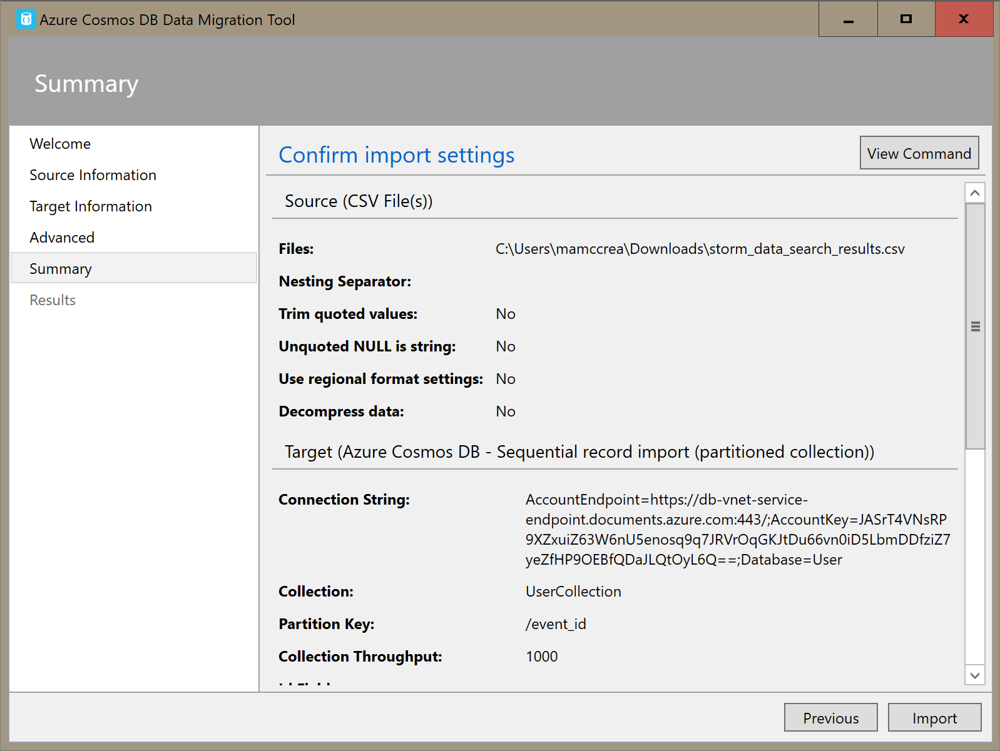
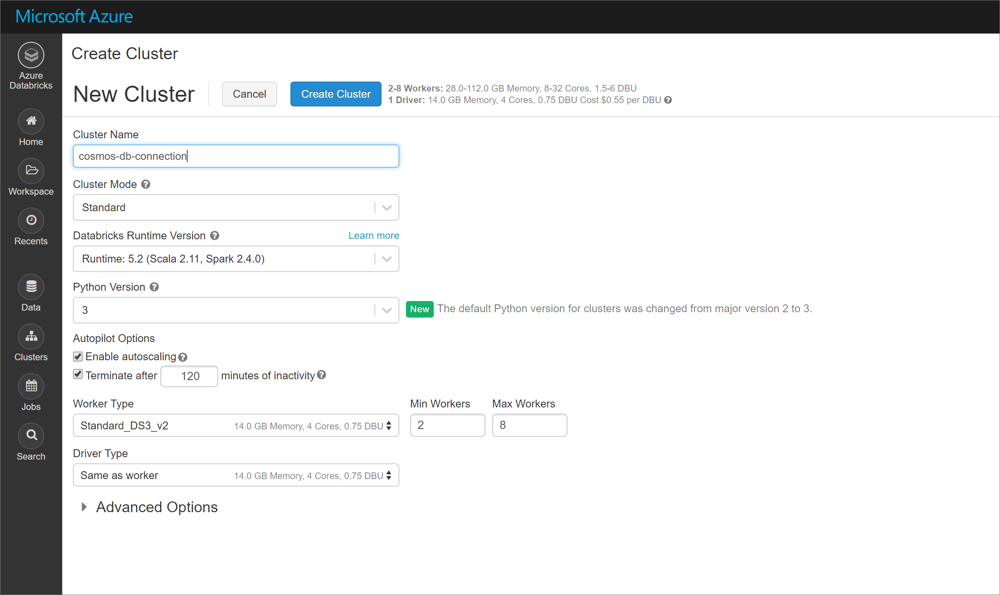
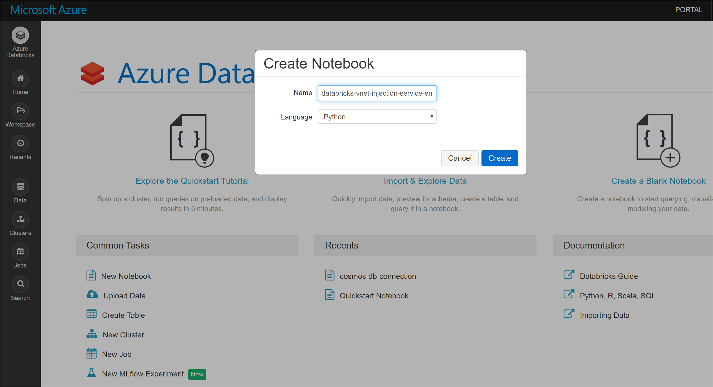

# Tutorial: Implement VNet injected Azure Databricks environment with a service endpoint enabled for Cosmos DB

This tutorial describes how to implement a VNet injected Databricks environment with a Service Endpoint enabled for Cosmos DB.

In this tutorial you learn how to:

## Prerequisites

Before you start, make sure you have the following:

* Create a [Databricks workspace in a virtual network](quickstart-create-databricks-workspace-vnet-injection.md).

* Download the [spark connector](https://search.maven.org/remotecontent?filepath=com/microsoft/azure/azure-cosmosdb-spark_2.4.0_2.11/1.3.4/azure-cosmosdb-spark_2.4.0_2.11-1.3.4-uber.jar).

* Download sample data from the [NOAA National Centers for Environmental Information](https://www.ncdc.noaa.gov/stormevents/). Select a state or area and select **Search**. On the next page, accept the defaults and select **Search**. Then select **CSV Download** on the left side of the page to download the results.

* Download the [pre-compiled binary](https://aka.ms/csdmtool) of the Azure Cosmos DB Data Migration Tool.

## Create Cosmos DB service endpoint

1. Once you have deployed an Azure Databricks workspace to a virtual network, navigate to the virtual network. Notice the public and private subnets that were created through the Databricks deployment.

   

2. Select the *public-subnet* and create a Cosmos DB service endpoint. Then **Save**.
   
   

## Create Cosmos DB account

1. Open the Azure portal. On the upper-left side of the screen, select **Create a resource > Databases > Azure Cosmos DB**.

2. Fill out the **Instance Details** on the **Basics** tab with the following settings:

   |Setting|Value|
   |-------|-----|
   |Subscription|*your subscription*|
   |Resource Group|*your resource group*|
   |Account Name|db-vnet-service-endpoint|
   |API|Core (SQL)|
   |Location|West US|
   |Geo-Redundancy|Disable|
   |Multi-region Writes|Enable|

   

3. Select the **Network** tab and configure your virtual network. Choose the virtual network you created as a prerequisite and *public-subnet*. Notice that *private-subnet* has the note *'Microsoft AzureCosmosDB' endpoint is missing'*. This is because you only enabled the Cosmos DB service endpoint on the *public-subnet*. 

   Ensure you have *Allow access from Azure Portal* enabled. This setting allows you to access your Cosmos DB account from the Azure portal. If this is disabled you will receive errors when attempting to access your account. 

   It is not necessary for this tutorial, but you can also enable *Allow access from my IP* if you want the ability to access your Cosmos DB account from your local machine. For example, if you are connecting to your account using the Cosmos DB SDK, you need to enable this setting. If it is disabled, you will receive "Access Denied" errors.

   

4. Select **Review + Create**, and then **Create** to create your Cosmos DB account inside the virtual network.

5. Once your Cosmos DB account has been created, navigate to **Keys** under **Settings**. Copy the primary connection string and save it in a text editor for later use.

    

## Upload data to Cosmos DB

1. Open the graphical interface version of the data migration tool for Cosmos DB, **Dtui.exe**.

    

2. On the **Source Information** tab, select **CSV File(s)** in the **Import from** dropdown. Then select **Add Files** and add the storm data csv you downloaded as a prerequisite.

    

3. On the **Target Information** tab, input your connection string. The connection string format is `AccountEndpoint=<URL>;AccountKey=<key>;Database=<database>`. The AccountEndpoint and AccountKey are included in the primary connection string you saved in the previous section. Append `Database=<your database name>` to the end of the connection string, and select **Verify**. Then, add the Collection name and partition key.

    

4. Select **Next** until you get to the Summar page. Then, select **Import**.

    

## Create a cluster and add library

1. Navigate to your Azure Databricks service in the Azure portal and select **Launch Workspace**.

   

2. Create a new cluster. Choose a Cluster Name and accept the remaining default settings.

   

3. After your cluster is created, navigate to the cluster page and select the **Libraries** tab. Select **Install New** and upload the Spark connector jar file to install the library.

    

    You can verify that the library was installed on the **Libraries** tab.

    

## Query Cosmos DB from Databricks notebook

1. Navigate to your Azure Databricks workspace and create a new python notebook.

    

2. 