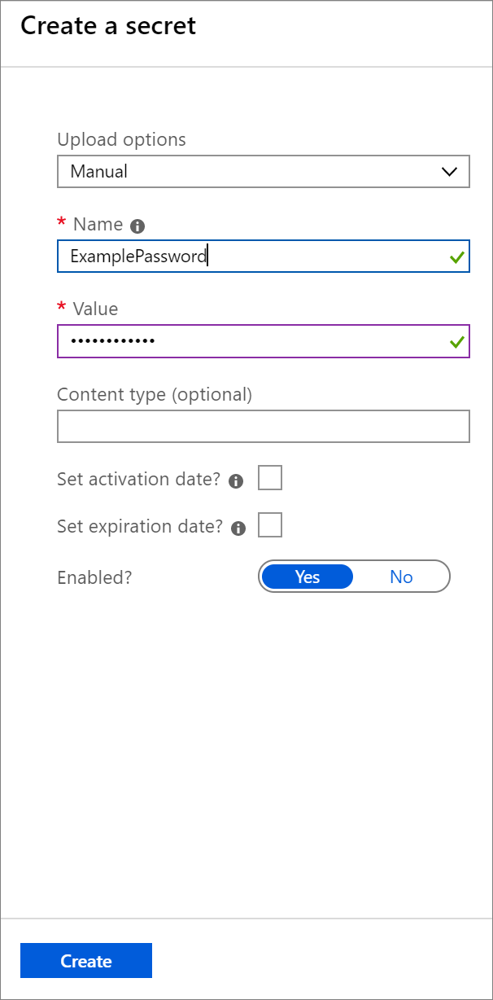

# Tutorial: Store and retrieve secrets from Azure Key Vault using Azure Databricks

This tutorial describes how to store and retrieve secrets from Azure Key Vault using Azure Databricks.

In this tutorial, you learn how to:

> [!div class="checklist"]
> * Create an Azure Key Vault
> * Add a secret to Key Vault
> * Create an Azure Databricks workspace
> * Create secret scope in the Azure Databricks workspace

If you don't have an Azure subscription, [create a free trial account](https://azure.microsoft.com/free/). This tutorial cannot be carried out using the Azure Free Trial Subscription. Before creating the cluster, go to your profile and change your subscription to **pay-as-you-go**. For more information, see [Azure free account](https://azure.microsoft.com/free/).

## Prerequisites

## Sign in to the Azure portal

Sign in to the [Azure portal](https://portal.azure.com/).

## Create an Azure Key Vault

1. In the Azure portal, select **Create a resource** and enter **Key Vault** in the search box.

   

2. The Key Vault resource is automatically selected. Select **Create**.

   

3. On the **Create key vault** section, enter the following information and keep the default values for the remaining fields:

   |Property|Description|
   |--------|-----------|
   |Name|A unique name for your key vault.|
   |Subscription|Choose a subscription.|
   |Resource group|Choose a resource group or create a a new one.|
   |Location|Choose a location.|

   

3. After providing the information above, select **Create**. 

## Add a secret to your key vault

1. Navigate to your key vault in the Azure portal and select **Secrets**. Then, select **+ Generate/Import**. 

   

2. On the **Create a secret** page, provide the following information and keep the default values for the remaining fields:

   |Property|Value|
   |--------|-----------|
   |Upload options|Manual|
   |Name|ExamplePassword|
   |Value|hVFkk965BuUv|

   

3. Select **Create**. Then, navigate to the **Properties** menu. Copy the **DNS Name** and **Resource ID** to a text editor for use later in the tutorial.

   

## Create an Azure Databricks workspace

1. In the Azure portal, select **Create a resource** > **Analytics** > **Azure Databricks**.

    

3. Under **Azure Databricks Service**, provide the following values to create a Databricks workspace.

    Provide the following values:

   |Property  |Description  |
   |---------|---------|
   |**Workspace name**     | Provide a name for your Databricks workspace        |
   |**Subscription**     | From the drop-down, select your Azure subscription.        |
   |**Resource group**     | Select the same resource group that contains your key vault. |
   |**Location**     | Select the same location as your Azure Key Vault. For all available regions, see [Azure services available by region](https://azure.microsoft.com/regions/services/).        |
   |**Pricing Tier**     |  Choose between **Standard** or **Premium**. For more information on these tiers, see [Databricks pricing page](https://azure.microsoft.com/pricing/details/databricks/).       |

   

   Select **Create**.

## Create secret scope in the Azure Databricks workspace

1. Navigate to your Azure Databricks resource in the Azure portal and select **Launch Workspace**.

   

2. Once your Azure Databricks workspace is open in a separate window, append **#secrets/createScope** to the URL. The URL should have the following format: **https://<location>.azuredatabricks.net/?o=<id>#secrets/createScope**.

3. Enter a scope name, and enter the Azure Key Vault DNS name and Resource ID you saved earlier. Then, select **Create**.

   

## Read secrets in an Azure Databricks notebook

1. From the home page of your Azure Databricks workspace, select **New Cluster** under **Common Tasks**.

   

2. Enter a cluster name and select **Create cluster**. The cluster creation takes a few minutes to complete.

3. Once the cluster is created, navigate to the home page of your Azure Databricks workspace, select **New Notebook** under **Common Tasks**.

   

4. Enter a notebook name, set the language to Python, and the cluster to the name of the cluster you created in the previous step.

5. 

## Clean up resources

If you're not going to continue to use this application, delete
<resources> with the following steps:

1. From the left-hand menu...
2. ...click Delete, type...and then click Delete

<!---Required:
To avoid any costs associated with following the tutorial procedure, a
Clean up resources (H2) should come just before Next steps (H2)
--->

## Next steps

Advance to the next article to learn how to create...
> [!div class="nextstepaction"]
> [Next steps button](contribute-get-started-mvc.md)

<!--- Required:
Tutorials should always have a Next steps H2 that points to the next
logical tutorial in a series, or, if there are no other tutorials, to
some other cool thing the customer can do. A single link in the blue box
format should direct the customer to the next article - and you can
shorten the title in the boxes if the original one doesn’t fit.
Do not use a "More info section" or a "Resources section" or a "See also
section". --->