# Tutorial: Access Azure Blob Storage from Azure Databricks using Azure Key Vault

This tutorial describes how to access Azure Blob Storage from Azure Databricks using secrets stored in a key vault.

In this tutorial, you learn how to:

> [!div class="checklist"]
> * Create a storage account and blob container
> * Create an Azure Key Vault and add a secret
> * Create an Azure Databricks workspace and add a secret scope
> * Access your blob container from Azure Databricks

## Prerequisites

- Azure subscription - [create one for free](https://azure.microsoft.com/free/)

## Sign in to the Azure portal

Sign in to the [Azure portal](https://portal.azure.com/).

> [!Note]
> This tutorial cannot be carried out using **Azure Free Trial Subscription**.
> If you have a free account, go to your profile and change your subscription to **pay-as-you-go**. For more information, see [Azure free account](https://azure.microsoft.com/free/). Then, [remove the spending limit](https://docs.microsoft.com/azure/billing/billing-spending-limit#why-you-might-want-to-remove-the-spending-limit), and [request a quota increase](https://docs.microsoft.com/azure/azure-portal/supportability/resource-manager-core-quotas-request) for vCPUs in your region. When you create your Azure Databricks workspace, you can select the **Trial (Premium - 14-Days Free DBUs)** pricing tier to give the workspace access to free Premium Azure Databricks DBUs for 14 days.

## Create a storage account and blob container

1. In the Azure portal, select **Create a resource** > **Storage**. Then select **Storage account**.

   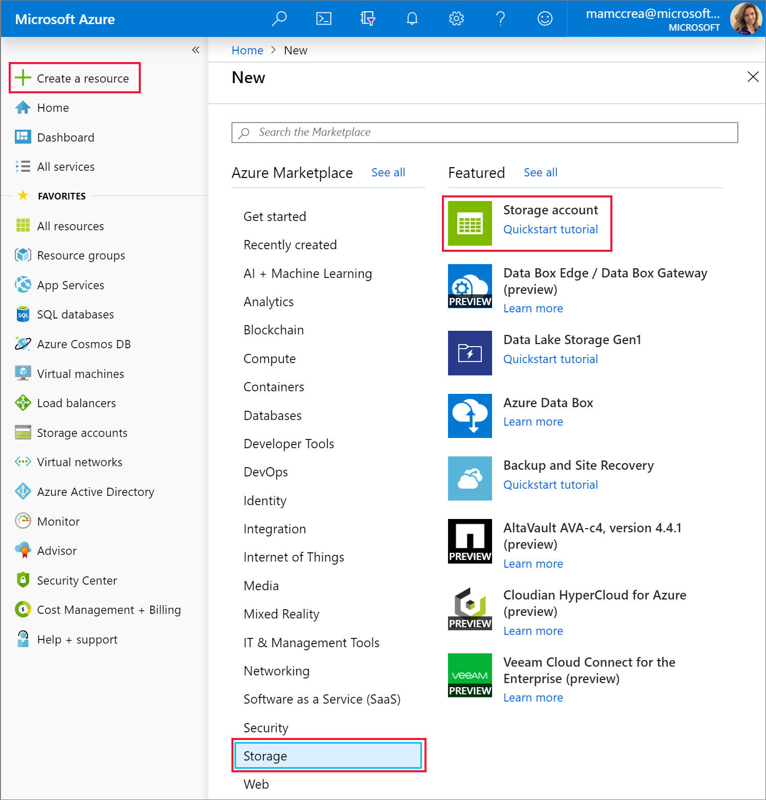

2. Select your subscription and resource group, or create a new resource group. Then enter a storage account name, and choose a location. Select **Review + Create**.

   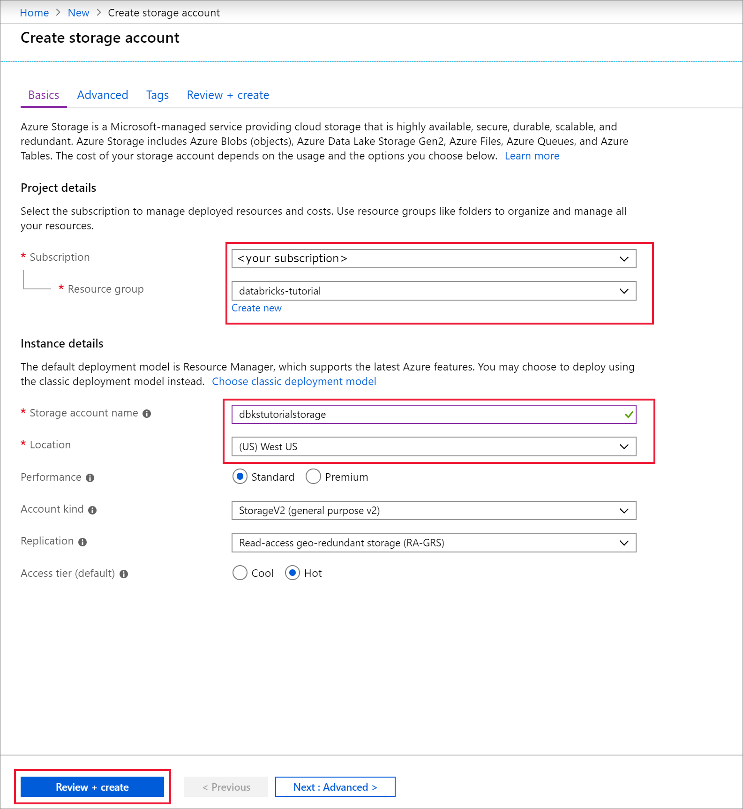

3. If the validation is unsuccessful, address the issues and try again. If the validation is successful, select **Create** and wait for the storage account to be created.

4. Navigate to your newly created storage account and select **Blobs** under **Services** on the **Overview** page. Then select **+ Container** and enter a container name. Select **OK**.

   

5. Locate a file you want to upload to your blob storage container. If you don't have a file, use a text editor to create a new text file with some information. In this example, a file named **hw.txt** contains the text "hello world." Save your text file locally and upload it to your blob storage container.

   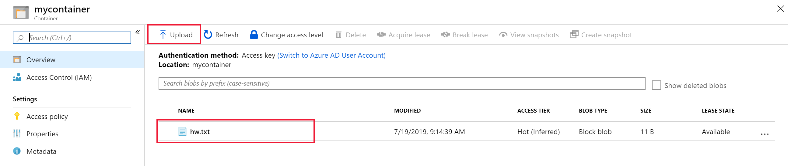

6. Return to your storage account and select **Access keys** under **Settings**. Copy **Storage account name** and **key 1** to a text editor for later use in this tutorial.

   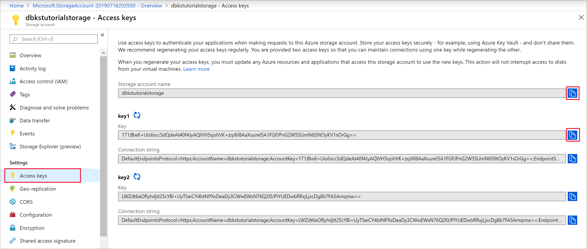

## Create an Azure Key Vault and add a secret

1. In the Azure portal, select **Create a resource** and enter **Key Vault** in the search box.

   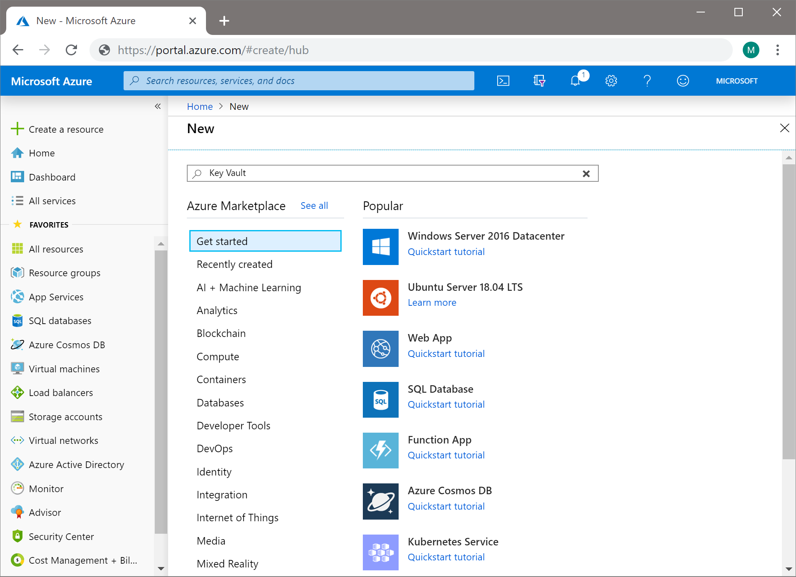

2. The Key Vault resource is automatically selected. Select **Create**.

   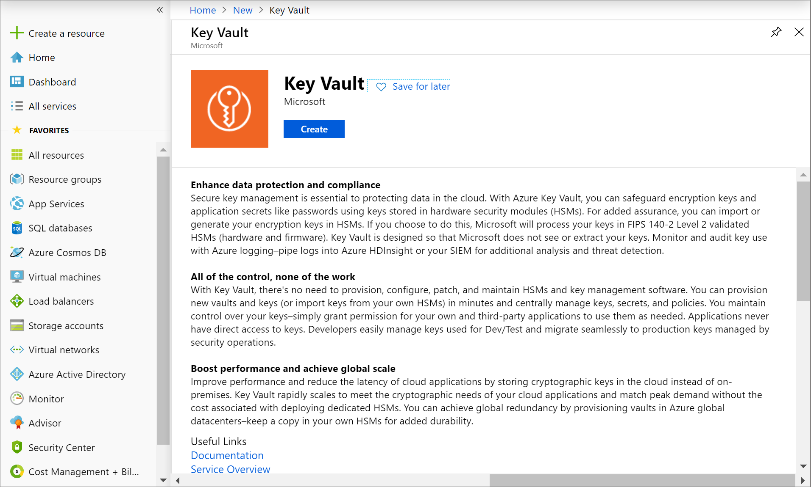

3. On the **Create key vault** page, enter the following information, and keep the default values for the remaining fields:

   |Property|Description|
   |--------|-----------|
   |Name|A unique name for your key vault.|
   |Subscription|Choose a subscription.|
   |Resource group|Choose a resource group or create a new one.|
   |Location|Choose a location.|

   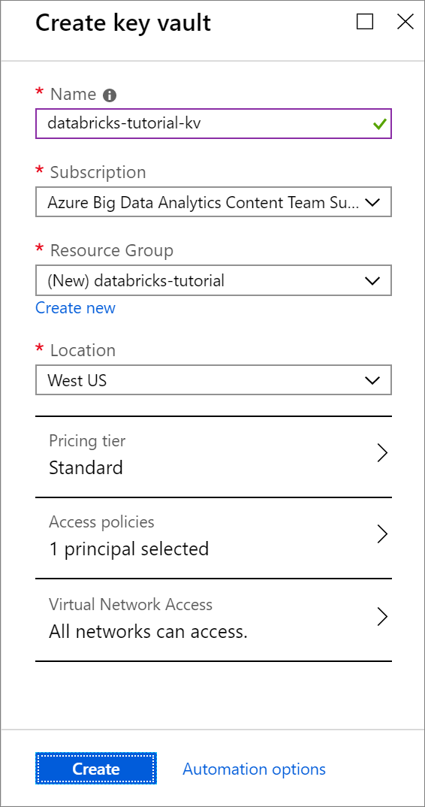

3. After providing the information above, select **Create**. 

4. Navigate to your newly created key vault in the Azure portal and select **Secrets**. Then, select **+ Generate/Import**. 

   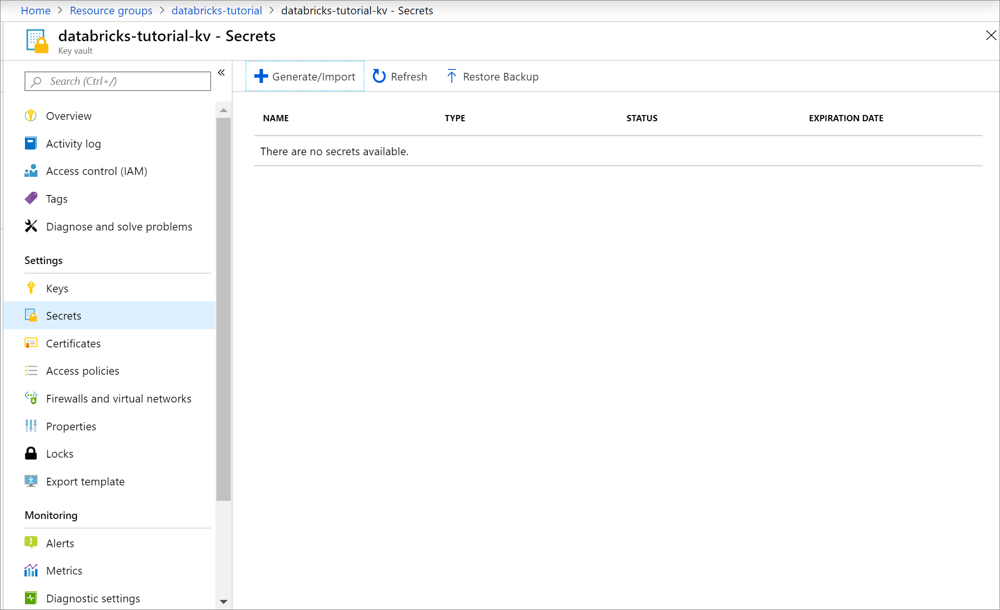

5. On the **Create a secret** page, provide the following information, and keep the default values for the remaining fields:

   |Property|Value|
   |--------|-----------|
   |Upload options|Manual|
   |Name|Friendly name for your storage account key.|
   |Value|key1 from your storage account.|

   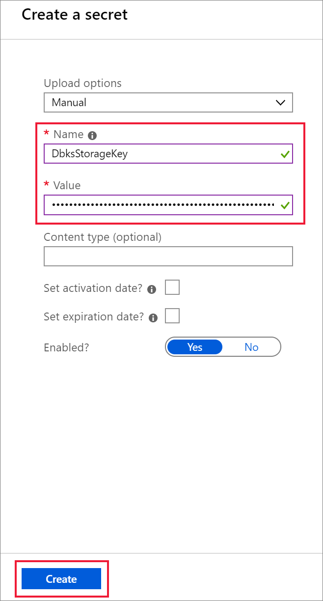

6. Save the key name in a text editor for use later in this tutorial, and select **Create**. Then, navigate to the **Properties** menu. Copy the **DNS Name** and **Resource ID** to a text editor for use later in the tutorial.

   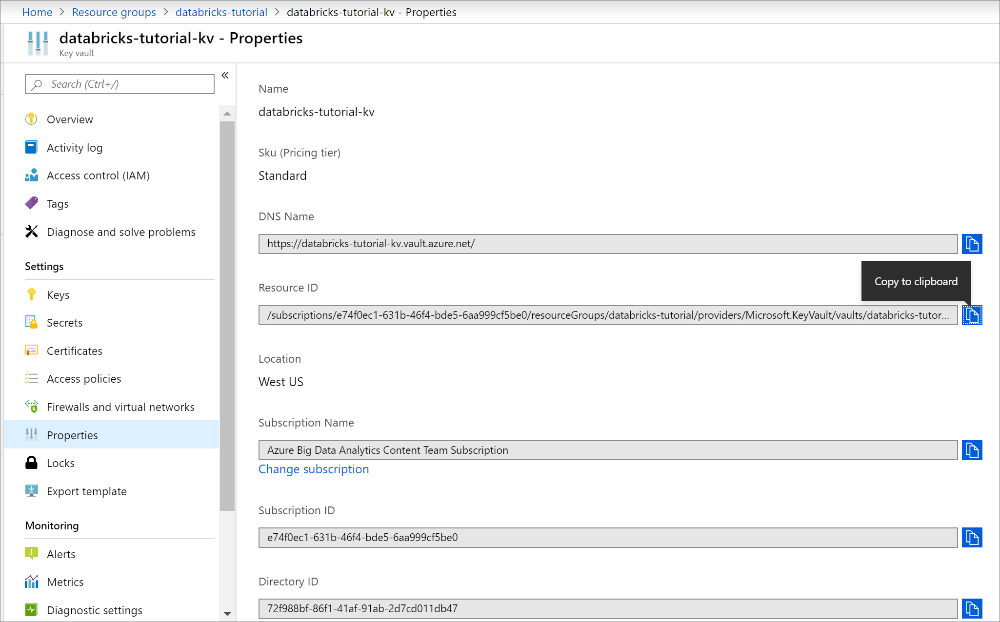

## Create an Azure Databricks workspace and add a secret scope

1. In the Azure portal, select **Create a resource** > **Analytics** > **Azure Databricks**.

    

2. Under **Azure Databricks Service**, provide the following values to create a Databricks workspace.

   |Property  |Description  |
   |---------|---------|
   |Workspace name     | Provide a name for your Databricks workspace        |
   |Subscription     | From the drop-down, select your Azure subscription.        |
   |Resource group     | Select the same resource group that contains your key vault. |
   |Location     | Select the same location as your Azure Key Vault. For all available regions, see [Azure services available by region](https://azure.microsoft.com/regions/services/).        |
   |Pricing Tier     |  Choose between **Standard** or **Premium**. For more information on these tiers, see [Databricks pricing page](https://azure.microsoft.com/pricing/details/databricks/).       |

   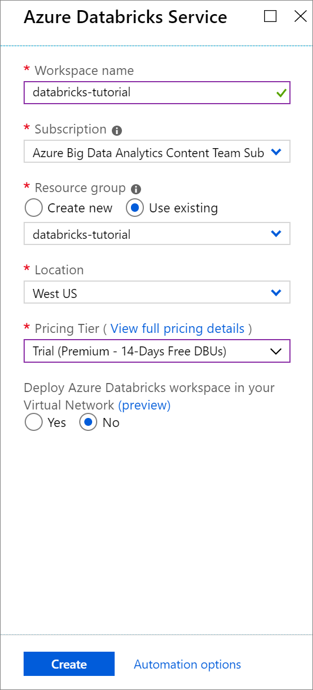

   Select **Create**.

3. Navigate to your newly created Azure Databricks resource in the Azure portal and select **Launch Workspace**.

   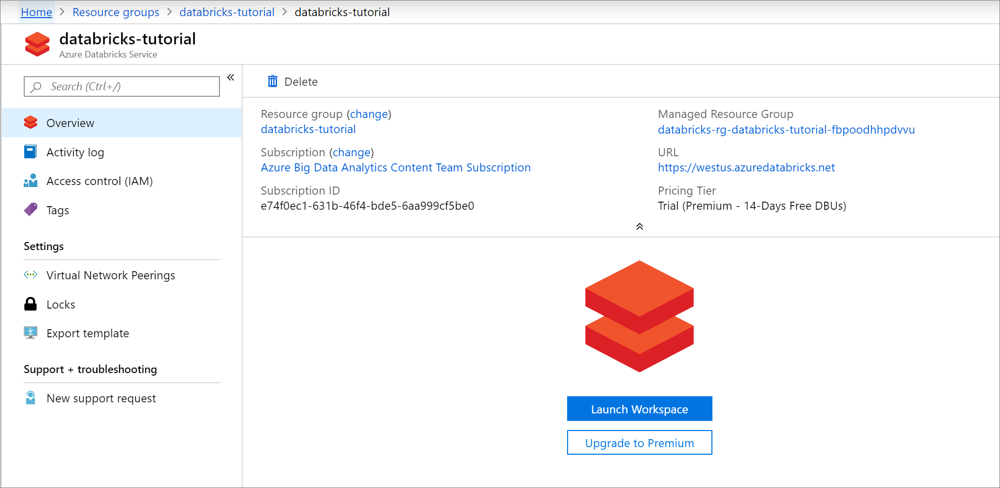

4. Once your Azure Databricks workspace is open in a separate window, append **#secrets/createScope** to the URL. The URL should have the following format: 

   **https://<\location>.azuredatabricks.net/?o=<\orgID>#secrets/createScope**.
   

5. Enter a scope name, and enter the Azure Key Vault DNS name and Resource ID you saved earlier. Save the scope name in a text editor for use later in this tutorial. Then, select **Create**.

   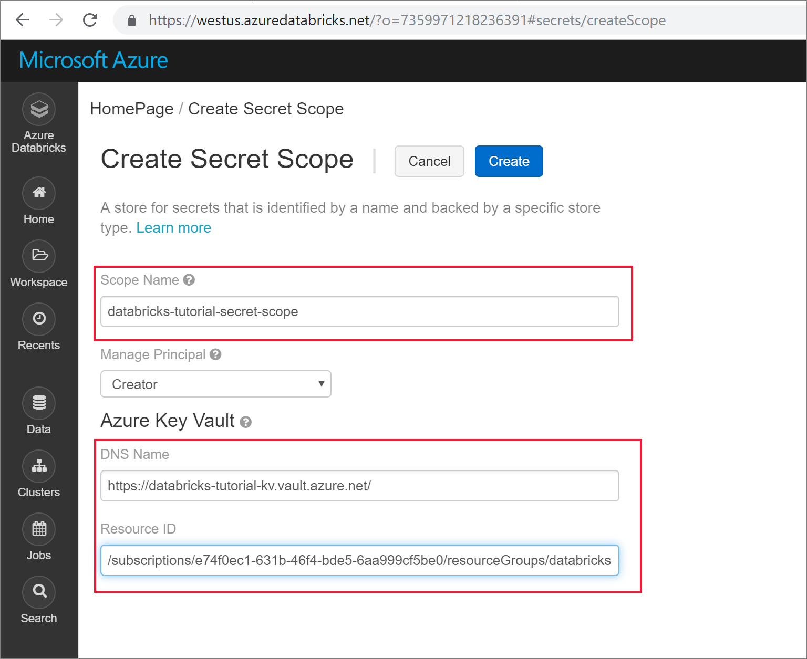

## Access your blob container from Azure Databricks

1. From the home page of your Azure Databricks workspace, select **New Cluster** under **Common Tasks**.

   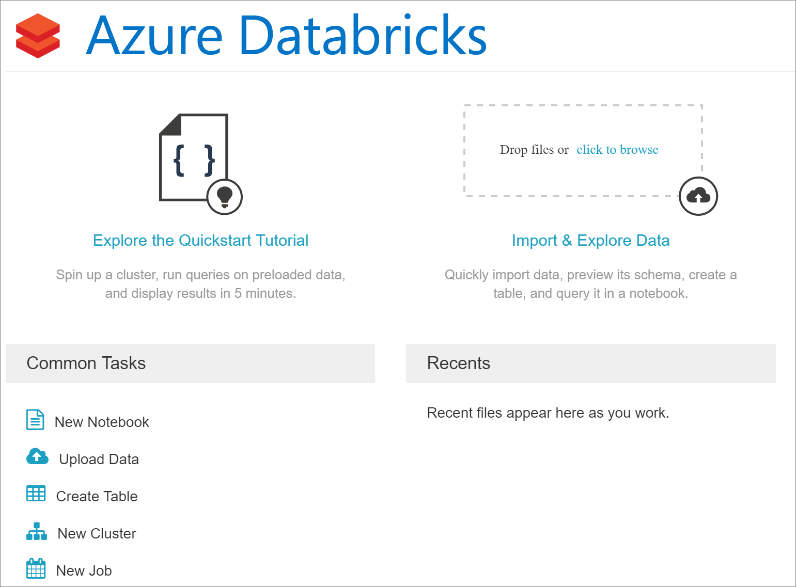

2. Enter a cluster name and select **Create cluster**. The cluster creation takes a few minutes to complete.

3. Once the cluster is created, navigate to the home page of your Azure Databricks workspace, select **New Notebook** under **Common Tasks**.

   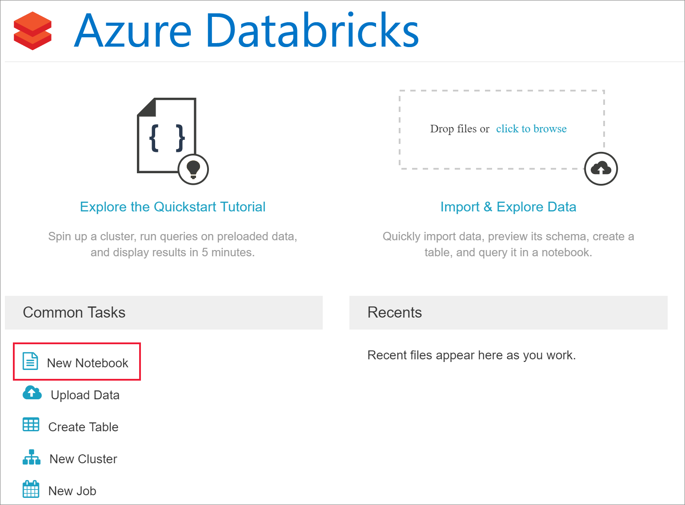

4. Enter a notebook name, and set the language to Python. Set the cluster to the name of the cluster you created in the previous step.

5. Run the following command to mount your blob storage container. Remember to change the values for the following properties:

   * your-container-name
   * your-storage-account-name
   * mount-name
   * config-key
   * scope-name
   * key-name

   ```python
   dbutils.fs.mount(
   source = "wasbs://<your-container-name>@<your-storage-account-name>.blob.core.windows.net",
   mount_point = "/mnt/<mount-name>",
   extra_configs = {"<conf-key>":dbutils.secrets.get(scope = "<scope-name>", key = "<key-name>")})
   ```

   * **mount-name** is a DBFS path representing where the Blob Storage container or a folder inside the container (specified in source) will be mounted.
   * **conf-key** can be either
      `fs.azure.account.key.<\your-storage-account-name>.blob.core.windows.net` or `fs.azure.sas.<\your-container-name>.<\your-storage-account-name>.blob.core.windows.net`
   * **scope-name** is the name of the secret scope you created in the previous section. 
   * **key-name** is the name of they secret you created for the storage account key in your key vault.

   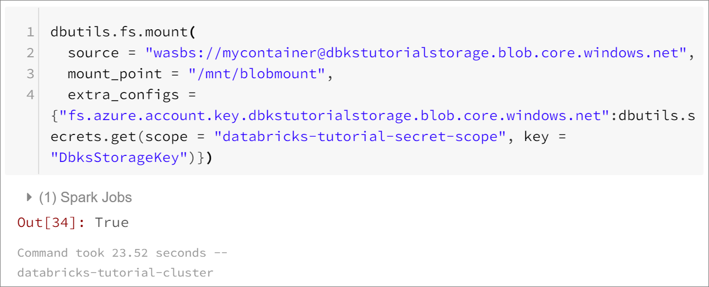

6. Run the following command to read the text file in your blob storage container to a dataframe. Change the values in the command to match your mount name and file name.

   ```python
   df = spark.read.text("/mnt/<mount-name>/<file-name>")
   ```

   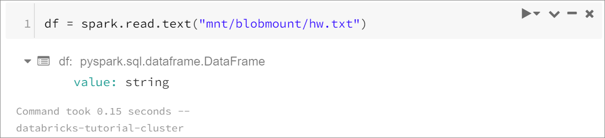

7. Use the following command to display the contents of your file.

   ```python
   df.show()
   ```
   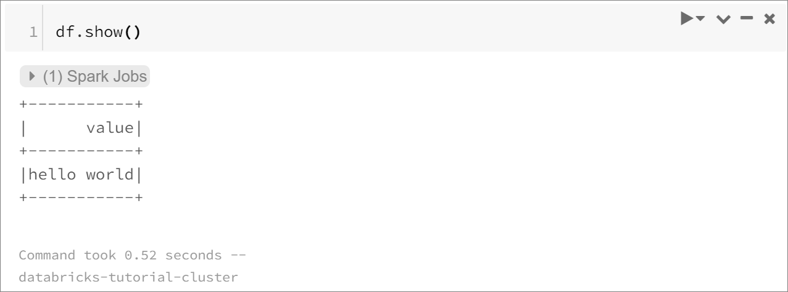

8. To unmount your blob storage, run the following command:

   ```python
   dbutils.fs.unmount("/mnt/<mount-name>")
   ```

   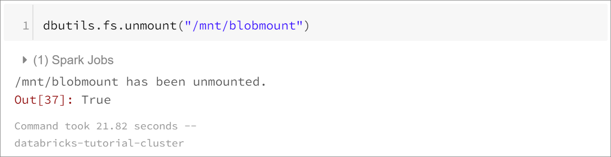

9. Notice that once the mount has been unmounted, you can no longer read from your blob storage account.

   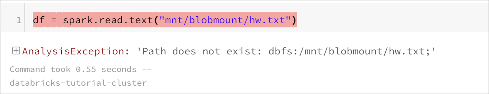

## Clean up resources

If you're not going to continue to use this application, delete your entire resource group with the following steps:

1. From the left-hand menu in Azure portal, select **Resource groups** and navigate to your resource group.

2. Select **Delete resource group** and type your resource group name. Then select **Delete**. 

## Next steps

Advance to the next article to learn how to implement a VNet injected Databricks environment with a Service Endpoint enabled for Cosmos DB.
> [!div class="nextstepaction"]
> [Tutorial: Implement Azure Databricks with a Cosmos DB endpoint](service-endpoint-cosmosdb.md)
