# Tutorial: Query a SQL Server Linux Docker container in a virtual network from an Azure Databricks notebook

This tutorial teaches you how to integrate Azure Databricks with a SQL Server Linux Docker container in a virtual network. 

In this tutorial, you learn how to:

> [!div class="checklist"]
> * Deploy an Azure Databricks workspace to a virtual network
> * Install a Linux virtual machine in a public network
> * Install Docker
> * Install Microsoft SQL Server on Linux docker container
> * Query the SQL Server using JDBC from a Databricks notebook

## Prerequisites

* Create a [Databricks workspace in a virtual network](quickstart-create-databricks-workspace-vnet-injection.md).

* Install [Ubuntu for Windows](https://www.microsoft.com/p/ubuntu/9nblggh4msv6?activetab=pivot:overviewtab).

* Download [SQL Server Management Studio](https://docs.microsoft.com/sql/ssms/download-sql-server-management-studio-ssms?view=sql-server-2017).

## Create a Linux virtual machine

1. In the Azure portal, select the icon for **Virtual Machines**. Then, select **+ Add**.

    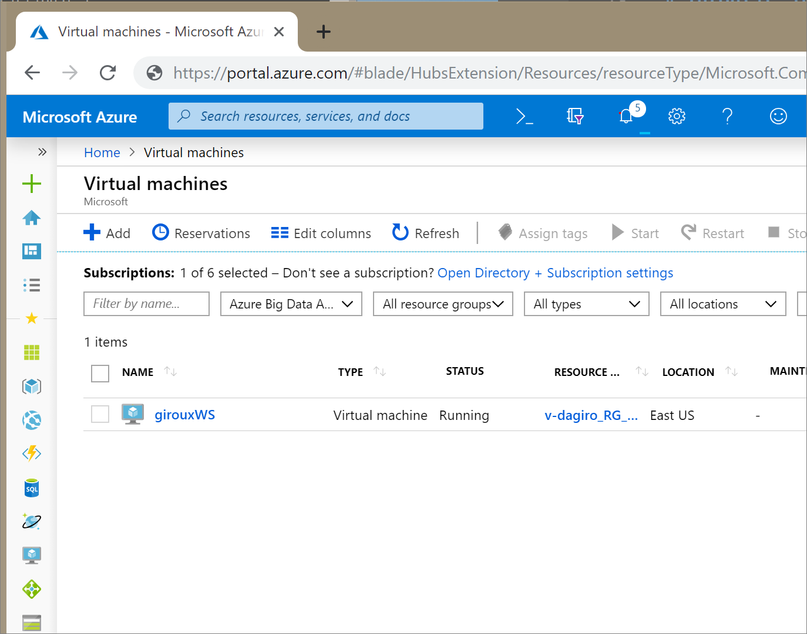

2. On the **Basics** tab, Choose Ubuntu Server 16.04 LTS. Change the VM size to B1ms, which has one VCPUS and 2-GB RAM. The minimum requirement for a Linux SQL Server Docker container is 2 GB. Choose an administrator username and password.

    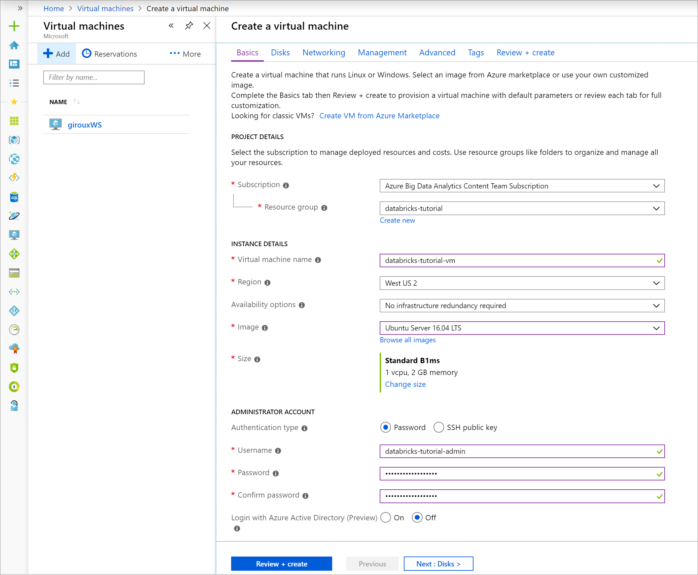

3. Navigate to the **Networking** tab. Choose the virtual network and the public subnet that includes your Azure Databricks cluster. Select **Review + create**, then **Create** to deploy the virtual machine.

    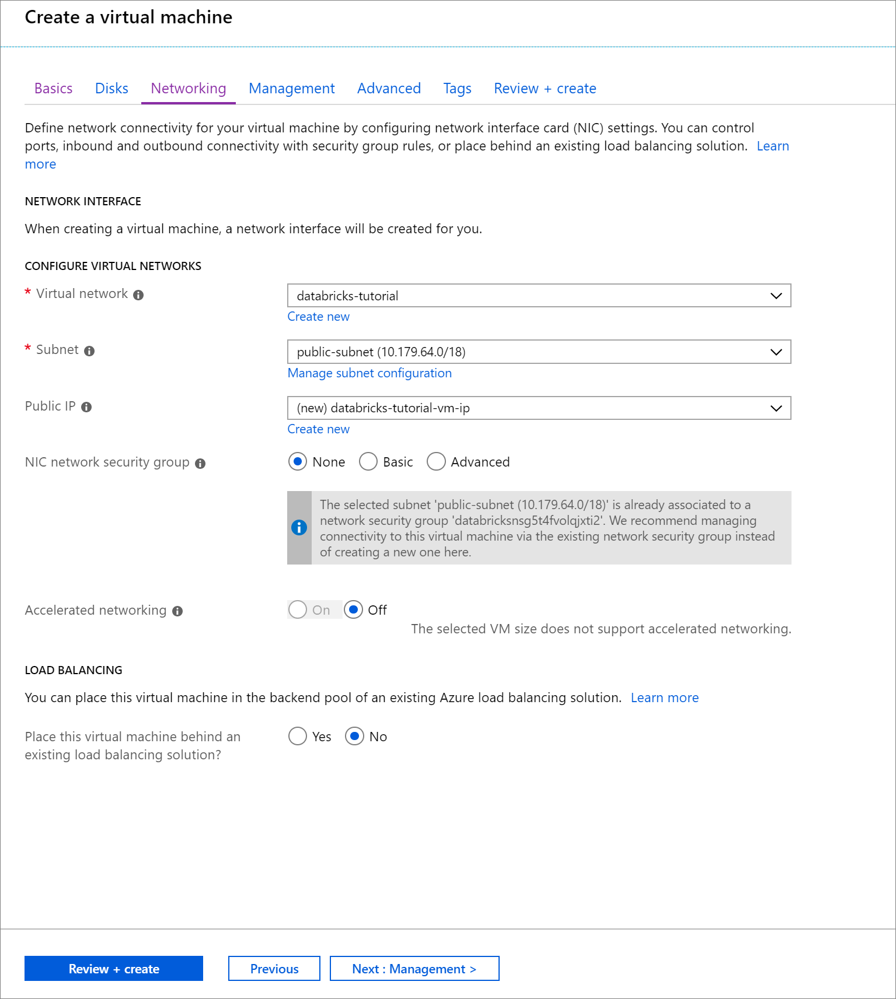

4. When the deployment is complete, navigate to the virtual machine. Notice the Public IP address and Virtual network/subnet in the **Overview**. Select the **Public IP Address**

    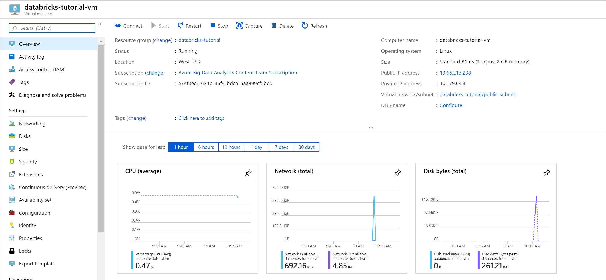

5. Change the **Assignment** to **Static** and enter a **DNS name label**. Select **Save**, and restart the virtual machine.

    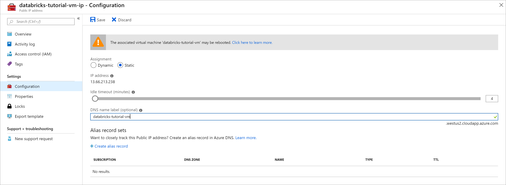

6. Select the **Networking** tab under **Settings**. Notice that the network security group that was created during the Azure Databricks deployment is associated with the virtual machine. Select **Add inbound port rule**.

7. Add a rule to open port 22 for SSH. Use the following settings:
    
    |Setting|Suggested value|Description|
    |-------|---------------|-----------|
    |Source|IP Addresses|IP Addresses specifies that incoming traffic from a specific source IP Address will be allowed or denied by this rule.|
    |Source IP addresses|<your public ip\>|Enter the your public IP address. You can find your  public IP address by visiting [bing.com](https://www.bing.com/) and searching for **"my IP"**.|
    |Source port ranges|*|Allow traffic from any port.|
    |Destination|IP Addresses|IP Addresses specifies that outgoing traffic for a specific source IP Address will be allowed or denied by this rule.|
    |Destination IP addresses|<your vm public ip\>|Enter your virtual machine's public IP address. You can find this on the **Overview** page of your virtual machine.|
    |Destination port ranges|22|Open port 22 for SSH.|
    |Priority|290|Give the rule a priority.|
    |Name|ssh-databricks-tutorial-vm|Give the rule a name.|


    

8. Add a rule to open port 1433 for SQL with the following settings:

    |Setting|Suggested value|Description|
    |-------|---------------|-----------|
    |Source|IP Addresses|IP Addresses specifies that incoming traffic from a specific source IP Address will be allowed or denied by this rule.|
    |Source IP addresses|10.179.0.0/16|Enter the address range for your virtual network.|
    |Source port ranges|*|Allow traffic from any port.|
    |Destination|IP Addresses|IP Addresses specifies that outgoing traffic for a specific source IP Address will be allowed or denied by this rule.|
    |Destination IP addresses|<your vm public ip\>|Enter your virtual machine's public IP address. You can find this on the **Overview** page of your virtual machine.|
    |Destination port ranges|1433|Open port 22 for SQL Server.|
    |Priority|300|Give the rule a priority.|
    |Name|sql-databricks-tutorial-vm|Give the rule a name.|

    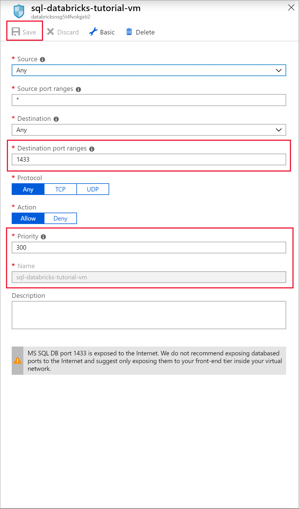

## Run SQL Server in a Docker container

1. Open [Ubuntu for Windows](https://www.microsoft.com/p/ubuntu/9nblggh4msv6?activetab=pivot:overviewtab), or any other tool that will allow you to SSH into the virtual machine. Navigate to your virtual machine in the Azure portal and select **Connect** to get the SSH command you need to connect.

    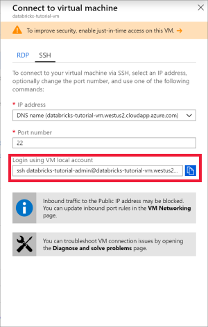

2. Enter the command in your Ubuntu terminal and enter the admin password you created when you configured the virtual machine.

    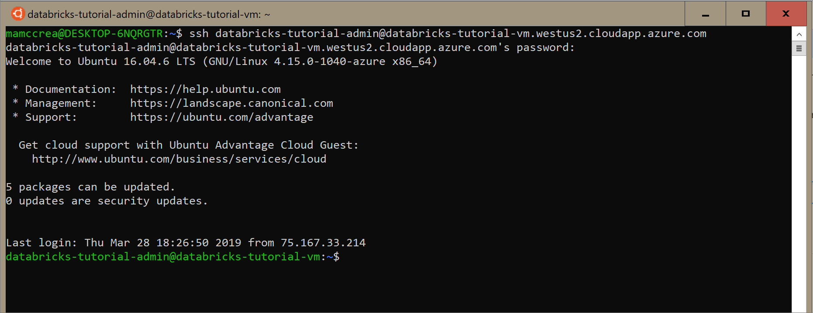

3. Use the following command to install Docker on the virtual machine.

    ```bash
    sudo apt-get install docker.io
    ```

    Verify the install of Docker with the following command:

    ```bash
    sudo docker --version
    ```

4. Install the image.

    ```bash
    sudo docker pull mcr.microsoft.com/mssql/server:2017-latest
    ```

    Check the images.

    ```bash
    sudo docker images
    ```

5. Run the container from the image.

    ```bash
    sudo docker run -e 'ACCEPT_EULA=Y' -e 'SA_PASSWORD=Password1234' -p 1433:1433 --name sql1  -d mcr.microsoft.com/mssql/server:2017-latest
    ```

    Verify that the container is running.

    ```bash
    sudo docker ps -a
    ```

## Create a SQL database

1. Open SQL Server Management Studio and connect to the server using the server name and SQL Authentication. The sign in username is **SA** and the password is the password set in the Docker command. The password in the example command is `Password1234`.

    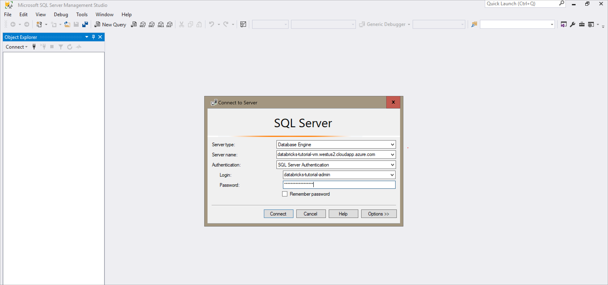

2. Once you've successfully connected, select **New Query** and enter the following code snippet to create a database, a table, and insert some records in the table.

    ```SQL
    CREATE DATABASE MYDB;
    GO
    USE MYDB;
    CREATE TABLE states(Name VARCHAR(20), Capitol VARCHAR(20));
    INSERT INTO states VALUES ('Delaware','Dover');
    INSERT INTO states VALUES ('South Carolina','Columbia');
    INSERT INTO states VALUES ('Texas','Austin');
    SELECT * FROM states
    GO
    ```

    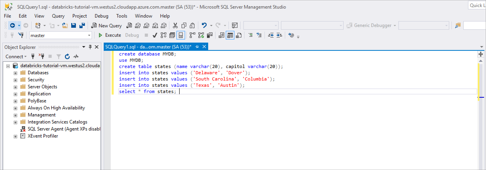

## Query SQL Server from Azure Databricks

1. Navigate to your Azure Databricks workspace and verify that you created a cluster as part of the prerequisites. Then, select **Create a Notebook**. Give the notebook a name, select *Python* as the language, and select the cluster you created.

    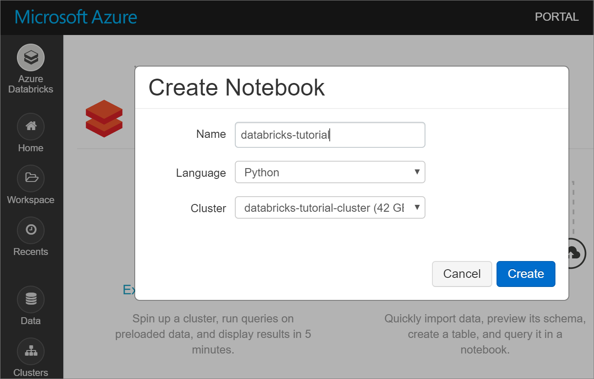

2. Use the following command to ping the internal IP Address of the SQL Server virtual machine. This ping should be successful. If not, verify that the container is running, and review the network security group (NSG) configuration.

    ```python
    %sh
    ping 10.179.64.4
    ```

    You can also use the nslookup command to review.

    ```python
    %sh
    nslookup databricks-tutorial-vm.westus2.cloudapp.azure.com
    ```

3. Once you've successfully pinged the SQL Server, you can query the database and tables. Run the following python code:

    ```python
    jdbcHostname = "10.179.64.4"
    jdbcDatabase = "MYDB"
    userName = 'SA'
    password = 'Password1234'
    jdbcPort = 1433
    jdbcUrl = "jdbc:sqlserver://{0}:{1};database={2};user={3};password={4}".format(jdbcHostname, jdbcPort, jdbcDatabase, userName, password)

    df = spark.read.jdbc(url=jdbcUrl, table='states')
    display(df)
    ```

## Clean up resources

When no longer needed, delete the resource group, the Azure Databricks workspace, and all related resources. Deleting the job avoids unnecessary billing. If you're planning to use the Azure Databricks workspace in future, you can stop the cluster and restart it later. If you are not going to continue to use this Azure Databricks workspace, delete all resources you created in this tutorial by using the following steps:

1. From the left-hand menu in the Azure portal, click **Resource groups** and then click the name of the resource group you created.

2. On your resource group page, select **Delete**, type the name of the resource to delete in the text box, and then select **Delete** again.

## Next steps

Advance to the next article to learn how to extract, transform, and load data using Azure Databricks.
> [!div class="nextstepaction"]
> [Tutorial: Extract, transform, and load data by using Azure Databricks](databricks-extract-load-sql-data-warehouse.md)
