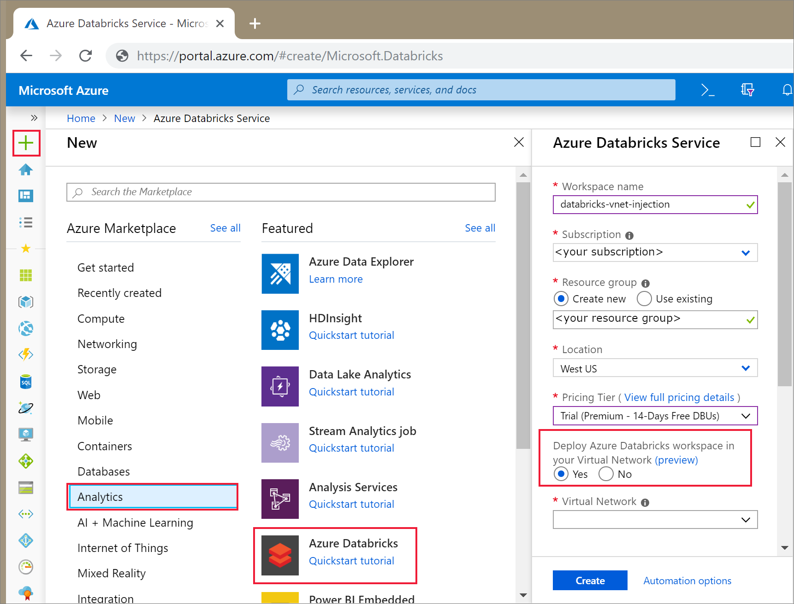
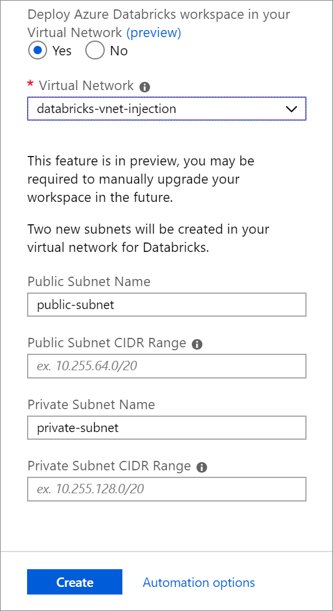

# Deploy Azure Databricks in your virtual network (Preview)

The default deployment of Azure Databricks is a fully managed service on Azure: all data plane resources, including a virtual network (VNet), are deployed to a locked resource group. If you require network customization, however, you can deploy Azure Databricks resources in your own virtual network (also called VNet injection), when enables you to:

* Connect Azure Databricks to other Azure services (such as Azure Storage) in a more secure manner using service endpoints.
* Connect to on-premises data sources for use with Azure Databricks, taking advantage of user-defined routes.
* Connect Azure Databricks to a network virtual appliance to inspect all outbound traffic and take actions according to allow and deny rules.
* Configure Azure Databricks to use custom DNS.
* Configure network security group (NSG) rules to specify egress traffic restrictions.
* Deploy Azure Databricks clusters in your existing virtual network.

Deploying Azure Databricks resources to your own virtual network also lets you take advantage of flexible CIDR ranges (anywhere between /16-/24 for the virtual network and between /18-/26 for the subnets).

  > [!NOTE]
  > You cannot replace the virtual network for an existing workspace. If your current workspace cannot accommodate the required number of active cluster nodes, create another workspace in a larger virtual network. Follow [these detailed migration steps](howto-regional-disaster-recovery.md#detailed-migration-steps) to copy resources (notebooks, cluster configurations, jobs) from the old to new workspace.

## Virtual network requirements

You can use the Azure Databricks workspace deployment interface in the Azure portal to automatically configure an existing virtual network with the required subnets, network security group, and whitelisting settings, or you can use Azure Resource Manager templates to configure your virtual network and deploy your workspace.

The virtual network that you deploy your Azure Databricks workspace to must meet the following requirements:

### Location

The virtual network must reside in the same location as the Azure Databricks workspace.

### Subnets

The virtual network must include two subnets dedicated to Azure Databricks:

   1. A private subnet with a configured network security group that allows cluster-internal communication

   2. A public subnet with a configured network security group that allows communication with the Azure Databricks control plane.

### Address space

A CIDR block between /16 - /24 for the virtual network and a CIDR block between /18 - /26 for the private and public subnets.

### Whitelisting

All outbound and inbound traffic between the subnets and the Azure Databricks control plane must be whitelisted.

## Create an Azure Databricks workspace

This section describes how to create an Azure Databricks workspace in the Azure portal and deploy it in your own existing virtual network. Azure Databricks updates the virtual network with two new subnets and network security groups using CIDR ranges provided by you, whitelists inbound and outbound subnet traffic, and deploys the workspace to the updated virtual network.

## Prerequisites

You must have a virtual network to which you will deploy the Azure Databricks workspace. You can use an existing virtual network or create a new one, but the virtual network must be in the same region as the Azure Databricks workspace that you plan to create. A CIDR range between /16 - /24 is required for the virtual network.

  > [!Warning]
  > A workspace with a smaller virtual network–that is, a lower CIDR range–can run out of IP addresses (network space) more quickly than a workspace with a larger virtual network. For example, a workspace with a /24 virtual network and /26 subnets can have a maximum of 64 nodes active at a time, whereas a workspace with a /20 virtual network and /22 subnets can house a maximum of 1024 nodes.

  Your subnets will be created automatically when you configure your workspace, and you will have the opportunity to provide the CIDR range for the subnets during configuration.

## Configure the virtual network

1. In the Azure portal, select **+ Create a resource > Analytics > Azure Databricks** to open the Azure Databricks service dialog.

2. Follow the configuration steps described in Step 2: Create an Azure Databricks workspace in the Getting Started Guide, and select the Deploy Azure Databricks workspace in your Virtual Network option.

   

3. Select the virtual network you want to use.

   

4. Provide CIDR ranges in a block between /18 - /26 for two subnets, dedicated to Azure Databricks:

   * A public subnet will be created with an associated network security group that allows communication with the Azure Databricks control plane.
   * A private subnet will be created with an associated network security group that allows cluster-internal communication.

5. Click **Create** to deploy the Azure Databricks workspace to the virtual network.

## Advanced resource manager configurations

If you want more control over the configuration of the virtual network – for example, you want to use existing subnets, use existing network security groups, or create your own security rules – you can use the following Azure Resource Manager templates instead of the portal virtual network configuration and workspace deployment.

### All in one

To create a virtual network, network security groups, and Azure Databricks workspace all in one, use the [All-in-one Template for Databricks VNet Injected Workspaces](https://azure.microsoft.com/resources/templates/101-databricks-all-in-one-template-for-vnet-injection/).

When you use this template, you do not need to do any manual whitelisting of subnet traffic.

### Network security groups

To create network security groups with the required rules for an existing virtual network, use the [Network Security Group Template for Databricks VNet Injection](https://azure.microsoft.com/resources/templates/101-databricks-nsg-for-vnet-injection).

When you use this template, you do not need to do any manual whitelisting of subnet traffic.

### Virtual network

To create a virtual network with the proper public and private subnets, use the [Virtual Network Template for Databricks VNet Injection](https://azure.microsoft.com/resources/templates/101-databricks-vnet-for-vnet-injection).

If you use this template without also using the network security groups template, you must manually add whitelisting rules to the network security groups you use with the virtual network.

### Azure Databricks workspace

To deploy an Azure Databricks workspace to an existing virtual network that has public and private subnets and properly configured network security groups already set up, use the [Workspace Template for Databricks VNet Injection](https://azure.microsoft.com/resources/templates/101-databricks-workspace-with-vnet-injection).

If you use this template without also using the network security groups template, you must manually add whitelisting rules to the network security groups you use with the virtual network.

## Whitelisting subnet traffic

If you do not use the [Azure portal](https://docs.azuredatabricks.net/administration-guide/cloud-configurations/azure/vnet-inject.html#vnet-inject-portal) or [Azure Resource Manager templates](https://docs.azuredatabricks.net/administration-guide/cloud-configurations/azure/vnet-inject.html#vnet-inject-advanced) to create your network security groups, you must manually whitelist the following traffic on your subnets.

|Direction|Protocol|Source|Source Port|Destination|Destination Port|
|---------|--------|------|-----------|-----------|----------------|
|Inbound|\*|VirtualNetwork|\*|\*|\*|
|Inbound|\*|Control Plane NAT IP|\*|\*|22|
|Inbound|\*|Control Plane NAT IP|\*|\*|5557|
|Outbound|\*|\*|\*|Webapp IP|\*|
|Outbound|\*|\*|\*|SQL (service tag)|\*|
|Outbound|\*|\*|\*|Storage (service tag)|\*|
|Outbound|\*|\*|\*|VirtualNetwork|\*|

Whitelist subnet traffic using the following IP addresses. For SQL (metastore) and Storage (artifact and log storage), you should use the Sql and Storage [service tags](https://docs.microsoft.com/azure/virtual-network/security-overview#service-tags).

|Azure Databricks Region|Service|Public IP|
|-----------------------|-------|---------|
|East US|Control Plane NAT   Webapp|23.101.152.95/32   40.70.58.221/32|
|East US 2|Control Plane NAT   Webapp|23.101.152.95/32   40.70.58.221/32|
|North Central US|Control Plane NAT   Webapp|23.101.152.95/32   40.70.58.221/32|
|Central US|Control Plane NAT   Webapp|23.101.152.95/32   40.70.58.221/32|
|South Central US|Control Plane NAT   Webapp|40.83.178.242/32   40.118.174.12/32|
|West US|Control Plane NAT   Webapp|40.83.178.242/32   40.118.174.12/32|
|West US 2|Control Plane NAT   Webapp|40.83.178.242/32   40.118.174.12/32|
|Canada Central|Control Plane NAT   Webapp|40.85.223.25/32   13.71.184.74/32|
|Canada East|Control Plane NAT   Webapp|40.85.223.25/32   13.71.184.74/32|
|UK West|Control Plane NAT   Webapp|51.140.203.27/32   51.140.204.4/32|
|UK South|Control Plane NAT   Webapp|51.140.203.27/32   51.140.204.4/32|
|West Europe|Control Plane NAT   Webapp|23.100.0.135/32   52.232.19.246/32|
|North Europe|Control Plane NAT   Webapp|23.100.0.135/32   52.232.19.246/32|
|Central India|Control Plane NAT   Webapp|104.211.89.81/32   104.211.101.14/32|
|South India|Control Plane NAT   Webapp|104.211.89.81/32   104.211.101.14/32|
|West India|Control Plane NAT   Webapp|104.211.89.81/32   104.211.101.14/32|
|South East Asia|Control Plane NAT   Webapp|52.187.0.85/32   52.187.145.107/32|
|East Asia|Control Plane NAT   Webapp|52.187.0.85/32   52.187.145.107/32|
|Australia East|Control Plane NAT   Webapp|13.70.105.50/32   13.75.218.172/32|
|Australia Southeast|Control Plane NAT   Webapp|13.70.105.50/32   13.75.218.172/32|
|Australia Central|Control Plane NAT   Webapp|13.70.105.50/32   13.75.218.172/32|
|Australia Central 2|Control Plane NAT   Webapp|13.70.105.50/32   13.75.218.172/32|
|Japan East|Control Plane NAT   Webapp|13.78.19.235/32   52.246.160.72/32|
|Japan West|Control Plane NAT   Webapp|13.78.19.235/32   52.246.160.72/32|

## Troubleshooting

### Workspace launch errors

Launching a workspace in a custom virtual network fails on the Azure Databricks sign in screen with the following error: **"We've encountered an error creating your workspace. Make sure the custom network configuration is correct and try again."**

This error is caused by a network configuration not meeting requirements. Confirm that you followed the instructions in this topic when you created the workspace.

### Cluster creation errors

**Instances Unreachable: Resources were not reachable via SSH.**

Possible cause: traffic from control plane to workers is blocked. Fix by ensuring that inbound security rules meet requirements. If you are deploying to an existing virtual network connected to your on-premises network, review your setup using the information supplied in Connecting your Azure Databricks Workspace to your On-Premises Network.

**Unexpected Launch Failure: An unexpected error was encountered while setting up the cluster. Retry and contact Azure Databricks if the problem persists. Internal error message: Timeout while placing node.**

Possible cause: traffic from workers to Azure Storage endpoints is blocked. Fix by ensuring that outbound security rules meet requirements. If you are using custom DNS servers, also check the status of the DNS servers in your virtual network.

**Cloud Provider Launch Failure: A cloud provider error was encountered while setting up the cluster. See the Azure Databricks guide for more information. Azure error code: AuthorizationFailed/InvalidResourceReference.**

Possible cause: the virtual network or subnets do not exist anymore. Make sure the virtual network and subnets exist.

**Cluster terminated. Reason: Spark Startup Failure: Spark was not able to start in time. This issue can be caused by a malfunctioning Hive metastore, invalid Spark configurations, or malfunctioning init scripts. Refer to the Spark driver logs to troubleshoot this issue, and contact Databricks if the problem persists. Internal error message: Spark failed to start: Driver failed to start in time.**

Possible cause: Container cannot talk to hosting instance or DBFS storage account. Fix by adding a custom route to the subnets for the DBFS storage account with the next hop being Internet.

### Notebook command errors

**Command is not responding**

Possible cause: worker-to-worker communication is blocked. Fix by making sure the inbound security rules meet requirements.

**Notebook workflow fails with the exception: com.databricks.WorkflowException: org.apache.http.conn.ConnectTimeoutException**

Possible cause: traffic from workers to Azure Databricks Webapp is blocked. Fix by making sure the outbound security rules meet requirements.

## Next steps

> [!div class="nextstepaction"]
> [Extract, transform, and load data using Azure Databricks](databricks-extract-load-sql-data-warehouse.md)
