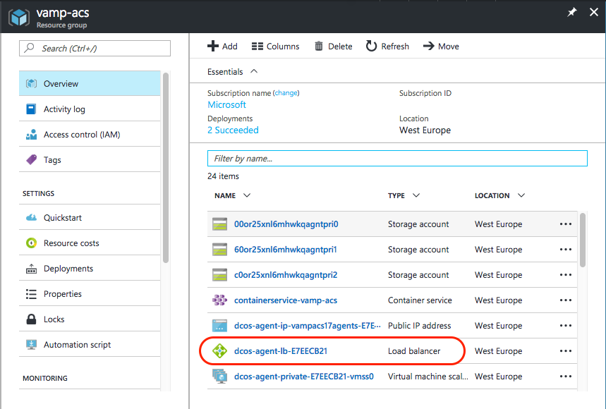
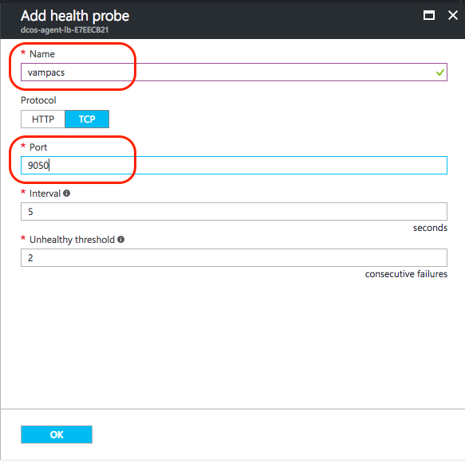
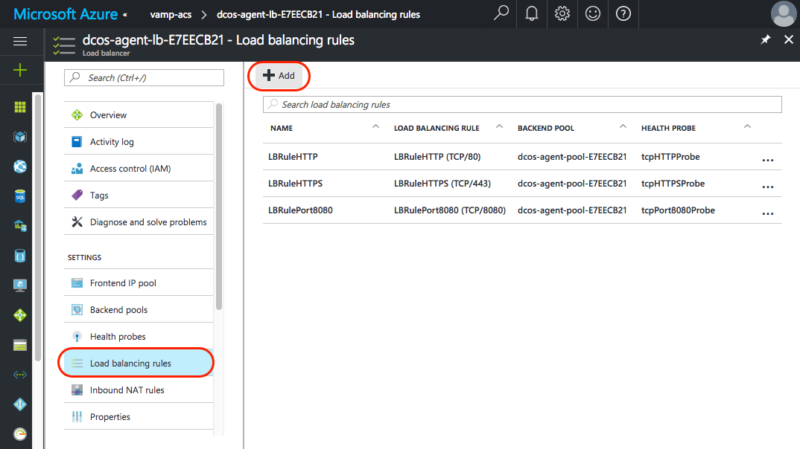
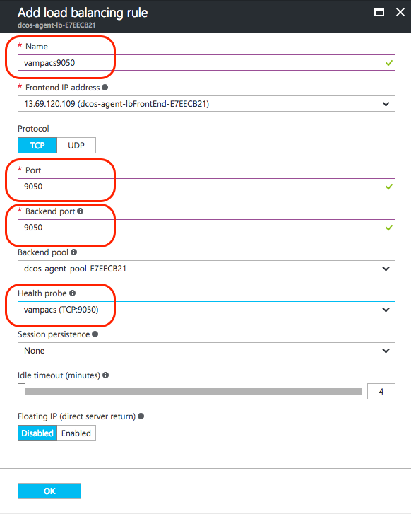
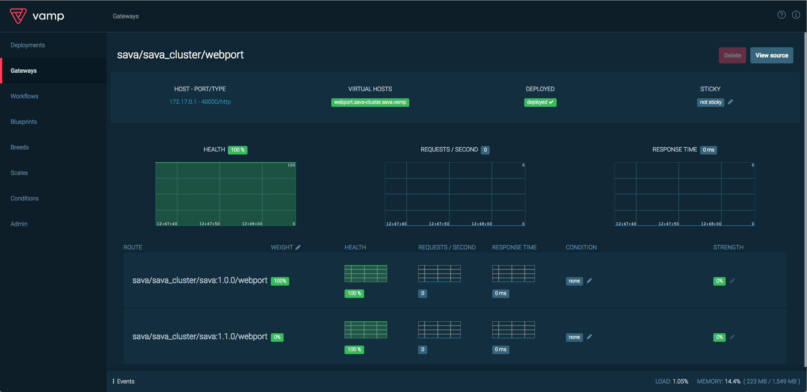

—--
title: Canary release microservices with Vamp | Microsoft Docs
description: How to use Vamp to canary release services and apply smart traffic filtering on an Azure Container Service DC/OS cluster 
services: <service slug assigned to your service by ACOM>
author: gggina
manager: ''

ms.service: <service per approved list>
ms.tgt_pltfrm: <optional>
ms.devlang: <optional>
ms.topic: article
ms.date: mm/dd/yyyy
ms.author: <your microsoft alias, one value only, alias only>
---


# Canary release microservices with Vamp on an Azure Container Service DC/OS cluster

* * *


Canary releasing is a smart deployment strategy adopted by innovative organisations like Netflix, Facebook and Spotify. It’s an approach that makes sense, because it reduces issues, introduces safety-nets, and increases innovation. So why aren’t all companies using it? Extending a CI/CD pipeline to include canary strategies requires adding complex architecture and configurations, and extensive knowledge and experience in the devops domain. That’s enough to block smaller companies and enterprises alike before they even get started. Vamp is an open source system designed to ease this transition and bring canary releasing features to your prefered container scheduler.

Vamp’s canary functionality goes far beyond percentage-based roll outs. Traffic can be filtered and split on a wide range of conditions, for example to target specific users, IP-ranges or devices. Vamp tracks and analyzes performance metrics, allowing for automation based on real-world data. That could be anything from an automatic rollback on errors, to scaling of individual service variants based on load or latency.

In this walkthrough we’ll set up Vamp on Azure Container Service (ACS) with a DC/OS cluster, canary release the Vamp demo service "sava" and then resolve an incompatibility with Firefox by applying smart traffic filtering. 

Let’s get started!

Want to know more about canary releases? ([martinfowler.com - canary release](https://martinfowler.com/bliki/CanaryRelease.html))

* * *


## Set up Azure Container Service with DC/OS

We will run Vamp on an ACS DC/OS cluster, but it would be just as happy working with Kubernetes as the orchestrator (also available in ACS).

1. Deploy an ACS DC/OS cluster with one master and two agents of default size:  
See [https://docs.microsoft.com/en-us/azure/container-service/container-service-deployment](https://docs.microsoft.com/en-us/azure/container-service/container-service-deployment)  
If you don’t already have an Azure account, you can [sign up for a free trial](https://azure.microsoft.com/en-us/free/).

2. Create an SSH tunnel to connect to the ACS cluster:  
See [https://docs.microsoft.com/en-us/azure/container-service/container-service-connect](https://docs.microsoft.com/en-us/azure/container-service/container-service-connect)

* * *


## Set up Vamp

Now you have a running DC/OS cluster, you can install Vamp from the DC/OS UI (localhost:80)


This is done in two stages:

* First, **deploy Elasticsearch**

* Then **deploy Vamp** by installing the Vamp DC/OS universe package

### Deploy Elasticsearch

Vamp requires Elasticsearch for metrics collection and aggregation. You can use the magneticio Docker images to deploy a compatible Vamp Elastic Stack ([hub.docker.com - magneticio elastic](https://hub.docker.com/r/magneticio/elastic/))

1. In the DC/OS UI, go to **Services** and click **Deploy Service**

2. Select **JSON mode** from the **Deploy New Service** pop up and paste in the below JSON (This will run the container with 1G of RAM and a basic health check on the elasticsearch port):
  ```
  {
    "id": "elasticsearch",
    "instances": 1,
    "cpus": 0.2,
    "mem": 1024.0,
    "container": {
      "docker": {
        "image": "magneticio/elastic:2.2",
        "network": "HOST",
        "forcePullImage": true
      }
    },
    "healthChecks": [
      {
        "protocol": "TCP",
        "gracePeriodSeconds": 30,
        "intervalSeconds": 10,
        "timeoutSeconds": 5,
        "port": 9200,
        "maxConsecutiveFailures": 0
      }
    ]
  }
  ```
  

3. Click **Deploy**

DC/OS will deploy the Elasticsearch container - you can track progress on the **Services** page.  


### Deploy Vamp

Once Elasticsearch reports as **Running**, you can add the Vamp DC/OS Universe package. 

1. Go to **Universe** and search for **vamp**  
  

2. Click **install** next to the vamp package and then choose **Advanced Installation**

3. Scroll down and enter elasticsearch-url: **http://elasticsearch.marathon.mesos:9200**  
  

4. Click **Review and install**, then click **Install** to start the deployment.  
  

DC/OS will deploy all required Vamp components - you can track progress on the **Services **page. Once deployment has completed, you can access the Vamp UI:

  


* * *

## Deploy your first service

Now Vamp is up and running, let’s jump in and deploy a service from a blueprint. 

In its simplest form, a Vamp blueprint describes the endpoints (gateways), clusters and services to deploy. Vamp uses clusters to group different variants of the same service into logical groups for canary releasing or A/B testing.  
[More about Vamp blueprints]([http://vamp.io/documentation/using-vamp/blueprints/](http://vamp.io/documentation/using-vamp/blueprints/))

Imagine you or the company you work for still use monolithic applications. I know, it sounds far fetched… This application is called **sava** and is at version 1.0. You’ve managed to wrap your monolith in a Docker container, which lives in the Docker hub under magneticio/sava:1.0.0. Your app normally runs on port 8080, but you want to expose it under port 9050 in this case. Let’s deploy this through Vamp using a simple blueprint.

1. Go to **Deployments**

2. Click **Add**

3. Paste in this blueprint YAML - note that this blueprint contains one cluster with only one service variant (we’ll change that later on):
  ```
  name: sava                    	# deployment name
  gateways:
    9050: sava_cluster/webport  	# stable endpoint
  clusters:
    sava_cluster:               # cluster to create
     services:
        -
          breed:
            name: sava:1.0.0    	# service variant name
            deployable: magneticio/sava:1.0.0
            ports:
              webport: 8080/http # cluster endpoint, used for canary releasing
  ```
4. Click **Save** and Vamp will initiate the deployment

The deployment will be listed on the **Deployments** screen. Open the deployment to monitor its status.


Two gateways will be created, you will see these listed on the **Gateways** screen:

* a stable endpoint to access the running service (port 9050) 
* a Vamp managed internal gateway (more on this later). 


The sava service has now deployed, but you can’t access it yet because the Azure Load Balancer doesn’t know to forward traffic to it yet. First you need to make some changes to the Azure networking configuration.

* * *


## Update the Azure network configuration

Vamp deployed the sava service on the DC/OS agent nodes, exposing a stable endpoint at port 9050. To enable this to be accessed from outside the DC/OS cluster, you need to make a couple of changes to the Azure network configuration: 

* First, **configure the Azure Load Balancer** to forward traffic to the the sava instances. 
* Then **update the Network Security Group** to allow traffic on port 9050.

### Configure the Azure Load Balancer

1. In the Azure portal, open the **dcos-agent-lb-xxxx** load balancer resource  
  

2. Go to **Health probes** under SETTINGS and click **+ Add**  
  

3. Give the new health probe a name and set **Port: 9050**  
  

4. Click **OK** to create the probe

5. In the same **dcos-agent-lb-xxxx** load balancer resource, go to **Load balancing rules** and click **+ Add**  
  

3. Give the new load balancing rule a name and set:
  * **Port:** 9050
  * **Backend port:** 9050
  * **Health probe:** point to the health probe you created
    


Click **OK** to save the load balancer rule

### Update the Network Security Group

The last step in the Azure network configuration is to open port 9050 for inbound traffic:

1. Open the **dcos-agent-public-nsg-xxxx** load balancer resource  
  

2. Go to **Inbound security rules** under SETTINGS and click **+ Add**  
  

3. Give the new inbound security rule a name and set **Port range: 9050**  
  

4. Click **OK** to create the security rule.

Once everything has been created, go to the **dcos-agent-lb-xxxx** overview page to find your external IP address and you can access sava at port 9050.


* * *


## Run a canary release

Now you can access sava, let’s try something fun! 

Say you have a new version of this great application that you want to canary release into production. You have it containerised as magneticio/sava:1.1.0 and are ready to go. Vamp let’s you easily add new services to the running deployment. These "merged" services are deployed alongside existing service(s) in a cluster and assigned a weight of 0%. This means that no traffic will be routed to a newly merged service until you adjust the traffic distribution. The weight slider in the Vamp UI gives you complete control over this, allowing for incremental adjustments (canary release) or an instant rollback.

### Merge a new service variant

Let’s merge the new and improved sava 1.1 service with the running deployment.

1. In the Vamp UI, go to **Blueprints**

2. Click **Add** and paste in the below blueprint YAML - note that this blueprint describes a new service variant (sava1.1.0) to deploy within the existing cluster (sava_cluster):
  ```
  name: sava:1.1.0      # blueprint name
  clusters:
    sava_cluster:       # cluster to update
      services:
        -
          breed:
            name: sava:1.1.0    # service variant name
            deployable: magneticio/sava:1.1.0    
            ports:
              webport: 8080/http # cluster endpoint to update
  ```
  
3. Click **Save** - the blueprint will be stored and listed on the Blueprints page

4. Open the action menu on the sava:1.1 blueprint and select **Merge to**  
  

5. Select the **sava** deployment and click **Merge**  
  

Vamp will deploy the new sava:1.1.0 service variant described in the blueprint alongside sava:1.0.0 in the **sava_cluster** of the running deployment. 


The **sava/sava_cluster/webport** gateway (the cluster endpoint) will also be updated, adding a route to the newly deployed sava:1.1.0. Note that no traffic will be routed here yet (the WEIGHT is set to 0%)



### Canary release

With both versions of sava deployed in the same cluster, adjusting the distribution of traffic between them is as simple as moving the WEIGHT slider.

1. Click  next to WEIGHT

2. Set the weight distribution to 50% / 50% and click **Save**  
  

Go back to your browser and hit refresh a few more times, the sava application will now switch between a sava:1.0 page and a sava:1.1 page 
(Note that this works best with the "Incognito" or “Anonymous” mode of your browser because of the caching of static assets).


### Filter traffic

Let’s take this a step further. 

Say after deployment you discovered an incompatibility in sava1.1.0 that caused it to not display correctly in Firefox browsers - far fetched, I know. You can set Vamp to filter incoming traffic and direct all Firefox users back to the known stable sava1.0.0. This will instantly resolve the disruption for Firefox users, while everybody else continues to enjoy the benefits of the two column sava1.1.0.

Vamp uses **conditions** to filter traffic between routes in a gateway. Traffic is first filtered and directed according to the condition(s) applied to each route, and then all remaining traffic is distributed according to the gateway weight setting.

You can create a condition to filter all Firefox users and direct them to the old sava:1.0.0:

1. On the sava/sava_cluster/webport Gateways page, click  to add a CONDITION to the route sava/sava_cluster/sava:1.0.0/webport

2. Enter the condition **user-agent == Firefox** and click to save  
  * Vamp will add the condition with a default strength of 0% - to start filtering traffic, you need to adjust the condition strength.

3. Click  to change the STRENGTH applied to the condition 

4. Set the STRENGTH to 100% and click to save

    * Vamp will now send all traffic matching the condition (i.e. all Firefox users) to sava:1.0.0


Finally, adjust the gateway weight to send all remaining traffic (i.e. all non-Firefox users) to the new sava:1.1.0:

5. Click  next to WEIGHT and set the weight distribution so 100% is directed to the route sava/sava_cluster/sava:1.1.0/webport

    * All traffic not filtered by the condition will now be directed to the new sava:1.1.0

To see this in action, open two different browsers - one Firefox and one other browser - and access the  sava service from both. All Firefox requests will be sent to sava:1.0.0, while all other browsers are directed to sava:1.1.0


* * *


## Summing up

That was a quick introduction to some Vamp magic. For starters, you got Vamp up and running on your Azure Container Service DC/OS cluster, deployed a service with a Vamp blueprint and accessed it at the exposed endpoint (gateway).

We also touched on some powerful features of Vamp - merging a new service variant to the running deployment and introducing it incrementally, then filtering traffic to resolve a known incompatibility.

**API integration**

In this walkthrough, we worked with the Vamp UI, however, all Vamp actions can also be managed directly through the API. This allows for seamless integration with existing systems:

* [Vamp API reference](http://vamp.io/documentation/api/api-reference/)

**Automation**

Finally, Vamp’s event monitoring capability allows for automation of deployment tasks based on defined SLAs. You can build your own Vamp automation scripts in Node JS and run these as Vamp workflows - containerised apps that access the Vamp API to monitor and interact with running services. The Vamp Runner project includes some examples to help you get started:

* [Vamp Runner GitHub project](https://github.com/magneticio/vamp-runner) 

**Want to know more?**

* Tutorial: [Automating a canary release - Vamp Runner](http://vamp.io/documentation/tutorials/automate-a-canary-release/) 

* Tutorial: [Creating a workflow](http://vamp.io/documentation/tutorials/create-a-workflow/) 

* [More about Vamp workflows](http://vamp.io/documentation/using-vamp/workflows/) 

This article was based on a technet blog post from December 2016: [Enabling Vamp on Azure Container Service (DC/OS)](https://blogs.technet.microsoft.com/livedevopsinjapan/2016/12/08/enable-vamp-on-azure-container-service-dcos/)
