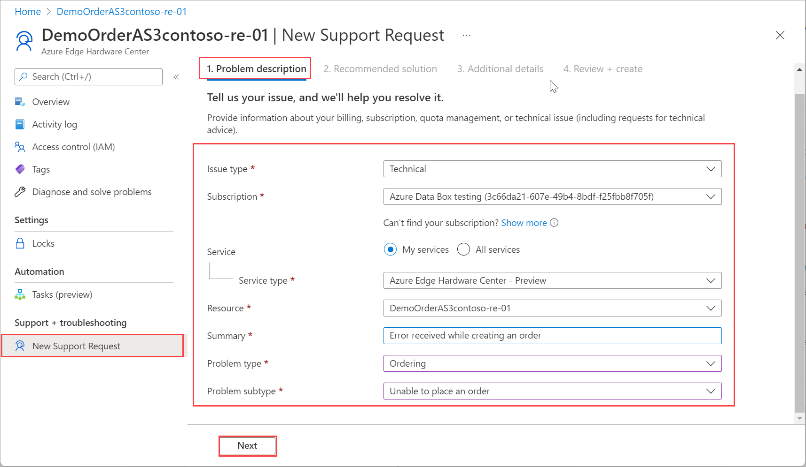
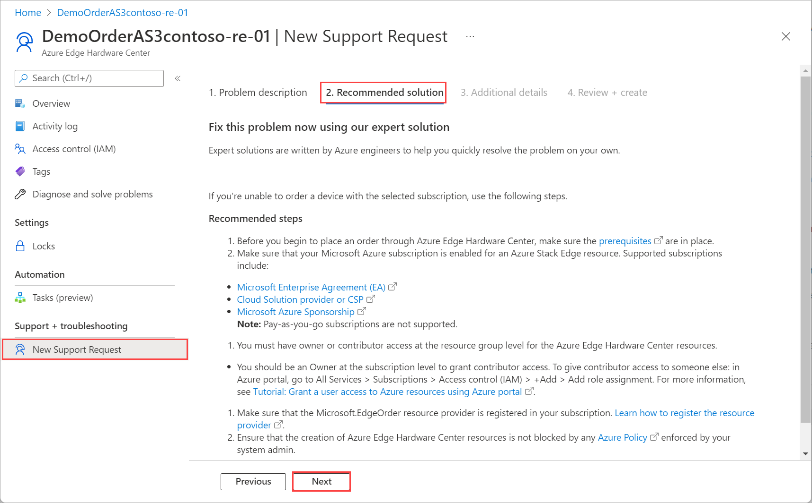
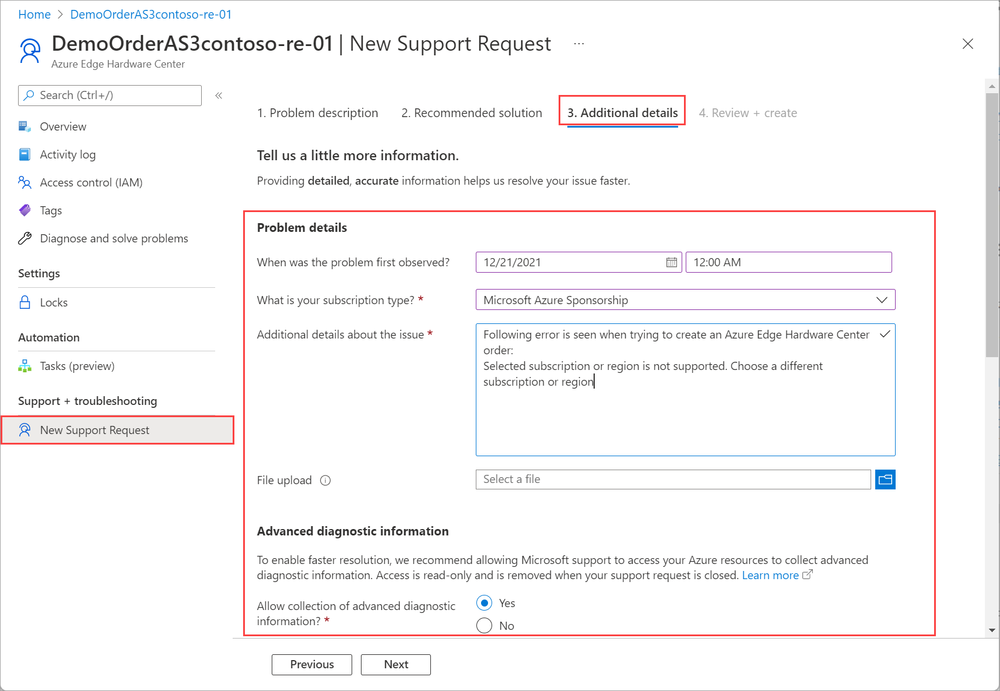
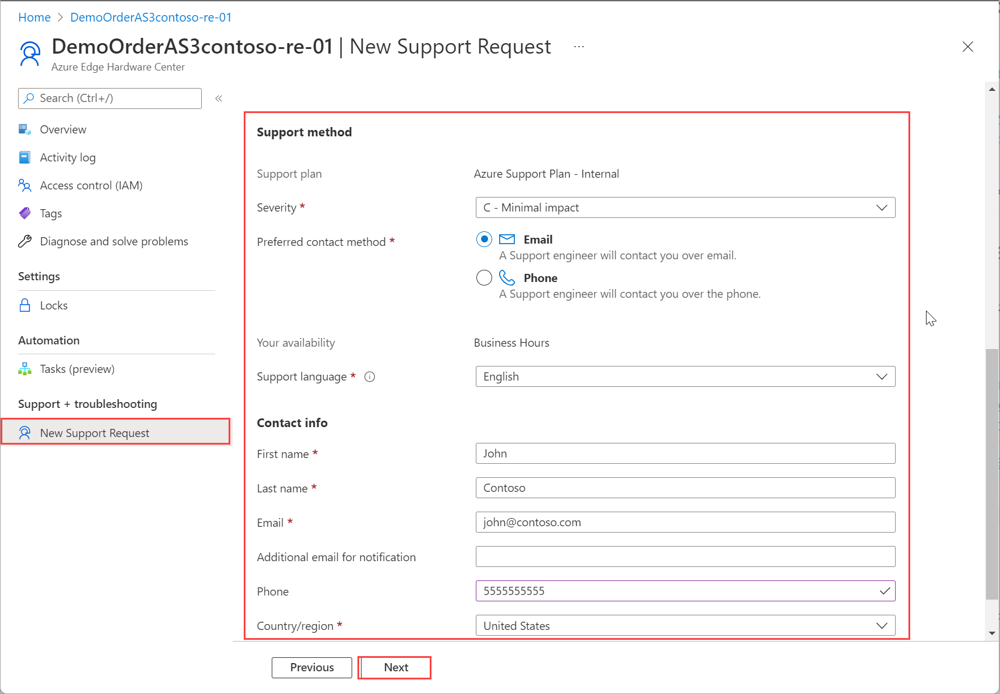
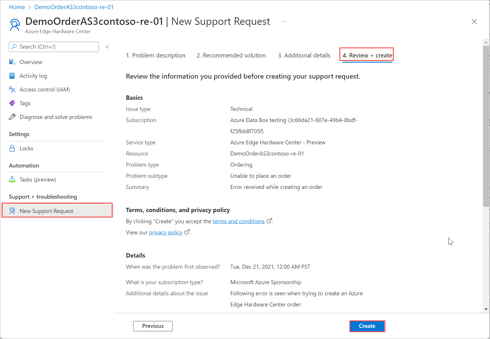
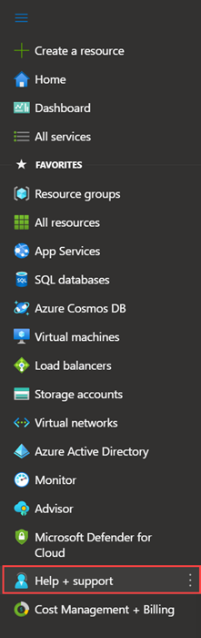

# Open a support ticket for Azure Edge Hardware Center

This article applies to orders created by Azure Edge Hardware Center service. If you encounter any issues with your service, you can create a service request for technical support. This article walks you through:

* How to create a support request.
* How to manage a support request lifecycle from within the portal.

## Create a support request

Do the following steps to create a support request:

1. Go to your Azure Edge Hardware Center order. Navigate to **Support + troubleshooting** section and then select **New support request**.

1. In **New support request**, on the **Problem description** tab, take the following steps:

    1. From the **Issue type** dropdown list, select **Technical**.
    2. Choose your **Subscription**.
    3. Under **Service**, check **My Services**. From the dropdown list, select **Azure Edge Hardware Center**.
    4. Select your **Resource**. This corresponds to the name of your order.
    5. Give a brief **Summary** of the issue you are experiencing. 
    6. Select your **Problem type**.
    7. Based on the problem type you selected, choose a corresponding **Problem subtype**.
    8. Select **Next**.

    

1. On the **Recommended solution** tab, check if the fix for the issue that you are observing is documented. If the error you are facing is not documented, select **Next**.

    

1. On the **Additional details** tab, take the following steps:

    1. Under Problem details, provide the start date and time for the problem.
    1. Select the **Subscription type**.
    1. Supply a **Additional details about the issue**.
    1. In the **File upload**, select the folder icon to browse any other files you want to upload.
    1. Under **Advanced diagnostic information**, check **Allow collection of advanced diagnostic information**.

        

    1. Under **Support method**, based on your subscription, a **Support plan** is automatically populated.
    1. From the dropdown list, select the **Severity**.
    1. Specify a **Preferred contact method**.
    1. **Your availability** are automatically selected based on your subscription plan.
    1. Provide the language you prefer for Support.
    1. Under **Contact info**, provide your name, email, phone, optional contact, country/region. Microsoft Support uses this information to reach out to you for further information, diagnosis, and resolution. 
    1. Select **Next**.

        

4. On the **Review + Create** tab, review the information related to Support ticket. Select **Create**. 

    

    After you create the Support ticket, a Support personnel will contact you as soon as possible to proceed with your request.

## Manage a support request

After creating a support ticket, you can manage the lifecycle of the ticket from within the portal.

### To manage your support requests

1. To get to the help and support page, navigate to **Help + support**.

    

2. A tabular listing of **Recent support requests** is displayed in **Help + support**.

3. Select and click a support request. You can view the status and the details for this request. Click **+ New message** if you want to follow up on this request.

## Next steps

- [Troubleshoot issues related to Azure Edge Hardware Center orders](azure-edge-hardware-center-troubleshoot-order.md).
