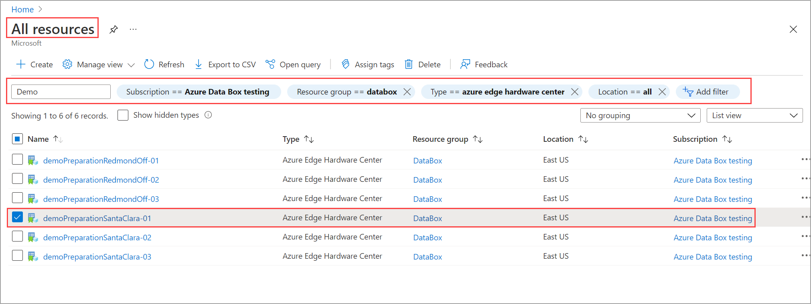
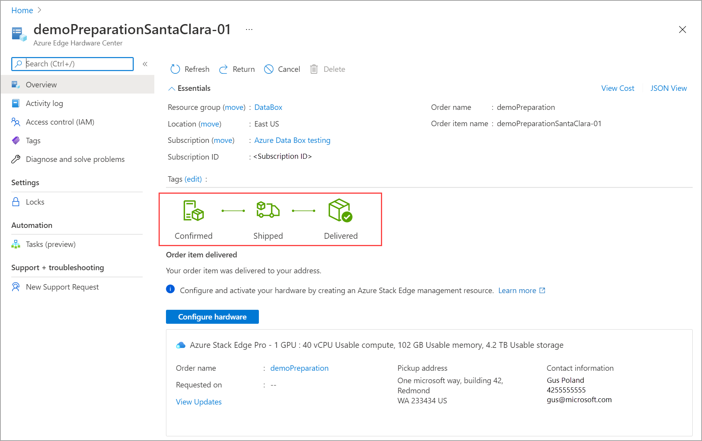
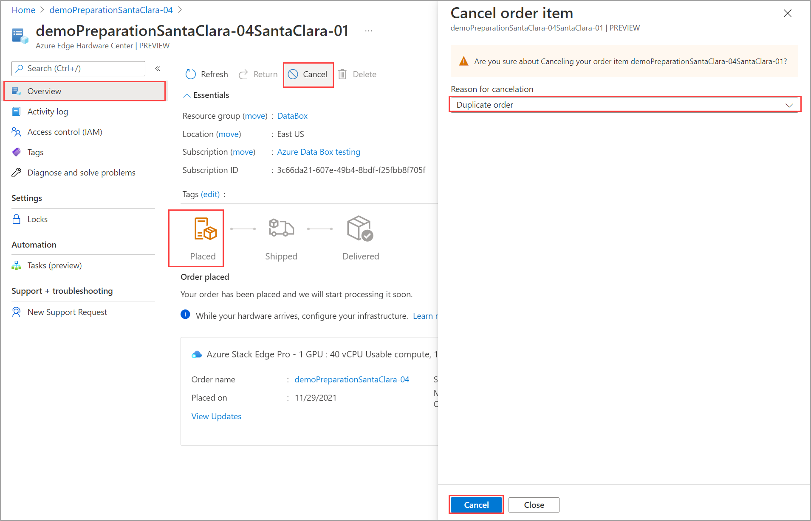
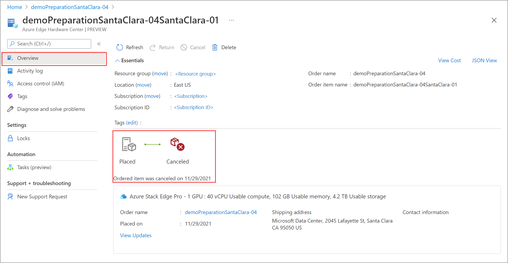

# Use the Azure portal to manage your Azure Edge Hardware Center orders

This article describes how to manage the orders created by Azure Edge Hardware Center. You can use the Azure portal to track and cancel orders created via the Edge Hardware Center.

In this article, you learn how to:

> [!div class="checklist"]
> * Track order
> * Cancel order

## Track order

Follow these steps in the Azure portal to track the order you created using the Edge Hardware Center.

1. In the Azure portal, go to **All resources**. Filter by **Type == Azure Edge Hardware Center**. This should list all the orders created using the Edge Hardware Center. From the list of orders, select your order and go to the order resource.

    

2. In the selected order resource, go to **Overview**. In the right pane, you can view the status of the order. For example, here the order was delivered to the customer.

    

## Cancel order

Follow these steps in the Azure portal to track the order you created using the Edge Hardware Center.

1. In the Azure portal, go to **All resources**. Filter by **Type == Azure Edge Hardware Center**. This should list all the orders created using the Edge Hardware Center. From the list of orders, select your order and go to the order resource.
 
2. In the selected order resource, go to **Overview**. In the right pane, from the top command bar, select Cancel. You can only cancel an order after the order is created and before the order is confirmed. For example, here the **Cancel** is enabled when the order status is **Placed**.

    

3. You see a notification that the order is being canceled. Once the order is canceled, the order status updates to **Canceled**.

    

## Next steps

- Review [Azure Edge Hardware Center FAQ](azure-edge-hardware-center-faq.md).
